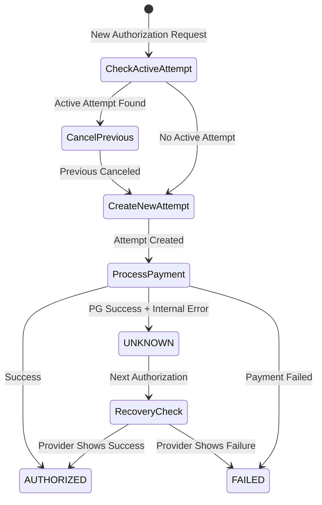
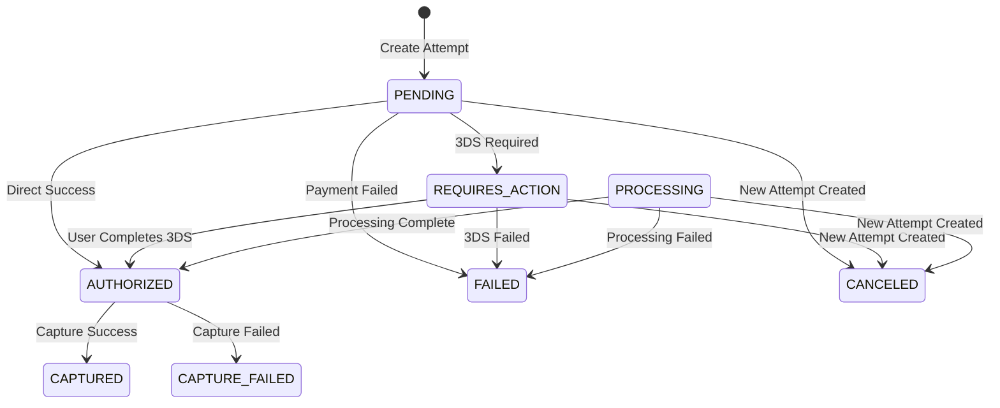
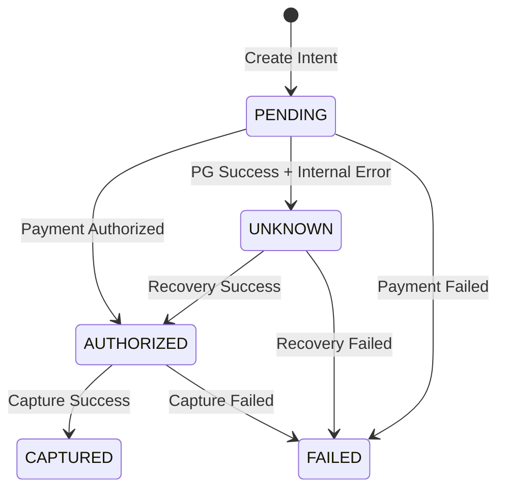

# Design Document

## Overview

This design implements concurrent payment prevention and unknown state recovery for the wallet payment system. The solution follows a lightweight approach that enhances the existing PaymentOrchestratorService without major architectural changes. The design prioritizes user experience by automatically canceling previous payment sessions (similar to Stripe's behavior) rather than blocking new attempts.

## Architecture

### Core Design Principles

1. **Automatic Session Management**: New payment attempts automatically cancel previous active attempts for the same intent
2. **Database Safety Net**: Unique constraints prevent race conditions at the database level
3. **Graceful State Recovery**: Unknown payment states are automatically recovered through provider inquiry
4. **Minimal Code Changes**: Leverage existing transaction patterns and service structure

### State Flow Diagram



## Components and Interfaces

### Database Schema Changes

#### 1. Unique Index for Active Attempts

```sql
CREATE UNIQUE INDEX IF NOT EXISTS uq_active_attempt_per_intent
ON payment_attempts(intent_id)
WHERE status IN ('PENDING','REQUIRES_ACTION','PROCESSING');
```

#### 2. Payment Intent Status Extension

```sql
ALTER TYPE payment_intent_status ADD VALUE IF NOT EXISTS 'UNKNOWN';
```

### Service Layer Enhancements

#### 1. PaymentOrchestratorService Methods

**New Private Method: `cancelActiveAttempt()`**

- Purpose: Cancel any active payment attempts for a given intent
- Parameters: `intentId: string, tx: Transaction`
- Updates all active attempts to 'CANCELED' status

**Enhanced Method: `authorizePayment()`**

- Add active attempt detection at method entry
- Automatically cancel previous attempts before creating new ones
- Handle UNKNOWN state recovery through provider inquiry

#### 2. Payment State Management

**Active Attempt Detection Logic:**

```typescript
const activeAttempt = await this.db.db.query.paymentAttempts.findFirst({
  where: and(
    eq(schema.paymentAttempts.intentId, intentId),
    inArray(schema.paymentAttempts.status, [
      'PENDING',
      'REQUIRES_ACTION',
      'PROCESSING',
    ]),
  ),
});
```

**Unknown State Recovery Logic:**

```typescript
if (intent.status === 'UNKNOWN') {
  const inquiry = await this.paymentExecutor.inquire(intent.id, providerType);
  if (inquiry?.status === 'AUTHORIZED' || inquiry?.status === 'CAPTURED') {
    // Update intent status and return success
  }
}
```

## Data Models

### Payment Attempt Status Flow



### Payment Intent Status Flow



## Error Handling

### Concurrent Payment Prevention

1. **Race Condition Protection**: Database unique constraint prevents simultaneous active attempts
2. **Automatic Cancellation**: Service layer cancels previous attempts before creating new ones
3. **Logging**: All cancellations are logged with attempt IDs for debugging

### Unknown State Recovery

1. **Provider Inquiry**: Query external payment provider for actual payment status
2. **State Synchronization**: Update internal state to match provider state
3. **Fallback Handling**: If inquiry fails, maintain UNKNOWN status and log error

### Error Response Codes

- `PREVIOUS_ATTEMPT_CANCELED`: Previous payment session was automatically canceled
- `UNKNOWN_STATE_RECOVERY`: Payment state was recovered from provider
- `ACTIVE_ATTEMPT_EXISTS`: Fallback error if cancellation fails

## Testing Strategy

### Unit Tests (Optional)

- Test `cancelActiveAttempt()` method with various attempt states
- Test UNKNOWN state recovery logic with different provider responses
- Test concurrent attempt creation scenarios

### Integration Tests (Optional)

- Test full authorization flow with active attempt cancellation
- Test database constraint enforcement under concurrent load
- Test provider inquiry integration for state recovery

### Manual Testing Scenarios

1. **Multi-Device Payment**: Start payment on mobile, continue on desktop
2. **Network Interruption**: Simulate network failure during payment processing
3. **Provider State Mismatch**: Test recovery when internal state differs from provider
4. **Race Condition**: Simulate simultaneous payment attempts from multiple sessions

## Implementation Notes

### Transaction Management

All database operations within a single payment flow are wrapped in transactions to ensure atomicity. The cancellation of previous attempts and creation of new attempts occur within the same transaction context.

### Logging Strategy

- Log all attempt cancellations with previous attempt ID
- Log UNKNOWN state detections and recovery attempts
- Log provider inquiry results for debugging

### Performance Considerations

- The unique index on payment_attempts is partial (WHERE clause) to minimize index size
- Active attempt queries are optimized with proper indexing
- Provider inquiries are only made when necessary (UNKNOWN state detection)
