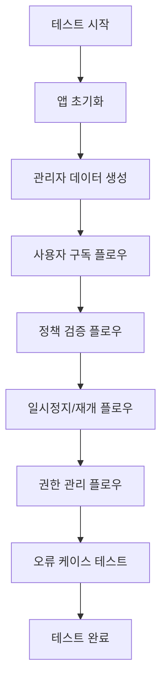

# Design Document

## Overview

멤버십 구독 서비스의 통합 E2E 테스트는 실제 사용자 시나리오를 기반으로 모든 API 엔드포인트의 동작을 검증합니다. MVP 단계에 적합하도록 단순하고 직접적인 접근 방식을 사용하며, 하나의 테스트 파일에서 전체 워크플로우를 순차적으로 검증합니다.

## Architecture

### Simple Test Structure
```
apps/membership/test/
├── membership-integration.e2e-spec.ts       # 메인 통합 테스트 (모든 시나리오 포함)
└── jest-e2e.json                           # Jest E2E 설정
```

### Alternative Structure (필요시)
코드가 너무 길어질 경우에만 최대 3개 파일로 분할:
```
apps/membership/test/
├── admin-flow.e2e-spec.ts                  # 관리자 운영 플로우
├── user-flow.e2e-spec.ts                   # 사용자 구독 플로우  
├── policy-flow.e2e-spec.ts                 # 정책 및 권한 플로우
└── jest-e2e.json
```

### Test Execution Flow


## Components and Interfaces

### Simple Test Structure
모든 로직을 하나의 테스트 파일에 포함하되, 내부적으로 간단한 헬퍼 함수들을 사용합니다.

```typescript
// 테스트 파일 내부 구조
describe('Membership Integration E2E', () => {
  let app: INestApplication
  let testData: TestData
  
  // 간단한 헬퍼 함수들
  const createTestTier = async () => { /* 구현 */ }
  const createTestPlan = async (tierId: string) => { /* 구현 */ }
  const createTestUser = () => { /* 구현 */ }
  
  beforeAll(async () => {
    // 앱 초기화
  })
  
  afterAll(async () => {
    // 정리
  })
  
  describe('관리자 운영 플로우', () => {
    // 티어, 플랜, 정책 생성 테스트
  })
  
  describe('사용자 구독 플로우', () => {
    // 구독 생성, 업그레이드, 다운그레이드, 취소 테스트
  })
  
  describe('정책 적용 플로우', () => {
    // 정책 제한 검증 테스트
  })
  
  describe('일시정지/재개 플로우', () => {
    // 일시정지, 재개 테스트
  })
  
  describe('권한 관리 플로우', () => {
    // 권한 조회, 검증 테스트
  })
  
  describe('오류 처리', () => {
    // 각종 오류 케이스 테스트
  })
})
```

### Test Data Structure
```typescript
interface TestData {
  tier: {
    id: string
    code: string
    name: string
  }
  plan: {
    id: string
    tierId: string
    price: number
  }
  user: {
    id: string
    email: string
  }
  policy: {
    id: string
    ruleType: string
  }
}
```

## Data Models

### Simple Test Configuration
```typescript
interface TestConfig {
  timeout: number
  baseUrl: string
}

interface TestData {
  tier: TierData
  plan: PlanData  
  user: UserData
  policy: PolicyData
}

interface TierData {
  id: string
  code: string
  name: string
  priorityLevel: number
}

interface PlanData {
  id: string
  tierId: string
  price: number
  durationDays: number
}

interface UserData {
  id: string
  email: string
  name: string
}

interface PolicyData {
  id: string
  ruleType: string
  ruleValue: any
  tierId: string
}
```

## Error Handling

### Simple Error Handling Strategy
테스트 실패 시 명확한 오류 메시지와 함께 실패하도록 하며, 복잡한 재시도 로직은 구현하지 않습니다.

```typescript
// 간단한 오류 처리 예시
it('should create subscription', async () => {
  const response = await request(app.getHttpServer())
    .post(`/api/subscriptions?userId=${testData.user.id}`)
    .send({ planId: testData.plan.id })
    .expect(201)
  
  expect(response.body).toHaveProperty('subscriptionId')
  expect(response.body.status).toBe('active')
})
```

### Error Categories
1. **HTTP Errors**: 잘못된 상태 코드 반환
2. **Response Format Errors**: 예상과 다른 응답 구조
3. **Business Logic Errors**: 비즈니스 규칙 위반
4. **Setup/Cleanup Errors**: 테스트 환경 문제

## Testing Strategy

### Simple Sequential Testing
모든 테스트를 순차적으로 실행하여 상태 의존성을 관리합니다.

#### Test Flow
1. **Setup Phase**: 앱 초기화 및 기본 데이터 생성
2. **Admin Flow**: 티어, 플랜, 정책 생성
3. **User Flow**: 구독 생성, 업그레이드, 다운그레이드, 취소
4. **Policy Flow**: 정책 제한 검증
5. **Pause Flow**: 일시정지, 재개
6. **Rights Flow**: 권한 조회, 검증
7. **Error Flow**: 오류 케이스 테스트
8. **Cleanup Phase**: 테스트 데이터 정리

### Test Categories

#### 1. Happy Path Tests
- 정상적인 사용자 시나리오
- 기본 CRUD 작업
- 워크플로우 연결

#### 2. Business Logic Tests  
- 정책 제한 적용
- 구독 상태 전환
- 권한 계산

#### 3. Error Handling Tests
- 잘못된 입력 (400)
- 리소스 없음 (404)
- 권한 없음 (403)
- 중복 생성 (409)

### Performance Considerations
- 테스트 실행 시간 5분 이내 목표
- 간단한 데이터 정리로 빠른 실행
- 불필요한 최적화 피하기

## Implementation Approach

### Single File Implementation
모든 테스트를 `membership-integration.e2e-spec.ts` 하나의 파일에 구현합니다.

```typescript
// 파일 구조 예시
describe('Membership Integration E2E', () => {
  // 설정 및 헬퍼 함수들
  
  describe('1. Admin Operations', () => {
    // 티어, 플랜, 정책 생성 테스트
  })
  
  describe('2. Subscription Flow', () => {
    // 구독 관련 테스트
  })
  
  describe('3. Policy Enforcement', () => {
    // 정책 적용 테스트
  })
  
  describe('4. Pause/Resume Flow', () => {
    // 일시정지/재개 테스트
  })
  
  describe('5. Rights Management', () => {
    // 권한 관리 테스트
  })
  
  describe('6. Error Handling', () => {
    // 오류 케이스 테스트
  })
})
```

### Alternative: 3-File Split (필요시)
코드가 너무 길어질 경우에만 최대 3개 파일로 분할:
- `admin-flow.e2e-spec.ts`: 관리자 운영
- `user-flow.e2e-spec.ts`: 사용자 구독 플로우
- `policy-flow.e2e-spec.ts`: 정책 및 권한 관리

### Simple Reporting
- Jest 기본 리포터 사용
- 실패 시 상세 오류 메시지 출력
- 복잡한 커스텀 리포팅 피하기