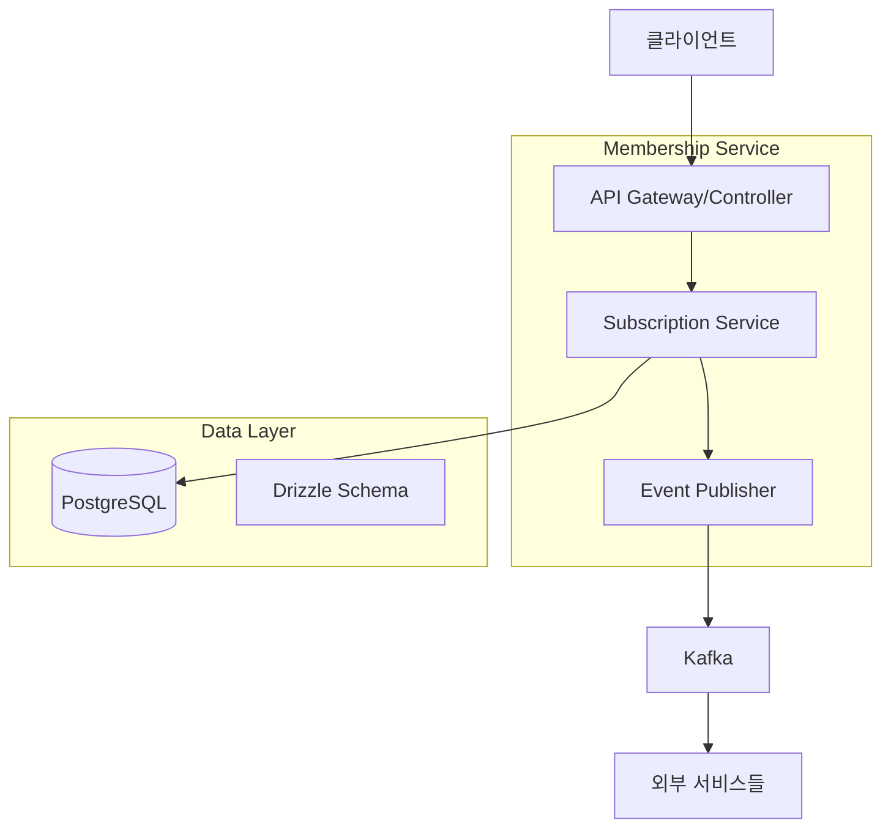
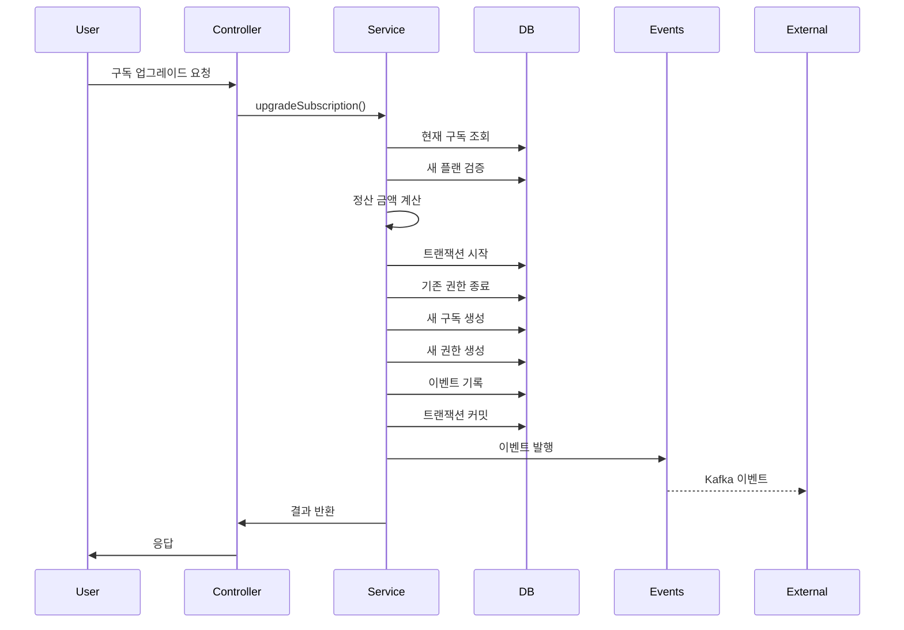

# 멤버십 구독 시스템 설계

## 개요

멤버십 구독 시스템은 NestJS 기반의 MSA 서비스로, 사용자의 구독 생명주기를 관리합니다. 시스템은 기존의 Drizzle ORM 스키마를 활용하여 PostgreSQL 데이터베이스와 상호작용하며, Kafka를 통해 이벤트 기반 아키텍처를 구현합니다.

## 아키텍처

### 전체 시스템 아키텍처



### 레이어 아키텍처

1. **Controller Layer**: HTTP 요청 처리 및 응답
2. **Service Layer**: 비즈니스 로직 처리
3. **Data Access Layer**: Drizzle ORM을 통한 데이터베이스 접근
4. **Event Layer**: Kafka를 통한 이벤트 발행

## 컴포넌트 및 인터페이스

### 1. 컨트롤러 구조

```typescript
// subscription.controller.ts
@Controller('subscriptions')
export class SubscriptionController {
  // 사용자 구독 관리
  @Get('current')
  getCurrentSubscription(@User() user)
  
  @Get('history')
  getSubscriptionHistory(@User() user)
  
  @Post('upgrade')
  upgradeSubscription(@User() user, @Body() dto)
  
  @Post('downgrade')
  downgradeSubscription(@User() user, @Body() dto)
  
  @Post('cancel')
  cancelSubscription(@User() user, @Body() dto)
  
  @Post('pause')
  pauseSubscription(@User() user, @Body() dto)
  
  @Post('resume')
  resumeSubscription(@User() user)
  
  @Get('pause-history')
  getPauseHistory(@User() user)
}

@Controller('plans')
export class PlanController {
  @Get()
  getAllPlans()
  
  @Get(':planId')
  getPlanDetails(@Param('planId') planId)
}

@Controller('admin')
export class AdminController {
  // 관리자 기능
  @Post('users/:userId/subscriptions/override')
  overrideSubscription(@Param('userId') userId, @Body() dto)
  
  @Post('users/:userId/credits/add')
  addCredits(@Param('userId') userId, @Body() dto)
  
  @Get('audit-logs')
  getAuditLogs(@Query() query)
}
```

### 2. 서비스 레이어 구조

```typescript
// subscription.service.ts
@Injectable()
export class SubscriptionService {
  // 구독 조회
  getCurrentSubscription(userId: string)
  getSubscriptionHistory(userId: string)
  
  // 구독 생성 및 변경
  createSubscription(userId: string, planId: string)
  upgradeSubscription(userId: string, newPlanId: string)
  downgradeSubscription(userId: string, newPlanId: string)
  cancelSubscription(userId: string, reason?: string)
  
  // 일시정지 관리
  pauseSubscription(userId: string, pauseRequest: PauseRequest)
  resumeSubscription(userId: string)
  getPauseHistory(userId: string)
  
  // 내부 헬퍼 메서드
  private validatePlanChange(currentTier, newTier, changeType)
  private calculateProration(currentPlan, newPlan, remainingDays)
  private checkPauseEligibility(userId: string, year: number)
  private publishEvent(event: SubscriptionEvent)
}

// pause.service.ts
@Injectable()
export class PauseService {
  pauseSubscription(userId: string, request: PauseRequest)
  resumeSubscription(userId: string)
  checkPauseEligibility(userId: string)
  updatePauseUsageTracker(userId: string, pauseDays: number)
}

// rights.service.ts
@Injectable()
export class RightsService {
  getUserRights(userId: string)
  createRights(subscriptionId: string, tierId: string, period: DateRange)
  closeRights(rightIds: string[], reason: string)
  pauseRights(rightIds: string[])
  resumeRights(rightIds: string[], extensionDays: number)
}
```

### 3. DTO 및 타입 정의

```typescript
// subscription.dto.ts
export class CreateSubscriptionDto {
  planId: string;
}

export class UpgradeSubscriptionDto {
  newPlanId: string;
}

export class DowngradeSubscriptionDto {
  newPlanId: string;
  effectiveDate?: Date;
}

export class PauseSubscriptionDto {
  startDate: Date;
  endDate: Date;
  reason?: string;
}

export class CancelSubscriptionDto {
  reason?: string;
  effectiveDate?: Date;
}

// subscription.types.ts
export interface CurrentSubscriptionResponse {
  id: string;
  status: SubscriptionStatus;
  currentTier: TierInfo;
  plan: PlanInfo;
  nextBillingDate: Date;
  startsAt: Date;
  endsAt: Date;
  isPaused: boolean;
  pausedAt?: Date;
}

export interface SubscriptionHistoryItem {
  id: string;
  planId: string;
  tierCode: string;
  status: SubscriptionStatus;
  startedAt: Date;
  endedAt?: Date;
  changeType: SubscriptionChangeType;
}
```

## 데이터 모델

### 기존 스키마 활용

시스템은 이미 정의된 Drizzle 스키마를 활용합니다:

1. **users**: 사용자 기본 정보
2. **subscriptionTiers**: 구독 티어 (FREE, BASIC, PREMIUM 등)
3. **subscriptionPlans**: 구독 플랜 (가격, 기간 등)
4. **subscriptions**: 구독 정보
5. **subscriptionRights**: 사용자 권한 기간
6. **subscriptionEvents**: 모든 구독 관련 이벤트
7. **subscriptionPauses**: 일시정지 정보
8. **pauseAffectedRights**: 일시정지로 영향받은 권한
9. **pauseUsageTracker**: 연간 일시정지 사용량 추적
10. **subscriptionPolicies**: 구독 정책 설정

### 데이터 흐름



## 오류 처리

### 오류 타입 정의

```typescript
export class SubscriptionError extends Error {
  constructor(
    message: string,
    public code: string,
    public statusCode: number = 400
  ) {
    super(message);
  }
}

export class SubscriptionNotFoundError extends SubscriptionError {
  constructor() {
    super('활성 구독이 없습니다', 'SUBSCRIPTION_NOT_FOUND', 404);
  }
}

export class InvalidPlanChangeError extends SubscriptionError {
  constructor(reason: string) {
    super(`플랜 변경이 불가능합니다: ${reason}`, 'INVALID_PLAN_CHANGE', 400);
  }
}

export class PauseQuotaExceededError extends SubscriptionError {
  constructor(used: number, limit: number) {
    super(
      `연간 일시정지 한도를 초과했습니다 (${used}/${limit})`,
      'PAUSE_QUOTA_EXCEEDED',
      400
    );
  }
}
```

### 글로벌 예외 필터

```typescript
@Catch(SubscriptionError)
export class SubscriptionExceptionFilter implements ExceptionFilter {
  catch(exception: SubscriptionError, host: ArgumentsHost) {
    const ctx = host.switchToHttp();
    const response = ctx.getResponse();
    
    response.status(exception.statusCode).json({
      error: {
        code: exception.code,
        message: exception.message,
        timestamp: new Date().toISOString(),
      },
    });
  }
}
```

## 테스트 전략

### 단위 테스트

1. **Service Layer 테스트**
   - 각 비즈니스 로직 메서드별 테스트
   - Mock을 활용한 의존성 격리
   - 경계값 및 예외 상황 테스트

2. **Controller Layer 테스트**
   - HTTP 요청/응답 테스트
   - 인증/인가 테스트
   - DTO 검증 테스트

### 통합 테스트

1. **데이터베이스 통합 테스트**
   - 실제 DB 트랜잭션 테스트
   - 스키마 제약조건 검증
   - 복잡한 쿼리 성능 테스트

2. **이벤트 발행 테스트**
   - Kafka 이벤트 발행 검증
   - 이벤트 페이로드 구조 테스트
   - 실패 시 재시도 로직 테스트

### E2E 테스트

1. **구독 생명주기 테스트**
   - 구독 생성 → 업그레이드 → 일시정지 → 재개 → 취소
   - 다양한 시나리오별 전체 플로우 검증

2. **동시성 테스트**
   - 동일 사용자의 동시 요청 처리
   - 데이터 일관성 검증

## 성능 고려사항

### 데이터베이스 최적화

1. **인덱스 전략**
   ```sql
   -- 사용자별 활성 구독 조회 최적화
   CREATE INDEX idx_subscriptions_user_status ON subscriptions(user_id, status);
   
   -- 권한 조회 최적화
   CREATE INDEX idx_rights_user_active ON subscription_rights(user_id, is_active, starts_at, ends_at);
   
   -- 이벤트 발행 상태 조회 최적화
   CREATE INDEX idx_events_publish_status ON subscription_events(publish_status, created_at);
   ```

2. **쿼리 최적화**
   - JOIN 최소화를 위한 데이터 비정규화 고려
   - 자주 조회되는 데이터의 캐싱 전략
   - 페이지네이션을 통한 대용량 데이터 처리

### 캐싱 전략

1. **Redis 캐싱**
   - 현재 구독 상태 캐싱 (TTL: 1시간)
   - 플랜/티어 정보 캐싱 (TTL: 24시간)
   - 사용자 권한 정보 캐싱 (TTL: 30분)

2. **캐시 무효화**
   - 구독 변경 시 관련 캐시 즉시 무효화
   - 이벤트 기반 캐시 무효화 패턴 적용

### 이벤트 처리 최적화

1. **배치 처리**
   - 대량 이벤트 발행 시 배치 단위로 처리
   - 실패한 이벤트의 배치 재처리

2. **비동기 처리**
   - 중요하지 않은 이벤트는 비동기로 처리
   - 데드레터 큐를 통한 실패 이벤트 관리

## 보안 고려사항

### 인증 및 인가

1. **JWT 기반 인증**
   - 사용자 토큰 검증
   - 관리자 권한 분리

2. **API 보안**
   - Rate Limiting 적용
   - 입력값 검증 및 Sanitization
   - SQL Injection 방지

### 데이터 보안

1. **민감 정보 보호**
   - 개인정보 암호화 저장
   - 감사 로그를 통한 접근 추적

2. **권한 기반 접근 제어**
   - 사용자는 본인 데이터만 접근
   - 관리자 기능의 별도 인가 체계