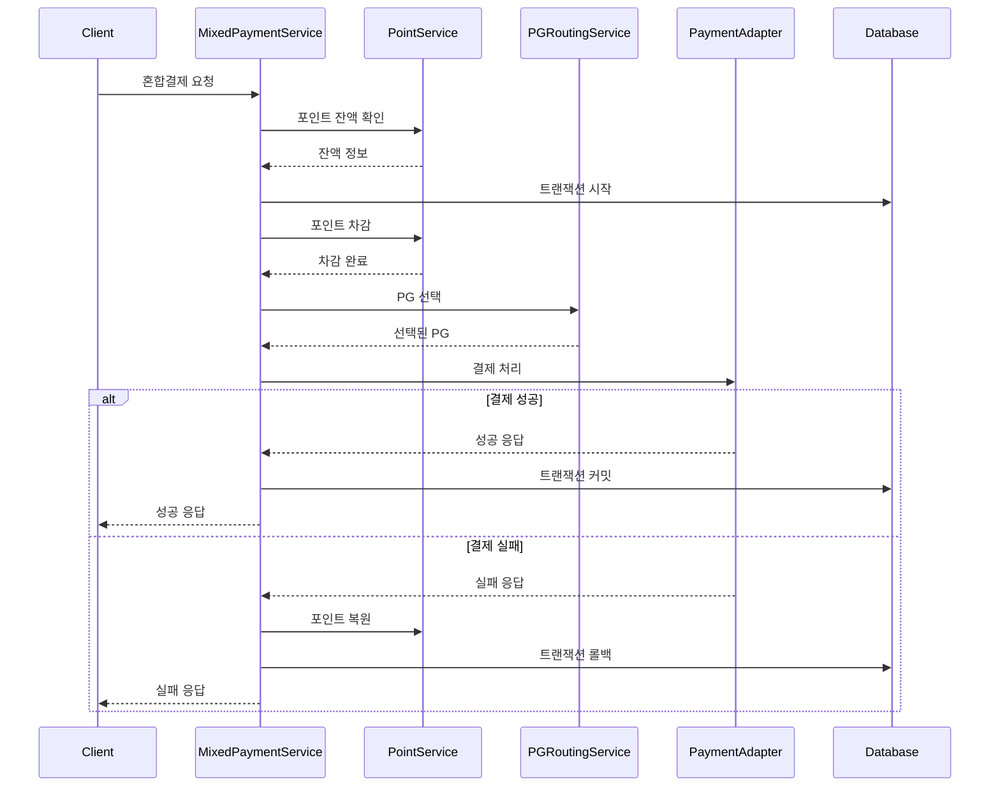
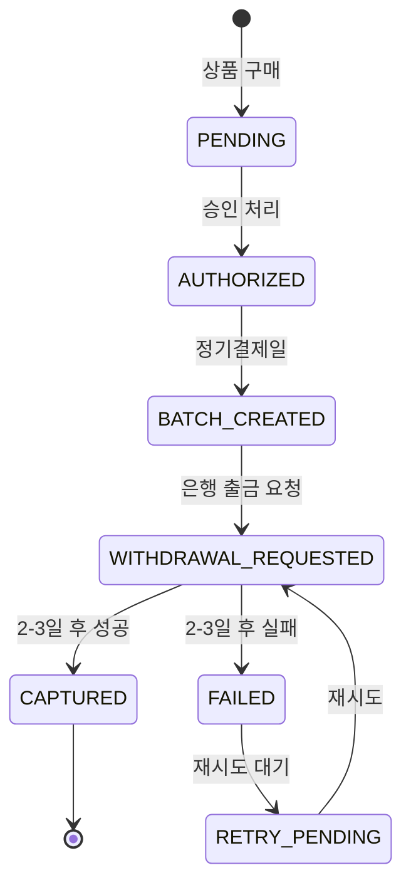

# 설계 문서

## 개요

이 설계는 기존 결제 시스템을 확장하여 다중 PG사 어댑터, 포인트 혼합결제, 그리고 BNPL의 복잡한 지연 결제 플로우를 구현합니다. 기존에 구현된 정기결제 로직과 포인트 서비스를 기반으로 하여 확장성 있는 어댑터 패턴과 트랜잭션 무결성을 보장하는 혼합결제 시스템을 설계합니다.

**핵심 설계 원칙:**
- 기존 코드베이스와의 호환성 유지
- 어댑터 패턴을 통한 PG사별 확장성
- 혼합결제의 트랜잭션 무결성 보장
- BNPL 지연 처리 플로우의 명확한 상태 관리
- 최소한의 기능 구현 (최적화 제외)

## 아키텍처

### 전체 아키텍처

```
┌─────────────────┐    ┌─────────────────┐    ┌─────────────────┐
│   Frontend      │    │  Wallet Server  │    │ External APIs   │
│   (Checkout)    │◄──►│   (NestJS)      │◄──►│ PG사/Point/HMS  │
└─────────────────┘    └─────────────────┘    └─────────────────┘
                              │
                              ▼
                       ┌─────────────────┐
                       │   PostgreSQL    │
                       │   (기존 스키마) │
                       └─────────────────┘
```

### 확장된 레이어 아키텍처

```
┌─────────────────────────────────────────────────────────┐
│                    Controllers                          │
│  payments │ mixed-payments │ bnpl │ admin │ health     │
├─────────────────────────────────────────────────────────┤
│                     Services                            │
│   mixed-payment.service │ pg-routing.service            │
│   bnpl-settlement.service │ point.service (기존)        │
├─────────────────────────────────────────────────────────┤
│                     Adapters                            │
│  toss.adapter │ nice.adapter │ kcp.adapter │ point.adapter│
│  bnpl.adapter │ adapter-registry (확장)                 │
├─────────────────────────────────────────────────────────┤
│                 Shared Components                       │
│     database │ types │ utils │ errors (기존)           │
└─────────────────────────────────────────────────────────┘
```

### 폴더 구조 확장

```
apps/wallet/src/
  adapters/
    toss-card.adapter.ts          # 기존
    nice-card.adapter.ts          # 신규
    kcp-card.adapter.ts           # 신규
    point.adapter.ts              # 신규
    bnpl-settlement.adapter.ts    # 신규
    adapter-registry.ts           # 확장
  controllers/
    mixed-payments.controller.ts  # 신규
    bnpl-settlement.controller.ts # 신규
  services/
    mixed-payment.service.ts      # 신규
    pg-routing.service.ts         # 신규
    bnpl-settlement.service.ts    # 신규
    point.service.ts              # 기존 (확장)
  ports/
    payment-adapter.port.ts       # 기존 (확장)
    mixed-payment.port.ts         # 신규
  shared/
    types/
      mixed-payment.types.ts      # 신규
      pg-routing.types.ts         # 신규
```

## 컴포넌트 및 인터페이스

### 핵심 서비스

#### MixedPaymentService
**책임:** 포인트와 다른 결제수단을 조합한 혼합결제 처리

```typescript
interface MixedPaymentService {
  processPayment(request: MixedPaymentRequest): Promise<MixedPaymentResult>
  validateMixedPayment(request: MixedPaymentRequest): Promise<ValidationResult>
  rollbackMixedPayment(paymentId: string): Promise<RollbackResult>
}

interface MixedPaymentRequest {
  userId: string
  totalAmount: number
  pointAmount: number
  paymentMethodId: string
  paymentMethodAmount: number
  orderId: string
  metadata?: Record<string, any>
}
```

**핵심 동작:**
- 포인트 잔액 검증 및 차감
- 나머지 금액의 결제수단 처리
- 실패 시 자동 롤백
- 트랜잭션 무결성 보장

#### PGRoutingService
**책임:** 결제 방법과 비즈니스 규칙에 따른 PG 라우팅

```typescript
interface PGRoutingService {
  selectPG(request: PaymentRoutingRequest): Promise<PGSelection>
  getAvailablePGs(paymentMethod: PaymentMethodType): Promise<PGInfo[]>
  handlePGFailover(originalPG: string, request: PaymentRoutingRequest): Promise<PGSelection>
}

interface PaymentRoutingRequest {
  paymentMethodType: 'CARD' | 'BANK_TRANSFER' | 'BNPL'
  amount: number
  userId: string
  metadata?: Record<string, any>
}

interface PGSelection {
  pgProvider: string
  adapter: PaymentAdapter
  routingReason: string
}
```

#### BNPLSettlementService
**책임:** BNPL 정기결제 배치 처리 및 지연 결제 관리

```typescript
interface BNPLSettlementService {
  createMonthlyBatch(): Promise<SettlementBatch>
  processSettlementItem(item: SettlementItem): Promise<SettlementResult>
  handleDelayedResponse(transactionId: string, result: BankResult): Promise<void>
  retryFailedSettlement(batchId: string): Promise<RetryResult>
}

interface SettlementBatch {
  batchId: string
  settlementDate: string
  totalItems: number
  totalAmount: number
  status: 'CREATED' | 'PROCESSING' | 'COMPLETED' | 'FAILED'
}
```

### PG 어댑터 확장

#### 표준 PaymentAdapter 인터페이스 확장
```typescript
interface PaymentAdapter {
  // 기존 메서드들
  authorize(request: AuthorizeRequest): Promise<AuthorizeResponse>
  capture(request: CaptureRequest): Promise<CaptureResponse>
  refund(request: RefundRequest): Promise<RefundResponse>
  
  // 신규 메서드들
  getProviderInfo(): PGProviderInfo
  healthCheck(): Promise<HealthStatus>
  handleTimeout(request: any): Promise<TimeoutResponse>
}

interface PGProviderInfo {
  name: string
  supportedMethods: PaymentMethodType[]
  maxAmount: number
  minAmount: number
  features: string[]
}
```

#### 개별 PG 어댑터들

**NiceCardAdapter**
```typescript
@Injectable()
export class NiceCardAdapter implements PaymentAdapter {
  async authorize(request: AuthorizeRequest): Promise<AuthorizeResponse>
  async capture(request: CaptureRequest): Promise<CaptureResponse>
  async refund(request: RefundRequest): Promise<RefundResponse>
  
  // Nice 전용 메서드들
  private formatNiceRequest(request: any): NiceAPIRequest
  private parseNiceResponse(response: any): AuthorizeResponse
}
```

**KCPCardAdapter**
```typescript
@Injectable()
export class KCPCardAdapter implements PaymentAdapter {
  async authorize(request: AuthorizeRequest): Promise<AuthorizeResponse>
  async capture(request: CaptureRequest): Promise<CaptureResponse>
  async refund(request: RefundRequest): Promise<RefundResponse>
  
  // KCP 전용 메서드들
  private encryptKCPData(data: any): string
  private decryptKCPResponse(response: string): any
}
```

**PointAdapter**
```typescript
@Injectable()
export class PointAdapter implements PaymentAdapter {
  constructor(private pointService: PointsService) {}
  
  async authorize(request: AuthorizeRequest): Promise<AuthorizeResponse>
  async capture(request: CaptureRequest): Promise<CaptureResponse>
  async refund(request: RefundRequest): Promise<RefundResponse>
  
  // 포인트는 즉시 처리되므로 authorize = capture
}
```

### 데이터 모델 확장

#### MixedPayment (신규)
```typescript
interface MixedPayment {
  id: string
  userId: string
  totalAmount: number
  pointAmount: number
  paymentMethodAmount: number
  pointTransactionId?: string
  paymentTransactionId?: string
  status: 'PENDING' | 'POINT_DEDUCTED' | 'COMPLETED' | 'FAILED' | 'ROLLED_BACK'
  rollbackReason?: string
  createdAt: Date
  completedAt?: Date
}
```

#### BNPLSettlement (확장)
```typescript
interface BNPLSettlement {
  id: string
  batchId: string
  bnplAccountId: string
  amount: number
  settlementDate: string
  status: 'PENDING' | 'SUBMITTED' | 'WITHDRAWAL_REQUESTED' | 'CAPTURED' | 'FAILED'
  bankTransactionId?: string
  submittedAt?: Date
  responseReceivedAt?: Date
  failureReason?: string
  retryCount: number
}
```

#### PGRouting (신규)
```typescript
interface PGRouting {
  id: string
  paymentMethodType: string
  pgProvider: string
  priority: number
  isActive: boolean
  conditions?: Record<string, any>
  createdAt: Date
}
```

## 혼합결제 플로우 설계

### 혼합결제 처리 순서



### 트랜잭션 무결성 보장

```typescript
async processPayment(request: MixedPaymentRequest): Promise<MixedPaymentResult> {
  return await this.db.transaction(async (tx) => {
    // 1. 혼합결제 레코드 생성
    const mixedPayment = await this.createMixedPaymentRecord(request, tx)
    
    try {
      // 2. 포인트 차감
      const pointResult = await this.pointService.redeem(
        request.userId, 
        request.pointAmount, 
        `혼합결제: ${mixedPayment.id}`,
        tx
      )
      
      // 3. 상태 업데이트
      await this.updateMixedPaymentStatus(mixedPayment.id, 'POINT_DEDUCTED', tx)
      
      // 4. 결제수단 처리
      const pgResult = await this.processPaymentMethod(request, tx)
      
      // 5. 완료 처리
      await this.completeMixedPayment(mixedPayment.id, pointResult, pgResult, tx)
      
      return { success: true, mixedPaymentId: mixedPayment.id }
      
    } catch (error) {
      // 자동 롤백 (트랜잭션 실패)
      throw error
    }
  })
}
```

## BNPL 지연 처리 플로우

### BNPL 정기결제 상태 관리



### 배치 처리 로직

```typescript
async processMonthlySettlement(): Promise<SettlementBatch> {
  // 1. 배치 생성
  const batch = await this.createSettlementBatch()
  
  // 2. 대상 BNPL 계정 조회
  const pendingAccounts = await this.getPendingBNPLAccounts()
  
  // 3. 배치 아이템 생성
  for (const account of pendingAccounts) {
    await this.createSettlementItem(batch.id, account)
  }
  
  // 4. 은행별 그룹화 및 순차 처리
  const groupedByBank = this.groupByBank(pendingAccounts)
  
  for (const [bank, accounts] of groupedByBank) {
    await this.processBankGroup(bank, accounts, batch.id)
  }
  
  return batch
}

async processBankGroup(bank: string, accounts: BNPLAccount[], batchId: string) {
  for (const account of accounts) {
    try {
      // HMS API를 통한 출금 요청
      const result = await this.bnplService.requestWithdrawal({
        memberId: account.hmsMemberId,
        amount: account.currentBalance,
        paymentDate: this.getNextSettlementDate(),
        invoiceId: `${batchId}-${account.id}`
      })
      
      // 상태 업데이트
      await this.updateSettlementStatus(account.id, 'WITHDRAWAL_REQUESTED', result.transactionId)
      
      // 2-3일 후 결과 확인을 위한 스케줄링
      await this.scheduleStatusCheck(result.transactionId, 3) // 3일 후
      
    } catch (error) {
      await this.handleSettlementError(account.id, error)
    }
  }
}
```

## PG 라우팅 로직

### 라우팅 규칙 엔진

```typescript
interface RoutingRule {
  condition: (request: PaymentRoutingRequest) => boolean
  pgProvider: string
  priority: number
}

class PGRoutingEngine {
  private rules: RoutingRule[] = [
    {
      condition: (req) => req.paymentMethodType === 'CARD' && req.amount >= 100000,
      pgProvider: 'TOSS',
      priority: 1
    },
    {
      condition: (req) => req.paymentMethodType === 'CARD' && req.amount < 100000,
      pgProvider: 'NICE',
      priority: 2
    },
    {
      condition: (req) => req.paymentMethodType === 'BANK_TRANSFER',
      pgProvider: 'KCP',
      priority: 1
    },
    {
      condition: (req) => req.paymentMethodType === 'BNPL',
      pgProvider: 'BNPL_INTERNAL',
      priority: 1
    }
  ]
  
  selectPG(request: PaymentRoutingRequest): PGSelection {
    const applicableRules = this.rules
      .filter(rule => rule.condition(request))
      .sort((a, b) => a.priority - b.priority)
    
    if (applicableRules.length === 0) {
      throw new Error('적용 가능한 PG 라우팅 규칙이 없습니다')
    }
    
    return {
      pgProvider: applicableRules[0].pgProvider,
      adapter: this.adapterRegistry.get(applicableRules[0].pgProvider),
      routingReason: `규칙 기반 선택: ${applicableRules[0].pgProvider}`
    }
  }
}
```

### 장애 조치 (Failover)

```typescript
async handlePGFailover(originalPG: string, request: PaymentRoutingRequest): Promise<PGSelection> {
  const failoverRules = this.getFailoverRules(originalPG)
  
  for (const rule of failoverRules) {
    const adapter = this.adapterRegistry.get(rule.pgProvider)
    
    // 헬스체크
    const health = await adapter.healthCheck()
    if (health.status === 'UP') {
      return {
        pgProvider: rule.pgProvider,
        adapter,
        routingReason: `장애조치: ${originalPG} -> ${rule.pgProvider}`
      }
    }
  }
  
  throw new Error('사용 가능한 대체 PG가 없습니다')
}
```

## 에러 처리 및 재시도

### 어댑터별 에러 처리

```typescript
abstract class BasePaymentAdapter implements PaymentAdapter {
  protected async executeWithRetry<T>(
    operation: () => Promise<T>,
    maxRetries: number = 3
  ): Promise<T> {
    let lastError: Error
    
    for (let attempt = 1; attempt <= maxRetries; attempt++) {
      try {
        return await operation()
      } catch (error) {
        lastError = error as Error
        
        if (this.isPermanentError(error)) {
          throw error // 즉시 실패
        }
        
        if (attempt < maxRetries) {
          const delay = this.calculateBackoffDelay(attempt)
          await this.sleep(delay)
        }
      }
    }
    
    throw lastError!
  }
  
  private isPermanentError(error: any): boolean {
    const permanentCodes = ['INVALID_CARD', 'INSUFFICIENT_FUNDS', 'CARD_EXPIRED']
    return permanentCodes.includes(error.code)
  }
  
  private calculateBackoffDelay(attempt: number): number {
    return Math.min(1000 * Math.pow(2, attempt - 1), 10000) // 최대 10초
  }
}
```

### 표준화된 에러 코드

```typescript
enum PaymentErrorCode {
  // PG 관련
  PG_TIMEOUT = 'PG_TIMEOUT',
  PG_NETWORK_ERROR = 'PG_NETWORK_ERROR',
  PG_INVALID_RESPONSE = 'PG_INVALID_RESPONSE',
  
  // 혼합결제 관련
  INSUFFICIENT_POINTS = 'INSUFFICIENT_POINTS',
  POINT_SERVICE_UNAVAILABLE = 'POINT_SERVICE_UNAVAILABLE',
  MIXED_PAYMENT_ROLLBACK_FAILED = 'MIXED_PAYMENT_ROLLBACK_FAILED',
  
  // BNPL 관련
  BNPL_SETTLEMENT_FAILED = 'BNPL_SETTLEMENT_FAILED',
  BNPL_BANK_TIMEOUT = 'BNPL_BANK_TIMEOUT',
  BNPL_INSUFFICIENT_FUNDS = 'BNPL_INSUFFICIENT_FUNDS',
  
  // 라우팅 관련
  NO_AVAILABLE_PG = 'NO_AVAILABLE_PG',
  PG_ROUTING_FAILED = 'PG_ROUTING_FAILED'
}
```

## API 설계

### 혼합결제 API

```typescript
// POST /mixed-payments
interface MixedPaymentRequest {
  userId: string
  totalAmount: number
  pointAmount: number
  paymentMethodId: string
  orderId: string
  returnUrl: string
  metadata?: Record<string, any>
}

interface MixedPaymentResponse {
  mixedPaymentId: string
  status: 'COMPLETED' | 'FAILED'
  pointTransaction?: {
    transactionId: string
    amount: number
  }
  paymentTransaction?: {
    transactionId: string
    amount: number
    pgProvider: string
  }
  message: string
}
```

### BNPL 정산 API

```typescript
// POST /admin/bnpl/settlement/run
interface SettlementRequest {
  settlementDate?: string // 기본값: 다음 정산일
  dryRun?: boolean // 테스트 실행
}

interface SettlementResponse {
  batchId: string
  settlementDate: string
  totalAccounts: number
  totalAmount: number
  status: 'CREATED' | 'PROCESSING'
  estimatedCompletion: string
}

// GET /admin/bnpl/settlement/:batchId/status
interface SettlementStatusResponse {
  batchId: string
  status: 'PROCESSING' | 'COMPLETED' | 'FAILED'
  processedItems: number
  totalItems: number
  successCount: number
  failureCount: number
  pendingCount: number
}
```

## 보안 고려사항

### 데이터 보호
- PG사별 API 키 및 인증 정보 암호화 저장
- 혼합결제 시 포인트 잔액 정보 보호
- BNPL 은행 계좌 정보 마스킹 처리

### 트랜잭션 보안
- 혼합결제 시 원자성 보장을 위한 분산 트랜잭션 패턴
- 포인트 차감/복원 시 동시성 제어
- BNPL 정산 시 중복 처리 방지

### 감사 추적
- 모든 PG 어댑터 호출 로깅
- 혼합결제 각 단계별 상태 기록
- BNPL 정산 배치 처리 이력 관리

## 배포 고려사항

### 환경 설정
- PG사별 API 엔드포인트 및 인증 정보
- 포인트 서비스 연동 설정
- BNPL HMS API 연동 설정
- 라우팅 규칙 설정

### 모니터링
- PG별 응답 시간 및 성공률 모니터링
- 혼합결제 성공률 및 롤백 빈도 추적
- BNPL 정산 배치 처리 상태 모니터링

### 확장성
- 새로운 PG 어댑터 추가 시 설정만으로 활성화
- 라우팅 규칙 동적 변경 지원
- 배치 처리 성능 최적화 (향후 개선 시)