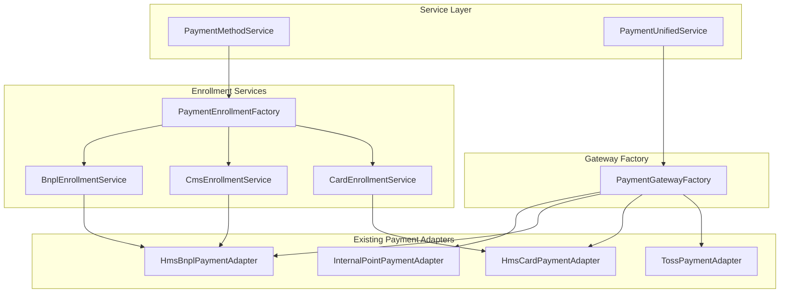

# Design Document

## Overview

현재 결제 서비스는 PaymentGateway 인터페이스와 어댑터 패턴을 사용하여 여러 결제수단을 지원하고 있습니다. 하지만 결제수단별로 서로 다른 회원 등록 절차(카드의 Billing Key 발급, BNPL의 출금동의서 등록 등)와 결제 실행 로직이 혼재되어 있어 구조적 복잡성이 증가하고 있습니다.

이 설계는 **결제수단 생명주기 관리(Payment Method Lifecycle Management)** 개념을 도입하여 회원 등록과 결제 실행을 명확히 분리하면서도 일관된 인터페이스를 제공하는 구조를 제안합니다.

## Architecture

### 핵심 설계 원칙

1. **등록 로직 분리**: 결제 실행과 회원 등록 로직을 명확히 분리
2. **팩토리 패턴**: 결제수단별 등록 서비스를 팩토리로 관리
3. **기존 구조 유지**: 현재 디렉토리 구조와 데이터베이스 스키마 완전 보존
4. **단순한 확장**: 새로운 결제수단 추가 시 해당 EnrollmentService만 구현

### 아키텍처 다이어그램



## Components and Interfaces

### 1. PaymentMethodEnrollment Interface

결제수단별 회원 등록을 담당하는 공통 인터페이스입니다.

```typescript
interface PaymentMethodEnrollment {
  registerMember(request: RegisterMemberRequest): Promise<RegisterMemberResponse>
  validateRegistrationData(request: RegisterMemberRequest): ValidationResult
  getRequiredFields(): string[]
}

interface RegisterMemberRequest {
  userId: string
  memberName: string
  phone: string
  methodType: 'CARD' | 'CMS' | 'BNPL'
  
  // 카드 전용 필드
  cardNumber?: string
  expiryYear?: string
  expiryMonth?: string
  cardHolderName?: string
  
  // BNPL/CMS 전용 필드
  creditLimit?: number
  billingCycleDay?: number
  consentFile?: Buffer
  consentFileName?: string
}

interface RegisterMemberResponse {
  success: boolean
  paymentMethodId: string
  externalMemberId?: string  // HMS 회원ID 등
  status: 'PENDING' | 'ACTIVE' | 'REQUIRES_CONSENT'
  nextSteps?: string[]
  error?: string
  metadata?: Record<string, any>
}
```

### 2. Enrollment Service Implementations

각 결제수단별 등록 서비스를 구현합니다.

```typescript
@Injectable()
export class CardEnrollmentService implements PaymentMethodEnrollment {
  constructor(private hmsCardAdapter: HmsCardPaymentAdapter) {}
  
  async registerMember(request: RegisterMemberRequest): Promise<RegisterMemberResponse> {
    // 1. HMS PaymentProfile API로 카드 등록
    // 2. Billing Key 발급
    // 3. 즉시 ACTIVE 상태로 전환
  }
}

@Injectable()
export class CmsEnrollmentService implements PaymentMethodEnrollment {
  constructor(private hmsBnplAdapter: HmsBnplPaymentAdapter) {}
  
  async registerMember(request: RegisterMemberRequest): Promise<RegisterMemberResponse> {
    // 1. HMS BatchCMS API로 회원 등록
    // 2. 출금동의서가 있으면 함께 제출
    // 3. PENDING 상태로 시작 (HMS 승인 대기)
  }
}

@Injectable()
export class BnplEnrollmentService implements PaymentMethodEnrollment {
  constructor(private hmsBnplAdapter: HmsBnplPaymentAdapter) {}
  
  async registerMember(request: RegisterMemberRequest): Promise<RegisterMemberResponse> {
    // 1. HMS BatchCMS API로 BNPL 회원 등록
    // 2. 출금동의서 제출 필요 시 REQUIRES_CONSENT 상태
    // 3. 모든 절차 완료 시 ACTIVE 상태
  }
}
```

### 3. PaymentEnrollmentFactory

결제수단별 등록 서비스를 관리하는 팩토리입니다.

```typescript
@Injectable()
export class PaymentEnrollmentFactory {
  constructor(
    private cardEnrollment: CardEnrollmentService,
    private cmsEnrollment: CmsEnrollmentService,
    private bnplEnrollment: BnplEnrollmentService,
  ) {}
  
  getEnrollmentService(methodType: string): PaymentMethodEnrollment {
    switch (methodType) {
      case 'CARD':
        return this.cardEnrollment
      case 'CMS':
        return this.cmsEnrollment
      case 'BNPL':
        return this.bnplEnrollment
      default:
        throw new Error(`지원하지 않는 결제수단: ${methodType}`)
    }
  }
  
  getSupportedMethods(): string[] {
    return ['CARD', 'CMS', 'BNPL']
  }
}
```

### 4. Enhanced PaymentMethodService

기존 PaymentMethodService에 등록 로직을 통합합니다.

```typescript
@Injectable()
export class PaymentMethodService {
  constructor(
    private db: DbService<typeof schema>,
    private enrollmentFactory: PaymentEnrollmentFactory,
    // ... 기존 의존성들
  ) {}
  
  async createWithEnrollment(
    dto: CreatePaymentMethodDto,
    idempotencyKey?: string,
  ): Promise<PaymentMethodResponseDto> {
    return await this.db.db.transaction(async (tx) => {
      // 1. 멱등성 체크
      // 2. 비즈니스 검증
      // 3. 등록 서비스를 통한 외부 시스템 등록
      const enrollmentService = this.enrollmentFactory.getEnrollmentService(dto.methodType)
      const enrollmentResult = await enrollmentService.registerMember({
        userId: dto.userId,
        memberName: dto.memberName,
        phone: dto.phone,
        methodType: dto.methodType,
        ...dto.additionalData
      })
      
      // 4. DB에 결제수단 저장
      // 5. 등록 결과에 따른 상태 설정
    })
  }
}
```

### 5. PaymentUnifiedService Integration

PaymentUnifiedService에서 등록된 결제수단을 사용하는 방식입니다.

```typescript
@Injectable()
export class PaymentUnifiedService {
  constructor(
    private db: DbService<typeof schema>,
    private gatewayFactory: PaymentGatewayFactory,
    private paymentMethodService: PaymentMethodService,  // 추가
    private idempotency: IdempotencyService,
  ) {}

  /**
   * 결제수단 등록 + 즉시 결제 (원스톱 서비스)
   */
  async registerAndPay(
    request: {
      // 등록 정보
      userId: string
      memberName: string
      phone: string
      methodType: 'CARD' | 'CMS' | 'BNPL'
      cardNumber?: string
      expiryYear?: string
      expiryMonth?: string
      // 결제 정보
      amount: number
      currency?: string
      orderName?: string
      sessionId: string
    },
    idempotencyKey?: string,
  ) {
    // 1. 결제수단 등록
    const enrollmentResult = await this.paymentMethodService.createWithEnrollment({
      userId: request.userId,
      memberName: request.memberName,
      phone: request.phone,
      methodType: request.methodType,
      cardNumber: request.cardNumber,
      expiryYear: request.expiryYear,
      expiryMonth: request.expiryMonth,
    })

    // 2. 등록이 즉시 완료된 경우에만 결제 진행
    if (enrollmentResult.status === 'ACTIVE') {
      return await this.processPayment(
        this.getGatewayTypeFromMethod(request.methodType),
        request.amount,
        request.currency || 'KRW',
        {
          userId: request.userId,
          sessionId: request.sessionId,
          paymentMethodId: enrollmentResult.id,
          orderName: request.orderName,
          hmsMemberId: enrollmentResult.externalMemberId,
        },
        idempotencyKey,
      )
    }

    // 3. 등록이 PENDING인 경우 (BNPL 등)
    return {
      success: false,
      enrollmentResult,
      message: '결제수단 등록이 완료되면 결제를 진행할 수 있습니다',
      nextSteps: enrollmentResult.nextSteps,
    }
  }

  /**
   * 기존 결제수단으로 결제 (기존 로직 유지)
   */
  async processPaymentWithExistingMethod(
    paymentMethodId: string,
    amount: number,
    sessionId: string,
    orderName?: string,
    idempotencyKey?: string,
  ) {
    // 1. 결제수단 조회 및 검증
    const paymentMethod = await this.paymentMethodService.get(paymentMethodId)
    
    if (paymentMethod.status !== 'ACTIVE') {
      throw new Error('사용할 수 없는 결제수단입니다')
    }

    // 2. 결제수단 타입에 따른 게이트웨이 선택 및 결제
    const gatewayType = this.getGatewayTypeFromMethod(paymentMethod.methodType)
    
    return await this.processPayment(
      gatewayType,
      amount,
      'KRW',
      {
        userId: paymentMethod.userId,
        sessionId,
        paymentMethodId,
        orderName,
        // 결제수단별 추가 메타데이터 조회 및 설정
        ...(await this.getPaymentMetadata(paymentMethod)),
      },
      idempotencyKey,
    )
  }

  /**
   * 결제수단별 메타데이터 조회
   */
  private async getPaymentMetadata(paymentMethod: any): Promise<Record<string, any>> {
    switch (paymentMethod.methodType) {
      case 'CARD':
        // cardMethod 테이블에서 billingKey 등 조회
        const cardInfo = await this.getCardMethodInfo(paymentMethod.id)
        return {
          hmsMemberId: cardInfo?.billingKey,
          isRecurring: true,
        }
      
      case 'BNPL':
        // bnplAccount 테이블에서 계정 정보 조회
        const bnplInfo = await this.getBnplAccountInfo(paymentMethod.id)
        return {
          bnplAccountId: bnplInfo?.id,
        }
      
      case 'CMS':
        // batchCmsMethod 테이블에서 HMS 회원 정보 조회
        const cmsInfo = await this.getCmsMethodInfo(paymentMethod.id)
        return {
          hmsMemberId: cmsInfo?.hmsMemberId,
          isRecurring: true,
        }
      
      default:
        return {}
    }
  }

  // 기존 processPayment 메서드는 그대로 유지...
}
```

## Data Models

### 1. 기존 Schema 활용

현재 데이터베이스 스키마를 그대로 사용하며, 등록 관련 메타데이터는 기존 JSON 필드를 활용합니다.

```typescript
// 기존 paymentMethod 테이블 그대로 사용
interface PaymentMethod {
  id: string
  userId: string
  methodType: 'CARD' | 'BANK_ACCOUNT' | 'BNPL' | 'REWARD_POINT'
  methodName: string
  isDefault: boolean
  status: 'PENDING' | 'ACTIVE' | 'INACTIVE'  // 기존 상태 활용
  createdAt: Date
  updatedAt: Date
}

// 기존 cardMethod, batchCmsMethod 테이블도 그대로 활용
// 등록 과정에서 생성된 외부 시스템 정보 저장
```

### 2. Enrollment Metadata

등록 과정의 메타데이터는 기존 테이블의 JSON 필드나 별도 필드를 활용합니다.

```typescript
// cardMethod 테이블의 기존 필드 활용
interface CardMethodData {
  pgToken: string        // PG 토큰
  billingKey: string     // 빌링키
  maskedCardNumber: string
  // ... 기타 카드 정보
}

// batchCmsMethod 테이블의 기존 필드 활용
interface BatchCmsMethodData {
  hmsMemberId: string    // HMS 회원 ID
  hmsCustId: string      // HMS 고객 ID
  creditLimit: number
  approvedLimit: number
  hmsMetadata: string    // JSON 형태로 추가 정보 저장
  // ... 기타 CMS 정보
}
```

### 3. Status Management

기존 status 필드를 활용하여 등록 상태를 관리합니다.

```typescript
// 기존 PAYMENT_METHOD_STATUS 그대로 사용
const PAYMENT_METHOD_STATUS = {
  PENDING: 'PENDING',    // 등록 진행 중 또는 승인 대기
  ACTIVE: 'ACTIVE',      // 등록 완료 및 사용 가능
  INACTIVE: 'INACTIVE'   // 비활성화
} as const

// 세부 상태는 metadata나 별도 로직으로 관리
interface EnrollmentStatus {
  status: PaymentMethodStatus
  substatus?: 'REGISTRATION_PENDING' | 'CONSENT_REQUIRED' | 'APPROVAL_PENDING'
  nextSteps?: string[]
  estimatedCompletionDate?: string
}
```

## Error Handling

### 1. Lifecycle-Specific Errors

```typescript
class LifecycleError extends Error {
  constructor(
    public methodId: string,
    public currentStep: LifecycleStep,
    public attemptedStep: LifecycleStep,
    message: string
  ) {
    super(message)
  }
}

class StepValidationError extends LifecycleError {
  constructor(
    methodId: string,
    step: LifecycleStep,
    public validationErrors: string[]
  ) {
    super(methodId, step, step, `Step validation failed: ${validationErrors.join(', ')}`)
  }
}
```

### 2. Error Recovery Strategies

- **재시도 가능한 오류**: 네트워크 오류, 일시적 API 장애
- **사용자 수정 필요**: 잘못된 카드 정보, 부족한 서류
- **시스템 오류**: 설정 문제, 내부 서비스 장애

## Testing Strategy

### 1. Unit Tests

```typescript
describe('PaymentLifecycleService', () => {
  describe('createPaymentMethod', () => {
    it('should create card method with registration step', async () => {
      // 카드 결제수단 생성 시 등록 단계부터 시작
    })
    
    it('should create BNPL method with registration and consent steps', async () => {
      // BNPL 결제수단 생성 시 등록 + 출금동의서 단계
    })
  })
  
  describe('proceedToNextStep', () => {
    it('should proceed from registration to activation for card', async () => {
      // 카드: 등록 → 활성화
    })
    
    it('should proceed from registration to consent for BNPL', async () => {
      // BNPL: 등록 → 출금동의서 → 활성화
    })
  })
})
```

### 2. Integration Tests

```typescript
describe('Payment Method Lifecycle Integration', () => {
  it('should complete full card registration lifecycle', async () => {
    // 1. 카드 정보로 등록 요청
    // 2. HMS API 호출하여 Billing Key 발급
    // 3. 자동 활성화
    // 4. 결제 가능 상태 확인
  })
  
  it('should complete full BNPL registration lifecycle', async () => {
    // 1. 회원 정보로 등록 요청
    // 2. HMS API 호출하여 회원 등록
    // 3. 출금동의서 제출
    // 4. HMS 승인 대기
    // 5. 활성화 및 결제 가능 상태
  })
})
```

### 3. End-to-End Tests

```typescript
describe('Payment Method E2E', () => {
  it('should handle complete payment flow with lifecycle management', async () => {
    // 1. 결제수단 등록부터 실제 결제까지 전체 플로우
    // 2. 각 단계별 상태 확인
    // 3. 오류 상황 처리 확인
  })
})
```

## Implementation Details

### 1. 기존 코드와의 호환성

- 기존 PaymentMethodService의 메서드들은 그대로 유지
- 새로운 `createWithEnrollment` 메서드 추가로 점진적 전환
- 기존 API 엔드포인트는 하위 호환성 완전 보장
- 새로운 등록 API는 별도 엔드포인트로 제공

### 2. 점진적 도입 전략

1. **Phase 1**: Enrollment 서비스들 구현 및 팩토리 패턴 적용
2. **Phase 2**: PaymentMethodService에 새로운 등록 메서드 추가
3. **Phase 3**: 프론트엔드에서 새로운 API 사용 시작
4. **Phase 4**: 기존 등록 로직을 새로운 방식으로 점진적 교체

### 3. 디렉토리 구조 (기존 구조 유지)

```
apps/wallet/src/
├── adapters/           # 기존 어댑터들 그대로 유지
├── services/
│   ├── enrollment/     # 새로운 등록 서비스들
│   │   ├── card-enrollment.service.ts
│   │   ├── cms-enrollment.service.ts
│   │   ├── bnpl-enrollment.service.ts
│   │   └── payment-enrollment.factory.ts
│   ├── payment-method.service.ts  # 기존 서비스 확장
│   └── ...
├── interfaces/         # 기존 인터페이스 + 새로운 등록 인터페이스
└── shared/            # 기존 구조 그대로
```

### 4. 성능 및 확장성

- 등록 서비스는 stateless로 설계하여 수평 확장 가능
- 외부 API 호출은 비동기 처리 및 재시도 로직 포함
- 등록 상태는 데이터베이스 기반으로 관리 (별도 캐시 불필요)

### 5. 모니터링 및 로깅

```typescript
interface EnrollmentEvent {
  userId: string
  methodType: string
  enrollmentService: string
  duration: number
  success: boolean
  errorMessage?: string
  externalApiCalls: {
    service: string
    duration: number
    success: boolean
  }[]
}
```

### 6. 에러 처리 전략

```typescript
class EnrollmentError extends Error {
  constructor(
    public methodType: string,
    public step: string,
    message: string,
    public retryable: boolean = false
  ) {
    super(message)
  }
}

// 각 등록 서비스에서 일관된 에러 처리
class CardEnrollmentError extends EnrollmentError {
  constructor(message: string, public cardError?: any) {
    super('CARD', 'BILLING_KEY_ISSUANCE', message, true)
  }
}
```

이 설계를 통해 결제수단별 복잡한 등록 절차와 결제 실행 로직을 체계적으로 관리하면서도, 기존 코드 구조를 최대한 보존하고 확장성을 확보할 수 있습니다.