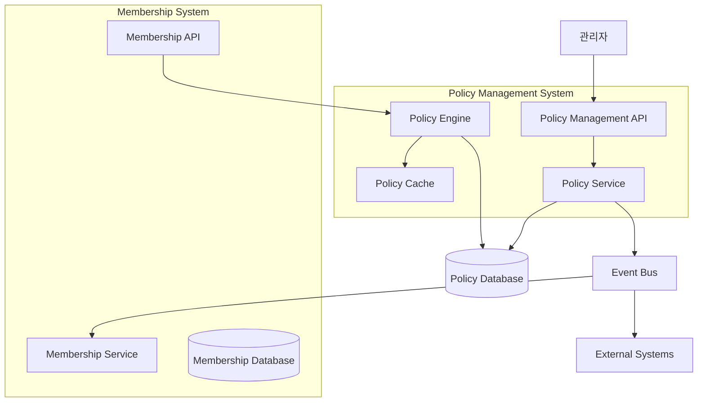
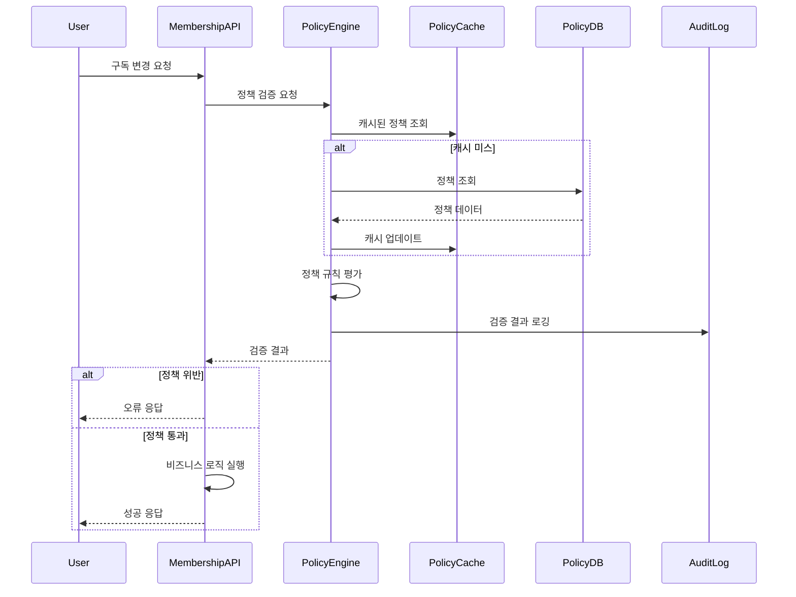
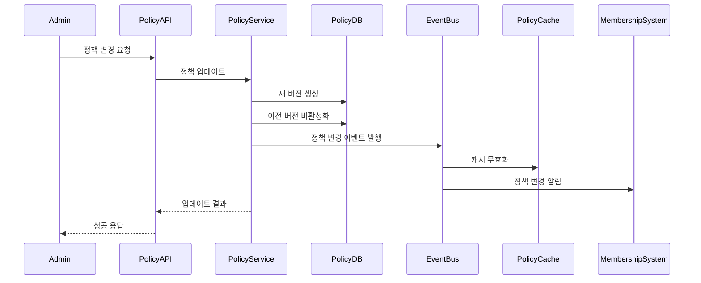

# 정책 관리 시스템 설계

## 개요

정책 관리 시스템은 멤버십 구독 시스템의 비즈니스 규칙을 동적으로 관리하는 독립적인 모듈입니다. 기존 멤버십 시스템과 긴밀하게 연동되면서도 확장 가능한 아키텍처를 제공하여, 코드 변경 없이 다양한 정책을 설정하고 관리할 수 있습니다.

## 아키텍처

### 전체 시스템 아키텍처



### 레이어 아키텍처

1. **API Layer**: 정책 관리 REST API 및 GraphQL 인터페이스
2. **Service Layer**: 정책 비즈니스 로직 처리
3. **Engine Layer**: 정책 검증 및 적용 엔진
4. **Data Layer**: 정책 데이터 저장 및 캐싱
5. **Integration Layer**: 외부 시스템과의 연동

## 컴포넌트 및 인터페이스

### 1. 정책 관리 컨트롤러

```typescript
// policy-management.controller.ts
@Controller('policies')
export class PolicyManagementController {
  // 정책 CRUD
  @Get()
  getAllPolicies(@Query() query: GetPoliciesDto)
  
  @Get(':policyId')
  getPolicyById(@Param('policyId') policyId: string)
  
  @Post()
  createPolicy(@Body() dto: CreatePolicyDto)
  
  @Put(':policyId')
  updatePolicy(@Param('policyId') policyId: string, @Body() dto: UpdatePolicyDto)
  
  @Delete(':policyId')
  deactivatePolicy(@Param('policyId') policyId: string)
  
  // 정책 버전 관리
  @Get(':policyId/versions')
  getPolicyVersions(@Param('policyId') policyId: string)
  
  @Post(':policyId/rollback/:version')
  rollbackToVersion(@Param('policyId') policyId: string, @Param('version') version: number)
  
  // 정책 템플릿
  @Get('templates')
  getPolicyTemplates(@Query() query: GetTemplatesDto)
  
  @Post('templates')
  createPolicyTemplate(@Body() dto: CreateTemplateDto)
  
  @Post('templates/:templateId/apply')
  applyTemplate(@Param('templateId') templateId: string, @Body() dto: ApplyTemplateDto)
}

// policy-validation.controller.ts
@Controller('policies/validation')
export class PolicyValidationController {
  // 정책 검증 API
  @Post('validate')
  validatePolicyCompliance(@Body() dto: PolicyValidationDto)
  
  @Post('validate/bulk')
  bulkValidatePolicies(@Body() dto: BulkValidationDto)
  
  @Get('user/:userId/applicable')
  getApplicablePolicies(@Param('userId') userId: string, @Query() context: PolicyContextDto)
  
  // 정책 검증 결과 조회
  @Get('violations')
  getPolicyViolations(@Query() query: ViolationQueryDto)
  
  @Get('statistics')
  getPolicyStatistics(@Query() query: StatisticsQueryDto)
}

// policy-monitoring.controller.ts
@Controller('policies/monitoring')
export class PolicyMonitoringController {
  // 정책 모니터링
  @Get('dashboard')
  getPolicyDashboard(@Query() query: DashboardQueryDto)
  
  @Get('analytics')
  getPolicyAnalytics(@Query() query: AnalyticsQueryDto)
  
  @Get('alerts')
  getPolicyAlerts(@Query() query: AlertQueryDto)
  
  @Post('alerts')
  createPolicyAlert(@Body() dto: CreateAlertDto)
}
```

### 2. 정책 서비스 레이어

```typescript
// policy-management.service.ts
@Injectable()
export class PolicyManagementService {
  // 정책 관리
  async createPolicy(dto: CreatePolicyDto): Promise<Policy>
  async updatePolicy(policyId: string, dto: UpdatePolicyDto): Promise<Policy>
  async deactivatePolicy(policyId: string): Promise<void>
  async getPolicyById(policyId: string): Promise<Policy>
  async getAllPolicies(query: GetPoliciesDto): Promise<PaginatedPolicies>
  
  // 정책 버전 관리
  async createPolicyVersion(policyId: string, changes: PolicyChanges): Promise<PolicyVersion>
  async getPolicyVersions(policyId: string): Promise<PolicyVersion[]>
  async rollbackToVersion(policyId: string, version: number): Promise<Policy>
  async comparePolicyVersions(policyId: string, v1: number, v2: number): Promise<PolicyComparison>
  
  // 정책 템플릿
  async createTemplate(dto: CreateTemplateDto): Promise<PolicyTemplate>
  async applyTemplate(templateId: string, dto: ApplyTemplateDto): Promise<Policy[]>
  async getTemplates(query: GetTemplatesDto): Promise<PolicyTemplate[]>
  
  // 내부 헬퍼 메서드
  private validatePolicyRules(rules: PolicyRule[]): Promise<ValidationResult>
  private publishPolicyChangeEvent(policy: Policy, changeType: PolicyChangeType): Promise<void>
  private invalidateRelatedCaches(policyId: string): Promise<void>
}

// policy-engine.service.ts
@Injectable()
export class PolicyEngineService {
  // 정책 검증 엔진
  async validateRequest(request: PolicyValidationRequest): Promise<PolicyValidationResult>
  async bulkValidate(requests: PolicyValidationRequest[]): Promise<PolicyValidationResult[]>
  async getApplicablePolicies(userId: string, context: PolicyContext): Promise<ApplicablePolicy[]>
  
  // 정책 적용
  async applyPolicies(userId: string, action: UserAction, context: PolicyContext): Promise<PolicyApplicationResult>
  async checkPolicyCompliance(userId: string, policies: Policy[]): Promise<ComplianceResult>
  
  // 정책 캐싱
  async refreshPolicyCache(): Promise<void>
  async getPolicyFromCache(policyId: string): Promise<Policy | null>
  
  // 내부 엔진 메서드
  private evaluatePolicyRule(rule: PolicyRule, context: PolicyContext): Promise<RuleEvaluationResult>
  private resolvePolicyConflicts(policies: Policy[]): Promise<Policy[]>
  private calculatePolicyPriority(policy: Policy, context: PolicyContext): number
}

// policy-analytics.service.ts
@Injectable()
export class PolicyAnalyticsService {
  // 정책 분석
  async getPolicyStatistics(query: StatisticsQueryDto): Promise<PolicyStatistics>
  async getPolicyViolations(query: ViolationQueryDto): Promise<PolicyViolation[]>
  async analyzePolicyEffectiveness(policyId: string, period: DateRange): Promise<EffectivenessAnalysis>
  
  // 대시보드 데이터
  async getDashboardData(query: DashboardQueryDto): Promise<PolicyDashboard>
  async getRealTimeMetrics(): Promise<RealTimeMetrics>
  
  // 알림 및 모니터링
  async createAlert(dto: CreateAlertDto): Promise<PolicyAlert>
  async checkAlertConditions(): Promise<void>
  async sendPolicyNotification(alert: PolicyAlert): Promise<void>
}
```

### 3. 데이터 모델 확장

```typescript
// 기존 스키마 확장
export const policyRuleTypeEnum = pgEnum('policy_rule_type', [
  // 일시정지 관련
  'MAX_PAUSES_PER_YEAR',
  'MIN_PAUSE_DURATION_DAYS',
  'MAX_PAUSE_DURATION_DAYS',
  'PAUSE_COOLDOWN_DAYS',
  'PAUSE_BLACKOUT_PERIODS',
  
  // 플랜 변경 관련
  'PLAN_CHANGE_COOLDOWN_DAYS',
  'ALLOWED_PLAN_CHANGES',
  'DOWNGRADE_RESTRICTIONS',
  'UPGRADE_BENEFITS',
  
  // 티어별 정책
  'TIER_SPECIFIC_LIMITS',
  'VIP_USER_BENEFITS',
  'NEW_USER_GRACE_PERIOD',
  
  // 프로모션 관련
  'PROMOTIONAL_PERIODS',
  'SEASONAL_RESTRICTIONS',
  'SPECIAL_EVENT_RULES',
]);

// 새로운 정책 관리 테이블들
export const policyDefinitions = pgTable('policy_definitions', {
  id: uuid('id').primaryKey().defaultRandom(),
  name: text('name').notNull(),
  description: text('description'),
  category: text('category').notNull(),
  ruleType: policyRuleTypeEnum('rule_type').notNull(),
  isActive: boolean('is_active').default(true).notNull(),
  priority: integer('priority').default(0).notNull(),
  createdBy: uuid('created_by').notNull(),
  approvedBy: uuid('approved_by'),
  approvedAt: timestamp('approved_at', { withTimezone: true }),
  createdAt: timestamp('created_at', { withTimezone: true }).defaultNow().notNull(),
  updatedAt: timestamp('updated_at', { withTimezone: true }).defaultNow().notNull(),
});

export const policyVersions = pgTable('policy_versions', {
  id: uuid('id').primaryKey().defaultRandom(),
  policyId: uuid('policy_id').notNull().references(() => policyDefinitions.id),
  version: integer('version').notNull(),
  ruleValue: jsonb('rule_value').notNull(),
  tierId: uuid('tier_id').references(() => subscriptionTiers.id),
  validFrom: timestamp('valid_from', { withTimezone: true }),
  validUntil: timestamp('valid_until', { withTimezone: true }),
  changeReason: text('change_reason'),
  changedBy: uuid('changed_by').notNull(),
  isActive: boolean('is_active').default(false).notNull(),
  createdAt: timestamp('created_at', { withTimezone: true }).defaultNow().notNull(),
});

export const policyTemplates = pgTable('policy_templates', {
  id: uuid('id').primaryKey().defaultRandom(),
  name: text('name').notNull(),
  description: text('description'),
  category: text('category').notNull(),
  templateData: jsonb('template_data').notNull(),
  isPublic: boolean('is_public').default(false).notNull(),
  createdBy: uuid('created_by').notNull(),
  createdAt: timestamp('created_at', { withTimezone: true }).defaultNow().notNull(),
  updatedAt: timestamp('updated_at', { withTimezone: true }).defaultNow().notNull(),
});

export const policyViolations = pgTable('policy_violations', {
  id: uuid('id').primaryKey().defaultRandom(),
  policyId: uuid('policy_id').notNull().references(() => policyDefinitions.id),
  userId: uuid('user_id').notNull().references(() => users.id),
  violationType: text('violation_type').notNull(),
  violationData: jsonb('violation_data').notNull(),
  actionAttempted: text('action_attempted').notNull(),
  isResolved: boolean('is_resolved').default(false).notNull(),
  resolvedAt: timestamp('resolved_at', { withTimezone: true }),
  resolvedBy: uuid('resolved_by'),
  createdAt: timestamp('created_at', { withTimezone: true }).defaultNow().notNull(),
});

export const policyApplicationLogs = pgTable('policy_application_logs', {
  id: uuid('id').primaryKey().defaultRandom(),
  policyId: uuid('policy_id').notNull().references(() => policyDefinitions.id),
  userId: uuid('user_id').notNull().references(() => users.id),
  action: text('action').notNull(),
  result: text('result').notNull(), // 'ALLOWED', 'DENIED', 'WARNING'
  context: jsonb('context').notNull(),
  executionTimeMs: integer('execution_time_ms'),
  createdAt: timestamp('created_at', { withTimezone: true }).defaultNow().notNull(),
});

export const policyAlerts = pgTable('policy_alerts', {
  id: uuid('id').primaryKey().defaultRandom(),
  name: text('name').notNull(),
  description: text('description'),
  condition: jsonb('condition').notNull(),
  threshold: jsonb('threshold').notNull(),
  recipients: jsonb('recipients').notNull(),
  isActive: boolean('is_active').default(true).notNull(),
  lastTriggered: timestamp('last_triggered', { withTimezone: true }),
  createdBy: uuid('created_by').notNull(),
  createdAt: timestamp('created_at', { withTimezone: true }).defaultNow().notNull(),
  updatedAt: timestamp('updated_at', { withTimezone: true }).defaultNow().notNull(),
});
```

### 4. DTO 및 타입 정의

```typescript
// policy.dto.ts
export class CreatePolicyDto {
  name: string;
  description?: string;
  category: string;
  ruleType: PolicyRuleType;
  ruleValue: Record<string, any>;
  tierId?: string;
  priority?: number;
  validFrom?: Date;
  validUntil?: Date;
}

export class UpdatePolicyDto {
  name?: string;
  description?: string;
  ruleValue?: Record<string, any>;
  priority?: number;
  validFrom?: Date;
  validUntil?: Date;
  changeReason: string;
}

export class PolicyValidationDto {
  userId: string;
  action: string;
  context: Record<string, any>;
  policyIds?: string[];
}

export class BulkValidationDto {
  requests: PolicyValidationDto[];
}

// policy.types.ts
export interface Policy {
  id: string;
  name: string;
  description?: string;
  category: string;
  ruleType: PolicyRuleType;
  currentVersion: PolicyVersion;
  isActive: boolean;
  priority: number;
  createdBy: string;
  approvedBy?: string;
  approvedAt?: Date;
  createdAt: Date;
  updatedAt: Date;
}

export interface PolicyVersion {
  id: string;
  policyId: string;
  version: number;
  ruleValue: Record<string, any>;
  tierId?: string;
  validFrom?: Date;
  validUntil?: Date;
  changeReason?: string;
  changedBy: string;
  isActive: boolean;
  createdAt: Date;
}

export interface PolicyValidationResult {
  isValid: boolean;
  violatedPolicies: PolicyViolation[];
  warnings: PolicyWarning[];
  appliedPolicies: AppliedPolicy[];
  executionTime: number;
}

export interface PolicyViolation {
  policyId: string;
  policyName: string;
  violationType: string;
  message: string;
  severity: 'ERROR' | 'WARNING';
  suggestedAction?: string;
}

export interface AppliedPolicy {
  policyId: string;
  policyName: string;
  ruleType: PolicyRuleType;
  appliedValue: any;
  context: Record<string, any>;
}

export interface PolicyTemplate {
  id: string;
  name: string;
  description?: string;
  category: string;
  templateData: PolicyTemplateData;
  isPublic: boolean;
  createdBy: string;
  createdAt: Date;
  updatedAt: Date;
}

export interface PolicyTemplateData {
  policies: CreatePolicyDto[];
  variables: Record<string, any>;
  conditions: Record<string, any>;
}
```

## 데이터 흐름

### 정책 검증 플로우



### 정책 변경 플로우



## 오류 처리

### 정책 관련 예외 클래스

```typescript
export class PolicyError extends Error {
  constructor(
    message: string,
    public code: string,
    public statusCode: number = 400
  ) {
    super(message);
  }
}

export class PolicyNotFoundError extends PolicyError {
  constructor(policyId: string) {
    super(`정책을 찾을 수 없습니다: ${policyId}`, 'POLICY_NOT_FOUND', 404);
  }
}

export class PolicyViolationError extends PolicyError {
  constructor(violations: PolicyViolation[]) {
    const message = violations.map(v => v.message).join(', ');
    super(`정책 위반: ${message}`, 'POLICY_VIOLATION', 400);
    this.violations = violations;
  }
  
  public violations: PolicyViolation[];
}

export class PolicyConflictError extends PolicyError {
  constructor(conflictingPolicies: string[]) {
    super(
      `정책 충돌이 감지되었습니다: ${conflictingPolicies.join(', ')}`,
      'POLICY_CONFLICT',
      409
    );
  }
}

export class PolicyVersionError extends PolicyError {
  constructor(message: string) {
    super(message, 'POLICY_VERSION_ERROR', 400);
  }
}
```

### 글로벌 정책 예외 필터

```typescript
@Catch(PolicyError)
export class PolicyExceptionFilter implements ExceptionFilter {
  catch(exception: PolicyError, host: ArgumentsHost) {
    const ctx = host.switchToHttp();
    const response = ctx.getResponse();
    
    const errorResponse = {
      error: {
        code: exception.code,
        message: exception.message,
        timestamp: new Date().toISOString(),
      },
    };
    
    if (exception instanceof PolicyViolationError) {
      errorResponse.error['violations'] = exception.violations;
    }
    
    response.status(exception.statusCode).json(errorResponse);
  }
}
```

## 테스트 전략

### 단위 테스트

1. **Policy Engine 테스트**
   - 정책 규칙 평가 로직 테스트
   - 정책 충돌 해결 테스트
   - 캐싱 메커니즘 테스트

2. **Policy Service 테스트**
   - CRUD 작업 테스트
   - 버전 관리 로직 테스트
   - 템플릿 적용 테스트

### 통합 테스트

1. **데이터베이스 통합 테스트**
   - 복잡한 정책 쿼리 테스트
   - 트랜잭션 일관성 테스트
   - 성능 테스트

2. **멤버십 시스템 연동 테스트**
   - 정책 검증 API 테스트
   - 이벤트 기반 통신 테스트

### E2E 테스트

1. **정책 생명주기 테스트**
   - 정책 생성 → 적용 → 수정 → 롤백 → 비활성화
   - 다양한 시나리오별 전체 플로우 검증

## 성능 고려사항

### 캐싱 전략

1. **Redis 기반 다층 캐싱**
   ```typescript
   // 캐시 키 전략
   const CACHE_KEYS = {
     POLICY_BY_ID: (id: string) => `policy:${id}`,
     POLICIES_BY_CATEGORY: (category: string) => `policies:category:${category}`,
     USER_APPLICABLE_POLICIES: (userId: string) => `policies:user:${userId}`,
     POLICY_VALIDATION_RESULT: (hash: string) => `validation:${hash}`,
   };
   
   // 캐시 TTL 설정
   const CACHE_TTL = {
     POLICY_DATA: 3600, // 1시간
     VALIDATION_RESULT: 300, // 5분
     USER_POLICIES: 1800, // 30분
   };
   ```

2. **캐시 무효화 전략**
   - 정책 변경 시 관련 캐시 즉시 무효화
   - 계층적 캐시 무효화 (정책 → 카테고리 → 사용자별)

### 데이터베이스 최적화

1. **인덱스 전략**
   ```sql
   -- 정책 조회 최적화
   CREATE INDEX idx_policy_definitions_category_active ON policy_definitions(category, is_active);
   CREATE INDEX idx_policy_versions_policy_active ON policy_versions(policy_id, is_active);
   
   -- 정책 적용 로그 최적화
   CREATE INDEX idx_policy_logs_user_date ON policy_application_logs(user_id, created_at);
   CREATE INDEX idx_policy_violations_policy_user ON policy_violations(policy_id, user_id, is_resolved);
   
   -- 정책 검증 최적화
   CREATE INDEX idx_policy_versions_tier_valid ON policy_versions(tier_id, valid_from, valid_until) WHERE is_active = true;
   ```

2. **쿼리 최적화**
   - 정책 검증 시 필요한 정책만 조회
   - 배치 처리를 통한 대량 검증 최적화
   - 파티셔닝을 통한 로그 테이블 성능 개선

### 정책 엔진 최적화

1. **규칙 평가 최적화**
   ```typescript
   // 정책 우선순위 기반 단축 평가
   async evaluatePolicies(policies: Policy[], context: PolicyContext): Promise<PolicyResult> {
     const sortedPolicies = policies.sort((a, b) => b.priority - a.priority);
     
     for (const policy of sortedPolicies) {
       const result = await this.evaluatePolicy(policy, context);
       if (result.isBlocking) {
         return result; // 차단 정책 발견 시 즉시 반환
       }
     }
     
     return { isValid: true, appliedPolicies: sortedPolicies };
   }
   ```

2. **병렬 처리**
   - 독립적인 정책 규칙의 병렬 평가
   - 벌크 검증 시 배치 처리

## 보안 고려사항

### 접근 제어

1. **역할 기반 접근 제어 (RBAC)**
   ```typescript
   export enum PolicyRole {
     POLICY_ADMIN = 'POLICY_ADMIN',
     POLICY_MANAGER = 'POLICY_MANAGER',
     POLICY_VIEWER = 'POLICY_VIEWER',
     POLICY_AUDITOR = 'POLICY_AUDITOR',
   }
   
   export const POLICY_PERMISSIONS = {
     [PolicyRole.POLICY_ADMIN]: ['*'],
     [PolicyRole.POLICY_MANAGER]: ['create', 'update', 'view', 'template'],
     [PolicyRole.POLICY_VIEWER]: ['view'],
     [PolicyRole.POLICY_AUDITOR]: ['view', 'audit'],
   };
   ```

2. **승인 워크플로우**
   - 중요 정책 변경 시 다단계 승인
   - 변경 사항에 대한 상세 로깅
   - 자동화된 보안 검사

### 데이터 보안

1. **민감 정보 보호**
   - 정책 규칙 값의 암호화 저장
   - 개인정보 포함 정책의 별도 처리
   - 감사 로그의 무결성 보장

2. **API 보안**
   - Rate Limiting 및 DDoS 방어
   - 입력값 검증 및 SQL Injection 방지
   - JWT 기반 인증 및 권한 검증

## 모니터링 및 관찰성

### 메트릭 수집

1. **비즈니스 메트릭**
   - 정책 적용 횟수 및 성공률
   - 정책 위반 발생 빈도
   - 정책 변경 빈도 및 영향도

2. **기술 메트릭**
   - 정책 검증 응답 시간
   - 캐시 히트율
   - 데이터베이스 쿼리 성능

### 알림 시스템

1. **실시간 알림**
   - 정책 위반 급증 시 알림
   - 시스템 오류 발생 시 즉시 알림
   - 성능 임계치 초과 시 알림

2. **정기 리포트**
   - 일/주/월별 정책 적용 현황
   - 정책 효과성 분석 리포트
   - 시스템 성능 리포트