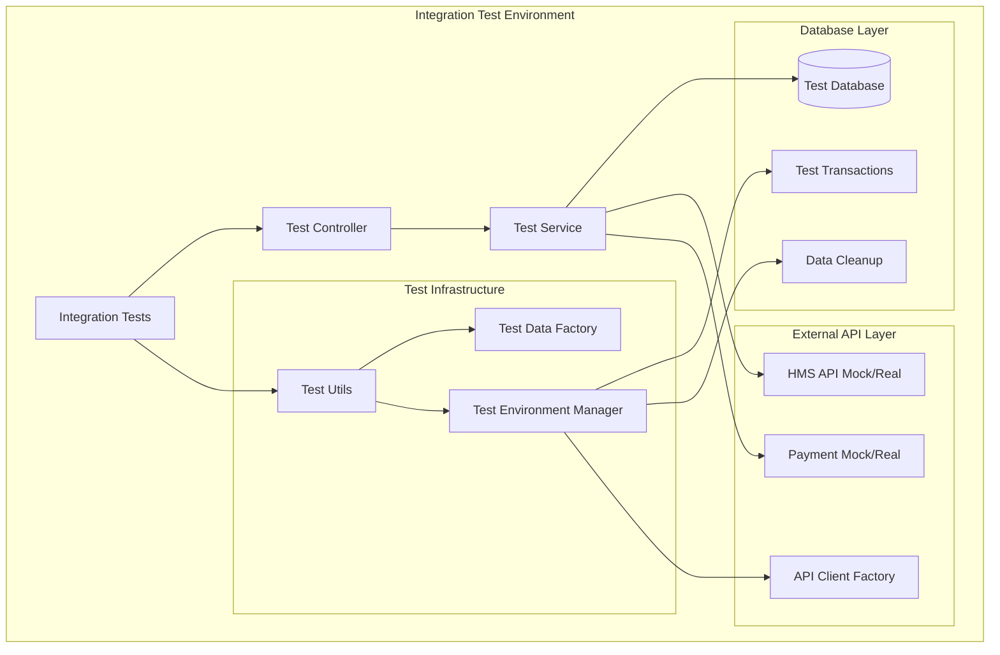

# Design Document

## Overview

이 설계는 wallet 컨트롤러들의 통합 테스트 시스템을 구축하는 것입니다. 실제 데이터베이스와 외부 API와의 연동을 테스트하면서도 테스트 격리와 안정성을 보장하는 통합 테스트 환경을 제공합니다.

## Architecture

### Test Environment Architecture



### Test Isolation Strategy

1. **Database Transaction Isolation**: 각 테스트는 독립적인 트랜잭션 내에서 실행
2. **Test Data Management**: 테스트 전용 데이터 팩토리를 통한 일관된 테스트 데이터 생성
3. **External API Mocking**: 환경 변수에 따른 실제 API vs 모킹 API 선택

## Components and Interfaces

### 1. Integration Test Base Class

```typescript
abstract class BaseIntegrationTest {
  protected app: INestApplication;
  protected dbService: DbService;
  protected testTransaction: any;
  
  abstract setupTestData(): Promise<void>;
  abstract cleanupTestData(): Promise<void>;
}
```

**책임:**
- 테스트 애플리케이션 초기화
- 데이터베이스 트랜잭션 관리
- 테스트 데이터 생성/정리

### 2. Test Environment Manager

```typescript
class TestEnvironmentManager {
  static async setupTestApp(): Promise<INestApplication>;
  static async teardownTestApp(app: INestApplication): Promise<void>;
  static async createTestTransaction(db: DbService): Promise<any>;
  static async rollbackTestTransaction(transaction: any): Promise<void>;
}
```

**책임:**
- NestJS 테스트 애플리케이션 생성/해제
- 데이터베이스 트랜잭션 생성/롤백
- 테스트 환경 설정 관리

### 3. Integration Test Data Factory

```typescript
class IntegrationTestDataFactory {
  static async createTestUser(db: DbService): Promise<User>;
  static async createTestPaymentMethod(db: DbService, userId: string): Promise<PaymentMethod>;
  static async createTestBNPLMember(db: DbService): Promise<BNPLMember>;
  static async cleanupTestData(db: DbService, testIds: string[]): Promise<void>;
}
```

**책임:**
- 실제 데이터베이스에 테스트 데이터 생성
- 테스트 완료 후 데이터 정리
- 테스트 간 데이터 격리 보장

### 4. API Client Test Factory

```typescript
class ApiClientTestFactory {
  static createHMSClient(useReal: boolean): HMSApiClient;
  static createPaymentClient(useReal: boolean): PaymentApiClient;
  static setupMockResponses(): void;
}
```

**책임:**
- 환경에 따른 실제/모킹 API 클라이언트 생성
- 모킹 API 응답 설정
- API 호출 추적 및 검증

### 5. Test Performance Monitor

```typescript
class TestPerformanceMonitor {
  static startMonitoring(): void;
  static recordApiCall(endpoint: string, duration: number): void;
  static recordDbQuery(query: string, duration: number): void;
  static generateReport(): PerformanceReport;
}
```

**책임:**
- API 응답 시간 측정
- 데이터베이스 쿼리 성능 모니터링
- 메모리 사용량 추적

## Data Models

### Test Configuration

```typescript
interface IntegrationTestConfig {
  database: {
    url: string;
    useTransactions: boolean;
    cleanupAfterEach: boolean;
  };
  externalApis: {
    hms: {
      useReal: boolean;
      apiKey: string;
      baseUrl: string;
    };
    payment: {
      useReal: boolean;
      timeout: number;
    };
  };
  performance: {
    enableMonitoring: boolean;
    maxResponseTime: number;
    maxMemoryUsage: number;
  };
}
```

### Test Data Models

```typescript
interface TestDataContext {
  testId: string;
  createdEntities: {
    users: string[];
    paymentMethods: string[];
    bnplMembers: string[];
    payments: string[];
  };
  transaction: any;
}
```

## Error Handling

### Database Error Handling

1. **Connection Failures**: 데이터베이스 연결 실패 시 명확한 에러 메시지와 함께 테스트 중단
2. **Transaction Failures**: 트랜잭션 실패 시 자동 롤백 및 정리
3. **Constraint Violations**: 데이터베이스 제약조건 위반 시 적절한 에러 응답 검증

### External API Error Handling

1. **Timeout Handling**: API 호출 타임아웃 시 적절한 에러 처리 검증
2. **Network Failures**: 네트워크 오류 시 재시도 로직 검증
3. **Invalid Responses**: 예상과 다른 API 응답 시 에러 처리 검증

### Test Environment Error Handling

1. **Setup Failures**: 테스트 환경 설정 실패 시 명확한 에러 메시지 제공
2. **Cleanup Failures**: 테스트 정리 실패 시 경고 로그 출력 및 수동 정리 가이드 제공
3. **Resource Exhaustion**: 리소스 부족 시 테스트 중단 및 리소스 정리

## Testing Strategy

### Test Categories

1. **Controller Integration Tests**
   - HTTP 요청/응답 검증
   - 실제 데이터베이스 연동 검증
   - 외부 API 호출 검증

2. **Service Integration Tests**
   - 비즈니스 로직과 데이터베이스 연동 검증
   - 트랜잭션 처리 검증
   - 외부 서비스 연동 검증

3. **End-to-End Flow Tests**
   - 전체 결제 플로우 검증
   - 결제수단 등록부터 결제 완료까지의 전체 과정 검증
   - 에러 시나리오별 롤백 처리 검증

### Test Data Management Strategy

1. **Test Data Isolation**
   - 각 테스트는 고유한 테스트 ID를 가짐
   - 테스트 데이터는 테스트 ID로 구분
   - 테스트 완료 후 해당 테스트 ID의 모든 데이터 정리

2. **Test Data Consistency**
   - 테스트 데이터 팩토리를 통한 일관된 데이터 생성
   - 실제 비즈니스 로직과 동일한 데이터 검증 규칙 적용
   - 테스트 간 데이터 의존성 최소화

3. **Test Data Performance**
   - 대량 데이터 테스트를 위한 배치 생성 기능
   - 테스트 데이터 캐싱을 통한 성능 최적화
   - 불필요한 데이터 생성 최소화

### External API Testing Strategy

1. **Mock vs Real API Selection**
   - 환경 변수 `USE_REAL_API`에 따른 선택
   - CI/CD 환경에서는 모킹 API 사용
   - 로컬 개발 환경에서는 실제 API 사용 가능

2. **API Response Validation**
   - 실제 API 응답 형식과 모킹 API 응답 형식 일치 검증
   - API 스키마 변경 감지 및 알림
   - API 버전 호환성 검증

3. **API Error Simulation**
   - 다양한 API 에러 상황 시뮬레이션
   - 네트워크 지연 및 타임아웃 시뮬레이션
   - API 응답 형식 오류 시뮬레이션

## Performance Considerations

### Database Performance

1. **Connection Pool Management**
   - 테스트용 별도 커넥션 풀 사용
   - 커넥션 풀 크기 최적화
   - 커넥션 누수 모니터링

2. **Query Optimization**
   - 테스트 데이터 조회 쿼리 최적화
   - 인덱스 활용 검증
   - N+1 쿼리 문제 감지

3. **Transaction Management**
   - 트랜잭션 범위 최적화
   - 데드락 방지
   - 롤백 성능 최적화

### Memory Management

1. **Test Data Memory Usage**
   - 대량 테스트 데이터 생성 시 메모리 사용량 모니터링
   - 테스트 완료 후 메모리 정리 검증
   - 메모리 누수 감지

2. **Application Memory Usage**
   - 테스트 실행 중 애플리케이션 메모리 사용량 모니터링
   - 가비지 컬렉션 성능 모니터링
   - 메모리 임계치 초과 시 알림

### Test Execution Performance

1. **Parallel Test Execution**
   - 테스트 간 격리를 보장하면서 병렬 실행
   - 데이터베이스 리소스 경합 최소화
   - 테스트 실행 시간 최적화

2. **Test Setup/Teardown Optimization**
   - 테스트 환경 설정 시간 최소화
   - 공통 테스트 데이터 재사용
   - 정리 작업 최적화

## Security Considerations

### Test Data Security

1. **Sensitive Data Handling**
   - 테스트 데이터에 실제 개인정보 사용 금지
   - 가짜 데이터 생성기를 통한 안전한 테스트 데이터 생성
   - 테스트 완료 후 모든 테스트 데이터 완전 삭제

2. **API Key Management**
   - 테스트용 API 키 별도 관리
   - 프로덕션 API 키 사용 금지
   - API 키 노출 방지

### Test Environment Security

1. **Database Access Control**
   - 테스트 데이터베이스 접근 권한 제한
   - 테스트 계정 권한 최소화
   - 프로덕션 데이터베이스 접근 차단

2. **Network Security**
   - 테스트 환경 네트워크 격리
   - 외부 API 호출 제한
   - 보안 스캔 및 취약점 검사

## Monitoring and Logging

### Test Execution Monitoring

1. **Test Result Tracking**
   - 각 테스트의 성공/실패 상태 추적
   - 테스트 실행 시간 측정
   - 테스트 커버리지 측정

2. **Performance Metrics**
   - API 응답 시간 측정
   - 데이터베이스 쿼리 성능 측정
   - 메모리 사용량 추적

### Error Logging

1. **Detailed Error Information**
   - 테스트 실패 시 상세한 에러 정보 로깅
   - 스택 트레이스 및 컨텍스트 정보 포함
   - 재현 가능한 에러 시나리오 정보 제공

2. **Integration Point Logging**
   - 데이터베이스 연동 로그
   - 외부 API 호출 로그
   - 테스트 데이터 생성/정리 로그

## Deployment and CI/CD Integration

### CI/CD Pipeline Integration

1. **Automated Test Execution**
   - PR 생성 시 자동 통합 테스트 실행
   - 테스트 실패 시 배포 차단
   - 테스트 결과 리포트 생성

2. **Test Environment Management**
   - CI/CD 환경별 테스트 설정 관리
   - 테스트 데이터베이스 자동 설정
   - 테스트 완료 후 리소스 정리

### Test Result Reporting

1. **Test Coverage Reports**
   - 코드 커버리지 리포트 생성
   - 통합 테스트 커버리지 측정
   - 커버리지 임계치 검증

2. **Performance Reports**
   - API 성능 리포트 생성
   - 데이터베이스 성능 리포트 생성
   - 성능 회귀 감지 및 알림