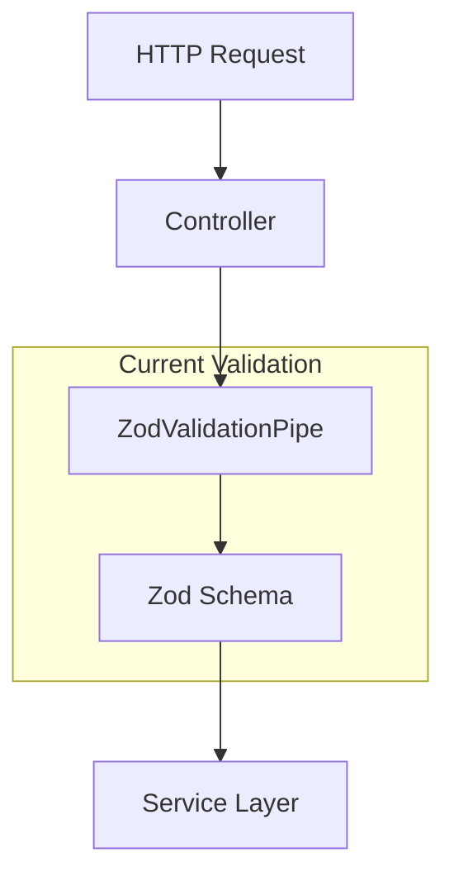
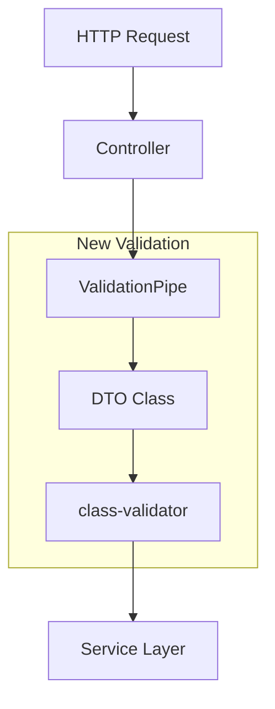

# Zod에서 Class-validator로 마이그레이션 설계

## 개요

이 설계는 현재 멤버십 구독 시스템에서 사용 중인 Zod 기반 검증을 NestJS 표준인 class-validator로 마이그레이션하는 방법을 정의합니다. MVP 개발 원칙에 따라 단순하고 직접적인 접근 방식을 사용하며, 기존 기능의 호환성을 보장합니다.

## 아키텍처

### 현재 아키텍처 (Zod 기반)



### 목표 아키텍처 (Class-validator 기반)



## 컴포넌트 및 인터페이스

### 1. DTO 클래스 구조

기존 Zod 스키마를 class-validator 기반 DTO로 변환:

```typescript
// 기존 (Zod)
export const CreateSubscriptionRequestSchema = z.object({
  planId: z.string().uuid('유효한 UUID 형식이어야 합니다'),
});

// 새로운 (class-validator)
export class CreateSubscriptionDto {
  @IsUUID(4, { message: '유효한 UUID 형식이어야 합니다' })
  planId: string;
}
```

### 2. 파일 구조 변경

```
apps/membership/src/shared/
├── dtos/                    # 새로 생성
│   ├── admin-operations.dto.ts
│   ├── subscription.dto.ts
│   ├── policy-management.dto.ts
│   └── index.ts
├── validators/              # 새로 생성 (커스텀 validator용)
│   ├── date-range.validator.ts
│   └── policy-rule.validator.ts
├── schemas/                 # 기존 유지 (DB 스키마용)
│   ├── entities/
│   ├── enums/
│   └── types.ts
└── pipes/
    └── zod-validation.pipe.ts  # 삭제 예정
```

### 3. 컨트롤러 업데이트 패턴

```typescript
// 기존
@Post()
@UsePipes(new ZodValidationPipe(CreateSubscriptionRequestSchema))
async createSubscription(
  @Body() createSubscriptionDto: CreateSubscriptionRequest,
) {
  // ...
}

// 새로운
@Post()
async createSubscription(
  @Body() createSubscriptionDto: CreateSubscriptionDto,
) {
  // ValidationPipe는 글로벌로 설정
}
```

## 데이터 모델

### DTO 클래스 매핑 테이블

| 기존 Zod 스키마 | 새로운 DTO 클래스 | 주요 검증 규칙 |
|---|---|---|
| `CreateTierRequestSchema` | `CreateTierDto` | `@IsString()`, `@Matches()`, `@Length()` |
| `CreateSubscriptionRequestSchema` | `CreateSubscriptionDto` | `@IsUUID()` |
| `PauseSubscriptionRequestSchema` | `PauseSubscriptionDto` | `@IsDateString()`, `@ValidateNested()` |
| `PolicyValidationRequestSchema` | `PolicyValidationDto` | `@IsUUID()`, `@IsObject()` |

### 커스텀 Validator 설계

복잡한 검증 로직을 위한 커스텀 validator:

```typescript
// 날짜 범위 검증
@ValidatorConstraint({ name: 'dateRange', async: false })
export class DateRangeValidator implements ValidatorConstraintInterface {
  validate(value: any, args: ValidationArguments) {
    const object = args.object as any;
    return new Date(object.startDate) < new Date(object.endDate);
  }

  defaultMessage(args: ValidationArguments) {
    return '시작일은 종료일보다 이전이어야 합니다';
  }
}

// 사용법
@Validate(DateRangeValidator)
export class PauseSubscriptionDto {
  @IsDateString()
  startDate: string;

  @IsDateString()
  endDate: string;
}
```

## 에러 처리

### 에러 응답 형식 통일

기존 Zod 에러 형식과 동일한 응답을 유지:

```typescript
// 목표 에러 응답 형식
{
  "message": "입력값 검증에 실패했습니다",
  "errors": [
    {
      "field": "planId",
      "message": "유효한 UUID 형식이어야 합니다"
    }
  ]
}
```

### 글로벌 ValidationPipe 설정

```typescript
// app.module.ts
{
  provide: APP_PIPE,
  useFactory: () => new ValidationPipe({
    whitelist: true,
    forbidNonWhitelisted: true,
    transform: true,
    exceptionFactory: (errors: ValidationError[]) => {
      const errorMessages = errors.map(error => ({
        field: error.property,
        message: Object.values(error.constraints || {})[0]
      }));
      
      return new BadRequestException({
        message: '입력값 검증에 실패했습니다',
        errors: errorMessages,
      });
    },
  }),
}
```

## 테스트 전략

### 1. 단위 테스트 업데이트

```typescript
// DTO 검증 테스트
describe('CreateSubscriptionDto', () => {
  it('should validate valid UUID', async () => {
    const dto = new CreateSubscriptionDto();
    dto.planId = '123e4567-e89b-12d3-a456-426614174000';
    
    const errors = await validate(dto);
    expect(errors).toHaveLength(0);
  });

  it('should reject invalid UUID', async () => {
    const dto = new CreateSubscriptionDto();
    dto.planId = 'invalid-uuid';
    
    const errors = await validate(dto);
    expect(errors).toHaveLength(1);
    expect(errors[0].constraints?.isUuid).toBeDefined();
  });
});
```

### 2. 컨트롤러 테스트 업데이트

```typescript
// 컨트롤러 테스트에서 새로운 DTO 사용
it('should create subscription with valid data', async () => {
  const createDto: CreateSubscriptionDto = {
    planId: '123e4567-e89b-12d3-a456-426614174000'
  };

  const result = await controller.createSubscription(createDto);
  expect(result).toBeDefined();
});
```

## 마이그레이션 전략

### 단계별 마이그레이션 접근법

1. **Phase 1: DTO 클래스 생성**
   - 모든 Zod 스키마에 대응하는 DTO 클래스 생성
   - 커스텀 validator 구현

2. **Phase 2: 컨트롤러 업데이트**
   - 한 번에 하나의 컨트롤러씩 업데이트
   - 기존 테스트가 통과하는지 확인

3. **Phase 3: 글로벌 설정 변경**
   - ZodValidationPipe를 ValidationPipe로 교체
   - 에러 형식 통일

4. **Phase 4: 정리**
   - 사용하지 않는 Zod 코드 제거
   - 의존성 정리

### 호환성 보장 방법

```typescript
// 마이그레이션 중 임시로 두 방식 모두 지원
@Post()
async createSubscription(
  @Body() createSubscriptionDto: CreateSubscriptionDto | CreateSubscriptionRequest,
) {
  // 타입 가드를 통한 호환성 처리
  const validatedDto = this.normalizeDto(createSubscriptionDto);
  return this.subscriptionService.createSubscription(validatedDto);
}
```

## 성능 고려사항

### 1. 검증 성능

- class-validator는 데코레이터 기반으로 Zod보다 약간 더 빠름
- 복잡한 커스텀 validator는 성능 영향 최소화

### 2. 메모리 사용량

- DTO 클래스는 프로토타입 기반으로 메모리 효율적
- 검증 메타데이터는 한 번만 로드됨

### 3. 번들 크기

- nestjs-zod 의존성 제거로 번들 크기 감소
- class-validator는 이미 NestJS 코어 의존성

## 보안 고려사항

### 1. 입력값 Sanitization

```typescript
@Transform(({ value }) => value.trim())
@IsString()
name: string;
```

### 2. 화이트리스트 검증

```typescript
// ValidationPipe 설정에서
{
  whitelist: true,           // DTO에 정의되지 않은 속성 제거
  forbidNonWhitelisted: true // 정의되지 않은 속성 발견 시 에러
}
```

### 3. 타입 변환 보안

```typescript
@Type(() => Number)
@IsInt()
@Min(1)
priorityLevel: number;
```

## Swagger 통합

### API 문서 자동 생성

```typescript
export class CreateSubscriptionDto {
  @ApiProperty({
    description: '구독할 플랜의 UUID',
    example: '123e4567-e89b-12d3-a456-426614174000'
  })
  @IsUUID(4, { message: '유효한 UUID 형식이어야 합니다' })
  planId: string;
}
```

class-validator 데코레이터는 자동으로 Swagger 스키마에 반영됩니다.

## 롤백 계획

마이그레이션 중 문제 발생 시:

1. **즉시 롤백**: Git을 통한 이전 커밋으로 복원
2. **부분 롤백**: 문제가 있는 컨트롤러만 Zod로 되돌림
3. **점진적 수정**: 문제 해결 후 다시 마이그레이션 진행

## 모니터링 및 검증

### 마이그레이션 완료 체크리스트

- [ ] 모든 API 엔드포인트가 정상 작동
- [ ] 기존 테스트 케이스 모두 통과
- [ ] 에러 응답 형식 일관성 유지
- [ ] Swagger 문서 정확성 확인
- [ ] 성능 저하 없음 확인
- [ ] 불필요한 의존성 제거 완료