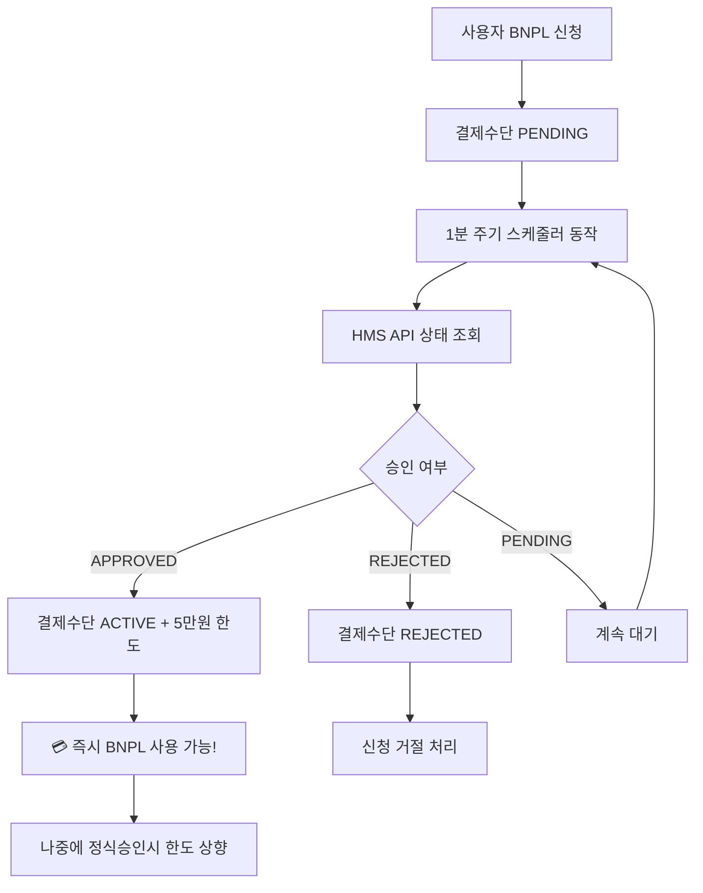

# 🔄 BNPL 결제수단 활성화 스케줄러 가이드

## 📋 **개요**

**특별 정책:** 회원인증 동안 5만원 임시한도를 먼저 제공하는 BNPL 결제수단 자동 활성화 시스템입니다.

## 🎯 **프로세스 플로우**



## 🔧 **구현된 컴포넌트**

### 1️⃣ **BnplStatusScheduler**

```typescript
// services/scheduler/bnpl-status.scheduler.ts
@Cron('0 * * * * *') // 매분 0초에 실행
async checkPendingBnplAccounts()
```

**주요 기능:**

- ✅ PENDING 상태 계정들 자동 조회
- ✅ HMS API 상태 확인
- ✅ 승인/거절/대기 상태별 처리
- ✅ 이벤트 로깅 및 메타데이터 업데이트

### 2️⃣ **BnplService 확장**

```typescript
// HMS 회원 상태 조회
async checkMemberStatus(userId, bnplAccountId)

// 계정 이벤트 기록
async recordAccountEvent(bnplAccountId, eventType, eventData)

// 계정 조회 헬퍼
async getBnplAccount(bnplAccountId)
```

### 3️⃣ **상태 변경 로직**

- **APPROVED** → `ACTIVE` (BNPL 사용 가능)
- **REJECTED** → `REJECTED` (신청 거절)
- **PENDING/UNDER_REVIEW** → 대기 유지

## 📊 **로그 예시**

```bash
# 스케줄러 시작
🔍 BNPL 결제수단 상태 확인 시작 (5만원 임시한도)

# 처리 대상 확인
📋 3개의 PENDING BNPL 결제수단을 확인합니다

# 개별 결제수단 처리
🔎 결제수단 pm_bnpl_123 (user: user_456) 상태 확인
📊 결제수단 pm_bnpl_123 HMS 상태: APPROVED
✅ 결제수단 pm_bnpl_123 ACTIVE로 활성화 완료 (5만원 한도)

# 완료 요약
✅ BNPL 결제수단 확인 완료: 활성화=2, 거절=0, 대기=1
```

## 🎮 **테스트 방법**

### 1. BNPL 계정 생성

```bash
POST /bnpl/register
{
  "userId": "user_test_001",
  "phone": "01012345678",
  "name": "홍길동"
}
```

### 2. 상태 확인 (자동)

- 스케줄러가 1분마다 자동 실행
- 로그에서 처리 결과 확인

### 3. 수동 확인

```bash
# BNPL 계정 조회
SELECT * FROM bnpl_account WHERE status = 'ACTIVE';

# 이벤트 로그 확인
SELECT * FROM payment_events WHERE actor = 'SCHEDULER';
```

## ⚙️ **설정**

### Mock HMS API

현재는 즉시 승인으로 설정:

```typescript
const mockResponse = {
  status: 'APPROVED', // 즉시 승인 처리
  approvedAt: new Date().toISOString(),
};
```

### 실제 HMS API 연동시

```typescript
// checkMemberStatus 메서드에서 실제 API 호출
const response = await hmsApiClient.getMemberStatus(userId);
```

## 🔍 **모니터링**

### 주요 지표

- **활성화된 계정 수**: PENDING → ACTIVE 변환
- **거절된 계정 수**: PENDING → REJECTED 변환
- **처리 대기 시간**: 신청 ~ 승인까지 소요 시간

### 로그 레벨

- `🔍` 스케줄러 시작/종료
- `📋` 처리 대상 요약
- `🔎` 개별 계정 처리
- `✅` 성공 처리
- `❌` 실패 처리
- `💥` 오류 발생

## 🚀 **운영 포인트**

1. **즉시 활성화**: Mock에서는 1분 내 자동 승인 + 5만원 한도
2. **실패 복구**: API 실패시 다음 주기에 재시도
3. **중복 처리 방지**: 이미 ACTIVE/REJECTED는 건너뜀
4. **이벤트 추적**: 모든 결제수단 활성화 이벤트 기록
5. **임시한도**: 5만원으로 시작, 나중에 정식 승인시 확대
6. **즉시 서비스**: 심사 기다리지 않고 바로 BNPL 사용 가능

## 🎯 **핵심 차별화**

**일반적인 BNPL 서비스:**
심사 완료 → 승인 → 서비스 시작

**우리 서비스 (특별 정책):**
회원등록 → **5만원 즉시 제공** → 심사 → 한도 확대

이제 **BNPL 결제수단 자동 활성화 + 5만원 임시한도**까지 완전 자동화되었습니다! 🎉
