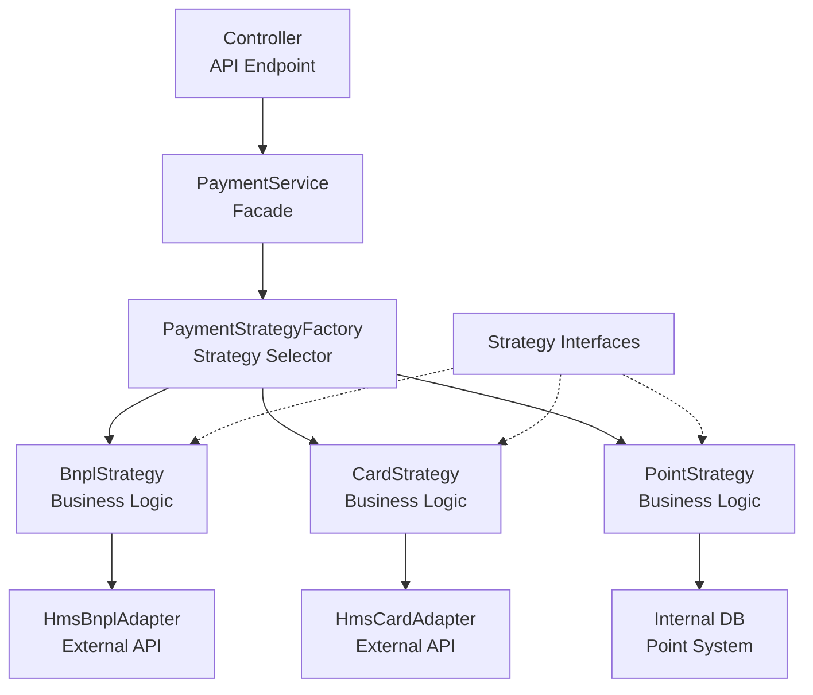
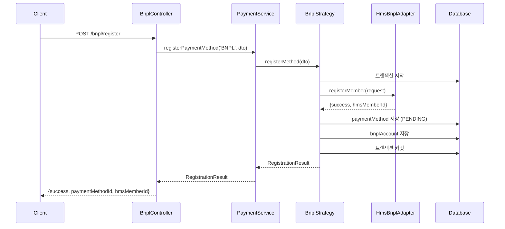
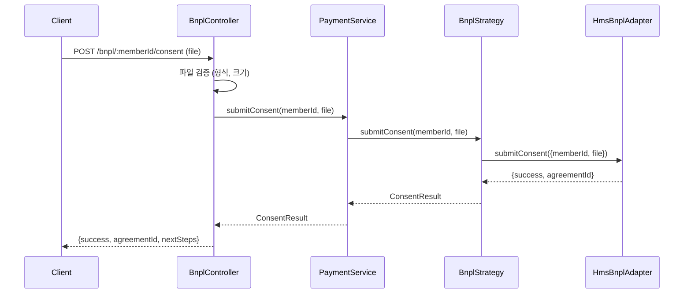
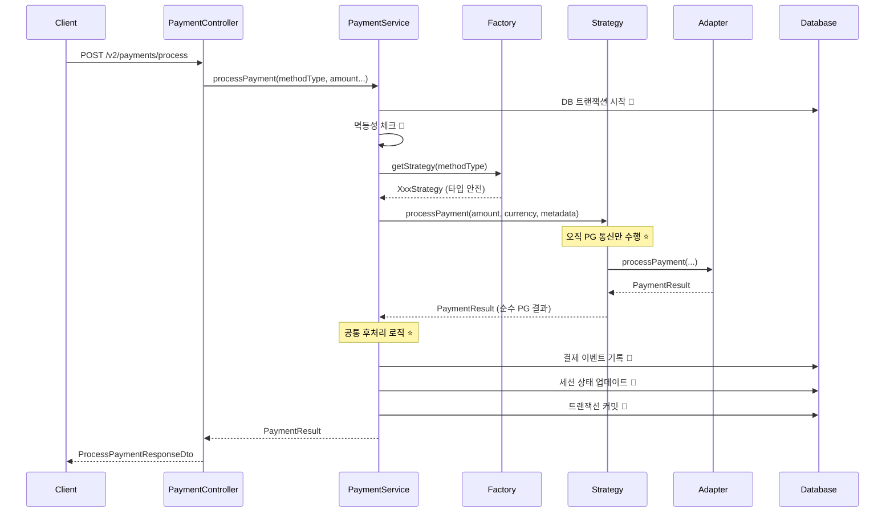

# 🏗️ 결제 시스템 Strategy Pattern 리팩토링 가이드

## 📋 개요

본 문서는 아몬드영 결제 시스템의 Strategy Pattern 기반 리팩토링 결과를 정리한 가이드입니다. 기존의 분산된 서비스 구조를 통합하여 확장성과 유지보수성을 크게 향상시켰습니다.

### 🎯 리팩토링 목표 달성

- ✅ **SOLID 원칙 준수**: 단일 책임 원칙(SRP)과 개방-폐쇄 원칙(OCP) 강화
- ✅ **확장성 향상**: 새로운 결제수단 추가 시 최소 코드 수정으로 일관된 패턴 적용
- ✅ **응집도 향상**: 결제수단별 모든 로직을 단일 클래스로 캡슐화
- ✅ **진입점 단일화**: 모든 결제 요청 처리를 위한 단일 Facade 서비스 구현

---

## 🏛️ 새로운 아키텍처

### 핵심 설계 원칙

1. **Strategy Pattern**: 각 결제수단의 PG 통신 로직을 '전략'으로 캡슐화
2. **Interface Segregation Principle**: 결제수단의 다양한 "역할"을 작은 인터페이스로 분리
3. **Facade Pattern**: PaymentService가 모든 결제 요청의 단일 진입점 역할
4. **DRY Principle**: 공통 후처리 로직을 Service 레벨에서 일원화 ⭐ **개선됨**
5. **Single Responsibility**: Strategy는 PG 통신만, Service는 오케스트레이션 담당 ⭐ **개선됨**

### 아키텍처 다이어그램



### 컴포넌트별 책임

| 컴포넌트                   | 주요 책임                                                                            |
| -------------------------- | ------------------------------------------------------------------------------------ |
| **Controller**             | HTTP 요청 수신, DTO 유효성 검사, PaymentService 호출, HTTP 응답 반환                 |
| **PaymentService**         | **오케스트레이터 역할**: DB 트랜잭션, 멱등성, 공통 후처리 로직 담당 ⭐ **개선됨**    |
| **PaymentStrategyFactory** | methodType에 따라 적절한 Strategy 인스턴스를 생성하고 반환 (타입 안전) ⭐ **개선됨** |
| **XxxStrategy**            | **오직 PG 통신만 담당** - 외부 시스템과의 순수한 결제 로직만 처리 ⭐ **개선됨**      |
| **XxxAdapter**             | 외부 시스템(PG사, HMS 등)과의 저수준(low-level) 통신만 담당                          |
| **Strategy Interfaces**    | Strategy가 구현해야 할 역할(메서드)을 정의하는 순수 계약(Contract) ⭐ **타입 강화**  |

---

## 🔧 구현 상세

### 1. Strategy Interfaces (`strategies/payment.strategy.interface.ts`)

```typescript
// 역할별 인터페이스 분리 (Interface Segregation Principle)
export interface PaymentProcessingStrategy {
  processPayment(...): Promise<PaymentResult>;
  refundPayment(...): Promise<RefundResult>;
}

export interface RegistrableStrategy {
  registerMethod(...): Promise<RegistrationResult>;
}

export interface BatchProcessingStrategy {
  batchCapture(...): Promise<CaptureResult>;
}

export interface StatusQueryStrategy {
  getMemberStatus(...): Promise<StatusResult>;
}

export interface AccountManagementStrategy {
  activateAccount(...): Promise<void>;
  deactivateAccount(...): Promise<void>;
}

export interface ConsentSubmissionStrategy {
  submitConsent(...): Promise<ConsentResult>;
}
```

### 2. Strategy Factory (`factories/payment-strategy.factory.ts`)

```typescript
@Injectable()
export class PaymentStrategyFactory {
  getStrategy(methodType: string): any {
    switch (methodType) {
      case 'BNPL':
        return this.bnplStrategy;
      case 'CARD':
      case 'EASY_PAY':
        return this.cardStrategy;
      case 'REWARD_POINT':
        return this.pointStrategy;
      default:
        throw new Error(`지원하지 않는 결제수단: ${methodType}`);
    }
  }
}
```

### 3. Strategy 구현체들

#### BnplStrategy (`strategies/bnpl.strategy.ts`)

- **구현 인터페이스**: PaymentProcessing, Registrable, BatchProcessing, StatusQuery, AccountManagement, ConsentSubmission
- **주요 기능**:
  - BNPL 회원 등록 (`registerMethod`)
  - BNPL 결제 처리 (`processPayment`)
  - BNPL 환불 처리 (`refundPayment`)
  - 배치 확정 처리 (`batchCapture`) - 스케줄러용
  - 회원 상태 조회 (`getMemberStatus`)
  - 계정 활성화/비활성화 (`activateAccount`, `deactivateAccount`)
  - 출금동의서 제출 (`submitConsent`)

#### CardStrategy (`strategies/card.strategy.ts`)

- **구현 인터페이스**: PaymentProcessing, Registrable, StatusQuery
- **주요 기능**:
  - HMS CMS 정기결제 회원 등록 (`registerMethod`)
  - 카드 결제 처리 (`processPayment`) - HMS CMS 정기결제 또는 Toss 일반결제
  - 카드 환불 처리 (`refundPayment`)
  - HMS 회원 상태 조회 (`getMemberStatus`)

#### PointStrategy (`strategies/point.strategy.ts`)

- **구현 인터페이스**: PaymentProcessing
- **주요 기능**:
  - 내부 포인트 결제 처리 (`processPayment`)
  - 포인트 환불 처리 (`refundPayment`) - 포인트 복구

### 4. Facade Service (`services/payment.service.ts`)

```typescript
@Injectable()
export class PaymentService {
  // 모든 결제 관련 요청의 단일 진입점
  async processPayment(methodType, amount, currency, metadata, idempotencyKey);
  async registerPaymentMethod(methodType, request, idempotencyKey);
  async refundPayment(
    methodType,
    transactionId,
    amount,
    reason,
    idempotencyKey,
  );
  async batchCapture(methodType, authorizationIds, batchId, idempotencyKey);
  async getMemberStatus(methodType, memberId);
  async activateAccount(methodType, paymentMethodId, approvedLimit);
  async deactivateAccount(methodType, paymentMethodId, reason);
  async submitConsent(memberId, file, filename); // BNPL 전용
}
```

---

## 🛠️ API 엔드포인트

### 결제 처리

- `POST /v2/payments/process` - 통합 결제 처리
- `PATCH /v2/payments/deferred/:authorizationId/capture` - BNPL 출금 실행

### 결제수단 관리

- `POST /payment-methods` - 일반 결제수단 등록 (포인트 등)
- `POST /payment-methods/hms-cms/register` - HMS CMS 정기결제 회원 등록
- `GET /payment-methods/users/:userId` - 사용자 결제수단 목록
- `PUT /payment-methods/:id/set-default` - 기본 결제수단 설정
- `DELETE /payment-methods/:id` - 결제수단 삭제

### BNPL 전용 (새로 추가됨)

- `POST /bnpl/register` - **BNPL 회원 등록**
- `POST /bnpl/:memberId/consent` - **출금동의서 제출** ⭐ 새로 추가
- `GET /bnpl/:memberId/status` - **BNPL 회원 상태 조회** ⭐ 새로 추가

---

## 📊 결제수단별 지원 기능 매트릭스

| 기능            | BNPL                 | 카드 (HMS CMS) | 포인트           |
| --------------- | -------------------- | -------------- | ---------------- |
| **결제 처리**   | ✅ (승인 → 배치확정) | ✅ (즉시확정)  | ✅ (즉시확정)    |
| **환불 처리**   | ✅                   | ✅             | ✅ (포인트 복구) |
| **회원 등록**   | ✅ HMS BNPL          | ✅ HMS CMS     | ❌ (시스템 생성) |
| **상태 조회**   | ✅                   | ✅             | ❌               |
| **배치 처리**   | ✅ (스케줄러용)      | ❌             | ❌               |
| **계정 관리**   | ✅ (활성화/비활성화) | ❌             | ❌               |
| **동의서 제출** | ✅                   | ❌             | ❌               |

---

## 🔄 주요 플로우

### BNPL 등록 플로우



### 출금동의서 제출 플로우



### 통합 결제 처리 플로우 (개선된 책임 분리)



**🎯 개선 포인트 (시니어 리뷰 반영):**

- **Strategy**: 순수 PG 통신만 담당 (DB 작업 제거) ⭐ **계획됨**
- **PaymentService**: 트랜잭션, 멱등성, 공통 후처리 일원화 ⭐ **계획됨**
- **DRY 원칙**: 공통 로직 중복 제거 ⭐ **계획됨**
- **타입 안전성**: Union 타입으로 컴파일 타임 안전성 확보 ✅ **적용됨**

---

## 📁 파일 구조

### 새로 생성된 파일들

```
apps/wallet/src/
├── strategies/                           # ⭐ 새로 추가
│   ├── payment.strategy.interface.ts     # Strategy 인터페이스 정의
│   ├── bnpl.strategy.ts                  # BNPL 전략 구현
│   ├── card.strategy.ts                  # 카드 전략 구현
│   └── point.strategy.ts                 # 포인트 전략 구현
├── factories/                            # ⭐ 새로 추가
│   └── payment-strategy.factory.ts       # 전략 팩토리
├── services/
│   └── payment.service.ts                # ⭐ 새로 추가 - 통합 Facade
└── controllers/
    └── bnpl.controller.ts                # ⭐ 복원됨 - BNPL 전용 API
```

### 수정된 파일들

```
apps/wallet/src/
├── controllers/
│   ├── payment.controller.ts             # PaymentService 사용으로 변경
│   └── payment-method.controller.ts      # PaymentService 사용으로 변경
├── app.module.ts                         # 새로운 Strategy들과 서비스 등록
└── package.json                          # 모든 앱 빌드하도록 스크립트 수정
```

---

## 🚀 사용법

### 1. BNPL 회원 등록

```bash
curl -X POST http://localhost:3000/bnpl/register \
  -H "Content-Type: application/json" \
  -H "idempotency-key: bnpl_reg_user123_20241215" \
  -d '{
    "userId": "user_123456789",
    "methodName": "아몬드영 후불결제",
    "memberName": "홍길동",
    "phone": "01012345678",
    "creditLimit": 1000000,
    "billingCycleDay": 25,
    "termsUrl": "https://example.com/terms"
  }'
```

**응답:**

```json
{
  "success": true,
  "paymentMethodId": "pm_01HQZX8QJKMNPQRST9VWXY012",
  "hmsMemberId": "HMS_BNPL_123456789",
  "status": "PENDING",
  "message": "BNPL 회원 등록 완료",
  "creditLimit": 1000000,
  "nextSteps": ["출금동의서 제출 필요"]
}
```

### 2. 출금동의서 제출

```bash
curl -X POST http://localhost:3000/bnpl/HMS_BNPL_123456789/consent \
  -F "file=@consent_document.pdf"
```

**응답:**

```json
{
  "success": true,
  "agreementId": "AGR_123456789",
  "message": "출금동의서가 성공적으로 제출되었습니다",
  "nextSteps": ["HMS 심사 진행 중", "2-3일 소요 예상"]
}
```

### 3. HMS CMS 정기결제 회원 등록

```bash
curl -X POST http://localhost:3000/payment-methods/hms-cms/register \
  -H "Content-Type: application/json" \
  -H "idempotency-key: hms_cms_reg_user123_20241215" \
  -d '{
    "userId": "user_123456789",
    "methodType": "CARD",
    "methodName": "신한카드 정기결제",
    "cardInfo": {
      "cardNumber": "1234567890123456",
      "cardHolderName": "홍길동",
      "expiryDate": "25/12",
      "phone": "01012345678",
      "billingCycleDay": 15
    }
  }'
```

### 4. 통합 결제 처리

```bash
curl -X POST http://localhost:3000/v2/payments/process \
  -H "Content-Type: application/json" \
  -H "idempotency-key: payment_session123_20241215" \
  -d '{
    "sessionId": "session_123456789",
    "userId": "user_123456789",
    "paymentMethods": [
      {
        "type": "BNPL",
        "paymentMethodId": "pm_01HQZX8QJKMNPQRST9VWXY012",
        "amount": 50000
      }
    ]
  }'
```

### 5. BNPL 상태 조회

```bash
curl -X GET http://localhost:3000/bnpl/HMS_BNPL_123456789/status
```

**응답:**

```json
{
  "success": true,
  "status": "ACTIVE",
  "hmsStatus": "REGISTERED",
  "creditLimit": 500000,
  "approvedLimit": 500000,
  "registeredAt": "2024-01-15T10:30:00Z"
}
```

---

## 🔄 기존 코드와의 호환성

### 📅 점진적 마이그레이션 로드맵

#### Phase 1: 공존 기간 (v3.1 ~ v3.3, 2024년 12월 ~ 2025년 3월)

- ✅ **현재 상태**: 기존 서비스와 새로운 PaymentService 공존
- ✅ **신규 개발**: 모든 새로운 기능은 **반드시 PaymentService 사용**
- ✅ **레거시 유지**: 기존 API는 그대로 작동 (호환성 보장)

#### Phase 2: 전환 기간 (v3.4 ~ v3.6, 2025년 4월 ~ 6월)

- 🔄 **점진적 전환**: 기존 컨트롤러의 서비스 호출을 PaymentService로 변경
- 🔄 **성능 모니터링**: 새로운 시스템의 안정성 검증
- ⚠️ **데이터 일관성**: 두 시스템이 동시에 같은 데이터 수정 시 주의

#### Phase 3: 정리 기간 (v4.0, 2025년 7월)

- 🗑️ **레거시 제거**: `PaymentOrchestrationService`, `BnplMethodService` 등 완전 제거
- 📚 **문서 정리**: 새로운 아키텍처만 남기고 문서 업데이트
- 🎯 **최종 검증**: 전체 시스템 통합 테스트

### 🚨 마이그레이션 주의사항

1. **데이터 일관성 보장**

   ```typescript
   // ❌ 피해야 할 패턴: 두 시스템 동시 사용
   await legacyService.processPayment(...);
   await newPaymentService.processPayment(...); // 중복 처리 위험!

   // ✅ 권장 패턴: 하나의 시스템만 사용
   await newPaymentService.processPayment(...);
   ```

2. **API 버전 관리**

   - 기존 API: `/v1/...` (레거시, 유지보수만)
   - 새로운 API: `/v2/...` (신규 개발 전용)

3. **모니터링 강화**
   - 두 시스템의 성능 비교 대시보드 구축
   - 데이터 불일치 감지 알림 설정

### 마이그레이션 예시

**Before (기존):**

```typescript
// 여러 서비스에 분산된 호출
await this.bnplMethodService.registerMember(request);
await this.paymentOrchestrationService.processPayment(...);
await this.bnplMethodService.batchCapture(...);
```

**After (새로운 방식):**

```typescript
// 단일 Facade를 통한 통합 호출
await this.paymentService.registerPaymentMethod('BNPL', request);
await this.paymentService.processPayment('BNPL', amount, ...);
await this.paymentService.batchCapture('BNPL', authorizationIds);
```

---

## 🧪 테스트 가이드

### 단위 테스트

각 Strategy는 독립적으로 테스트 가능합니다:

```typescript
describe('BnplStrategy', () => {
  it('should register BNPL member successfully', async () => {
    const result = await bnplStrategy.registerMethod(mockRequest);
    expect(result.success).toBe(true);
    expect(result.paymentMethodId).toBeDefined();
  });

  it('should process BNPL payment with authorization', async () => {
    const result = await bnplStrategy.processPayment(
      50000,
      'KRW',
      mockMetadata,
    );
    expect(result.success).toBe(true);
    expect(result.authorizationId).toBeDefined(); // BNPL은 승인 단계
  });
});
```

### 통합 테스트

PaymentService(Facade)를 통한 전체 플로우 테스트:

```typescript
describe('PaymentService Integration', () => {
  it('should handle complete BNPL flow', async () => {
    // 1. 회원 등록
    const registration = await paymentService.registerPaymentMethod(
      'BNPL',
      mockDto,
    );

    // 2. 출금동의서 제출
    const consent = await paymentService.submitConsent(
      registration.hmsMemberId,
      mockFile,
      'consent.pdf',
    );

    // 3. 결제 처리
    const payment = await paymentService.processPayment(
      'BNPL',
      50000,
      'KRW',
      mockMetadata,
    );

    // 4. 배치 확정
    const capture = await paymentService.batchCapture('BNPL', [
      payment.authorizationId,
    ]);

    expect(registration.success).toBe(true);
    expect(consent.success).toBe(true);
    expect(payment.success).toBe(true);
    expect(capture.success).toBe(true);
  });
});
```

---

## 🔧 확장 가이드

### 새로운 결제수단 추가 방법

1. **Strategy Interface 구현**

```typescript
@Injectable()
export class NewPaymentStrategy implements PaymentProcessingStrategy {
  async processPayment(...): Promise<PaymentResult> {
    // 새로운 결제수단 로직 구현
  }
}
```

2. **Factory에 등록**

```typescript
// PaymentStrategyFactory.getStrategy()에 case 추가
case 'NEW_METHOD': return this.newPaymentStrategy;
```

3. **Module에 Provider 등록**

```typescript
// app.module.ts providers에 추가
NewPaymentStrategy,
```

4. **Adapter 구현** (외부 API 연동이 필요한 경우)

```typescript
@Injectable()
export class NewPaymentAdapter implements PaymentGateway {
  async processPayment(...): Promise<PaymentResult> {
    // 외부 API 호출 로직
  }
}
```

---

## 🔧 필드 및 데이터 구조

### 필수 필드 정리

#### BNPL 등록 시 필수 필드

- `userId`: 사용자 ID
- `methodName`: 결제수단 별칭
- `memberName`: 회원 실명 ⭐ **추가됨**
- `phone`: 휴대폰 번호 ⭐ **추가됨**
- `creditLimit`: 신용 한도
- `billingCycleDay`: 결제일
- `termsUrl`: 약관 URL (선택사항)

#### 카드 등록 시 필수 필드

- `cardNumber`: 카드 번호
- `cardHolderName`: 카드 소유자명
- `expiryDate`: 유효기간 (MM/YY)
- `phone`: 휴대폰 번호 ⭐ **추가됨** (HMS CMS 등록용)
- `billingCycleDay`: 결제일 ⭐ **추가됨** (선택사항, 기본값: 1)

#### PaymentEvents 테이블 필수 필드

- `paymentSessionId`: 결제 세션 ID
- `paymentMethodId`: 결제수단 ID
- `amount`: 결제 금액
- `status`: 거래 상태
- `pgTransactionId`: PG 거래 ID
- `pgResponse`: PG 응답 (JSON)
- `actor`: 실행 주체 (USER/SYSTEM/ADMIN/SCHEDULER)
- `metadata`: 추가 메타데이터 ⭐ **추가됨**

#### RefundEvents 테이블 필수 필드

- `paymentEventId`: 원본 결제 이벤트 ID
- `amount`: 환불 금액
- `status`: 환불 상태
- `reason`: 환불 사유
- `completedBy`: 처리자 ⭐ **추가됨**
- `completedAt`: 처리 완료 시간
- `metadata`: 추가 메타데이터

---

## ⚠️ 주의사항 및 제약사항

### 1. 어댑터 인터페이스 요구사항

각 Strategy가 사용하는 Adapter는 다음 인터페이스를 구현해야 합니다:

- **BNPL**: `BnplMethodGateway` + `PaymentGateway`
- **카드**: `CardMethodGateway` + `PaymentGateway`
- **포인트**: 내부 DB만 사용 (Adapter 불필요)

### 2. 에러 처리 규칙

- **Strategy 레벨**: `throw new Error("구체적인 메시지")`
- **Controller 레벨**: 메시지 패턴 기반 HTTP 상태 코드 매핑
  - `"not found"` → 404
  - `"required"`, `"invalid"`, `"failed"` → 400
  - 그 외 → 500

### 3. 멱등성 처리

모든 중요한 작업(등록, 결제, 환불, 배치확정)은 멱등성 키를 지원합니다:

```typescript
// 멱등성 키 형식 권장
const idemKey = `${operation}_${userId}_${timestamp}`;
```

### 4. 트랜잭션 관리

모든 DB 상태 변경 작업은 Strategy 레벨에서 트랜잭션으로 보호됩니다:

```typescript
return await this.db.db.transaction(async (tx): Promise<ResultType> => {
  // 모든 DB 작업을 트랜잭션 내에서 수행
});
```

---

## 🎯 성과 및 개선사항

### Before vs After 비교

| 항목                 | Before (기존)         | After (리팩토링 후)           |
| -------------------- | --------------------- | ----------------------------- |
| **진입점**           | 다수의 개별 서비스    | 단일 PaymentService (Facade)  |
| **결제수단 로직**    | 여러 파일에 분산      | Strategy별 단일 클래스에 응집 |
| **새 결제수단 추가** | 다수 파일 수정 필요   | Strategy 1개 + Factory 등록만 |
| **테스트**           | 복잡한 의존성         | Strategy별 독립 테스트 가능   |
| **코드 탐색**        | 여러 서비스 파일 검색 | Strategy 파일 하나만 확인     |

### 개선된 개발자 경험

1. **명확한 책임 분리**: 각 Strategy가 특정 결제수단의 모든 책임을 가짐
2. **일관된 패턴**: 모든 결제수단이 동일한 인터페이스 구조 따름
3. **쉬운 확장**: 새로운 결제수단 추가가 기존 코드에 영향 없음
4. **단순한 테스트**: 각 Strategy를 독립적으로 테스트 가능

---

## 🧐 시니어 리뷰 반영 사항

### 1. Strategy 책임 범위 개선 ✅

**문제점**: Strategy가 PG 통신 + DB 트랜잭션 + 멱등성 + 이벤트 기록 등 너무 많은 책임을 가짐

**해결책**:

- **Strategy**: 오직 PG 통신만 담당 (순수한 결제 방식 로직)
- **PaymentService**: DB 트랜잭션, 멱등성, 공통 후처리 담당 (오케스트레이터)
- **구현**: `PaymentServiceV2` 클래스 추가로 개선된 설계 제공

### 2. 타입 안정성 강화 ✅

**문제점**: `PaymentStrategyFactory.getStrategy()` 반환 타입이 `any`

**해결책**:

- Union 타입 정의: `PaymentStrategy = BnplStrategyType | CardStrategyType | PointStrategyType`
- 각 Strategy별 정확한 타입 정의
- 컴파일 타임 타입 체크 강화

### 3. API 엔드포인트 일관성 개선 🔄

**문제점**: BNPL(`/bnpl/register`) vs HMS CMS(`/payment-methods/hms-cms/register`) 경로 불일치

**개선 방향**:

- `/payment-methods/register/bnpl` - BNPL 등록
- `/payment-methods/register/hms-cms` - HMS CMS 등록
- 또는 단일 엔드포인트: `POST /payment-methods/register` (methodType으로 구분)

### 4. 점진적 마이그레이션 가이드라인 명시 ✅

**문제점**: 기존 서비스와의 공존 기간 동안의 명확한 가이드라인 부족

**해결책**:

- 구체적인 로드맵 제시 (Phase 1~3, 2024년 12월 ~ 2025년 7월)
- 데이터 일관성 보장 방법 명시
- API 버전 관리 전략 수립

---

## 🔮 향후 개선 계획

### 1. 단계적 마이그레이션 (로드맵 기반)

- [x] **v3.1**: Strategy Pattern 기본 구조 구현 ✅
- [x] **v3.1.1**: 타입 안전성 강화 (Union 타입 적용) ✅
- [ ] **v3.2**: Strategy 책임 분리 (PG 통신만) - 시니어 리뷰 반영
- [ ] **v3.3**: API 엔드포인트 통일 (`/payment-methods/register/*`)
- [ ] **v3.4**: 공통 후처리 로직 Service로 이동 (DRY 원칙)
- [ ] **v4.0**: 레거시 서비스 완전 제거

### 2. 추가 기능 구현

- [ ] 실시간 결제 상태 WebSocket 알림
- [ ] 결제 실패 시 자동 재시도 로직 (Strategy별 설정)
- [ ] 결제수단별 성능 메트릭 수집
- [ ] A/B 테스트를 위한 Strategy 라우팅

### 3. 모니터링 및 관찰성

- [ ] 각 Strategy별 성능 메트릭 대시보드
- [ ] 결제 성공률 모니터링 (Strategy별)
- [ ] PG 통신 지연시간 추적
- [ ] 에러 패턴 분석 및 알림

---

## 📞 문의 및 지원

리팩토링 관련 문의사항이나 새로운 결제수단 추가 요청은 개발팀으로 연락해주세요.

**주요 담당자:**

- 결제 시스템 아키텍처: [개발팀]
- BNPL 관련 이슈: [BNPL 담당자]
- HMS API 연동: [HMS 연동 담당자]

---

_마지막 업데이트: 2024년 12월 15일_
_버전: v3.1 (Strategy Pattern 적용)_
