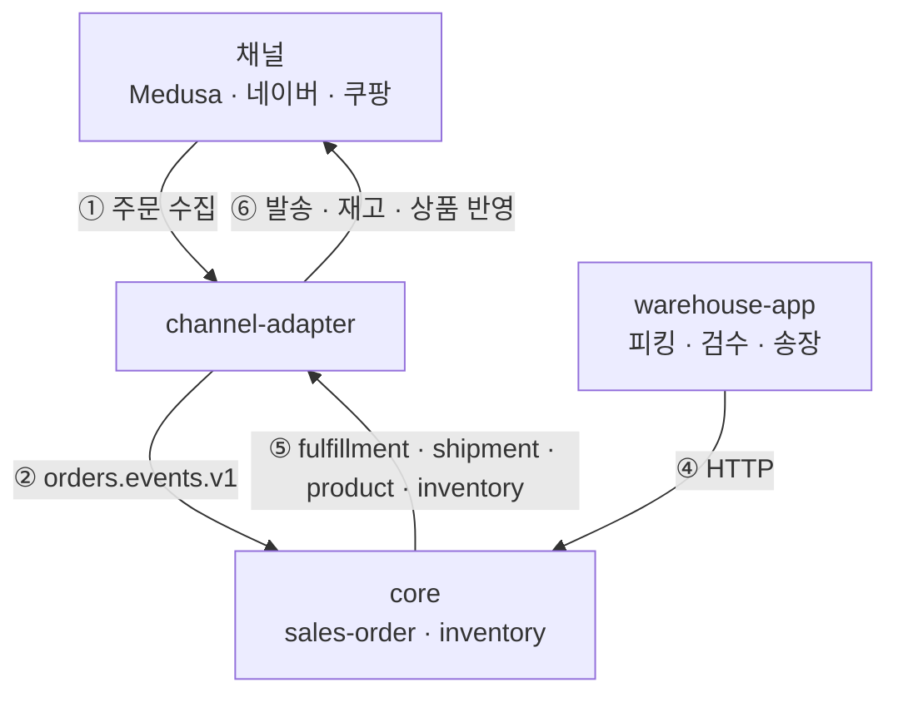

# 아몬드영 서버

커머스·물류 통합 운영 시스템

---

## 이 프로젝트의 지향점

만약 자사몰 하나만 있는 것으로 충분하다면, 카페24나 아임웹처럼 잘 만들어진 SaaS 쇼핑몰 서비스를 사용하는 편이 좋습니다.

이 프로젝트는 커머스를 중심으로 하는 비즈니스에서, 플랫폼이 허용하는 범위를 벗어나 주도권을 갖고 원하는 대로 확장하기 쉬운 키트가 되는 것을 지향점으로 삼고 있습니다.

이 목적을 달성하기 위해, 인증 모델을 직접 소유하도록 하고, 새 앱을 늘리는 비용이 낮은 구조를 채택했습니다.

---

## 주문 흐름으로 보는 예시

**① 채널 → `channel-adapter`** — 네이버 · 쿠팡 · 자사몰(Medusa)에서 주문을 수집한다.

**② `channel-adapter` → `core`** — 번역된 주문이 `orders.events.v1` 로 넘어간다. 이 경계
덕분에 Core는 판매채널과 격리되어 판매채널에 의존하지 않는다.

**③ `core` 내부** — 판매주문을 만들고 재고를 예약하고 출고주문을 낸다.

**④ `warehouse-app` → `core`** — 물류팀이 피킹 · 검수 · 송장 발행을 수행한다.

**⑤⑥ `core` → `channel-adapter` → 채널** — 발송 · 재고 · 상품 상태가 이벤트로 나가고
`channel-adapter` 가 각 채널의 형식으로 되돌려 반영한다.

도메인 명사의 정확한 정의는 [`CONTEXT.md`](CONTEXT.md)에 있습니다.

---

## 전체 구성

앱 13 · 라이브러리 4 · 웹 2 · 네이티브 2 · 패키지 5

### 백엔드 앱 (`apps/`)

| 앱                 | 역할                                             |
| ----------------- | ---------------------------------------------- |
| `core`            | 메인 API. 상품 정보(PIM)와 재고 · 물류(WMS)를 함께 담는 통합 백엔드 |
| `user-service`    | 인증, 사용자 계정                                     |
| `wallet`          | 결제, BNPL, 환불                                   |
| `membership`      | 구독 · 멤버십                                       |
| `notification`    | 푸시 · 이메일 · SMS                                 |
| `channel-adapter` | 네이버 · 쿠팡 등 판매채널 양방향 연동                         |
| `file-service`    | 파일 업로드 · 저장(S3)                                |
| `search`          | OpenSearch 상품 검색                               |
| `analytics`       | 분석 데이터 수집                                      |
| `ugc-service`     | 리뷰 등 사용자 생성 콘텐츠                                |

### 커머스 · 프론트엔드 앱 (`apps/`)

| 앱            | 역할                    |
| ------------ | --------------------- |
| `medusa`     | Medusa 기반 자사몰 커머스 백엔드 |
| `admin-web`  | Next.js 관리자 대시보드      |
| `wallet-web` | 결제 · 지갑 화면            |

### 공유 라이브러리 (`libs/`)

| 라이브러리                | 역할                                                  |
| -------------------- | --------------------------------------------------- |
| `@app/db`            | Drizzle ORM 기반, `DbService<Schema>` 와 단일 트랜잭션 러너    |
| `@app/events`        | Kafka 이벤트 버스 — 트랜잭셔널 아웃박스 · DLQ · graceful shutdown |
| `@app/authorization` | RBAC 인가                                             |
| `@app/shared`        | 공통 유틸리티와 도메인 예외                                     |

### 웹 (`web/`)

| 앱                        | 역할                |
| ------------------------ | ----------------- |
| `almondyoung-storefront` | 고객용 쇼핑몰 (Next.js) |
| `auth-web`               | 로그인 · 인증 화면       |

### 네이티브 (`native/`)

| 앱                | 역할                                  |
| ---------------- | ----------------------------------- |
| `warehouse-app`  | 물류 스테이션용 Tauri 앱. 하드웨어 스캐너 · ZPL 라벨 |
| `storefront-app` | Expo 기반 쇼핑몰 모바일 셸                   |

### 패키지 (`packages/`)

| 패키지                   | 역할                                     |
| --------------------- | -------------------------------------- |
| `event-contracts`     | 앱 간 Kafka 스트림 · 이벤트 스키마 정의 (프레임워크 비의존) |
| `domain-types`        | 프레임워크 비의존 도메인 타입 정의                    |
| `product-description` | 상품 상세 Markdown 계약                      |
| `web-observability`   | Next.js 웹 앱용 관측성 헬퍼                    |

---

## 어디로 가는가

이 시스템은 온라인 미용재료 B2B 쇼핑몰인 아몬드영과 아몬드영을 중심으로 한 주식회사 엘씨나인의 비즈니스를 운영하기 위해 만들어졌습니다.

다만, 이 프로젝트의 목표인 완전한 주도권이 우리에게만 유효할 이유는 없으므로, 같은 필요를 가진 다른 비즈니스가 가져다 쓸 수 있는 범용 제품으로서의 형태로 나아가는 것을
지향하고 있습니다.

---

## 라이선스

[Business Source License 1.1](LICENSE).

 [`web/almondyoung-storefront/`](web/almondyoung-storefront) 는 medusa-next(MIT,
© 2022 Medusa)의 파생물로서, 해당 디렉토리의 [`LICENSE`](web/almondyoung-storefront/LICENSE) 를 따릅니다.
