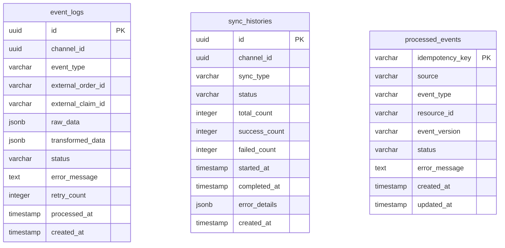

# 📑 Channel Adapter 리팩터링 계획서 (CTO SoT 원칙)

## 📌 목차

1. [현행 구조 요약](#현행-구조-요약)
2. [문제점 및 개선 포인트](#문제점-및-개선-포인트)
3. [리팩터링 설계안](#리팩터링-설계안)
4. [파일별 수정/추가 목록](#파일별-수정추가-목록)
5. [체크리스트](#체크리스트)

---

## 🏗️ 현행 구조 요약

### 주요 컴포넌트 역할

| 컴포넌트                        | 현재 역할                                                                    | 호출 순서                         |
| ------------------------------- | ---------------------------------------------------------------------------- | --------------------------------- |
| **ChannelAdapterController**    | HTTP 엔드포인트 제공 (폴링, 웹훅, sync-to, command, query)                   | 1. 외부 → Controller              |
| **ChannelAdapterService**       | 컨트롤러 → 오케스트레이터 파사드                                             | 2. Controller → Service           |
| **AdapterOrchestrationService** | 핵심 오케스트레이션 (pollAndPublish, handleIncoming, execute, syncToChannel) | 3. Service → Orchestration        |
| **SyncStatusService**           | 메모리 기반 동기화 상태 관리                                                 | 4. Orchestration → SyncStatus     |
| **EventPublisherService**       | null-event-publisher (개발/테스트용)                                         | 5. Orchestration → EventPublisher |

### 현재 스키마 구조



---

## ⚠️ 문제점 및 개선 포인트

### 1. Consumer 부재

- **현재**: HTTP 폴링과 웹훅만으로 외부 데이터 수집
- **문제**: 내부 시스템(WMS, OMS, PIM)에서 발생하는 이벤트를 처리할 Consumer가 없음
- **영향**: CTO SoT 원칙 중 "내부 SoT는 이벤트"를 구현할 수 없음

### 2. 멱등키 체계 미흡

- **현재**: processed_events 테이블은 있지만 실제 사용되지 않음
- **문제**: 중복 이벤트 처리 위험, 데이터 일관성 보장 어려움
- **영향**: 동일 이벤트가 여러 번 처리되어 채널에 잘못된 데이터 전송 가능

### 3. SyncStatus 영속화 필요

- **현재**: 메모리 기반 상태 관리 (재시작 시 모든 상태 손실)
- **문제**: 서비스 재시작 시 동기화 상태 추적 불가
- **영향**: 운영 모니터링 및 장애 대응 어려움

### 4. DLQ/재시도 정책 미구현

- **현재**: 단순 throw Error로 실패 처리
- **문제**: 일시적 장애에 대한 복원력 부족
- **영향**: 네트워크 장애나 API 일시 오류 시 데이터 손실 위험

---

## 🎯 리팩터링 설계안

### 1. Consumer 추가 구조

```typescript
// src/consumers/stock-event.consumer.ts
@Injectable()
export class StockEventConsumer {
  constructor(private readonly orchestrator: AdapterOrchestrationService) {}

  @KafkaSubscribe('wms.stock.changed')
  async handleStockChanged(evt: StockChangedEvent) {
    const key = `WMS:STOCK_CHANGED:${evt.sku}:${evt.eventVersion}`;

    // 멱등키 체크
    if (await this.orchestrator.isProcessed(key)) {
      this.logger.debug(`이미 처리된 이벤트: ${key}`);
      return;
    }

    // 모든 채널에 재고 동기화
    await this.orchestrator.syncToChannel('all', {
      dataType: 'inventory',
      payload: {
        productId: evt.sku,
        stockQuantity: evt.deltaQty,
        isOptionProduct: false,
      },
    });

    // 처리 완료 마킹
    await this.orchestrator.markProcessed({
      idempotencyKey: key,
      source: 'WMS',
      eventType: 'STOCK_CHANGED',
      resourceId: evt.sku,
      eventVersion: evt.eventVersion.toString(),
    });
  }
}
```

### 2. AdapterOrchestrationService 확장

```typescript
// 멱등키 체크 메서드 추가
async isProcessed(idempotencyKey: string): Promise<boolean> {
  const existing = await this.db.db
    .select()
    .from(schema.processedEvents)
    .where(eq(schema.processedEvents.idempotencyKey, idempotencyKey))
    .limit(1);

  return existing.length > 0;
}

// 처리 완료 마킹 메서드 추가
async markProcessed(data: NewProcessedEvent): Promise<void> {
  await this.db.db
    .insert(schema.processedEvents)
    .values({ ...data, status: 'PROCESSED' })
    .onConflictDoNothing(); // 중복 시 무시
}
```

### 3. SyncStatusService 확장 설계

```typescript
// PostgreSQL 테이블 기반으로 전환
export const syncStatuses = pgTable(
  'sync_statuses',
  {
    id: uuid('id')
      .primaryKey()
      .default(sql`uuid_v7()`),
    channelId: varchar('channel_id', { length: 50 }).notNull(),
    dataType: varchar('data_type', { length: 50 }).notNull(),
    status: varchar('status', { length: 20 }).notNull(), // idle, in_progress, success, failed
    lastSyncAt: timestamp('last_sync_at'),
    lastEventCount: integer('last_event_count').default(0),
    totalSyncs: integer('total_syncs').default(0),
    successfulSyncs: integer('successful_syncs').default(0),
    failedSyncs: integer('failed_syncs').default(0),
    avgProcessingTimeMs: integer('avg_processing_time_ms').default(0),
    updatedAt: timestamp('updated_at').default(sql`now()`),
    createdAt: timestamp('created_at').default(sql`now()`),
  },
  (table) => ({
    uniqChannelDataType: uniqueIndex('uq_sync_status_channel_data').on(
      table.channelId,
      table.dataType,
    ),
  }),
);
```

### 4. ChannelStrategy 인터페이스 강화

```typescript
// 기존 인터페이스에 메서드 추가
export interface ChannelStrategyInterface {
  // 기존 메서드들...

  // 재고 업데이트 (새로 추가)
  updateStock(payload: InternalInventoryData): Promise<SyncResult>;

  // 주문 이행 상태 업데이트 (새로 추가)
  updateFulfillment(payload: InternalFulfillmentData): Promise<SyncResult>;

  // 배치 재고 업데이트 (성능 최적화)
  batchUpdateStock(payloads: InternalInventoryData[]): Promise<SyncResult>;
}
```

### 5. DLQ/재시도 정책

```typescript
// src/decorators/retry-policy.decorator.ts
export function RetryPolicy(options: {
  maxRetries: number;
  backoffMs: number[];
  dlqTopic?: string;
}) {
  return function(target: any, propertyKey: string, descriptor: PropertyDescriptor) {
    const originalMethod = descriptor.value;

    descriptor.value = async function(...args: any[]) {
      let lastError: Error;

      for (let attempt = 0; attempt <= options.maxRetries; attempt++) {
        try {
          return await originalMethod.apply(this, args);
        } catch (error) {
          lastError = error;

          if (attempt < options.maxRetries) {
            const delay = options.backoffMs[attempt] || options.backoffMs[options.backoffMs.length - 1];
            await new Promise(resolve => setTimeout(resolve, delay));
            continue;
          }

          // 최대 재시도 초과 시 DLQ로 전송
          if (options.dlqTopic) {
            await this.sendToDLQ(options.dlqTopic, args[0], lastError);
          }

          throw lastError;
        }
      }
    };
  };
}

// 사용 예시
@RetryPolicy({
  maxRetries: 3,
  backoffMs: [1000, 5000, 30000],
  dlqTopic: 'channel-adapter.dlq'
})
async syncToChannel(channel: ChannelType, payload: SyncToChannelPayload) {
  // 실제 동기화 로직
}
```

---

## 📁 파일별 수정/추가 목록

### 새로 생성할 파일

| 파일 경로                                     | 목적                     | 주요 내용                           |
| --------------------------------------------- | ------------------------ | ----------------------------------- |
| `src/consumers/stock-event.consumer.ts`       | WMS 재고 이벤트 처리     | `wms.stock.changed` 토픽 구독       |
| `src/consumers/fulfillment-event.consumer.ts` | WMS 이행 이벤트 처리     | `wms.fulfillment.updated` 토픽 구독 |
| `src/consumers/catalog-event.consumer.ts`     | PIM 카탈로그 이벤트 처리 | `catalog.product.updated` 토픽 구독 |
| `src/decorators/retry-policy.decorator.ts`    | 재시도 정책 데코레이터   | 지수백오프 + DLQ 전송               |
| `src/services/idempotency.service.ts`         | 멱등키 관리 서비스       | processed_events 테이블 조작        |

### 수정할 파일

| 파일 경로                                       | 수정 내용                                                 |
| ----------------------------------------------- | --------------------------------------------------------- |
| `src/schema.ts`                                 | sync_statuses 테이블 추가, processed_events 인덱스 최적화 |
| `src/types.ts`                                  | Consumer 이벤트 타입, DLQ 관련 타입 추가                  |
| `src/services/adapter-orchestration.service.ts` | 멱등키 체크/마킹 메서드 추가, DLQ 처리 로직               |
| `src/services/sync-status.service.ts`           | PostgreSQL 기반으로 전환, 영속화 구현                     |
| `src/strategies/channel-strategy.interface.ts`  | updateStock, updateFulfillment 메서드 추가                |
| `src/strategies/coupang.strategy.ts`            | 새 인터페이스 메서드 구현                                 |
| `src/strategies/naver-smartstore.strategy.ts`   | 새 인터페이스 메서드 구현                                 |

---

## ✅ 체크리스트

### 개발 단계

- [ ] **Consumer 구현**: Stock, Fulfillment, Catalog 이벤트 Consumer 생성
- [ ] **멱등키 시스템**: IdempotencyService 구현 및 processed_events 테이블 활용
- [ ] **SyncStatus 영속화**: PostgreSQL 기반 sync_statuses 테이블로 전환
- [ ] **재시도 정책**: RetryPolicy 데코레이터 구현 및 DLQ 처리
- [ ] **Strategy 확장**: updateStock, updateFulfillment 메서드 구현

### 테스트 단계

- [ ] **단위 테스트**: Consumer 로직, 멱등키 체크, 재시도 정책 테스트
- [ ] **통합 테스트**: Kafka → Consumer → Orchestration → Channel API 전체 플로우
- [ ] **성능 테스트**: 대량 이벤트 처리 시 메모리/CPU 사용량 측정
- [ ] **장애 시나리오**: 네트워크 장애, API 오류, DB 연결 끊김 시 복원력 테스트

### 배포 및 모니터링

- [ ] **DB 마이그레이션**: sync_statuses 테이블 생성, processed_events 인덱스 추가
- [ ] **Kafka 토픽 생성**: wms.stock.changed, wms.fulfillment.updated, catalog.product.updated
- [ ] **DLQ 토픽 설정**: channel-adapter.dlq, 재시도 실패 이벤트 수집
- [ ] **로그 모니터링**: 멱등키 중복, 재시도 횟수, DLQ 전송 건수 추적
- [ ] **메트릭 수집**: 처리량, 응답시간, 에러율 등 운영 지표

### 운영 검증

- [ ] **이벤트 처리 정확성**: 동일 이벤트 중복 처리 방지 확인
- [ ] **채널별 동기화**: 네이버/쿠팡 재고/이행 업데이트 정상 동작 확인
- [ ] **장애 복구**: 서비스 재시작 후 동기화 상태 복원 확인
- [ ] **성능 안정성**: 피크 시간대 이벤트 처리 지연 없이 동작 확인

---

## 🚀 구현 우선순위

### Phase 1: 핵심 인프라 (Week 1-2)

1. `processed_events` 테이블 스키마 최적화
2. `IdempotencyService` 구현
3. `SyncStatusService` PostgreSQL 전환

### Phase 2: Consumer 구현 (Week 2-3)

1. `StockEventConsumer` 구현 및 테스트
2. `FulfillmentEventConsumer` 구현 및 테스트
3. Kafka 연동 및 토픽 설정

### Phase 3: 재시도 정책 (Week 3-4)

1. `RetryPolicy` 데코레이터 구현
2. DLQ 처리 로직 구현
3. 장애 시나리오 테스트

### Phase 4: Strategy 확장 (Week 4-5)

1. ChannelStrategy 인터페이스 확장
2. 채널별 updateStock/updateFulfillment 구현
3. 배치 처리 최적화

이 계획서를 바탕으로 단계적으로 리팩터링을 진행하여 **CTO SoT 원칙**을 완전히 구현하고, 운영 안정성을 크게 향상시킬 수 있습니다.
