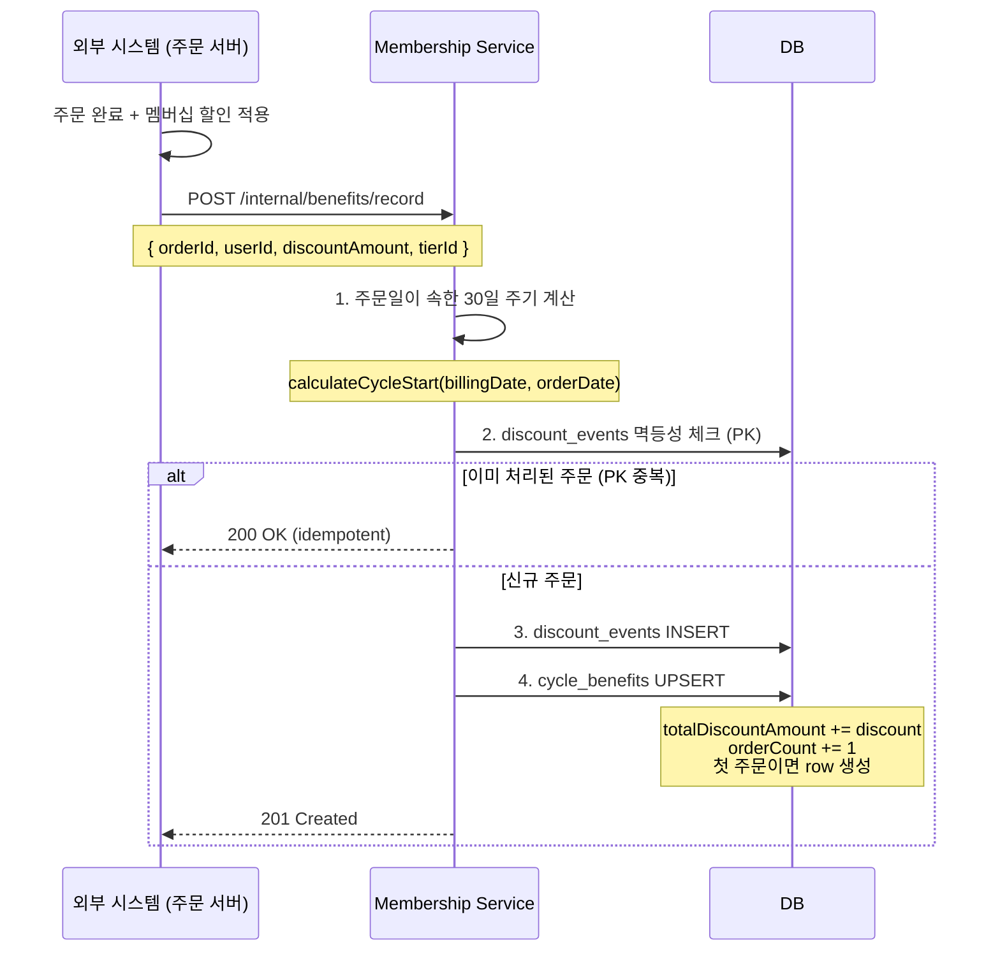
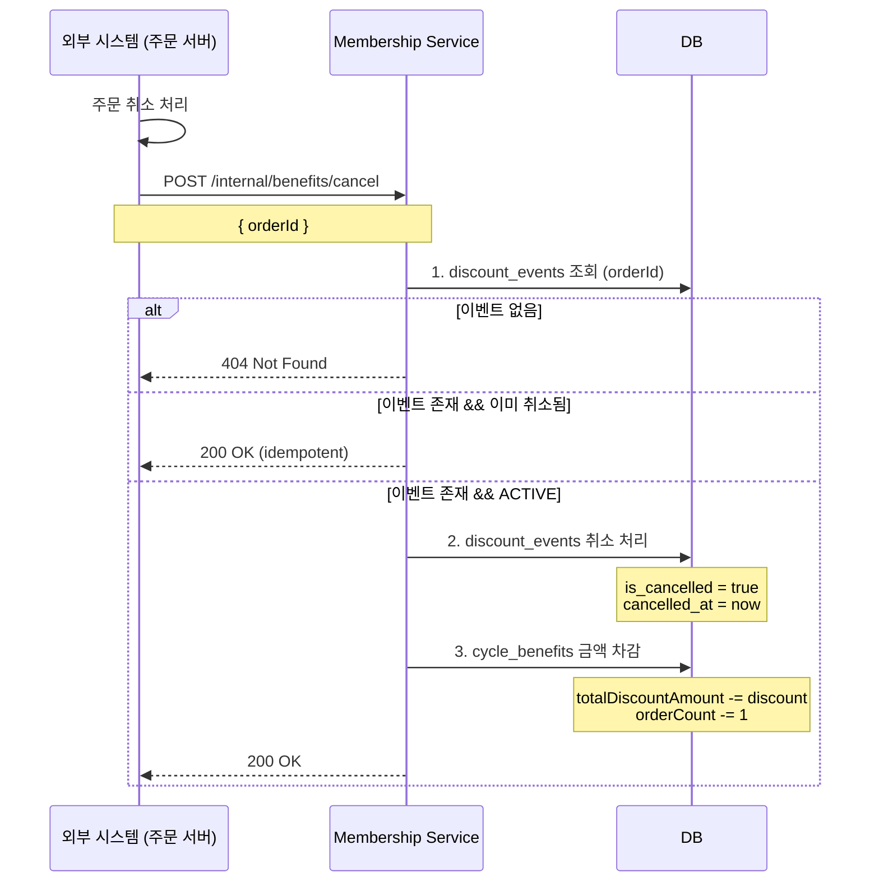

# 멤버십 혜택 추적 기능 명세서

> **버전**: 2.1.0  
> **작성일**: 2025-10-15  
> **목적**: 결제일 기준 30일 주기 단위로 멤버십 할인 혜택을 추적하고 사용자에게 제공

---

## 📌 기능 개요

### 왜 이 기능이 필요한가?

사용자에게 **"이번 결제 주기 동안 멤버십으로 얼마를 절약했는지"**를 명확하게 보여주기 위함입니다.

**핵심 요구사항:**

- 결제일 기준 정확히 30일 단위로 혜택 추적
- "이번 주기 총 절약 금액" 빠른 조회 (< 5ms)
- 주문 취소 시 금액 차감
- 멱등성 보장 (동일 주문 중복 처리 방지)

**비즈니스 가치:**

```
사용자: "10월 15일 ~ 11월 13일 동안 67,000원 절약했어요!"
마케팅: "다음 결제까지 12일 남았어요. 이미 67,000원 절약 중!"
리텐션: 주기별 혜택 추이 분석 가능
```

---

## 🔑 핵심 개념: 30일 주기(Billing Cycle)

### 30일 주기란?

**구독 결제일을 기준으로 30일 단위로 반복되는 기간입니다.**

```
연간 구독 (2025-01-15 결제) 예시:

Cycle 1:  2025-01-15 ~ 2025-02-13 (30일)
Cycle 2:  2025-02-14 ~ 2025-03-15 (30일)
Cycle 3:  2025-03-16 ~ 2025-04-14 (30일)
...
Cycle 12: 2026-01-15 ~ 2026-02-13 (30일)
```

### 왜 30일 단위인가?

1. **명확한 기준**: "이번 달"이 아닌 "결제일 기준 30일"
2. **공정한 비교**: 월마다 일수가 달라도 항상 30일 고정
3. **일관성**: 연간/월간 구독 관계없이 동일한 방식
4. **성능**: 주기 시작일만 알면 PK 조회 1번으로 끝

---

## 📊 데이터 모델

### 1. 주기별 혜택 집계 테이블

**`membership_cycle_benefits`** - 조회 최적화용

**테이블 목적:**

- 사용자의 30일 주기별 총 절약 금액을 집계
- PK 조회로 초고속 응답 (< 5ms)
- 첫 주문 발생 시 자동 생성 (Lazy Creation)

| 컬럼                    | 타입      | 제약     | 설명                          |
| ----------------------- | --------- | -------- | ----------------------------- |
| `user_id`               | VARCHAR   | PK       | 사용자 ID                     |
| `cycle_start_date`      | DATE      | PK       | 주기 시작일 (YYYY-MM-DD)      |
| `cycle_end_date`        | DATE      | NOT NULL | 주기 종료일 (시작일 + 29일)   |
| `total_discount_amount` | INTEGER   | NOT NULL | 해당 주기 총 할인액           |
| `order_count`           | INTEGER   | NOT NULL | 할인 적용 주문 건수           |
| `subscription_id`       | VARCHAR   | NOT NULL | 어떤 구독의 주기인지          |
| `cycle_number`          | INTEGER   | NOT NULL | 몇 번째 30일 주기인지 (1부터) |
| `created_at`            | TIMESTAMP | NOT NULL | 최초 생성 시각                |
| `updated_at`            | TIMESTAMP | NOT NULL | 마지막 업데이트 시각          |

**인덱스:**

```sql
PRIMARY KEY (user_id, cycle_start_date)
CREATE INDEX idx_cycle_subscription ON membership_cycle_benefits(subscription_id);
CREATE INDEX idx_cycle_end_date ON membership_cycle_benefits(cycle_end_date);
```

**예시 데이터:**

```json
{
  "user_id": "user_12345",
  "cycle_start_date": "2025-10-15",
  "cycle_end_date": "2025-11-13",
  "total_discount_amount": 67000,
  "order_count": 15,
  "subscription_id": "sub_YEAR_abc",
  "cycle_number": 10,
  "created_at": "2025-10-15T10:30:00Z",
  "updated_at": "2025-10-28T14:30:00Z"
}
```

---

### 2. 주문별 할인 이벤트 테이블

**`membership_discount_events`** - 멱등성 보장 + 취소 처리 + 분석용

**테이블 목적:**

- 모든 할인 발생을 원자적으로 기록 (Source of Truth)
- orderId를 PK로 사용하여 중복 처리 자동 방지
- 주문 취소 시 어떤 주기에서 차감할지 추적
- 내부 분석: 티어별, 주기별 할인 패턴 분석

| 컬럼               | 타입         | 제약     | 설명                      |
| ------------------ | ------------ | -------- | ------------------------- |
| `order_id`         | VARCHAR(100) | PK       | 주문 ID (멱등성 키)       |
| `user_id`          | VARCHAR      | NOT NULL | 사용자 ID                 |
| `discount_amount`  | INTEGER      | NOT NULL | 해당 주문의 멤버십 할인액 |
| `tier_id`          | UUID         | NOT NULL | 할인 발생 시점의 티어     |
| `cycle_start_date` | DATE         | NOT NULL | 주문이 속한 주기 시작일   |
| `subscription_id`  | VARCHAR      | NOT NULL | 구독 ID                   |
| `order_date`       | TIMESTAMP    | NOT NULL | 주문 일시                 |
| `is_cancelled`     | BOOLEAN      | NOT NULL | 취소 여부 (기본: false)   |
| `cancelled_at`     | TIMESTAMP    | NULL     | 취소 시각                 |
| `created_at`       | TIMESTAMP    | NOT NULL | 이벤트 수신 시각          |

**인덱스:**

```sql
PRIMARY KEY (order_id)
CREATE INDEX idx_events_user_cycle ON membership_discount_events(user_id, cycle_start_date);
CREATE INDEX idx_events_subscription ON membership_discount_events(subscription_id);
CREATE INDEX idx_events_cancelled ON membership_discount_events(is_cancelled) WHERE is_cancelled = false;
```

---

## 🔄 처리 플로우

### 1. 주문 완료 시 혜택 기록



---

### 2. 주문 취소 시 혜택 차감



---

## 🚀 API 명세

### 1. 혜택 기록 (내부 API)

**목적:** 외부 시스템에서 주문 완료 시 멤버십 혜택 기록

```http
POST /api/internal/membership/benefits/record
Content-Type: application/json
```

**Request Body:**

```json
{
  "orderId": "order_2025_1234",
  "userId": "user_12345",
  "orderDate": "2025-10-28T14:30:00Z",
  "membershipDiscountAmount": 5000,
  "tierId": "tier-uuid-premium"
}
```

**성공 응답:**

```json
// 201 Created (신규 기록)
{
  "success": true,
  "message": "Discount recorded"
}

// 200 OK (멱등성 - 이미 처리됨)
{
  "success": true,
  "message": "Already recorded"
}
```

---

### 2. 혜택 취소 (내부 API)

**목적:** 외부 시스템에서 주문 취소 시 멤버십 혜택 차감

```http
POST /api/internal/membership/benefits/cancel
Content-Type: application/json
```

**Request Body:**

```json
{
  "orderId": "order_2025_1234"
}
```

**성공 응답:**

```json
// 200 OK
{
  "success": true,
  "message": "Discount cancelled"
}
```

**에러 응답:**

```json
// 404 Not Found
{
  "error": "DISCOUNT_EVENT_NOT_FOUND",
  "message": "해당 주문의 할인 기록을 찾을 수 없습니다"
}
```

---

### 3. 현재 주기 혜택 조회 (외부 API)

**목적:** 사용자에게 "지금 이 주기 동안 얼마나 절약했는지" 보여주기

```http
GET /api/membership/benefits/current?userId={userId}
```

**Query Parameters:**
| 파라미터 | 타입 | 필수 | 설명 |
| -------- | ------ | ---- | --------- |
| userId | string | ✅ | 사용자 ID |

**성공 응답 (200 OK):**

```json
{
  "userId": "user_12345",
  "cycleStartDate": "2025-10-15",
  "cycleEndDate": "2025-11-13",
  "totalDiscountAmount": 67000,
  "orderCount": 15,
  "daysRemaining": 12,
  "daysElapsed": 18,
  "subscriptionType": "YEAR",
  "nextCycleStartDate": "2025-11-14"
}
```

**에러 응답:**

```json
// 404: 활성 구독 없음
{
  "error": "NO_ACTIVE_SUBSCRIPTION",
  "message": "활성화된 구독이 없습니다"
}
```

---

### 4. 특정 주기 혜택 조회 (외부 API)

**목적:** 과거 주기 데이터 조회

```http
GET /api/membership/benefits/cycle?userId={userId}&cycleStartDate={date}
```

**Query Parameters:**
| 파라미터 | 타입 | 필수 | 설명 |
| --------------- | ------ | ---- | ------------------------ |
| userId | string | ✅ | 사용자 ID |
| cycleStartDate | string | ✅ | 주기 시작일 (YYYY-MM-DD) |

**성공 응답 (200 OK):**

```json
{
  "userId": "user_12345",
  "cycleStartDate": "2025-09-15",
  "cycleEndDate": "2025-10-14",
  "totalDiscountAmount": 52000,
  "orderCount": 12,
  "subscriptionType": "YEAR",
  "isCompleted": true
}
```

---

### 5. 주기별 혜택 이력 조회 (외부 API)

**목적:** 사용자의 전체 혜택 히스토리 (최근 N개 주기)

```http
GET /api/membership/benefits/history?userId={userId}&limit={limit}
```

**Query Parameters:**
| 파라미터 | 타입 | 필수 | 기본값 | 설명 |
| -------- | ------- | ---- | ------ | ---------------- |
| userId | string | ✅ | - | 사용자 ID |
| limit | integer | ❌ | 12 | 조회할 주기 개수 |

**성공 응답 (200 OK):**

```json
{
  "userId": "user_12345",
  "cycles": [
    {
      "cycleStartDate": "2025-10-15",
      "cycleEndDate": "2025-11-13",
      "totalDiscountAmount": 67000,
      "orderCount": 15,
      "isCompleted": false
    },
    {
      "cycleStartDate": "2025-09-15",
      "cycleEndDate": "2025-10-14",
      "totalDiscountAmount": 52000,
      "orderCount": 12,
      "isCompleted": true
    }
  ],
  "totalCycles": 10,
  "totalDiscountAllTime": 580000
}
```

---

## 💻 구현 가이드

### 1. 핵심 유틸리티: 주기 계산 로직

```typescript
// apps/membership/src/utils/cycle.utils.ts
import { addDays, differenceInDays } from 'date-fns';

/**
 * 주문일이 속한 30일 주기의 시작일을 계산
 *
 * @param billingDate - 구독 최초 결제일 (구독 시작일)
 * @param orderDate - 주문 발생일
 * @returns 해당 주문이 속한 주기의 시작일
 *
 * @example
 * billingDate: 2025-01-15
 * orderDate: 2025-10-28
 *
 * 계산 과정:
 * 1. 경과일: 286일
 * 2. 주기 번호: Math.floor(286 / 30) = 9 (10번째 주기)
 * 3. 시작일: 2025-01-15 + (9 * 30일) = 2025-10-15
 */
export function calculateCycleStart(billingDate: Date, orderDate: Date): Date {
  const daysSinceStart = differenceInDays(orderDate, billingDate);
  const cycleNumber = Math.floor(daysSinceStart / 30);
  return addDays(billingDate, cycleNumber * 30);
}

/**
 * 주기 번호 계산 (1부터 시작)
 */
export function calculateCycleNumber(
  billingDate: Date,
  cycleStartDate: Date,
): number {
  const daysSinceStart = differenceInDays(cycleStartDate, billingDate);
  return Math.floor(daysSinceStart / 30) + 1;
}

/**
 * 주기 종료일 계산 (시작일 + 29일)
 */
export function calculateCycleEnd(cycleStartDate: Date): Date {
  return addDays(cycleStartDate, 29);
}

/**
 * 주기 완료 여부 판단
 */
export function isCycleCompleted(cycleEndDate: Date): boolean {
  return cycleEndDate < new Date();
}

/**
 * 날짜를 YYYY-MM-DD 형식으로 변환
 */
export function formatDate(date: Date): string {
  return date.toISOString().split('T')[0];
}
```

---

### 2. Drizzle ORM 스키마 정의

```typescript
// apps/membership/src/database/schema/membership-cycle-benefits.schema.ts
import {
  pgTable,
  varchar,
  date,
  integer,
  timestamp,
  primaryKey,
  index,
} from 'drizzle-orm/pg-core';

export const membershipCycleBenefits = pgTable(
  'membership_cycle_benefits',
  {
    userId: varchar('user_id').notNull(),
    cycleStartDate: date('cycle_start_date').notNull(),
    cycleEndDate: date('cycle_end_date').notNull(),
    totalDiscountAmount: integer('total_discount_amount').notNull().default(0),
    orderCount: integer('order_count').notNull().default(0),
    subscriptionId: varchar('subscription_id').notNull(),
    cycleNumber: integer('cycle_number').notNull(),
    createdAt: timestamp('created_at').notNull().defaultNow(),
    updatedAt: timestamp('updated_at').notNull().defaultNow(),
  },
  (table) => ({
    pk: primaryKey({ columns: [table.userId, table.cycleStartDate] }),
    subscriptionIdx: index('idx_cycle_subscription').on(table.subscriptionId),
    endDateIdx: index('idx_cycle_end_date').on(table.cycleEndDate),
  }),
);

// apps/membership/src/database/schema/membership-discount-events.schema.ts
import {
  pgTable,
  varchar,
  integer,
  uuid,
  date,
  timestamp,
  boolean,
  index,
} from 'drizzle-orm/pg-core';

export const membershipDiscountEvents = pgTable(
  'membership_discount_events',
  {
    orderId: varchar('order_id', { length: 100 }).primaryKey(),
    userId: varchar('user_id').notNull(),
    discountAmount: integer('discount_amount').notNull(),
    tierId: uuid('tier_id').notNull(),
    cycleStartDate: date('cycle_start_date').notNull(),
    subscriptionId: varchar('subscription_id').notNull(),
    orderDate: timestamp('order_date').notNull(),
    isCancelled: boolean('is_cancelled').notNull().default(false),
    cancelledAt: timestamp('cancelled_at'),
    createdAt: timestamp('created_at').notNull().defaultNow(),
  },
  (table) => ({
    userCycleIdx: index('idx_events_user_cycle').on(
      table.userId,
      table.cycleStartDate,
    ),
    subscriptionIdx: index('idx_events_subscription').on(table.subscriptionId),
    cancelledIdx: index('idx_events_cancelled').on(table.isCancelled),
  }),
);
```

---

### 3. 서비스: BenefitTrackingService

```typescript
// apps/membership/src/services/benefit-tracking.service.ts
import { Injectable, Logger, NotFoundException } from '@nestjs/common';
import { eq, and, sql, desc } from 'drizzle-orm';
import { DatabaseService } from '../database/database.service';
import { SubscriptionService } from './subscription.service';
import * as schema from '../database/schema';
import {
  calculateCycleStart,
  calculateCycleEnd,
  calculateCycleNumber,
  formatDate,
  isCycleCompleted,
} from '../utils/cycle.utils';
import { differenceInDays, addDays } from 'date-fns';

@Injectable()
export class BenefitTrackingService {
  private readonly logger = new Logger(BenefitTrackingService.name);

  constructor(
    private readonly db: DatabaseService,
    private readonly subscriptionService: SubscriptionService,
  ) {}

  /**
   * 주문 완료 시 혜택 기록 (외부 시스템에서 호출)
   */
  async recordDiscount(dto: RecordDiscountDto): Promise<void> {
    const subscription = await this.subscriptionService.getActiveSubscription(
      dto.userId,
    );

    if (!subscription) {
      this.logger.warn('No active subscription', {
        userId: dto.userId,
        orderId: dto.orderId,
      });
      return;
    }

    const orderDate = new Date(dto.orderDate);
    const billingDate = new Date(subscription.billingDate);

    const cycleStartDate = calculateCycleStart(billingDate, orderDate);
    const cycleEndDate = calculateCycleEnd(cycleStartDate);
    const cycleNumber = calculateCycleNumber(billingDate, cycleStartDate);

    await this.db.db.transaction(async (tx) => {
      // 멱등성 체크: PK 제약조건이 자동으로 처리
      try {
        await tx.insert(schema.membershipDiscountEvents).values({
          orderId: dto.orderId,
          userId: dto.userId,
          discountAmount: dto.membershipDiscountAmount,
          tierId: dto.tierId,
          cycleStartDate: formatDate(cycleStartDate),
          subscriptionId: subscription.id,
          orderDate: dto.orderDate,
          isCancelled: false,
        });
      } catch (error) {
        if (error.code === '23505') {
          this.logger.info('Duplicate order, skipping', {
            orderId: dto.orderId,
          });
          return;
        }
        throw error;
      }

      // UPSERT: 첫 주문이면 INSERT, 아니면 UPDATE
      await tx
        .insert(schema.membershipCycleBenefits)
        .values({
          userId: dto.userId,
          cycleStartDate: formatDate(cycleStartDate),
          cycleEndDate: formatDate(cycleEndDate),
          totalDiscountAmount: dto.membershipDiscountAmount,
          orderCount: 1,
          subscriptionId: subscription.id,
          cycleNumber,
        })
        .onConflictDoUpdate({
          target: [
            schema.membershipCycleBenefits.userId,
            schema.membershipCycleBenefits.cycleStartDate,
          ],
          set: {
            totalDiscountAmount: sql`${schema.membershipCycleBenefits.totalDiscountAmount} + ${dto.membershipDiscountAmount}`,
            orderCount: sql`${schema.membershipCycleBenefits.orderCount} + 1`,
            updatedAt: new Date(),
          },
        });
    });

    this.logger.info('Discount recorded', {
      orderId: dto.orderId,
      cycleStartDate: formatDate(cycleStartDate),
      amount: dto.membershipDiscountAmount,
    });
  }

  /**
   * 주문 취소 시 혜택 차감 (외부 시스템에서 호출)
   */
  async cancelDiscount(orderId: string): Promise<void> {
    await this.db.db.transaction(async (tx) => {
      const events = await tx
        .select()
        .from(schema.membershipDiscountEvents)
        .where(eq(schema.membershipDiscountEvents.orderId, orderId))
        .limit(1);

      if (!events.length) {
        this.logger.error('Event not found', { orderId });
        throw new NotFoundException('DISCOUNT_EVENT_NOT_FOUND');
      }

      const event = events[0];

      if (event.isCancelled) {
        this.logger.info('Already cancelled', { orderId });
        return;
      }

      await tx
        .update(schema.membershipDiscountEvents)
        .set({
          isCancelled: true,
          cancelledAt: new Date(),
        })
        .where(eq(schema.membershipDiscountEvents.orderId, orderId));

      await tx
        .update(schema.membershipCycleBenefits)
        .set({
          totalDiscountAmount: sql`${schema.membershipCycleBenefits.totalDiscountAmount} - ${event.discountAmount}`,
          orderCount: sql`${schema.membershipCycleBenefits.orderCount} - 1`,
          updatedAt: new Date(),
        })
        .where(
          and(
            eq(schema.membershipCycleBenefits.userId, event.userId),
            eq(
              schema.membershipCycleBenefits.cycleStartDate,
              event.cycleStartDate,
            ),
          ),
        );
    });

    this.logger.info('Discount cancelled', { orderId });
  }

  /**
   * 현재 주기 혜택 조회
   */
  async getCurrentCycleBenefit(userId: string): Promise<CycleBenefitDto> {
    const subscription =
      await this.subscriptionService.getActiveSubscription(userId);

    if (!subscription) {
      throw new NotFoundException('NO_ACTIVE_SUBSCRIPTION');
    }

    const now = new Date();
    const billingDate = new Date(subscription.billingDate);
    const cycleStartDate = calculateCycleStart(billingDate, now);
    const cycleEndDate = calculateCycleEnd(cycleStartDate);

    const benefits = await this.db.db
      .select()
      .from(schema.membershipCycleBenefits)
      .where(
        and(
          eq(schema.membershipCycleBenefits.userId, userId),
          eq(
            schema.membershipCycleBenefits.cycleStartDate,
            formatDate(cycleStartDate),
          ),
        ),
      )
      .limit(1);

    // row 없으면 0원 반환
    if (!benefits.length) {
      return {
        userId,
        cycleStartDate: formatDate(cycleStartDate),
        cycleEndDate: formatDate(cycleEndDate),
        totalDiscountAmount: 0,
        orderCount: 0,
        daysRemaining: differenceInDays(cycleEndDate, now),
        daysElapsed: differenceInDays(now, cycleStartDate),
        subscriptionType: subscription.type,
        nextCycleStartDate: formatDate(addDays(cycleStartDate, 30)),
      };
    }

    const benefit = benefits[0];
    const endDate = new Date(benefit.cycleEndDate);

    return {
      userId: benefit.userId,
      cycleStartDate: benefit.cycleStartDate,
      cycleEndDate: benefit.cycleEndDate,
      totalDiscountAmount: benefit.totalDiscountAmount,
      orderCount: benefit.orderCount,
      daysRemaining: differenceInDays(endDate, now),
      daysElapsed: differenceInDays(now, cycleStartDate),
      subscriptionType: subscription.type,
      nextCycleStartDate: formatDate(addDays(cycleStartDate, 30)),
    };
  }

  /**
   * 주기별 혜택 이력 조회
   */
  async getCycleBenefitHistory(
    userId: string,
    limit: number = 12,
  ): Promise<CycleBenefitHistoryDto> {
    const benefits = await this.db.db
      .select()
      .from(schema.membershipCycleBenefits)
      .where(eq(schema.membershipCycleBenefits.userId, userId))
      .orderBy(desc(schema.membershipCycleBenefits.cycleStartDate))
      .limit(limit);

    const cycles = benefits.map((b) => ({
      cycleStartDate: b.cycleStartDate,
      cycleEndDate: b.cycleEndDate,
      totalDiscountAmount: b.totalDiscountAmount,
      orderCount: b.orderCount,
      isCompleted: isCycleCompleted(new Date(b.cycleEndDate)),
    }));

    const totalDiscountAllTime = benefits.reduce(
      (sum, b) => sum + b.totalDiscountAmount,
      0,
    );

    return {
      userId,
      cycles,
      totalCycles: benefits.length,
      totalDiscountAllTime,
    };
  }
}
```

---

### 4. DTO 정의

```typescript
// apps/membership/src/dto/benefit-tracking.dto.ts
import { createZodDto } from 'nestjs-zod';
import { z } from 'zod';

// 혜택 기록 요청
export const RecordDiscountSchema = z.object({
  orderId: z.string(),
  userId: z.string(),
  orderDate: z.string().datetime(),
  membershipDiscountAmount: z.number().int().min(0),
  tierId: z.string().uuid(),
});

export class RecordDiscountDto extends createZodDto(RecordDiscountSchema) {}

// 현재 주기 혜택 응답
export const CycleBenefitSchema = z.object({
  userId: z.string(),
  cycleStartDate: z.string().regex(/^\d{4}-\d{2}-\d{2}$/),
  cycleEndDate: z.string().regex(/^\d{4}-\d{2}-\d{2}$/),
  totalDiscountAmount: z.number().int().min(0),
  orderCount: z.number().int().min(0),
  daysRemaining: z.number().int(),
  daysElapsed: z.number().int(),
  subscriptionType: z.enum(['MONTHLY', 'YEAR']),
  nextCycleStartDate: z.string().regex(/^\d{4}-\d{2}-\d{2}$/),
});

export class CycleBenefitDto extends createZodDto(CycleBenefitSchema) {}

// 혜택 이력 응답
export const CycleBenefitHistorySchema = z.object({
  userId: z.string(),
  cycles: z.array(
    z.object({
      cycleStartDate: z.string(),
      cycleEndDate: z.string(),
      totalDiscountAmount: z.number().int(),
      orderCount: z.number().int(),
      isCompleted: z.boolean(),
    }),
  ),
  totalCycles: z.number().int(),
  totalDiscountAllTime: z.number().int(),
});

export class CycleBenefitHistoryDto extends createZodDto(
  CycleBenefitHistorySchema,
) {}
```

---

### 5. Controller

```typescript
// apps/membership/src/controllers/benefit-tracking.controller.ts
import { Controller, Get, Post, Body, Query } from '@nestjs/common';
import { BenefitTrackingService } from '../services/benefit-tracking.service';
import {
  RecordDiscountDto,
  CycleBenefitDto,
} from '../dto/benefit-tracking.dto';

@Controller('membership/benefits')
export class BenefitTrackingController {
  constructor(
    private readonly benefitTrackingService: BenefitTrackingService,
  ) {}

  // 내부 API: 혜택 기록
  @Post('internal/record')
  async recordDiscount(@Body() dto: RecordDiscountDto) {
    await this.benefitTrackingService.recordDiscount(dto);
    return { success: true, message: 'Discount recorded' };
  }

  // 내부 API: 혜택 취소
  @Post('internal/cancel')
  async cancelDiscount(@Body('orderId') orderId: string) {
    await this.benefitTrackingService.cancelDiscount(orderId);
    return { success: true, message: 'Discount cancelled' };
  }

  // 외부 API: 현재 주기 조회
  @Get('current')
  async getCurrentCycleBenefit(
    @Query('userId') userId: string,
  ): Promise<CycleBenefitDto> {
    return this.benefitTrackingService.getCurrentCycleBenefit(userId);
  }

  // 외부 API: 혜택 이력 조회
  @Get('history')
  async getCycleBenefitHistory(
    @Query('userId') userId: string,
    @Query('limit') limit?: number,
  ) {
    return this.benefitTrackingService.getCycleBenefitHistory(
      userId,
      limit || 12,
    );
  }
}
```

---

## 🧪 통합 테스트

```typescript
// apps/membership/src/services/__tests__/benefit-tracking.integration.spec.ts
import { Test } from '@nestjs/testing';
import { BenefitTrackingService } from '../benefit-tracking.service';
import { DatabaseService } from '../../database/database.service';
import { SubscriptionService } from '../subscription.service';

describe('BenefitTrackingService (Integration)', () => {
  let service: BenefitTrackingService;
  let db: DatabaseService;

  beforeAll(async () => {
    const module = await Test.createTestingModule({
      providers: [BenefitTrackingService, DatabaseService, SubscriptionService],
    }).compile();

    service = module.get(BenefitTrackingService);
    db = module.get(DatabaseService);
  });

  describe('주문 완료 → 조회 → 취소 플로우', () => {
    const userId = 'test-user-001';
    const orderId = 'test-order-001';

    it('전체 플로우가 정상 동작해야 함', async () => {
      // 1. 주문 완료 - 혜택 기록
      await service.recordDiscount({
        orderId,
        userId,
        orderDate: new Date().toISOString(),
        membershipDiscountAmount: 5000,
        tierId: 'tier-uuid-premium',
      });

      // 2. 현재 주기 조회 - 5,000원 확인
      let benefit = await service.getCurrentCycleBenefit(userId);
      expect(benefit.totalDiscountAmount).toBe(5000);
      expect(benefit.orderCount).toBe(1);

      // 3. 같은 주문 중복 처리 - 멱등성 확인
      await service.recordDiscount({
        orderId, // 동일한 orderId
        userId,
        orderDate: new Date().toISOString(),
        membershipDiscountAmount: 5000,
        tierId: 'tier-uuid-premium',
      });

      benefit = await service.getCurrentCycleBenefit(userId);
      expect(benefit.totalDiscountAmount).toBe(5000); // 여전히 5,000원
      expect(benefit.orderCount).toBe(1); // 여전히 1건

      // 4. 주문 취소 - 혜택 차감
      await service.cancelDiscount(orderId);

      benefit = await service.getCurrentCycleBenefit(userId);
      expect(benefit.totalDiscountAmount).toBe(0);
      expect(benefit.orderCount).toBe(0);
    });
  });
});
```

---

## ✅ 구현 체크리스트

### Phase 1: 기본 구조 (1일)

- [ ] 데이터베이스 스키마 작성 (Drizzle)
- [ ] 마이그레이션 실행
- [ ] 유틸리티 함수 작성 (cycle.utils.ts)
- [ ] 유틸리티 단위 테스트

### Phase 2: 서비스 로직 (2일)

- [ ] BenefitTrackingService 구현
- [ ] recordDiscount() 메서드
- [ ] cancelDiscount() 메서드
- [ ] getCurrentCycleBenefit() 메서드
- [ ] getCycleBenefitHistory() 메서드

### Phase 3: API & 통합 (1일)

- [ ] Controller 구현
- [ ] DTO 작성 및 Validation
- [ ] 통합 테스트 1개 작성 및 통과

---

## 🎯 핵심 포인트

1. **30일 주기 = 성능**: PK 조회 1번 (< 5ms)
2. **Lazy Creation = 단순함**: 첫 주문 시 자동 생성
3. **멱등성 = PK**: orderId가 자동 보장
4. **동기 호출**: 외부 시스템 → Membership 직접 API 호출
5. **통합 테스트 1개**: 핵심 플로우만 검증

---

## 📌 구독 스키마 업데이트

### subscriptionContracts 테이블에 billingDate 필드 추가

**배경:**
30일 주기 계산의 기준점이 되는 "첫 결제일"을 저장하기 위해 `billingDate` 필드가 필수입니다.

**스키마 변경:**

```typescript
export const subscriptionContracts = pgTable('subscription_contracts', {
  id: uuid('id').primaryKey().defaultRandom(),
  userId: varchar('user_id').notNull(),
  planId: uuid('plan_id').notNull(),

  // 날짜 필드들
  createdAt: timestamp('created_at').notNull().defaultNow(), // 구독 생성일
  billingDate: date('billing_date').notNull(), // 첫 결제일 (고정) ⭐ NEW
  nextBillingDate: date('next_billing_date'), // 다음 결제일 (변동)

  // ... 기존 필드들
});
```

**필드 의미:**

- `createdAt`: 사용자가 구독을 생성한 시각
- `billingDate`: **첫 결제가 발생한(할) 날짜** = 30일 주기 계산의 기준점
- `nextBillingDate`: 다음 결제 예정일 (매 결제 시 업데이트)

**마이그레이션:**

```sql
-- 1. 컬럼 추가 (nullable로 먼저)
ALTER TABLE subscription_contracts
ADD COLUMN billing_date DATE;

-- 2. 기존 데이터 채우기
-- 가정: plan 테이블의 trial_days를 활용
UPDATE subscription_contracts sc
SET billing_date = (sc.created_at + INTERVAL '1 day' * COALESCE(p.trial_days, 0))::date
FROM plan p
WHERE sc.plan_id = p.id AND sc.billing_date IS NULL;

-- 3. NOT NULL 제약조건 추가
ALTER TABLE subscription_contracts
ALTER COLUMN billing_date SET NOT NULL;

-- 4. 인덱스 추가 (성능 최적화)
CREATE INDEX idx_subscription_billing_date
ON subscription_contracts(billing_date);
```

---

## 📝 SubscriptionService 메소드 추가

### getActiveSubscription() 명세

**목적:** BenefitTrackingService에서 사용자의 활성 구독 정보를 조회

```typescript
/**
 * 사용자의 활성 구독 정보를 조회합니다.
 * @param userId - 사용자 ID
 * @returns 활성 구독이 있으면 구독 정보, 없으면 null
 */
async getActiveSubscription(userId: string): Promise<ActiveSubscription | null> {
  const contracts = await this.dbService.db
    .select()
    .from(schema.subscriptionContracts)
    .where(
      and(
        eq(schema.subscriptionContracts.userId, userId),
        eq(schema.subscriptionContracts.isVoided, false),
      )
    )
    .limit(1);

  if (!contracts.length) {
    return null;
  }

  return {
    id: contracts[0].id,
    userId: contracts[0].userId,
    billingDate: new Date(contracts[0].billingDate), // ⭐ 30일 주기 계산에 사용
    type: 'ANNUAL', // planId로부터 조회하여 반환
  };
}
```

**반환 타입:**

```typescript
export type ActiveSubscription = {
  id: string;
  userId: string;
  billingDate: Date; // 첫 결제일 (30일 주기 기준점)
  type: 'MONTHLY' | 'YEAR';
};
```

---

**END OF SPEC v2.2.0**
