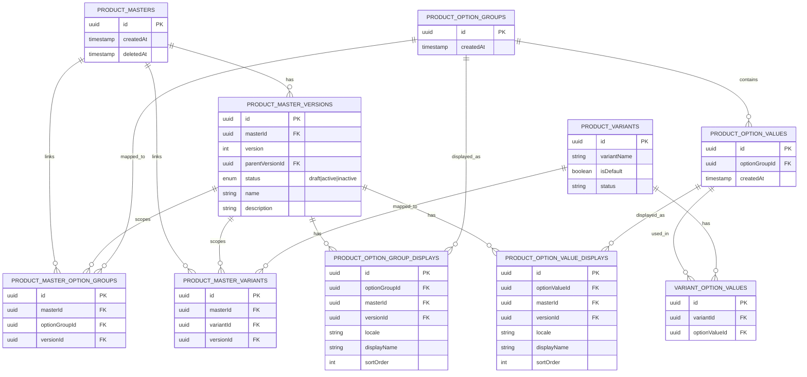
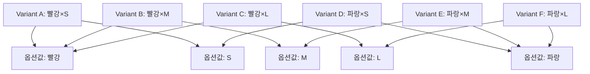

# PIM 상품 버전-옵션-품목(Variant) 관계 가이드

**작성일**: 2025-12-07  
**목적**: 테스트 시나리오 작성 시 엔티티 간 관계를 이해하기 위한 참고 문서

---

## 📋 목차

1. [핵심 엔티티 개요](#핵심-엔티티-개요)
2. [엔티티 관계도](#엔티티-관계도)
3. [주요 매핑 테이블](#주요-매핑-테이블)
4. [Variant 생성 로직](#variant-생성-로직)
5. [버전 격리(Version Isolation)](#버전-격리version-isolation)
6. [실제 테이블 구조](#실제-테이블-구조)

---

## 핵심 엔티티 개요

### 1. Product Master (상품 마스터)
- **테이블**: `product_masters`
- **역할**: 상품의 메타데이터 컨테이너
- **특징**: 
  - 상품 자체의 실제 데이터는 포함하지 않음
  - 여러 버전을 가질 수 있는 "그릇" 역할
  - Soft delete 지원 (`deletedAt`)

```typescript
// 최소 구조
{
  id: string;           // UUID v7
  createdAt: Date;
  deletedAt: Date | null;
}
```

### 2. Product Master Version (상품 버전)
- **테이블**: `product_master_versions`
- **역할**: 버전별 상품 데이터 저장
- **특징**:
  - 상품명, 설명, 브랜드 등 실제 상품 정보 포함
  - 상태: `draft` | `active` | `inactive`
  - Master당 Active 버전은 최대 1개
  - 모든 관계(옵션, 품목, 카테고리 등)는 버전 단위로 관리

```typescript
{
  id: string;
  masterId: string;           // FK → product_masters.id
  version: number;            // 1, 2, 3, ...
  parentVersionId: string | null;
  status: 'draft' | 'active' | 'inactive';
  name: string;
  description: string;
  // ... 기타 상품 속성
}
```

### 3. Product Option Group (옵션 그룹)
- **테이블**: `product_option_groups`
- **역할**: 옵션의 논리적 그룹 (예: "색상", "사이즈")
- **특징**:
  - 옵션 그룹 자체는 ID만 존재 (데이터 없음)
  - 표시 정보는 `product_option_group_displays`에 버전별로 저장

```typescript
{
  id: string;           // UUID v7
  createdAt: Date;
}
```

### 4. Product Option Value (옵션 값)
- **테이블**: `product_option_values`
- **역할**: 옵션 그룹 내의 구체적인 값 (예: "빨강", "파랑")
- **특징**:
  - 특정 옵션 그룹에 속함
  - 표시 정보는 `product_option_value_displays`에 버전별로 저장

```typescript
{
  id: string;
  optionGroupId: string;    // FK → product_option_groups.id
  createdAt: Date;
}
```

### 5. Product Variant (품목/SKU)
- **테이블**: `product_variants`
- **역할**: 실제 판매/재고 관리 단위 (SKU)
- **특징**:
  - 옵션 조합으로 자동 생성됨
  - 옵션이 없는 경우 기본 variant 1개 (`isDefault: true`)
  - WMS와 연동되는 핵심 엔티티

```typescript
{
  id: string;
  variantName: string | null;   // 예: "빨강 × L"
  isDefault: boolean;            // 옵션 없는 경우 true
  status: 'active' | 'inactive';
}
```

### 6. Display Tables (표시 정보)
- **테이블**: 
  - `product_option_group_displays`
  - `product_option_value_displays`
- **역할**: 버전별/언어별 표시 이름 저장
- **특징**:
  - 동일 옵션도 버전마다 다른 표시명 가능
  - 다국어 지원 (`locale`)

---

## 엔티티 관계도



---

## 주요 매핑 테이블

### 1. `product_master_option_groups` (버전 ↔ 옵션 그룹)

**목적**: 특정 버전이 어떤 옵션 그룹을 사용하는지 연결

**구조**:
```typescript
{
  id: string;
  masterId: string;        // FK → product_masters.id
  optionGroupId: string;   // FK → product_option_groups.id
  versionId: string;       // FK → product_master_versions.id
}
```

**제약조건**:
- UNIQUE(masterId, optionGroupId, versionId)
- 동일 버전에 같은 옵션 그룹 중복 불가

**의미**:
- 버전 A가 "색상" 옵션 그룹 사용
- 버전 B가 "색상", "사이즈" 옵션 그룹 사용 (독립적)

---

### 2. `product_master_variants` (버전 ↔ Variant)

**목적**: 특정 버전이 어떤 품목(Variant)들을 포함하는지 연결

**구조**:
```typescript
{
  id: string;
  masterId: string;     // FK → product_masters.id
  variantId: string;    // FK → product_variants.id
  versionId: string;    // FK → product_master_versions.id
}
```

**제약조건**:
- UNIQUE(masterId, variantId, versionId)

**의미**:
- 버전 1에는 Variant A, B가 속함
- 버전 2에는 Variant C, D, E가 속함 (완전히 다른 품목 구성)

---

### 3. `variant_option_values` (Variant ↔ 옵션 값)

**목적**: 각 Variant가 어떤 옵션 조합으로 구성되는지 정의

**구조**:
```typescript
{
  id: string;
  variantId: string;        // FK → product_variants.id
  optionValueId: string;    // FK → product_option_values.id
}
```

**제약조건**:
- UNIQUE(variantId, optionValueId)

**의미**:
- Variant X = [색상:빨강, 사이즈:L]
- Variant Y = [색상:빨강, 사이즈:M]

---

### 4. `product_option_group_displays` (옵션 그룹 표시 정보)

**목적**: 버전별/언어별 옵션 그룹 표시명 저장

**구조**:
```typescript
{
  id: string;
  optionGroupId: string;    // FK → product_option_groups.id
  masterId: string;         // FK → product_masters.id
  versionId: string;        // FK → product_master_versions.id
  locale: string;           // 'ko-KR', 'en-US', ...
  displayName: string;      // "색상", "Color"
  sortOrder: number;
}
```

**제약조건**:
- UNIQUE(optionGroupId, masterId, versionId, locale)

**의미**:
- 버전 1에서는 "색상"으로 표시
- 버전 2에서는 "컬러"로 표시 (표시명 변경 가능)

---

### 5. `product_option_value_displays` (옵션 값 표시 정보)

**목적**: 버전별/언어별 옵션 값 표시명 저장

**구조**:
```typescript
{
  id: string;
  optionValueId: string;    // FK → product_option_values.id
  masterId: string;         // FK → product_masters.id
  versionId: string;        // FK → product_master_versions.id
  locale: string;
  displayName: string;      // "빨강", "Red"
  colorCode: string;        // "#FF0000"
  sortOrder: number;
}
```

**제약조건**:
- UNIQUE(optionValueId, masterId, versionId, locale)

---

## Variant 생성 로직

### 케이스 1: 옵션이 없는 경우

**조건**: 버전에 연결된 옵션 그룹이 없음

**결과**: 기본 Variant 1개 생성

```typescript
// 생성되는 Variant
{
  variantName: null,
  isDefault: true,
  status: 'active'
}
```

**매핑**:
- `product_master_variants`: (masterId, variantId, versionId)
- `variant_option_values`: (매핑 없음)

---

### 케이스 2: 옵션이 있는 경우

**조건**: 버전에 N개의 옵션 그룹 연결됨

**결과**: 모든 옵션 값의 데카르트 곱(Cartesian Product)으로 Variant 자동 생성

**예시**:

```
옵션 그룹 1: 색상
  - 값: 빨강, 파랑

옵션 그룹 2: 사이즈
  - 값: S, M, L

생성되는 Variant:
1. Variant A: [빨강, S] → variantName: "빨강 × S"
2. Variant B: [빨강, M] → variantName: "빨강 × M"
3. Variant C: [빨강, L] → variantName: "빨강 × L"
4. Variant D: [파랑, S] → variantName: "파랑 × S"
5. Variant E: [파랑, M] → variantName: "파랑 × M"
6. Variant F: [파랑, L] → variantName: "파랑 × L"

총 6개 (2 × 3)
```

**매핑 구조**:



**코드 참조**:
```typescript
// apps/pim/src/core/products/services/product-masters.service.ts
private async _generateVariants(
  masterId: string,
  versionId: string,
  optionGroups: VersionOptionGroupWithDisplays[],
  tx: DbTransaction,
): Promise<void> {
  // 옵션이 없는 경우
  if (!optionGroups || optionGroups.length === 0) {
    const [variant] = await tx.insert(productVariants).values({
      variantName: null,
      isDefault: true,
      status: 'active',
    }).returning();
    
    await tx.insert(productMasterVariants).values({
      masterId, variantId: variant.id, versionId
    });
    return;
  }

  // 옵션 조합 생성 (Cartesian Product)
  const combinations = this.generateOptionCombinations(optionGroups);

  for (const combination of combinations) {
    // Variant 생성
    const [variant] = await tx.insert(productVariants).values({
      variantName: combination.map(v => v.displayName).join(' × '),
      isDefault: false,
      status: 'active',
    }).returning();

    // Master-Variant 매핑
    await tx.insert(productMasterVariants).values({
      masterId, variantId: variant.id, versionId
    });

    // Variant-OptionValue 매핑
    for (const optionValue of combination) {
      await tx.insert(variantOptionValues).values({
        variantId: variant.id,
        optionValueId: optionValue.id,
      });
    }
  }
}
```

---

## 버전 격리(Version Isolation)

### 원칙

**각 버전은 독립적인 옵션/Variant 구조를 가짐**

- 버전 1이 "색상" 옵션만 사용
- 버전 2가 "색상", "사이즈" 옵션 사용
- 두 버전은 완전히 다른 Variant 세트를 가짐

### 버전별 분리 사항

| 항목 | 테이블 | 분리 방법 |
|------|--------|----------|
| 옵션 그룹 연결 | `product_master_option_groups` | `versionId` 컬럼 |
| Variant 연결 | `product_master_variants` | `versionId` 컬럼 |
| 옵션 그룹 표시명 | `product_option_group_displays` | `versionId` 컬럼 |
| 옵션 값 표시명 | `product_option_value_displays` | `versionId` 컬럼 |
| 카테고리 연결 | `product_master_categories` | `versionId` 컬럼 |
| 가격 규칙 | `product_master_pricing_rules` | `versionId` 컬럼 |

### 예시: 버전별 독립성

```
Master M1
├─ Version 1 (active)
│  ├─ 옵션: [색상: 빨강, 파랑]
│  └─ Variants: [빨강], [파랑]
│
└─ Version 2 (draft)
   ├─ 옵션: [색상: 빨강, 파랑, 노랑], [사이즈: S, M]
   └─ Variants: [빨강×S], [빨강×M], [파랑×S], [파랑×M], [노랑×S], [노랑×M]

→ 버전 2 발행(publish) 시:
  - 버전 1 → inactive
  - 버전 2 → active
  - 버전 1의 Variant들은 더 이상 활성화된 버전에 속하지 않음
```

### 조회 시 주의사항

**❌ 잘못된 조회**:
```sql
-- versionId 없이 조회 (모든 버전의 옵션이 섞임)
SELECT * FROM product_master_option_groups
WHERE masterId = 'master-uuid';
```

**✅ 올바른 조회**:
```sql
-- versionId 포함하여 조회
SELECT * FROM product_master_option_groups
WHERE masterId = 'master-uuid' AND versionId = 'version-uuid';
```

---

## 실제 테이블 구조

### 테이블 간 외래키 관계

```
product_masters
  ↓ (1:N)
product_master_versions
  ↓ (N:M via product_master_option_groups)
product_option_groups
  ↓ (1:N)
product_option_values
  ↓ (N:M via variant_option_values)
product_variants
  ↑ (N:M via product_master_variants)
product_master_versions
```

### 핵심 인덱스

```sql
-- 버전별 옵션 조회
CREATE INDEX idx_master_option_groups_master_version 
ON product_master_option_groups(master_id, version_id);

-- 버전별 Variant 조회
CREATE INDEX idx_master_variants_master_version 
ON product_master_variants(master_id, version_id);

-- Variant의 옵션 값 조회
CREATE INDEX idx_variant_options_variant 
ON variant_option_values(variant_id);

-- Display 정보 조회
CREATE INDEX idx_option_group_displays_lookup 
ON product_option_group_displays(option_group_id, master_id, version_id, locale);

CREATE INDEX idx_option_value_displays_lookup 
ON product_option_value_displays(option_value_id, master_id, version_id, locale);
```

### 유니크 제약조건

```sql
-- 버전당 Active는 1개만
CREATE UNIQUE INDEX unique_master_active_version 
ON product_master_versions(master_id) 
WHERE status = 'active';

-- 동일 버전에 옵션 그룹 중복 불가
CREATE UNIQUE INDEX unique_master_option_group_version 
ON product_master_option_groups(master_id, option_group_id, version_id);

-- 동일 버전에 Variant 중복 불가
CREATE UNIQUE INDEX unique_master_variant_version 
ON product_master_variants(master_id, variant_id, version_id);

-- Variant에 동일 옵션 값 중복 불가
CREATE UNIQUE INDEX unique_variant_option_values 
ON variant_option_values(variant_id, option_value_id);
```

---

## 테스트 시나리오 작성 시 고려사항

### 1. 버전 컨텍스트 명확히 하기

모든 테스트는 특정 버전을 대상으로 수행해야 함:

```typescript
// ✅ Good
const version = await getActiveVersion(masterId);
const variants = await getVariantsByVersion(masterId, version.id);

// ❌ Bad (버전 컨텍스트 누락)
const variants = await getVariantsByMaster(masterId); // 어떤 버전?
```

### 2. Variant 생성 타이밍 확인

- Variant는 버전 생성/수정 시 자동 생성됨
- 옵션 변경 → 모든 Variant 재생성
- WMS 이벤트 발행 확인 필요

### 3. Display 정보와 실제 엔티티 분리

```typescript
// 옵션 그룹 ID는 동일해도 표시명은 버전별로 다를 수 있음
optionGroupId: 'og-123'
├─ Version 1: displayName = "색상"
└─ Version 2: displayName = "컬러"
```

### 4. 버전 상태 전환 검증

```
draft → active (publish)
  ├─ 기존 active 버전 → inactive로 자동 전환
  ├─ Variant 변경사항 이벤트 발행
  └─ 채널 동기화 트리거
```

---

## 참고 문서

- [PIM 상품 등록 및 수정 플로우](./PRODUCT_LIFECYCLE.md)
- [PIM API 설계 가이드](./API_DESIGN_GUIDE.md)
- 스키마 정의: `apps/pim/src/schema.ts`
- 타입 정의: `apps/pim/src/types.ts`

---

**최종 업데이트**: 2025-12-07  
**작성자**: AI Development Assistant

