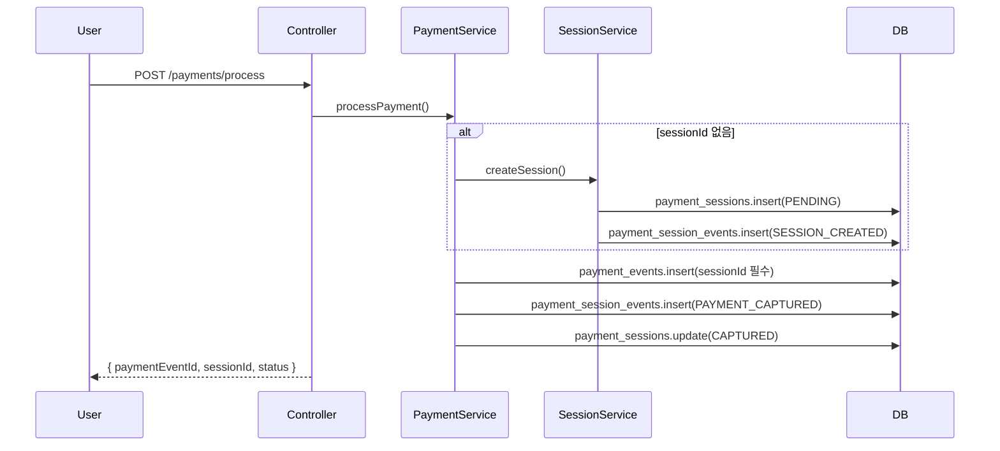
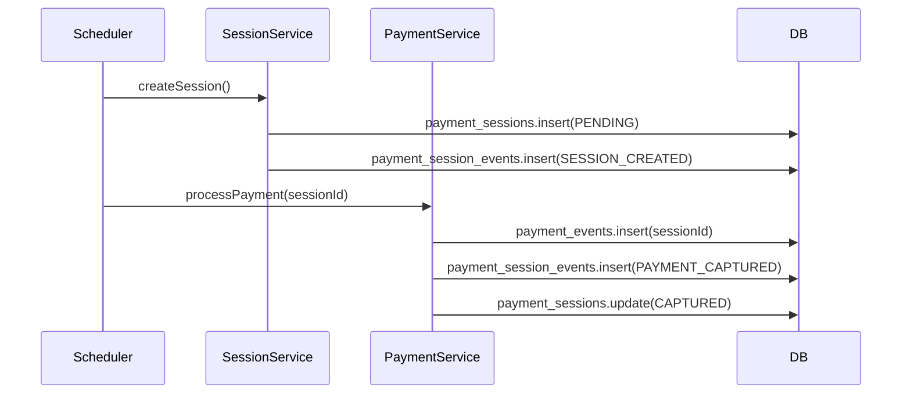
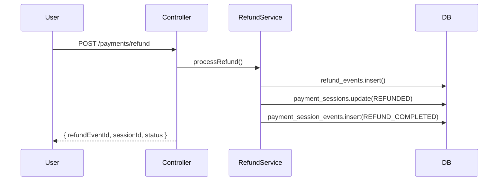

# 결제 세션 기반 플로우 설계 문서

## 📋 개요

Wallet MSA에서 모든 결제는 **세션 기반 구조**를 따릅니다. 이 문서는 세션 → 이벤트 → 결과의 3단계 구조를 설명합니다.

## 🏗️ 아키텍처

### 핵심 테이블 구조

```
payment_sessions (청구서 단위)
├── payment_session_events (상태 로그)
└── payment_events (실제 트랜잭션 결과)
    └── refund_events (환불 처리 결과)
```

### 데이터 흐름

1. **세션 생성**: `payment_sessions` 테이블에 PENDING 상태로 생성
2. **세션 이벤트**: `payment_session_events`에 SESSION_CREATED 로그
3. **결제 실행**: `payment_events`에 실제 결제 결과 저장 (sessionId 필수)
4. **세션 업데이트**: `payment_sessions` 상태를 CAPTURED/FAILED로 변경
5. **환불 처리**: `refund_events`에 환불 결과 저장 + 세션 상태 REFUNDED로 변경

## 🔄 주요 플로우

### 1. 일반 결제 플로우



### 2. 정기결제 플로우



### 3. 환불 플로우



## 📊 세션 상태 관리

### PaymentSession 상태

- **PENDING**: 세션 생성됨, 결제 대기중
- **AUTHORIZED**: 승인 완료 (BNPL 등)
- **CAPTURED**: 결제 완료
- **FAILED**: 결제 실패
- **CANCELLED**: 결제 취소
- **REFUNDED**: 환불 완료

### PaymentSessionEvent 타입

- **SESSION_CREATED**: 세션 생성
- **PAYMENT_AUTHORIZED**: 결제 승인
- **PAYMENT_CAPTURED**: 결제 완료
- **PAYMENT_FAILED**: 결제 실패
- **PAYMENT_CANCELLED**: 결제 취소
- **REFUND_REQUESTED**: 환불 요청
- **REFUND_COMPLETED**: 환불 완료

## 🔧 구현 세부사항

### 1. PaymentService 수정사항

```typescript
async processPayment(request) {
  return await this.db.transaction(async (tx) => {
    // 1. 세션 없으면 자동 생성
    let sessionId = request.sessionId;
    if (!sessionId) {
      const sessionResponse = await this.paymentSessionService.createSession({
        userId: request.userId,
        amount: request.amount,
        currency: request.currency || 'KRW',
        metadata: request.metadata,
      });
      sessionId = sessionResponse.sessionId;
    }

    // 2. 결제 실행
    const pgResult = await this.callPaymentAdapter(/*...*/);

    // 3. PaymentEvents 저장 (sessionId 필수)
    await tx.insert(schema.paymentEvents).values({
      sessionId: sessionId, // 이제 필수
      // ... 기타 필드
    });

    // 4. PaymentSessionEvents 로그
    await tx.insert(schema.paymentSessionEvents).values({
      paymentSessionId: sessionId,
      eventType: pgResult.status === 'CAPTURED' ? 'PAYMENT_CAPTURED' : 'PAYMENT_FAILED',
      // ...
    });

    // 5. PaymentSessions 상태 업데이트
    await tx.update(schema.paymentSessions)
      .set({ status: pgResult.status })
      .where(eq(schema.paymentSessions.id, sessionId));
  });
}
```

### 2. RefundService 수정사항

```typescript
async processRefund(request) {
  return await this.db.transaction(async (tx) => {
    // 1. 결제 이벤트 검증 (세션 ID 포함)
    const paymentEvent = await this.validatePaymentEvent(tx, request.paymentEventId);

    // 2. 환불 실행
    const refundResult = await this.callRefundAdapter(/*...*/);

    // 3. RefundEvents 저장
    await tx.insert(schema.refundEvents).values({/*...*/});

    // 4. PaymentSessions 상태 업데이트
    if (refundResult.success) {
      await tx.update(schema.paymentSessions)
        .set({ status: 'REFUNDED', refundedAmount: refundAmount })
        .where(eq(schema.paymentSessions.id, paymentEvent.sessionId));

      // 5. PaymentSessionEvents 로그
      await tx.insert(schema.paymentSessionEvents).values({
        paymentSessionId: paymentEvent.sessionId,
        eventType: 'REFUND_COMPLETED',
        // ...
      });
    }
  });
}
```

### 3. DB 스키마 변경사항

```sql
-- payment_events.sessionId를 nullable에서 not null로 변경
ALTER TABLE payment_events
ALTER COLUMN session_id SET NOT NULL;

-- 외래키 제약조건 추가
ALTER TABLE payment_events
ADD CONSTRAINT fk_payment_events_session_id
FOREIGN KEY (session_id) REFERENCES payment_sessions(id);
```

## ✅ 검증 포인트

### 1. 모든 결제는 세션 필수

- `payment_events.sessionId`가 null인 레코드가 없어야 함
- 세션 없는 결제 요청 시 자동으로 세션 생성

### 2. 세션 상태 일관성

- `payment_sessions.status`와 `payment_events.status`가 일치해야 함
- 환불 시 `payment_sessions.status`가 REFUNDED로 변경되어야 함

### 3. 이벤트 로그 완전성

- 모든 상태 변경이 `payment_session_events`에 기록되어야 함
- 세션 생성 → 결제 실행 → 환불까지 전체 이력 추적 가능

## 🚀 마이그레이션 가이드

### 1. 기존 데이터 처리

```sql
-- 기존 sessionId가 null인 결제 이벤트에 대해 임시 세션 생성
-- (실제 운영에서는 더 정교한 마이그레이션 필요)
```

### 2. 점진적 적용

1. 새로운 결제부터 세션 기반 적용
2. 기존 데이터는 별도 마이그레이션 스크립트로 처리
3. 모든 데이터 마이그레이션 완료 후 NOT NULL 제약조건 적용

## 📈 모니터링 및 운영

### 1. 세션 상태 모니터링

```sql
-- 세션 상태별 집계
SELECT status, COUNT(*)
FROM payment_sessions
WHERE created_at >= CURRENT_DATE
GROUP BY status;

-- 세션 없는 결제 이벤트 확인 (마이그레이션 후에는 0이어야 함)
SELECT COUNT(*)
FROM payment_events
WHERE session_id IS NULL;
```

### 2. 성능 최적화

- `payment_sessions.status` 인덱스
- `payment_events.session_id` 인덱스
- `payment_session_events.payment_session_id` 인덱스

---

이 문서는 Wallet MSA의 세션 기반 결제 시스템 설계를 정의합니다. 모든 구현은 이 가이드라인을 따라야 합니다.
