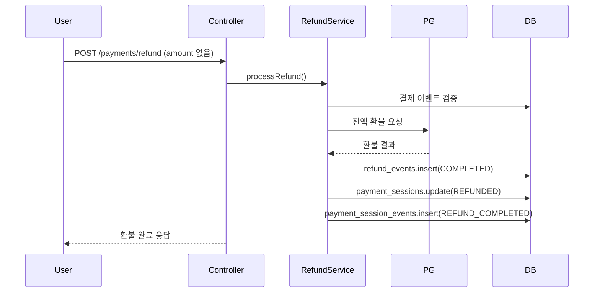
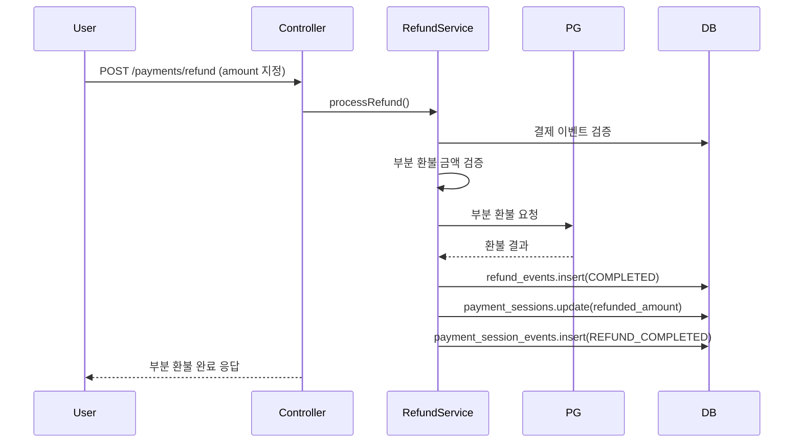

# 환불 API 설계 문서

## 📋 개요

Wallet MSA의 환불 시스템은 **세션 기반 구조**를 따르며, 결제 이벤트를 대상으로 전액/부분 환불을 지원합니다.

## 🎯 핵심 원칙

### 1. 세션 기반 환불

- 모든 환불은 원본 결제의 `sessionId`와 연결됩니다
- 환불 완료 시 `payment_sessions.status`를 `REFUNDED`로 업데이트
- `payment_session_events`에 `REFUND_COMPLETED` 이벤트 로그 저장

### 2. 단순한 환불 플로우

- 복잡한 상태 관리 제거
- 환불 요청 → PG사 환불 실행 → 결과 저장
- 실패 시 재시도는 외부 시스템에서 처리

## 🔧 API 설계

### 환불 요청 API

```http
POST /payments/refund
Content-Type: application/json

{
  "paymentEventId": "01K4HPR5HAKFQ576BP06H4Y027",
  "amount": 25000,  // 선택사항: 부분 환불 금액
  "reason": "고객 요청",
  "refundAccountId": "01K4HPR5HAKFQ576BP06H4Y029"  // 선택사항
}
```

### 환불 응답

```json
{
  "success": true,
  "refundEventId": "re_01K4HPR8YXYG7N2XBHQV4T7W1Z",
  "sessionId": "01K4HPR5HAKFQ576BP06H4Y028",
  "refundedAmount": 25000,
  "status": "COMPLETED",
  "processedAt": "2025-09-07T10:15:30.000Z"
}
```

## 🏗️ 데이터베이스 설계

### refund_events 테이블

```sql
CREATE TABLE refund_events (
  id VARCHAR(26) PRIMARY KEY,
  payment_event_id VARCHAR(26) NOT NULL REFERENCES payment_events(id),
  refund_account_id VARCHAR(26) REFERENCES user_refund_accounts(id), -- nullable
  amount NUMERIC(19,4) NOT NULL,
  status VARCHAR(255) NOT NULL, -- REQUESTED, APPROVED, COMPLETED, CANCELLED, FAILED
  reason TEXT,
  completed_by VARCHAR(64),
  completed_at TIMESTAMP WITH TIME ZONE,
  rejection_reason TEXT,
  created_at TIMESTAMP WITH TIME ZONE DEFAULT NOW(),
  metadata TEXT -- JSON 형태로 PG 응답 등 저장
);
```

### 환불 상태 정의

- **REQUESTED**: 외부에서 환불 요청 접수됨
- **APPROVED**: 외부에서 승인되어 실행 대기중
- **COMPLETED**: 실제 환급 완료
- **CANCELLED**: 환불 취소됨
- **FAILED**: 환급 실행 실패

## 🔄 환불 플로우

### 1. 전액 환불



### 2. 부분 환불



## 💻 구현 세부사항

### RefundService.processRefund()

```typescript
async processRefund(request: {
  paymentEventId: string;
  amount?: number; // 부분 환불 지원, 없으면 전액
  reason?: string;
  refundAccountId?: string;
  actor: 'USER' | 'ADMIN' | 'SYSTEM';
}): Promise<{
  refundEventId: string;
  sessionId: string;
  amount: number;
  status: 'COMPLETED' | 'FAILED';
  createdAt: Date;
}> {
  return await this.db.transaction(async (tx) => {
    // 1. 결제 이벤트 검증 (세션 ID 포함)
    const paymentEvent = await this.validatePaymentEvent(tx, request.paymentEventId);

    // 2. 환불 금액 결정
    const refundAmount = request.amount || Number(paymentEvent.amount);

    // 3. PG사 환불 실행
    const refundResult = await this.callRefundAdapter(paymentEvent.methodType, {
      pgTransactionId: paymentEvent.pgTransactionId,
      amount: refundAmount,
      reason: request.reason || '고객 요청',
    });

    // 4. RefundEvents 저장
    const refundEventId = ulid();
    await tx.insert(schema.refundEvents).values({
      id: refundEventId,
      paymentEventId: request.paymentEventId,
      refundAccountId: request.refundAccountId || null,
      amount: refundAmount,
      status: refundResult.success ? 'COMPLETED' : 'FAILED',
      reason: request.reason || '고객 요청',
      completedBy: request.actor,
      completedAt: refundResult.success ? new Date() : null,
      rejectionReason: refundResult.error || null,
      metadata: JSON.stringify({
        pgTransactionId: refundResult.pgTransactionId,
        gateway: this.getGatewayName(paymentEvent.methodType),
        processedAt: new Date().toISOString(),
      }),
    });

    // 5. PaymentSessions 상태 업데이트
    if (refundResult.success) {
      await tx.update(schema.paymentSessions)
        .set({
          status: 'REFUNDED',
          refundedAmount: refundAmount,
          updatedAt: new Date(),
        })
        .where(eq(schema.paymentSessions.id, paymentEvent.sessionId));

      // 6. PaymentSessionEvents 로그
      await tx.insert(schema.paymentSessionEvents).values({
        paymentSessionId: paymentEvent.sessionId,
        eventType: 'REFUND_COMPLETED',
        eventData: JSON.stringify({
          refundEventId: refundEventId,
          refundAmount: refundAmount,
          reason: request.reason || '고객 요청',
        }),
      });
    }

    return {
      refundEventId,
      sessionId: paymentEvent.sessionId,
      amount: refundAmount,
      status: refundResult.success ? 'COMPLETED' : 'FAILED',
      createdAt: new Date(),
    };
  });
}
```

### 결제 이벤트 검증

```typescript
private async validatePaymentEvent(tx: any, paymentEventId: string) {
  const result = await tx
    .select({
      id: schema.paymentEvents.id,
      sessionId: schema.paymentEvents.sessionId,
      amount: schema.paymentEvents.amount,
      status: schema.paymentEvents.status,
      eventContext: schema.paymentEvents.eventContext,
      methodType: schema.paymentMethod.methodType,
    })
    .from(schema.paymentEvents)
    .innerJoin(
      schema.paymentMethod,
      eq(schema.paymentEvents.methodId, schema.paymentMethod.id),
    )
    .where(eq(schema.paymentEvents.id, paymentEventId))
    .limit(1);

  if (result.length === 0) {
    throw new Error(`결제 이벤트를 찾을 수 없습니다: ${paymentEventId}`);
  }

  const paymentEvent = result[0];

  if (paymentEvent.status !== 'CAPTURED') {
    throw new Error(`환불 가능한 상태가 아닙니다: ${paymentEvent.status}`);
  }

  // 세션 ID 필수 검증
  if (!paymentEvent.sessionId) {
    throw new Error(`결제 세션 정보가 없습니다: ${paymentEventId}`);
  }

  return {
    ...paymentEvent,
    pgTransactionId: this.extractPgTransactionId(paymentEvent.eventContext),
  };
}
```

## 🔍 환불 어댑터 패턴

### 결제수단별 환불 처리

```typescript
private async callRefundAdapter(
  methodType: string,
  request: {
    pgTransactionId: string;
    amount: number;
    reason: string;
  },
): Promise<{
  success: boolean;
  pgTransactionId?: string;
  error?: string;
}> {
  switch (methodType) {
    case 'CARD':
      // HMS 카드 환불 API 호출
      return await this.hmsCardAdapter.refund(request);

    case 'BNPL':
      // HMS BNPL 환불 API 호출
      return await this.hmsBnplAdapter.refund(request);

    case 'REWARD_POINT':
      // 내부 포인트 환불 처리
      return await this.pointAdapter.refund(request);

    default:
      return {
        success: false,
        error: `지원하지 않는 결제수단 타입: ${methodType}`,
      };
  }
}
```

## ✅ 검증 및 테스트

### 1. 환불 가능 조건 검증

- 결제 상태가 `CAPTURED`인 경우만 환불 가능
- 이미 환불된 결제는 중복 환불 불가
- 부분 환불 시 잔여 금액 검증

### 2. 세션 상태 일관성

- 환불 완료 시 `payment_sessions.status`가 `REFUNDED`로 변경
- `payment_session_events`에 `REFUND_COMPLETED` 이벤트 기록
- `refund_events`와 세션 정보 일치

### 3. 테스트 시나리오

```typescript
describe('RefundService', () => {
  it('전액 환불 성공', async () => {
    // Given: CAPTURED 상태의 결제 이벤트
    // When: 전액 환불 요청
    // Then: 환불 완료 + 세션 상태 REFUNDED
  });

  it('부분 환불 성공', async () => {
    // Given: 50,000원 결제 완료
    // When: 25,000원 부분 환불 요청
    // Then: 25,000원 환불 완료 + refunded_amount 업데이트
  });

  it('환불 불가 상태 검증', async () => {
    // Given: FAILED 상태의 결제 이벤트
    // When: 환불 요청
    // Then: "환불 가능한 상태가 아닙니다" 에러
  });

  it('세션 없는 결제 환불 실패', async () => {
    // Given: sessionId가 null인 결제 이벤트
    // When: 환불 요청
    // Then: "결제 세션 정보가 없습니다" 에러
  });
});
```

## 📊 모니터링

### 1. 환불 현황 조회

```sql
-- 일별 환불 현황
SELECT
  DATE(created_at) as refund_date,
  status,
  COUNT(*) as count,
  SUM(amount) as total_amount
FROM refund_events
WHERE created_at >= CURRENT_DATE - INTERVAL '7 days'
GROUP BY DATE(created_at), status
ORDER BY refund_date DESC;

-- 환불 성공률
SELECT
  status,
  COUNT(*) as count,
  ROUND(COUNT(*) * 100.0 / SUM(COUNT(*)) OVER(), 2) as percentage
FROM refund_events
WHERE created_at >= CURRENT_DATE - INTERVAL '30 days'
GROUP BY status;
```

### 2. 세션 상태 일관성 검증

```sql
-- 환불된 세션의 상태 검증
SELECT
  ps.id as session_id,
  ps.status as session_status,
  re.status as refund_status,
  re.amount as refund_amount
FROM payment_sessions ps
JOIN payment_events pe ON ps.id = pe.session_id
JOIN refund_events re ON pe.id = re.payment_event_id
WHERE re.status = 'COMPLETED' AND ps.status != 'REFUNDED';
```

## 🚨 에러 처리

### 1. 비즈니스 로직 에러

- `"결제 이벤트를 찾을 수 없습니다"` → 404
- `"환불 가능한 상태가 아닙니다"` → 400
- `"결제 세션 정보가 없습니다"` → 400

### 2. PG사 에러

- 네트워크 오류 → 재시도 로직
- 환불 한도 초과 → 사용자에게 안내
- 이미 환불된 거래 → 중복 처리 방지

---

이 문서는 Wallet MSA의 환불 API 설계를 정의합니다. 모든 환불 처리는 이 가이드라인을 따라야 합니다.
