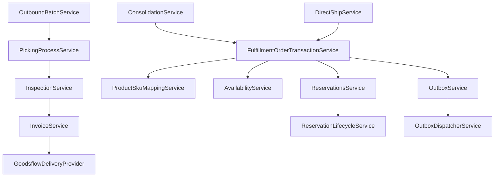

# WMS Order 서비스 가이드

## 개요
본 문서는 WMS Order 모듈의 핵심 서비스들의 역할, 기능, API를 상세히 설명합니다.

## 재고 및 가용성 관리 서비스

### AvailabilityService
가용재고 확인 및 계산을 담당하는 핵심 서비스

#### 주요 기능
- **실시간 가용재고 계산**: ON_HAND - RESERVED 수량
- **세트 상품 가용성 체크**: 구성 SKU별 제약사항 확인
- **다중 창고 가용성 조회**: 창고별 재고 현황 통합
- **미래 가용성 예측**: 입고예정/발주중 수량 반영

#### API 예시
```typescript
// 단일 SKU 가용성 확인
checkAvailability(skuId: string, warehouseId: string): Promise<AvailabilityResult>

// 세트 상품 가용성 체크 (병목 SKU 식별)
checkProductAvailability(productId: string, qty: number): Promise<ProductAvailabilityResult>

// 다중 SKU 일괄 확인
checkBulkAvailability(items: SkuQuantityRequest[]): Promise<BulkAvailabilityResult>
```

### ReservationsService
재고 예약의 생성, 해제, 이관을 관리

#### 주요 기능
- **예약 생성**: 출고주문별 재고 선점
- **예약 해제**: 주문 취소 시 재고 복원
- **예약 이관**: 합배송/분할 시 예약 재배치
- **예약 만료 관리**: 시간 초과된 예약 자동 해제

#### API 예시
```typescript
// 재고 예약 생성
createReservation(foId: string, items: ReservationItem[]): Promise<ReservationResult>

// 예약 해제
releaseReservation(reservationId: string): Promise<void>

// FO간 예약 이관 (합배송/분할용)
transferReservation(fromFoId: string, toFoId: string, items: TransferItem[]): Promise<void>

// 만료된 예약 정리
cleanupExpiredReservations(): Promise<number>
```

### ReservationLifecycleService
예약의 전체 생명주기를 관리하는 고수준 서비스

#### 주요 기능
- **예약 상태 전이**: PENDING → CONFIRMED → PICKED → CONSUMED
- **예약 이력 추적**: 생성/변경/해제 감사 로그
- **예약 정합성 검증**: 재고와 예약 데이터 일치성 확인

#### 예약 상태 흐름
```
PENDING (임시예약) → CONFIRMED (확정예약) → PICKED (피킹완료) → CONSUMED (출고완료)
                                           ↓
                                      RELEASED (해제됨)
```

## 주문 처리 서비스

### FulfillmentOrderTransactionService
복잡한 FO 관련 트랜잭션을 원자적으로 처리

#### 주요 기능
- **SO→FO 변환**: 판매상품을 재고상품으로 매핑하여 FO 생성
- **합배송 처리**: 여러 SO를 단일 FO로 통합
- **송장 분리**: 하나의 FO를 여러 FO로 분할
- **FO 취소**: 예약 해제 및 관련 데이터 정리

#### 트랜잭션 예시
```typescript
// SO에서 FO 생성 (매핑 + 예약까지 원자적 처리)
async createFulfillmentOrderFromSalesOrder(
  salesOrderId: string,
  options?: CreateFOOptions
): Promise<FulfillmentOrder>

// 합배송 처리
async consolidateOrders(
  sourceOrderIds: string[],
  targetAddress: ShippingAddress
): Promise<FulfillmentOrder>

// 송장 분리
async splitFulfillmentOrder(
  foId: string,
  splitRules: SplitRule[]
): Promise<FulfillmentOrder[]>
```

### ConsolidationService
합배송 로직 및 정책을 처리

#### 주요 기능
- **합배송 후보 검색**: 동일 주소/배송방식 주문 식별
- **합배송 가능성 검증**: 배송정책/SLA/용적 제약 확인
- **자동 합배송**: 설정된 규칙에 따른 자동 통합
- **수동 합배송**: 관리자 승인 기반 통합

#### 합배송 정책
- 동일 배송지 (주소 해시 기준)
- 동일 배송 서비스 (일반택배/직배)
- SLA 호환성 (빠른 배송 우선)
- 채널 정책 (동일 채널만 허용)

### DirectShipService
직배(외부 창고 출고) 전용 워크플로우

#### 주요 기능
- **직배 FO 필터링**: 일반 출고회차에서 제외
- **업체별 분류**: 홀더(소유업체)별 주문 그룹핑
- **리스트 내보내기**: 엑셀/CSV 형태로 외부 업체 전달
- **수동 완료 처리**: 외부 업체 처리 완료 시 상태 업데이트

#### 직배 프로세스
```
직배 FO 생성 → 업체별 분류 → 리스트 내보내기 → 외부 전달 → 수동 완료
```

## 작업 프로세스 서비스

### OutboundBatchService
출고회차 생성 및 관리

#### 주요 기능
- **출고회차 생성**: 선택된 FO들을 배치로 그룹핑
- **피킹 방식 결정**: 개별출고 vs 토탈피킹
- **작업자 할당**: 배치별 담당자 지정
- **동적 배치 관리**: 재고부족 등으로 FO 제외/추가

#### 배치 생성 기준
- 창고별 분리 (멀티 창고 지원)
- 우선순위 (긴급주문 우선)
- 용량 제한 (토탈피킹 시 카트 바구니 수)
- 직배 제외 (일반 출고회차에서 자동 필터링)

### PickingProcessService
피킹 작업의 상태 및 진행 관리

#### 주요 기능
- **개별출고 관리**: FO별 개별 피킹 진행상황 추적
- **토탈피킹 관리**: 배치 단위 피킹 순서 최적화
- **피킹 진행률 계산**: 실시간 작업 진척도 표시
- **피킹 완료 검증**: 모든 SKU 피킹 확인

#### 피킹 방식 비교
| 구분 | 개별출고 | 토탈피킹 |
|------|----------|----------|
| 적용 | 소량 주문 | 대량 배치 |
| 효율성 | 낮음 | 높음 |
| 복잡도 | 낮음 | 높음 |
| 오류율 | 높음 | 낮음 |

### InspectionService
검수 로직 및 바코드 검증

#### 주요 기능
- **바코드 스캔 처리**: 실시간 SKU 식별 및 수량 증가
- **검수 진행률 추적**: FO별 검수 완료율 계산
- **오류 검출**: 잘못된 SKU 스캔 감지
- **강제 완료**: 일부 누락된 상태에서 출고 승인

#### 검수 프로세스
```
바코드 스캔 → SKU 식별 → 수량 증가 → 진행률 업데이트 → 완료 확인 → 출고 승인
```

## 외부 연동 서비스

### InvoiceService
송장 발급 및 관리

#### 주요 기능
- **송장 발급**: 굿스플로 API 연동하여 송장번호 생성
- **라벨 출력**: 배치 단위 송장 라벨 출력 URI 생성
- **배송 추적**: 실시간 배송 상태 조회
- **송장 취소**: 오류 시 송장 무효화

#### 송장 발급 플로우
```
FO 출고작업 시작 → 굿스플로 API 호출 → 송장번호 수신 → DB 저장 → 라벨 출력 준비
```

### GoodsflowDeliveryProvider
굿스플로 택배사 API 연동 구현체

#### 주요 기능
- **송장 발급 API**: 수취인 정보로 송장번호 생성
- **라벨 출력 API**: 여러 송장의 통합 라벨 출력
- **배송 추적 API**: 송장번호로 배송 상태 조회
- **송장 취소 API**: 발급된 송장 무효화

#### API 연동 예시
```typescript
// 송장 발급
issueInvoice(request: InvoiceRequest): Promise<InvoiceResponse>

// 라벨 출력 URI 생성
generatePrintUri(serviceIds: string[]): Promise<{ printUri: string }>

// 배송 추적
trackDelivery(serviceId: string): Promise<DeliveryStatus>
```

## 이벤트 및 정책 서비스

### OutboxService
도메인 이벤트를 안전하게 발행

#### 주요 기능
- **이벤트 적재**: 트랜잭션 내에서 outbox 테이블에 이벤트 저장
- **메타데이터 관리**: 이벤트 타입, 발생시간, 컨텍스트 정보
- **중복 방지**: 멱등성 키 기반 중복 이벤트 방지

### OutboxDispatcherService
이벤트 비동기 디스패처

#### 주요 기능
- **배치 처리**: 대기 중인 이벤트를 배치로 처리
- **재시도 로직**: 실패한 이벤트 자동 재시도
- **Dead Letter Queue**: 반복 실패 이벤트 별도 관리

### PoliciesService
주문/출고 정책 관리

#### 주요 기능
- **재고 정책**: 재고관리 대상 여부, 예약 정책
- **배송 정책**: 배송 방식, SLA, 합배송 허용 여부
- **채널 정책**: 채널별 특수 규칙 적용

### ProductSkuMappingService
상품-SKU 매핑 스냅샷 관리

#### 주요 기능
- **매핑 스냅샷 생성**: 주문 시점의 매핑 규칙 고정
- **세트 상품 해체**: 판매상품을 구성 SKU로 분해
- **매핑 이력 관리**: 매핑 변경 이력 추적
- **일괄 적용**: 신규 매핑을 미출고 주문에 적용

## 서비스 간 의존성



이러한 서비스들이 유기적으로 연동되어 복잡한 전자상거래 출고 요구사항을 안정적이고 효율적으로 처리합니다.