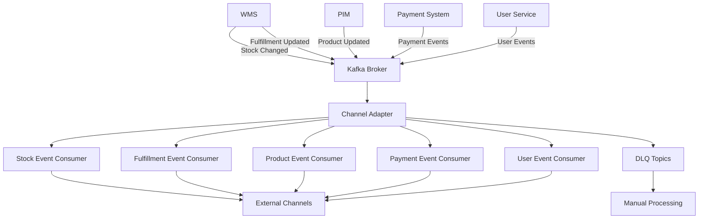

# 📡 Channel Adapter Kafka 이벤트 소비 명세서

## 📋 개요

Channel Adapter는 Kafka 이벤트 브로커를 통해 다양한 마이크로서비스로부터 이벤트를 수신하고 처리하는 중앙 허브 역할을 수행합니다. 이 문서는 어댑터가 소비할 수 있는 모든 Kafka 이벤트 유형의 상세 명세를 정의합니다.

### 🎯 핵심 원칙

- **이벤트 기반 아키텍처**: 느슨한 결합을 통한 마이크로서비스 간 통신
- **멱등성 보장**: `idempotencyKey`를 통한 중복 처리 방지
- **약한 일관성**: 부분 성공 허용, DLQ를 통한 실패 관리
- **SoT (Source of Truth) 원칙**: 데이터 소유권에 따른 이벤트 방향 결정

---

## 🔄 이벤트 소비 아키텍처



---

## 📥 소비 가능한 이벤트 유형

### 1. WMS 재고 변경 이벤트 (Stock Changed Event)

**토픽**: `wms.stock.changed`  
**Consumer**: `StockEventConsumer`  
**Handler**: `handleStockChanged()`

```typescript
interface StockChangedEvent {
  sku: string; // 상품 SKU 코드
  deltaQty: number; // 변경량 (+50, -10 등)
  reason: 'INBOUND' | 'OUTBOUND' | 'ADJUSTMENT' | 'DAMAGE'; // 변경 사유
  warehouseId?: string; // 창고 ID (선택사항)
  eventVersion: number; // 이벤트 버전 (timestamp)
  occurredAt: string; // 이벤트 발생 시각 (ISO 8601)
}
```

**처리 로직**:

1. 멱등키 체크 (`WMS:STOCK_CHANGED:${sku}:${eventVersion}`)
2. 현재 재고 수량 계산
3. 모든 활성 채널에 재고 동기화 (네이버, 쿠팡, 메두사)
4. 필수 채널 동기화 성공 시 멱등키 처리 완료

**재시도 정책**:

- 최대 재시도: 3회
- 백오프: [1000ms, 5000ms, 30000ms]
- DLQ 토픽: `channel-adapter.stock.dlq`

**예시 메시지**:

```json
{
  "sku": "PROD-12345",
  "deltaQty": -5,
  "reason": "OUTBOUND",
  "warehouseId": "WH-MAIN",
  "eventVersion": 1695462345000,
  "occurredAt": "2025-09-25T12:34:56Z"
}
```

---

### 2. WMS 이행 상태 업데이트 이벤트 (Fulfillment Updated Event)

**토픽**: `wms.fulfillment.updated`  
**Consumer**: `FulfillmentEventConsumer`  
**Handler**: `handleFulfillmentUpdated()`

```typescript
interface FulfillmentUpdatedEvent {
  orderId: string; // 내부 주문 ID
  fulfillmentNo: string; // 이행 번호
  status: 'PREPARING' | 'SHIPPED' | 'DELIVERED' | 'RETURNED'; // 이행 상태
  trackingNo?: string; // 송장 번호
  carrier?: string; // 택배사 코드
  shippedAt?: string; // 출고 시각
  deliveredAt?: string; // 배송 완료 시각
  eventVersion: number; // 이벤트 버전
  occurredAt: string; // 이벤트 발생 시각
}
```

**처리 로직**:

1. 멱등키 체크 (`WMS:FULFILLMENT_UPDATED:${orderId}:${eventVersion}`)
2. 이행 정보를 내부 표준 형식으로 변환
3. 상태별 특별 처리 로직 실행
4. 모든 활성 채널에 이행 상태 동기화
5. 필수 채널 동기화 성공 시 멱등키 처리 완료

**상태별 처리**:

- `PREPARING`: 출고 준비 중 상태로 채널 업데이트
- `SHIPPED`: 출고 완료, 송장번호와 함께 배송 시작 알림
- `DELIVERED`: 배송 완료 상태로 최종 업데이트
- `RETURNED`: 반품 처리 완료 상태로 업데이트

**재시도 정책**:

- 최대 재시도: 3회
- 백오프: [2000ms, 10000ms, 60000ms]
- DLQ 토픽: `channel-adapter.fulfillment.dlq`

**예시 메시지**:

```json
{
  "orderId": "ORDER-20250925-001",
  "fulfillmentNo": "F-001",
  "status": "SHIPPED",
  "trackingNo": "123456789012",
  "carrier": "CJ",
  "shippedAt": "2025-09-25T15:30:00Z",
  "eventVersion": 1695462345000,
  "occurredAt": "2025-09-25T15:30:05Z"
}
```

---

### 3. PIM 상품 정보 업데이트 이벤트 (Product Updated Event)

**토픽**: `pim.product.updated`  
**Consumer**: `ProductEventConsumer`  
**Handler**: `handleProductUpdated()`

```typescript
interface ProductUpdatedEvent {
  productId: string; // 상품 ID
  changes: {
    // 변경된 필드들
    name?: string; // 상품명 변경
    price?: number; // 가격 변경
    description?: string; // 설명 변경
    categoryId?: string; // 카테고리 변경
    status?: 'ACTIVE' | 'INACTIVE' | 'DISCONTINUED'; // 판매 상태 변경
    images?: string[]; // 이미지 URL 목록
    specifications?: Record<string, any>; // 상품 스펙 정보
  };
  eventVersion: number; // 이벤트 버전
  occurredAt: string; // 이벤트 발생 시각
}
```

**처리 로직**:

1. 멱등키 체크 (`PIM:PRODUCT_UPDATED:${productId}:${eventVersion}`)
2. 상품 정보 변경사항을 내부 표준 형식으로 변환
3. 모든 활성 채널에 상품 정보 동기화
4. 채널별 상품 매핑 정보 업데이트
5. 동기화 성공 시 멱등키 처리 완료

**재시도 정책**:

- 최대 재시도: 3회
- 백오프: [1500ms, 7500ms, 45000ms]
- DLQ 토픽: `channel-adapter.product.dlq`

**예시 메시지**:

```json
{
  "productId": "PROD-12345",
  "changes": {
    "name": "새로운 상품명",
    "price": 29900,
    "status": "ACTIVE"
  },
  "eventVersion": 1695462345000,
  "occurredAt": "2025-09-25T10:15:30Z"
}
```

---

### 4. 결제 시스템 이벤트 (Payment Events)

**토픽**: `wallet.payment.updated`  
**Consumer**: `PaymentEventConsumer`  
**Handler**: `handlePaymentUpdated()`

```typescript
interface PaymentUpdatedEvent {
  paymentId: string; // 결제 ID
  orderId: string; // 주문 ID
  status: 'PENDING' | 'COMPLETED' | 'FAILED' | 'CANCELLED' | 'REFUNDED'; // 결제 상태
  amount: number; // 결제 금액
  currency: string; // 통화 코드
  paymentMethod: 'CARD' | 'BANK_TRANSFER' | 'VIRTUAL_ACCOUNT' | 'MOBILE'; // 결제 수단
  transactionId?: string; // 거래 ID
  failureReason?: string; // 실패 사유
  eventVersion: number; // 이벤트 버전
  occurredAt: string; // 이벤트 발생 시각
}
```

**처리 로직**:

1. 멱등키 체크 (`WALLET:PAYMENT_UPDATED:${paymentId}:${eventVersion}`)
2. 결제 상태 변경에 따른 주문 상태 업데이트
3. 채널별 결제 상태 동기화
4. 환불/취소 시 재고 복원 처리
5. 동기화 성공 시 멱등키 처리 완료

**재시도 정책**:

- 최대 재시도: 5회 (결제는 더 중요)
- 백오프: [1000ms, 3000ms, 9000ms, 27000ms, 81000ms]
- DLQ 토픽: `channel-adapter.payment.dlq`

**예시 메시지**:

```json
{
  "paymentId": "PAY-20250925-001",
  "orderId": "ORDER-20250925-001",
  "status": "COMPLETED",
  "amount": 29900,
  "currency": "KRW",
  "paymentMethod": "CARD",
  "transactionId": "TXN-123456789",
  "eventVersion": 1695462345000,
  "occurredAt": "2025-09-25T11:45:20Z"
}
```

---

### 5. 사용자 서비스 이벤트 (User Events)

**토픽**: `user.profile.updated`  
**Consumer**: `UserEventConsumer`  
**Handler**: `handleUserProfileUpdated()`

```typescript
interface UserProfileUpdatedEvent {
  userId: string; // 사용자 ID
  changes: {
    // 변경된 필드들
    email?: string; // 이메일 변경
    phone?: string; // 전화번호 변경
    name?: string; // 이름 변경
    address?: {
      // 주소 변경
      postalCode: string;
      roadAddress: string;
      detailAddress: string;
    };
    preferences?: Record<string, any>; // 사용자 선호 설정
  };
  eventVersion: number; // 이벤트 버전
  occurredAt: string; // 이벤트 발생 시각
}
```

**처리 로직**:

1. 멱등키 체크 (`USER:PROFILE_UPDATED:${userId}:${eventVersion}`)
2. 사용자 정보 변경사항 분석
3. 관련 주문의 배송지 정보 업데이트 필요 시 처리
4. 채널별 고객 정보 동기화
5. 동기화 성공 시 멱등키 처리 완료

**재시도 정책**:

- 최대 재시도: 3회
- 백오프: [2000ms, 8000ms, 32000ms]
- DLQ 토픽: `channel-adapter.user.dlq`

---

### 6. 주문 취소/반품/교환 이벤트 (Claim Events)

**토픽**: `order.claim.created`, `order.claim.updated`  
**Consumer**: `ClaimEventConsumer`  
**Handler**: `handleClaimEvent()`

```typescript
interface ClaimEvent {
  claimId: string; // 클레임 ID
  orderId: string; // 주문 ID
  claimType: 'CANCEL' | 'RETURN' | 'EXCHANGE'; // 클레임 유형
  status: 'REQUESTED' | 'APPROVED' | 'REJECTED' | 'COMPLETED'; // 클레임 상태
  reason: string; // 클레임 사유
  items: Array<{
    // 클레임 대상 상품들
    orderItemId: string;
    productId: string;
    quantity: number;
    reason: string;
  }>;
  requestedBy: 'CUSTOMER' | 'ADMIN'; // 요청자
  eventVersion: number; // 이벤트 버전
  occurredAt: string; // 이벤트 발생 시각
}
```

**처리 로직**:

1. 멱등키 체크 (`ORDER:CLAIM_${eventType}:${claimId}:${eventVersion}`)
2. 클레임 유형별 처리 로직 실행
3. 채널별 클레임 상태 동기화
4. 재고 복원/차감 처리 (필요 시)
5. 동기화 성공 시 멱등키 처리 완료

**재시도 정책**:

- 최대 재시도: 3회
- 백오프: [2000ms, 10000ms, 50000ms]
- DLQ 토픽: `channel-adapter.claim.dlq`

---

````

### 멱등성 체크 플로우

```mermaid
graph TD
    A[이벤트 수신] --> B[멱등키 생성]
    B --> C{이미 처리됨?}
    C -->|Yes| D[처리 스킵]
    C -->|No| E[비즈니스 로직 실행]
    E --> F{처리 성공?}
    F -->|Yes| G[멱등키 처리 완료 마킹]
    F -->|No| H[멱등키 실패 마킹]
    H --> I[재시도 또는 DLQ]
    G --> J[완료]
    D --> J
````

### 처리 상태 관리

```typescript
// 처리 완료 마킹
await idempotencyService.markProcessed({
  idempotencyKey: "WMS:STOCK_CHANGED:PROD-123:1695462345000",
  source: 'WMS',
  eventType: 'STOCK_CHANGED',
  resourceId: 'PROD-123',
  eventVersion: '1695462345000'
});

// 처리 실패 마킹 (재시도 가능)
await idempotencyService.markFailed(
  idempotencyKey,
  errorMessage,
  isRetryable: true
);
```

---

## 📊 DLQ (Dead Letter Queue) 관리

### DLQ 토픽 구조

| 원본 토픽                 | DLQ 토픽                          | 설명                    |
| ------------------------- | --------------------------------- | ----------------------- |
| `wms.stock.changed`       | `channel-adapter.stock.dlq`       | 재고 이벤트 처리 실패   |
| `wms.fulfillment.updated` | `channel-adapter.fulfillment.dlq` | 이행 이벤트 처리 실패   |
| `pim.product.updated`     | `channel-adapter.product.dlq`     | 상품 이벤트 처리 실패   |
| `wallet.payment.updated`  | `channel-adapter.payment.dlq`     | 결제 이벤트 처리 실패   |
| `user.profile.updated`    | `channel-adapter.user.dlq`        | 사용자 이벤트 처리 실패 |
| `order.claim.*`           | `channel-adapter.claim.dlq`       | 클레임 이벤트 처리 실패 |

### DLQ 메시지 형식

```typescript
interface DLQMessage {
  originalTopic: string; // 원본 토픽명
  originalEvent: any; // 원본 이벤트 데이터
  lastError: {
    // 마지막 오류 정보
    message: string;
    stack: string;
    code?: string;
  };
  retryCount: number; // 재시도 횟수
  maxRetries: number; // 최대 재시도 횟수
  failedAt: string; // 실패 시각
  consumer: string; // 처리한 Consumer 이름
  idempotencyKey: string; // 멱등키
}
```

### DLQ 처리 전략

1. **자동 재시도**: 일정 시간 후 자동으로 재처리 시도
2. **수동 재처리**: 관리자가 특정 DLQ 메시지를 수동으로 재처리
3. **알림 발송**: DLQ 메시지 임계치 초과 시 관리자에게 알림
4. **자동 정리**: 일정 기간 경과 후 DLQ 메시지 자동 삭제

---

## 🔧 Consumer 설정 및 최적화

### Kafka Consumer 공통 설정

```typescript
@KafkaSubscribe({
  topic: 'wms.stock.changed',
  groupId: 'channel-adapter-stock',
  config: {
    'session.timeout.ms': 30000,
    'heartbeat.interval.ms': 3000,
    'max.poll.interval.ms': 300000,
    'auto.offset.reset': 'latest',
    'enable.auto.commit': false,
    'max.poll.records': 100
  }
})
```

### 병렬 처리 최적화

```typescript
@Injectable()
export class StockEventConsumer {
  private readonly concurrencyLimit = 5;
  private readonly semaphore = new Semaphore(this.concurrencyLimit);

  @KafkaSubscribe('wms.stock.changed')
  async handleStockChanged(event: StockChangedEvent): Promise<void> {
    await this.semaphore.acquire();
    try {
      await this.processStockEvent(event);
    } finally {
      this.semaphore.release();
    }
  }
}
```

---

## 📈 모니터링 및 알림

### 핵심 메트릭

1. **이벤트 처리량**
   - 초당 처리된 이벤트 수 (TPS)
   - Consumer별 처리량 분포
   - 피크 시간대 처리량 패턴

2. **처리 지연시간**
   - 이벤트 발생부터 처리 완료까지 소요 시간
   - Consumer별 평균 처리 시간
   - 95th, 99th percentile 지연시간

3. **성공률 및 오류율**
   - 전체 이벤트 처리 성공률
   - Consumer별 성공률
   - DLQ 메시지 발생률

4. **리소스 사용률**
   - CPU, 메모리 사용률
   - Kafka Consumer 래그
   - DB 연결 풀 사용률

### 알림 조건

- DLQ 메시지가 시간당 임계치(10건) 초과
- 특정 Consumer의 성공률이 95% 미만
- 이벤트 처리 지연시간이 30초 초과
- Consumer 래그가 1000건 초과
- 멱등키 충돌이 시간당 5회 이상 발생

---

## 🚀 확장성 및 성능 최적화

### 수평 확장 전략

1. **파티션 기반 확장**
   - 토픽별 파티션 수 증가
   - Consumer 인스턴스 수 증가
   - 키 기반 파티셔닝으로 순서 보장

2. **Consumer 그룹 분리**
   - 중요도별 Consumer 그룹 분리
   - 처리 속도별 Consumer 그룹 분리
   - 리소스 격리를 통한 안정성 확보

### 성능 최적화 기법

1. **배치 처리**
   - 관련 이벤트들을 묶어서 배치 처리
   - DB 트랜잭션 최적화
   - 네트워크 호출 최소화

2. **캐싱 전략**
   - 상품 정보 캐시
   - 채널별 설정 캐시
   - 멱등키 캐시

3. **비동기 처리**
   - 중요하지 않은 작업의 비동기 처리
   - 백그라운드 작업 큐 활용
   - 이벤트 발행의 비동기화

---

## 🔒 보안 및 데이터 보호

### 이벤트 데이터 암호화

```typescript
interface EncryptedEvent {
  eventId: string;
  encryptedPayload: string; // AES-256으로 암호화된 페이로드
  keyVersion: string; // 암호화 키 버전
  algorithm: 'AES-256-GCM'; // 암호화 알고리즘
}
```

### 접근 제어

- Kafka ACL을 통한 토픽별 접근 제어
- Consumer 그룹별 권한 분리
- 민감 정보 마스킹 처리

### 감사 로그

- 모든 이벤트 처리 이력 기록
- 개인정보 접근 로그 관리
- 데이터 변경 이력 추적

---

## 🧪 테스트 전략

### 단위 테스트

```typescript
describe('StockEventConsumer', () => {
  it('should process stock changed event correctly', async () => {
    const event: StockChangedEvent = {
      sku: 'TEST-SKU',
      deltaQty: -5,
      reason: 'OUTBOUND',
      eventVersion: Date.now(),
      occurredAt: new Date().toISOString(),
    };

    await consumer.handleStockChanged(event);

    expect(mockChannelSync).toHaveBeenCalledWith(
      'inventory',
      expect.any(Object),
    );
  });
});
```

### 통합 테스트

```typescript
describe('Channel Adapter Integration', () => {
  it('should handle end-to-end event processing', async () => {
    // Kafka 메시지 발행
    await kafkaProducer.send({
      topic: 'wms.stock.changed',
      messages: [{ value: JSON.stringify(stockEvent) }],
    });

    // 처리 완료 대기
    await waitForProcessing(stockEvent.sku);

    // 외부 채널 동기화 확인
    expect(mockNaverApi.updateStock).toHaveBeenCalled();
    expect(mockCoupangApi.updateStock).toHaveBeenCalled();
  });
});
```

### 부하 테스트

- JMeter를 통한 대량 이벤트 처리 테스트
- Kafka 클러스터 부하 테스트
- Consumer 확장성 테스트

---

## 📚 운영 가이드

### 배포 전략

1. **블루-그린 배포**
   - Consumer 그룹을 이용한 무중단 배포
   - 새 버전 검증 후 트래픽 전환
   - 롤백 시나리오 준비

2. **카나리 배포**
   - 일부 파티션만 새 버전으로 처리
   - 점진적 트래픽 증가
   - 모니터링 기반 자동 롤백

### 장애 대응 절차

1. **Consumer 장애**
   - 다른 인스턴스로 자동 페일오버
   - DLQ 메시지 수동 재처리
   - 근본 원인 분석 및 수정

2. **Kafka 클러스터 장애**
   - 백업 클러스터로 전환
   - 메시지 손실 방지 확인
   - 데이터 일관성 검증

3. **외부 채널 API 장애**
   - 회로 차단기 패턴 적용
   - 재시도 로직 활성화
   - 수동 동기화 준비

---

## 📊 성능 벤치마크

### 처리량 목표

| 이벤트 유형          | 목표 TPS | 최대 지연시간 | 성공률 목표 |
| -------------------- | -------- | ------------- | ----------- |
| Stock Changed        | 1,000    | 5초           | 99.9%       |
| Fulfillment Updated  | 500      | 10초          | 99.5%       |
| Product Updated      | 100      | 30초          | 99.0%       |
| Payment Updated      | 2,000    | 3초           | 99.95%      |
| User Profile Updated | 50       | 60초          | 98.0%       |
| Claim Events         | 200      | 15초          | 99.0%       |

### 리소스 요구사항

- **CPU**: 4 core 이상 (Consumer 인스턴스당)
- **메모리**: 8GB 이상 (Consumer 인스턴스당)
- **네트워크**: 1Gbps 이상
- **디스크**: SSD 권장 (로그 및 캐시용)

---

## 🔄 버전 관리 및 호환성

### 이벤트 스키마 진화

```typescript
// v1.0 - 초기 버전
interface StockChangedEventV1 {
  sku: string;
  deltaQty: number;
  reason: string;
}

// v2.0 - 필드 추가 (하위 호환성 유지)
interface StockChangedEventV2 {
  sku: string;
  deltaQty: number;
  reason: string;
  warehouseId?: string; // 새로 추가된 선택적 필드
  eventVersion: number; // 새로 추가된 필드
}
```

### 호환성 보장 전략

1. **하위 호환성**: 새 필드는 선택적으로 추가
2. **스키마 레지스트리**: Confluent Schema Registry 사용
3. **점진적 마이그레이션**: 구 버전과 신 버전 동시 지원

---

## 📝 설정 예시

### application.yml

```yaml
kafka:
  bootstrap-servers: localhost:9092
  consumer:
    group-id: channel-adapter
    auto-offset-reset: latest
    enable-auto-commit: false
    max-poll-records: 100
    session-timeout-ms: 30000
    heartbeat-interval-ms: 3000

channel-adapter:
  required-channels: coupang,naver_smartstore
  retry:
    max-attempts: 3
    backoff-delay: 1000
  dlq:
    enabled: true
    threshold-per-hour: 10
    alert-enabled: true

monitoring:
  metrics:
    enabled: true
    export-interval: 30s
  alerts:
    slack-webhook: ${SLACK_WEBHOOK_URL}
    email-recipients: ${ALERT_EMAIL_RECIPIENTS}
```

### Docker Compose

```yaml
version: '3.8'
services:
  channel-adapter:
    image: channel-adapter:latest
    environment:
      - KAFKA_BROKERS=kafka:9092
      - DB_HOST=postgres
      - REDIS_HOST=redis
    depends_on:
      - kafka
      - postgres
      - redis
    deploy:
      replicas: 3
      resources:
        limits:
          cpus: '2'
          memory: 4G
```

---

## 🎯 로드맵

### Phase 1 (완료)

- ✅ 기본 이벤트 Consumer 구현
- ✅ 멱등성 관리 시스템
- ✅ DLQ 처리 메커니즘
- ✅ 재시도 정책 구현

### Phase 2 (진행 중)

- 🔄 성능 최적화 및 모니터링 강화
- 🔄 새로운 이벤트 유형 추가 지원
- 🔄 보안 강화 (암호화, 접근 제어)

### Phase 3 (계획)

- 📋 AI 기반 이상 탐지
- 📋 자동 스케일링
- 📋 멀티 리전 지원
- 📋 실시간 대시보드

---

**최종 업데이트**: 2025-09-25  
**버전**: 2.0.0  
**작성자**: Channel Adapter Team  
**검토자**: Architecture Team
