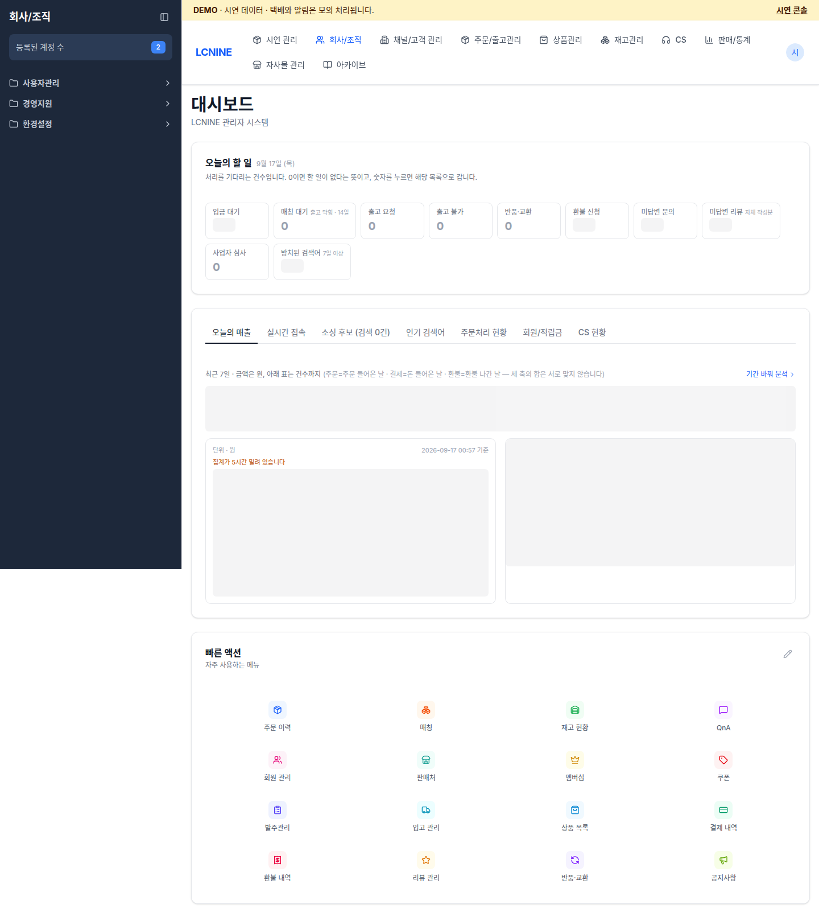

# Demo 직원 업무 매뉴얼

이 문서는 demo 환경에서 발주, 입고, 적치, 주문, 출고의 작업 흐름을 확인할 때 사용합니다. 실제 운영 환경에서는 사용하지 않습니다.

- 관리자 화면: <https://admin.almondyoung-next.com>
- 관리자 계정 ID: `demoadmin`
- 창고 작업자 계정 ID: `demoworker`
- 로그인에 필요한 추가 정보와 Windows 설치 파일은 개발팀에서 별도로 받습니다.
- 로그인 뒤 주소 상단에 `DEMO · 시연 데이터 · 택배와 알림은 모의 처리됩니다.`가 표시되는지 확인합니다.

## 역할별 문서

- [보충 제안과 발주](retail.md)
- [창고 앱 입고·적치·출고](warehouse.md)
- [개발팀: 시연 콘솔 운영](operator.md)
- [예시 작업 흐름](workshop.md)

## 공통 작업 원칙

1. 작업을 시작하기 전에 환경, 계정, 대상 SKU, 시작 수량을 기록합니다.
2. 발주번호, 입고번호, 주문번호, shipment ID, 운송장번호가 화면에 표시되면 전체 값을 복사합니다. 번호가 표시되지 않는 화면에서는 입고 시각, SKU, 수량, 위치처럼 실제로 보이는 값을 기록합니다.
3. 처리 중이거나 결과가 불명확하면 새 작업을 만들지 말고 같은 요청의 재확인 기능을 사용합니다.
4. 발주서 생성, 발주 라인 실행, 입고 확정, 적치 완료, 출고 완료는 서로 다른 단계입니다. 앞 단계가 끝났다고 다음 단계가 끝난 것으로 기록하지 않습니다.
5. 기존 주문, 발주, 재고를 삭제하거나 전체 데이터를 초기화하지 않습니다. 반복 작업에는 새 보충 작업을 사용합니다.

## Demo 데이터에서 알아둘 점

- 상품명, SKU, 바코드, 공개 상품 이미지는 기준 시점의 상품 정보를 demo로 복사한 것입니다.
- 가져온 원본 SKU에는 공급처 구매 관계가 없었습니다. demo에서는 발주 흐름을 확인할 수 있도록 이 SKU들에 `데모 국내 공급사` 관계를 보완했습니다. 화면의 demo 공급처와 단가는 실제 구매처나 계약 조건이 아닙니다.
- demo의 재고, 수요 이력, 발주, 주문, 고객, 배송 이력은 시연용 데이터입니다. 실제 운영 주문과 재고를 복사한 것이 아닙니다.
- 일부 원본 SKU에는 바코드가 없습니다. 바코드가 없는 품목은 SKU 코드로 검색하고, 스캔 동작을 확인할 때는 바코드가 표시되는 다른 품목을 선택합니다.
- 택배 접수, 판매채널 반영, 고객 알림은 모의 처리됩니다. 실제 택배사나 고객에게 전송되지 않습니다.
- Windows 설치 파일은 준비되어 있지만 지정 PC, 스캐너, 프린터의 실물 설정은 현장에서 확인해야 합니다. 확인하지 않은 드라이버나 용지 규격을 임의로 고정하지 않습니다.

## 문제가 생겼을 때 남길 내용

- 발생 시각과 화면 주소
- 사용 계정 ID와 선택한 창고
- 상품명, SKU, 바코드
- 화면에 표시된 발주번호, 입고번호, 주문번호, shipment ID, 운송장번호. 번호가 없으면 작업 시각, SKU, 수량, 위치
- 시작 수량, 입력 수량, 처리 수량, 남은 수량
- 마지막으로 누른 버튼과 화면에 표시된 오류 문구
- 같은 요청 재확인 또는 새로고침 뒤의 결과
