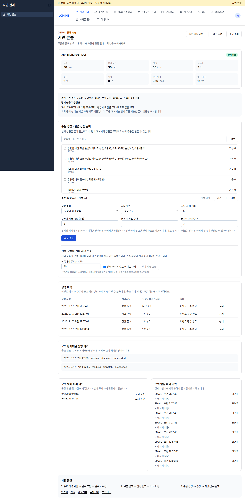

# 개발팀: 시연 콘솔 운영

[문서 목록](README.md) · [발주 안내](retail.md) · [창고 앱 안내](warehouse.md) · [예시 작업 흐름](workshop.md)

## 접속과 권한

- 주소: <https://admin.almondyoung-next.com/demo>
- 계정 ID: `demoadmin`
- `demoworker`는 창고 작업자 계정이므로 시연 콘솔과 관리자용 demo 기능에 접근할 수 없습니다.

## 1. 시작 전 준비 상태 확인

1. 화면 상단의 `시연 데이터 준비 상태`를 확인합니다.
2. 상태가 `준비 완료`인지 확인합니다.
3. `상품`, `판매 옵션`, `SKU`, `공급사`, `창고`, `위치`, `수요 이력`, `납기 이력`의 실제 수가 기대 수 이상인지 확인합니다.
4. `전체 상품 기준정보`에서 다음 항목을 확인합니다.
   - 운영 상품 복사 수와 원본 수
   - 누락 수
   - 전체 SKU와 비삭제 SKU
   - 공급처 미연결 수
   - 바코드 없음 수
5. `준비 필요`가 표시되면 주문을 만들지 않습니다. 환경 관리자에게 기준 데이터 준비를 요청합니다.

상단 준비 상태는 고정 시연 세트 기준입니다. `전체 상품 기준정보`는 가져온 전체 상품 범위를 보여줍니다. 두 수치를 같은 의미로 해석하지 않습니다.

## 2. 작업할 상품 찾기

1. 시연 콘솔의 상품 검색 입력칸에 상품명, SKU 또는 바코드를 입력합니다.
2. `검색`을 누릅니다.
3. 검색 결과에서 상품명, SKU, `가용 N`을 확인합니다.
4. 사용할 상품 왼쪽 체크박스를 선택합니다. 최대 50개까지 선택할 수 있습니다.
5. 검색 결과가 여러 페이지면 `이전`, `다음`을 사용합니다.
6. 다시 고르려면 `선택 해제`를 누릅니다.

세트 상품은 주문 화면에는 한 상품으로 보이지만 재고는 구성 SKU 수량만큼 사용합니다. 부족 여부와 보충량은 구성 수량을 포함해 확인합니다.

## 3. 선택 상품의 재고와 수요 이력 준비

이 기능은 선택 상품을 국내 demo 창고에 새로 입고하고 적치합니다. 기존 재고와 진행 중인 작업을 지우지 않습니다.

1. 준비할 상품을 체크합니다.
2. `상품마다 준비할 수량`을 입력합니다. 1 이상 1,000 이하의 정수만 사용할 수 있습니다.
3. 보충 제안도 확인할 경우 `발주 추천용 수요 이력도 준비`를 선택합니다.
4. `선택 상품 보충`을 누릅니다.
5. 결과가 확정되지 않았다는 안내가 나오면 새 보충을 시작하지 말고 `보충 요청 재확인`을 누릅니다. 같은 요청은 재고를 두 번 더하지 않습니다.
6. 보충 완료 결과에서 창고, 위치, 입고번호, SKU별 증가 수량을 기록합니다.

발주 추천을 확인할 때는 재고가 없는 상품을 선택하고 준비 수량을 1로 시작합니다. 이미 재고가 충분해 제안이 나타나지 않으면 재고를 초기화하지 않습니다. 다른 상품을 선택하거나 해당 상품을 출고한 뒤 다시 확인합니다.

입고와 적치 자체를 실증하려는 경우에는 이 보충 버튼을 쓰지 않습니다. [발주 안내](retail.md)와 [창고 앱 안내](warehouse.md)의 발주·입고 절차를 사용합니다.

## 4. 주문 생성

### 무작위 여러 상품

1. `생성 방식`에서 `무작위 여러 상품`을 선택합니다.
2. 특정 상품 범위에서만 추첨하려면 먼저 상품을 체크합니다. 아무것도 선택하지 않으면 전체 주문 후보를 사용합니다.
3. `시나리오`에서 `정상 출고` 또는 `재고 부족 → 보충 후 출고`를 선택합니다.
4. `주문 수 (1–50)`를 입력합니다.
5. `주문당 상품 종류 (1–5)`를 입력합니다.
6. `품목당 최소 수량`과 `품목당 최대 수량`을 각각 1~100 범위에서 입력합니다. 최소 수량은 최대 수량보다 클 수 없습니다.
7. 선택한 상품 범위가 있다면 서로 다른 선택 상품 수가 `주문당 상품 종류` 이상인지 확인합니다.
8. `주문 생성`을 한 번 누릅니다.

예시 입력값은 주문 수 5, 주문당 상품 종류 2, 품목당 최소 1, 최대 3입니다. 현장 시연 시간이 짧으면 주문 수를 1로 줄일 수 있습니다.

### 선택한 상품

1. 검색 결과에서 사용할 상품을 체크합니다.
2. `생성 방식`에서 `선택한 상품`을 선택합니다.
3. `주문당 상품 종류`만큼 서로 다른 상품을 선택했는지 확인합니다.
4. 시나리오와 수량 범위를 입력하고 `주문 생성`을 누릅니다.

## 5. 주문 생성 결과 확인

1. `생성 이력`의 최신 행에서 `요청 / 접수 / 실패` 수와 상태를 확인합니다.
2. 이벤트가 접수됐더라도 주문과 출고 준비 반영에는 시간이 걸릴 수 있습니다.
3. 최신 행의 `상세`를 누릅니다.
4. `생성 결과`에서 각 외부 주문번호, 상태, 상품명, SKU, 수량을 확인합니다.
5. 외부 주문번호 링크를 눌러 `주문내역 목록`을 엽니다.
6. 해당 주문 행의 외부 주문번호와 상품을 확인합니다. 외부 주문번호, 생성 이력의 생성 시각, SKU, 수량을 기록합니다.

`확인할 주문 요청이 있습니다.`가 보이면 `같은 요청 재확인`을 누릅니다. 이 동작은 저장된 같은 상품과 수량을 확인하며 새 상품을 추첨하거나 주문을 중복 생성하지 않습니다.

`실패`가 1 이상이거나 상태가 일부 실패이면 `상세`를 열고 오류를 기록한 뒤 `실패 항목 재시도`를 사용합니다. 완료된 항목은 다시 만들지 않습니다.

## 6. 물류 앱에 보낼 출고 작업 준비

시연 콘솔에서 주문을 만든 것만으로는 물류 앱의 출고 작업 목록에 나타나지 않습니다. 관리자 화면에서 shipment 계획을 확정하고 운송장을 발급한 뒤 출고 배치에 추가해야 합니다.

### 출고주문과 shipment 확인

1. 메뉴 경로 `주문/출고관리` → `출고` → `출고주문`으로 이동합니다.
2. 주문 생성 시각과 창고가 맞는 최근 행을 누릅니다.
3. `출고주문 상세`의 생성일, 창고와 `출고 라인`의 SKU·요청 수량을 앞에서 기록한 값과 대조합니다. 다르면 목록으로 돌아가 다음 행을 확인합니다.
4. 후보가 하나로 확인되면 출고주문의 전체 `주문번호`를 FO ID로 기록하고 `배송` 탭을 누릅니다.
5. shipment ID, 상태, 전체 수량, 예약 수량, 창고, `manifest v`, `reservation v`를 기록합니다.
6. 각 라인의 예약 수량이 주문 수량과 같은지 확인합니다.
7. shipment 상태가 `draft`이면 `계획 확정`을 누릅니다.
8. `shipment 계획 확정` 창의 `shipping profile UUID`가 채워져 있는지 확인하고 `서버에 요청`을 누릅니다. UUID가 비어 있으면 임의로 입력하지 말고 환경 관리자에게 알립니다.
9. 완료 안내 뒤 shipment 상태가 `planned`로 바뀌었는지 확인하고 화면에 다시 표시된 현재 `manifest v`와 `reservation v`를 기록합니다. 계획 확정만으로 두 버전이 반드시 바뀌는 것은 아닙니다. 상태가 `planned`였으면 7~9단계는 생략합니다.

같은 시각에 동일한 SKU·수량의 후보가 여러 개이거나 외부 주문과 FO의 연결이 확실하지 않으면 추측해서 계획을 확정하지 않습니다. 외부 주문번호와 후보 FO 정보를 환경 관리자에게 전달해 대상을 확인받습니다.

shipment가 아직 없거나 예약 수량이 부족하면 계획을 확정하거나 운송장을 발급하지 않습니다. 정상 출고 주문은 잠시 뒤 다시 확인합니다. 부족 시나리오는 새 주문을 만들지 말고 선택 상품을 보충한 뒤 같은 주문을 다시 확인합니다. 계획 확정 결과가 `pending` 등으로 남으면 `동일 키로 안전 재시도`를 사용합니다. 계속 준비되지 않으면 화면의 주문번호와 상태를 환경 관리자에게 전달합니다. 직원이 API를 호출하거나 `출고주문 생성 (수동)`으로 중복 출고주문을 만들지 않습니다.

### 운송장 발급

1. 메뉴 경로 `주문/출고관리` → `출고` → `운송장 발급`으로 이동합니다.
2. `주문처리(FO)`에서 기록한 출고주문을 선택합니다.
3. 목록에서 기록한 shipment ID와 수량을 확인한 뒤 왼쪽 체크박스를 선택합니다.
4. `택배사`는 지원되는 `HANJIN`을 선택합니다.
5. `선택 1건 일괄발급`을 한 번 누릅니다.
6. `발급 결과`에서 결과와 운송장번호를 기록합니다. 완료 수가 1인지 확인합니다.

`planned 상태 shipment 가 없습니다.`가 보이면 출고주문 상세로 돌아가 shipment 상태와 예약 수량을 확인합니다. 발급 결과가 `진행중` 또는 `실패`이면 같은 shipment에 새 운송장을 수동 등록하지 말고 결과와 사유를 기록한 뒤 상태를 다시 확인합니다.

### 출고 배치 만들기와 shipment 추가

1. 메뉴 경로 `주문/출고관리` → `출고` → `출고 배치`로 이동합니다.
2. `배치 생성`을 누릅니다.
3. `V2 출고 배치 생성`에서 shipment와 같은 `창고`를 선택합니다.
4. 위치별 출고 예시는 `피킹 방식`에서 `개별 피킹`을 선택합니다. 다른 방식은 개발팀이 별도로 지정한 경우에만 사용합니다. `멀티오더 피킹 (바구니 카트)`을 지정받았다면 `카트 바구니 수`에 이 배치에 넣을 운송장 수 이상의 정수를 입력합니다.
5. 필요하면 `배치명`과 `피킹 예정 시각`을 입력하고 `생성`을 누릅니다.
6. 목록에서 방금 만든 배치를 누릅니다.
7. `Eligible shipment`에서 shipment ID, 운송장번호, 수량을 대조하고 `추가`를 누릅니다.
8. `Work item queue`에 같은 shipment와 작업 ID가 표시되는지 확인합니다.
9. 입출고 담당자에게 배치 ID, 작업 ID, shipment ID, 운송장번호, 창고, SKU와 수량을 전달합니다.

`Eligible shipment`에 대상이 없으면 운송장 발급 여부, shipment 상태, 배치 창고가 모두 맞는지 확인합니다. `서버 확인 중…` 뒤 결과가 불명확하고 버튼이 `원래 명령 재시도`로 바뀌면 새 배치를 만들지 말고 그 버튼으로 같은 명령을 재확인합니다. 위치별 출고 예시에서는 관리자 화면의 `계획 생성`, `Picker claim`, `Packer claim`을 누르지 않습니다. 물류 앱에서 `출고 준비`를 누르면 이 작업에 필요한 준비와 작업자 할당이 진행됩니다.

물류 앱에서는 운송장 조회, `출고 준비`, 출발 위치 선택 뒤 `다음 스캔 수량`과 `출고 상품 바코드`를 입력합니다. 남은 수량이 모두 반영되면 검수와 출고가 자동으로 진행됩니다. 별도의 포장·검수·출고 완료 버튼을 누르는 절차가 아닙니다. 마지막 수량을 반영할 상품 바코드를 입력하기 전에 실물, 수량, 포장 상태를 확인하도록 작업자에게 알립니다.

## 7. 출고 뒤 모의 처리 이력 확인

출고 작업이 끝난 뒤 시연 콘솔 아래쪽에서 확인합니다.

- `모의 판매채널 반영 이력`: 출고 또는 취소 반영 작업의 상태
- `모의 택배 처리 이력`: 운송장번호와 `번호 발급`, `모의 접수`, `취소` 상태
- `모의 알림 처리 이력`: 알림 채널과 저장된 처리 상태

이 이력은 실제 외부 판매채널, 택배사, 고객에게 전송된 결과가 아닙니다.

## 오류 대처

- `주문 수·상품 종류·최소/최대 수량을 확인해 주세요.`: 각 입력이 허용 범위의 정수인지, 최소가 최대보다 작거나 같은지 확인합니다.
- `주문당 상품 종류만큼 서로 다른 상품을 선택해 주세요.`: 선택 상품을 더 추가하거나 주문당 상품 종류를 줄입니다.
- `보충할 상품을 선택해 주세요.`: 상품 체크 여부와 보충 수량을 확인합니다.
- 검색 결과가 없음: 상품명 대신 SKU나 바코드로 다시 검색합니다. 바코드가 없는 원본 SKU는 SKU 코드로 검색합니다.
- `준비 필요`: 주문과 보충을 중단하고 환경 관리자에게 알립니다.
- 네트워크 오류 또는 결과 미확정: 브라우저를 닫거나 새 요청을 만들기 전에 화면의 `같은 요청 재확인` 또는 `보충 요청 재확인`을 사용합니다.
- 주문은 보이지만 출고 준비가 없음: 주문 화면에서 재고 예약과 출고 준비 상태를 확인합니다. 부족 시나리오는 보충 뒤 같은 주문의 준비를 다시 확인합니다.

## 반복 작업 시 데이터 처리

- 기존 데이터를 유지하고 새 주문·보충 작업을 추가합니다.
- 기존 주문, 발주, 입고, 출고 기록은 이후 상태 확인에 사용합니다.
- 재고는 입고·적치·출고 작업을 통해 변경합니다.
- 결과가 불명확한 요청은 같은 요청의 재확인 기능으로 확인합니다.
- demo 공급처와 단가는 시연용 정보로 구분합니다.
