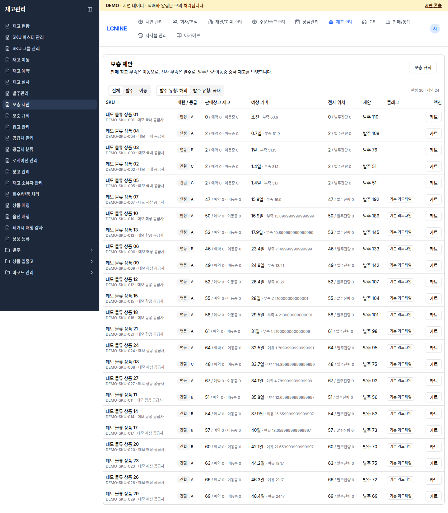
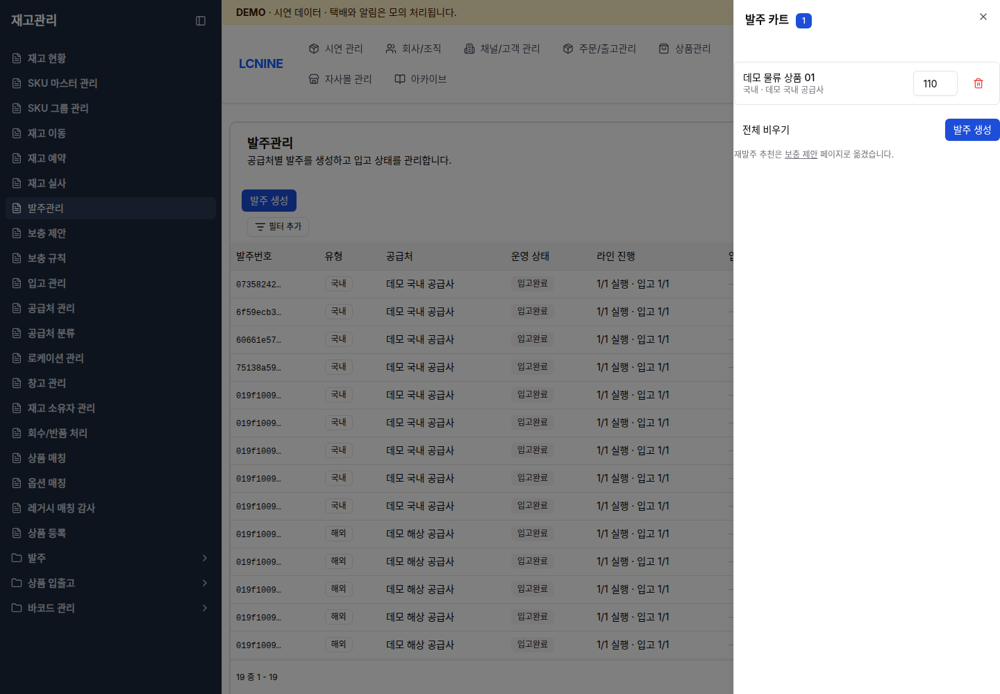
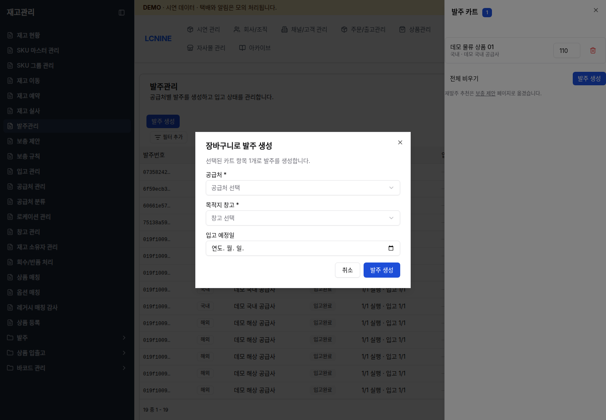
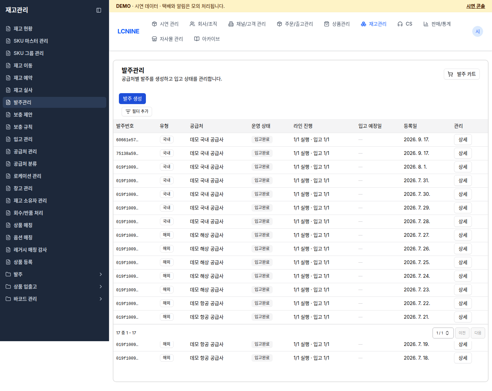
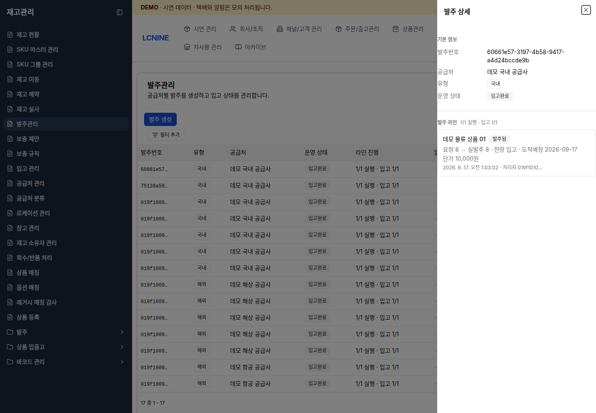

# 보충 제안과 발주

[문서 목록](README.md) · [창고 앱 안내](warehouse.md) · [개발팀](operator.md) · [예시 작업 흐름](workshop.md)

## 시작 조건

- 관리자 화면에 `demoadmin`으로 로그인합니다.
- 상단에 demo 안내 문구가 있는지 확인합니다.
- 개발팀에서 대상 상품명, SKU 코드, 발주 수량, 목적지 창고를 받습니다.
- 이번 발주는 기본적으로 `국내` 유형을 사용합니다.
- 화면의 `데모 국내 공급사`는 시연용 관계입니다. 실제 구매처나 실제 단가로 사용하지 않습니다.

## 1. 보충 제안 확인

메뉴 경로: `재고관리` → `보충 제안`

1. 상단 필터에서 `발주`를 선택합니다.
2. `발주 유형: 국내`를 선택합니다. 이 값은 카트에 담을 때 저장되며 카트에서는 바꿀 수 없습니다.
3. 대상 행의 상품명과 SKU 코드를 개발팀이 준 값과 비교합니다.
4. 다음 열을 읽습니다.
   - `판매창고 재고`: 보유 수량, 예약 수량, 이동 중 수량
   - `예상 커버`: 현재 재고로 예상되는 판매 가능 기간
   - `전사 위치`: 전사 기준 재고와 이미 발주한 잔량
   - `제안`: `발주 N` 또는 `이동 N`
   - `플래그`: `기본 리드타임`, `공급사 미정`, `신뢰도 낮음` 등
5. 행을 누르면 상세 화면이 열립니다. `전사 축 (발주 판정)`, `판매창고 축 (이동 판정)`, 수요 프로필, 리드타임을 확인합니다.
6. 화면의 제안 수량과 이번 작업에 필요한 수량을 비교합니다. 수량을 변경한 경우 변경값과 사유를 기록합니다.

정상 결과: 대상 SKU 행에 `발주 N`이 표시되고 오른쪽에 `카트` 버튼이 보입니다.

### 제안이 없을 때

- `제안이 없습니다.`가 보이면 상품의 재고와 수요 조건이 발주 기준을 충족하지 않은 것입니다.
- `공급사 미정`이 보이면 공급처를 확인한 뒤 진행합니다.
- 실제 상품으로 발주 제안을 확인하려면 개발팀이 시연 콘솔의 `발주 제안용 데이터 준비`를 사용할 수 있습니다. 무작위 또는 직접 선택한 새 상품에 시연용 수요를 만들고 발주 제안을 확인합니다. [콘솔 사용법](operator.md#발주-제안용-데이터-준비)을 참고합니다.
- 이미 재고가 충분하면 전체 초기화를 요청하지 않습니다. 다른 상품을 선택하거나 해당 상품을 출고한 뒤 다시 확인합니다.
- 제안을 불러오지 못하면서 판매 창고 관련 오류가 표시되면 창고 구성을 개발팀에 확인받습니다.

## 2. 발주 카트에 담기

1. 대상 SKU 행의 `카트`를 누릅니다.
2. `상품명 N개를 국내 발주 카트에 담았습니다.` 알림을 확인합니다.
3. 메뉴 경로 `재고관리` → `발주관리`로 이동합니다.
4. 오른쪽 위 `발주 카트`를 누릅니다.
5. 상품명, `국내`, 공급처, 수량을 확인합니다.

화면 예시는 별도 demo 상품입니다. 작업할 SKU와 수량은 현재 화면의 선택값을 기준으로 확인합니다.

6. 수량을 바꿀 때는 1 이상의 정수를 입력하고 입력이 저장될 때까지 기다립니다.
7. 필요 없는 항목은 휴지통 버튼으로 삭제합니다. `전체 비우기`는 현재 카트의 모든 항목을 삭제합니다. 카트를 비울 때는 유지할 항목이 없는지 확인합니다.
8. `발주 생성`을 누릅니다.
9. `장바구니로 발주 생성` 창에서 다음 값을 입력합니다.
   - `공급처 *`: 대상 행에 표시된 demo 공급처
   - `목적지 창고 *`: 개발팀이 지정한 국내 demo 창고
   - `입고 예정일`: 공급 일정이 정해진 경우에만 입력
10. 다시 `발주 생성`을 누릅니다.

정상 결과: `발주가 생성되었습니다.`가 표시되고 발주관리 목록에 새 행이 생깁니다.

## 3. 발주서 직접 생성이 필요한 경우

보충 제안에서 카트를 사용하는 것이 기본 절차입니다. 개발팀이 정확한 내부 SKU ID를 준 경우에만 직접 생성합니다.

1. `재고관리` → `발주관리`에서 `발주 생성`을 누릅니다.
2. `발주 유형`은 `국내`를 선택합니다.
3. `입고 예정일`, `공급처 *`, `목적지 창고 *`를 입력합니다.
4. `발주 라인 *`의 `SKU ID`에 화면용 SKU 코드가 아니라 개발팀이 준 내부 SKU ID를 입력합니다.
5. `수량`은 1 이상의 정수로 입력합니다. `단가`는 시연용 값이 정해져 있을 때만 입력합니다.
6. 여러 품목이면 `라인 추가`를 눌러 행을 더합니다.
7. `발주 생성`을 누릅니다.

`발주 라인을 1개 이상 입력해주세요.`, `공급처를 선택해주세요.`, `목적지 창고를 선택해주세요.`가 표시되면 해당 필드를 채운 뒤 다시 누릅니다.

## 4. 발주 목록에서 새 발주 찾기

1. `필터 추가`에서 `운영 상태: 생성됨`과 `발주 유형: 국내`를 선택합니다.
2. 방금 만든 행의 `발주번호`, `공급처`, `입고 예정일`, `등록일`을 확인합니다.
3. `라인 진행`이 `0/N 실행`인지 확인합니다. 발주서만 만든 상태이며 아직 발주 실행 기록이 없는 상태입니다.
4. `상세`를 누릅니다.

## 5. 품목별 발주 실행

발주서 생성만으로 품목 발주가 끝나지 않습니다. 각 `요청됨` 라인을 처리해야 합니다.

1. `발주 상세`의 전체 발주번호를 복사합니다.
2. 공급처, 유형, 운영 상태, 입고 예정일을 확인합니다.
3. 대상 라인의 상품명과 `요청 N`을 확인합니다.
4. `실행`을 누릅니다.
5. `발주 실행 기록` 창에서 다음 값을 확인하거나 입력합니다.
   - `실발주 수량`: 실제로 발주한 수량. 기본값은 요청 수량입니다.
   - `실제 단가 (선택)`: 0 이상의 정수. 비우면 기존 단가를 유지합니다.
   - `도착 예정일 (선택)`: 실제 예정일이 정해진 경우 입력합니다.

6. 값이 맞는지 다시 확인한 뒤 `실행 기록`을 누릅니다. 이 기록은 되돌릴 수 없습니다.
7. `발주 실행이 기록되었습니다.` 알림을 확인합니다.
8. 라인 상태가 `발주됨`으로 바뀌고 `요청 N → 실발주 N`이 표시되는지 확인합니다.
9. 여러 라인이면 모든 라인에 반복합니다.

정상 결과: 목록의 `라인 진행`이 `N/N 실행`으로 바뀝니다. 입출고 담당자가 입고할 수 있도록 전체 발주번호, 목적지 창고, SKU, 실발주 수량, 도착 예정일을 전달합니다.

## 6. 부분 입고와 완료 상태 확인

입출고 담당자가 입고를 확정하면 같은 발주 상세를 다시 엽니다.

- 일부만 받았으면 `받음 4 (남음 6)`처럼 표시됩니다.
- 전량을 받았으면 `전량 입고`가 표시됩니다.
- 모든 발주 라인의 입고가 끝나면 발주서 운영 상태가 `입고완료`로 바뀝니다.
- 입고 확정 뒤에도 입출고 담당자의 적치 작업은 남아 있을 수 있습니다. `입고완료`만 보고 재고가 보관 위치에 적치됐다고 판단하지 않습니다.

부분 입고 예시에서는 첫 입고 뒤 남은 수량을 입출고 담당자에게 다시 전달합니다. 두 번째 입고 뒤 `남음 0`과 적치 완료를 각각 확인합니다.

## 7. 예외 처리

### 도착 예정일 변경

`발주됨` 라인의 `예정일 수정`을 누르고 새 날짜를 입력한 뒤 `저장`을 누릅니다. 날짜를 제거하려면 `비우기`를 사용합니다.

### 발주하지 못한 품목

아직 `요청됨`인 라인에서 `불가`를 누릅니다. 사유는 500자 이내로 입력할 수 있습니다. `불가로 종결`은 되돌릴 수 없으며 다시 사려면 새 발주서를 만들어야 합니다.

### 일부 입고 뒤 남은 수량을 받지 않는 경우

라인의 `잔량 포기`를 누릅니다. 남은 수량을 확인하고 필수 사유를 입력한 뒤 다시 `잔량 포기`를 누릅니다. 이 작업은 되돌릴 수 없습니다.

### 발주 전체 취소

입고된 수량이 하나도 없을 때만 `발주 취소`를 사용할 수 있습니다. 필수 사유를 입력합니다. 이미 일부 입고됐다면 전체 취소 대신 각 라인의 `잔량 포기`를 사용합니다.

### 화면 오류 또는 결과 미확정

- 버튼이 `처리 중…`, `기록 중…`, `저장 중…`인 동안 다시 누르지 않습니다.
- 오류 문구를 그대로 기록하고 목록을 새로 불러와 상태를 확인합니다.
- 생성 여부가 불명확하면 발주번호, 등록일, 공급처로 기존 행을 먼저 찾습니다. 확인하지 않고 같은 발주를 새로 만들지 않습니다.
- 권한 오류가 나오면 `demoadmin`으로 로그인했는지 확인합니다.
