# 창고 앱 입고·적치·출고

[문서 목록](README.md) · [발주 안내](retail.md) · [개발팀](operator.md) · [예시 작업 흐름](workshop.md)

Windows PC, USB 바코드 스캐너, 프린터를 사용하는 작업자를 위한 문서입니다. 화면 예시는 demo 서버에 연결한 warehouse-app에서 실제 작업한 결과입니다. 캡처 환경은 Linux입니다. Windows의 홈 메뉴는 `입고`, 캡처의 홈 메뉴는 `입고/검수`로 표시됩니다. 아래 입고·적치·출고 업무 화면은 공통입니다.

## 1. 설치와 로그인

1. 개발팀에서 Windows용 demo 설치 파일과 작업자 로그인 정보를 받습니다.
2. 설치 파일을 실행하고 설치 창의 안내를 따릅니다. 설치 권한이나 보안 정책으로 실행되지 않으면 해당 메시지를 PC 담당자에게 전달합니다.
3. 앱을 실행합니다. 상단에 `Almond WMS · DEMO`가 있는지 확인합니다.
4. `Login`을 누릅니다. 브라우저가 열리면 `demoworker`와 전달받은 비밀번호로 로그인합니다.
5. 로그인이 완료되면 창고 앱으로 돌아옵니다. 작업 메뉴가 보이는지 확인합니다.
6. `waiting for browser callback…` 상태가 계속되면 브라우저의 로그인 완료 여부를 확인합니다. 실패 메시지가 표시되면 창을 반복해서 열지 말고 담당자에게 메시지를 전달합니다.

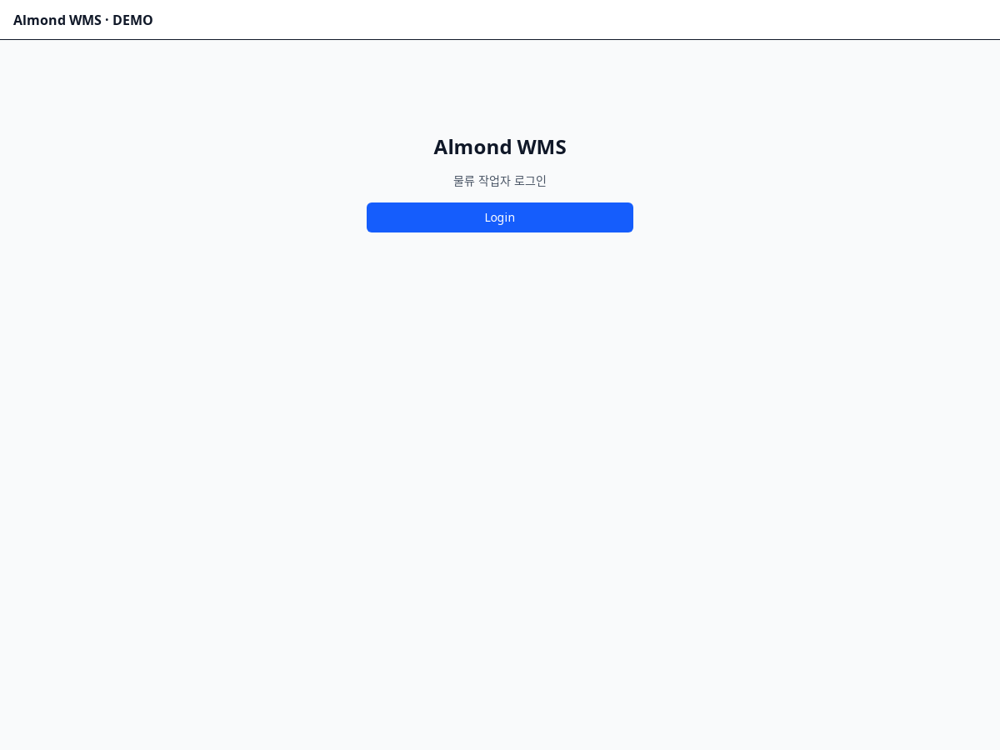

Windows 설치·스캐너·프린터의 현장 연결은 시연 시작 전에 담당자와 확인합니다. 이 문서의 캡처에는 Windows 설치 창이나 실제 출력물이 포함되어 있지 않습니다.

## 2. 작업 창고 선택

1. 홈의 `설정` 또는 오른쪽 위 창고명을 누릅니다.
2. `이 기기의 창고`에서 개발팀이 지정한 창고를 선택합니다. 문서 예시는 `데모 국내 물류센터`입니다.
3. 오른쪽 위 창고명이 선택한 값으로 바뀌는지 확인합니다.
4. 뒤로 가기 버튼으로 홈에 돌아갑니다.

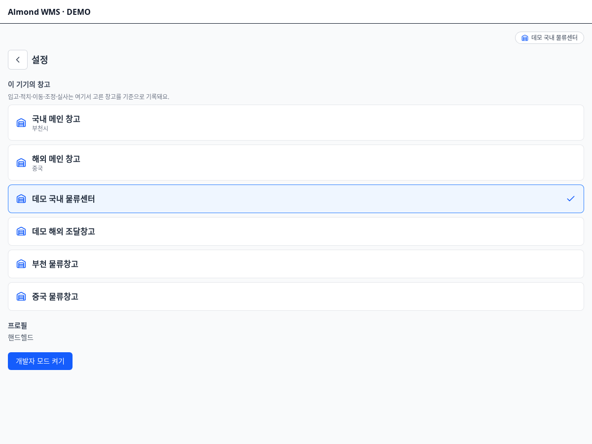

입고·적치·이동·조정·실사는 이 기기에 선택된 창고를 기준으로 기록됩니다. 이름이 비슷한 다른 창고를 선택하지 않습니다. 작업 중인 창고를 바꾸기 전에는 현재 작업의 처리 결과를 확인합니다.

## 3. 바코드 스캐너 사용

1. 스캐너를 PC에 연결합니다. 개발팀이 키보드 입력 방식과 스캔 끝의 Enter 입력을 확인합니다.
2. 재고조회 화면에서 등록된 상품 하나를 시험 스캔합니다.
3. 상품명과 SKU가 실물 라벨과 같은지 확인합니다. 여러 상품이 나오면 SKU를 비교해 선택합니다.
4. 자동 스캔을 사용할 때는 수량·검색 입력칸 밖을 누른 뒤 스캔합니다. 입력칸에 커서가 있으면 문자가 그 칸에 입력됩니다.
5. 입력칸을 사용한 수동 입력은 아래 각 화면의 `검색`, `조회`, `입력` 버튼으로 제출합니다.
6. 스캔 후 수량과 처리 결과를 확인한 다음 다음 상품을 스캔합니다.

미등록 바코드가 나오면 상품을 임의로 등록하거나 다른 상품으로 대신 처리하지 않습니다. SKU와 바코드를 담당자에게 전달합니다. 바코드가 없는 상품은 검색·목록 선택이 가능한 작업에서 SKU 코드로 찾습니다.

## 4. 상품 재고 확인

1. 홈에서 `재고조회`를 누릅니다.
2. `상품명·코드 검색`에 상품명 또는 SKU 코드를 입력하고 `검색`을 누릅니다. 등록된 상품 바코드를 스캔해도 됩니다.
3. 결과의 상품명, 코드, 옵션을 비교합니다.
4. 상품명을 눌러 상세를 엽니다.

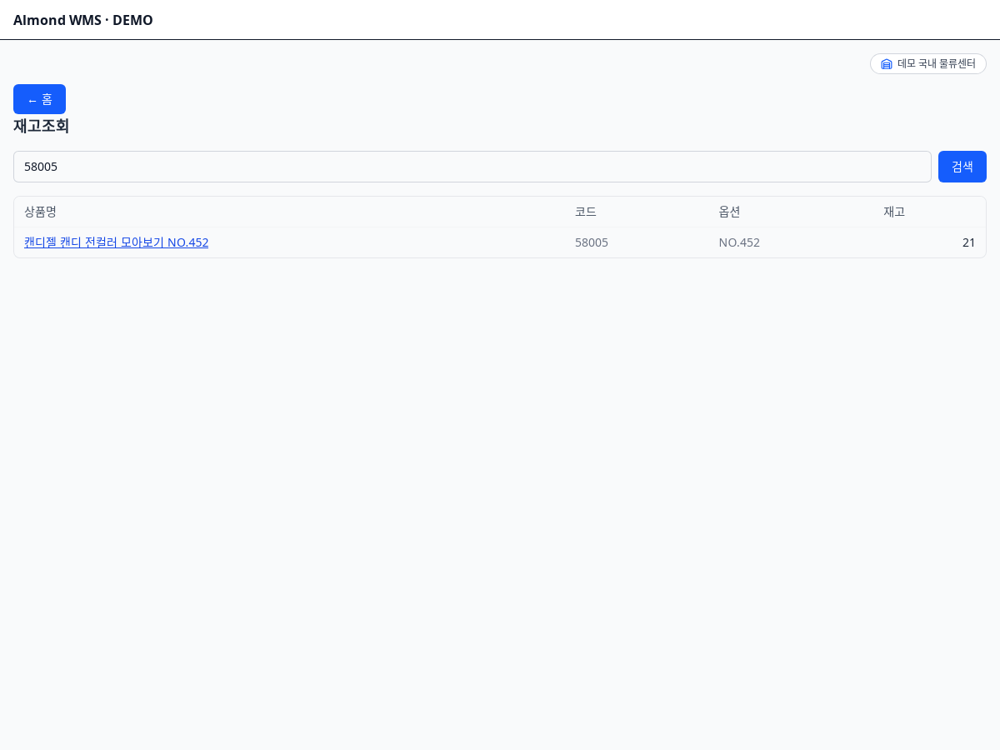

5. `실재고`, `예약`, `가용`을 구분해서 읽습니다. 예약 수량은 다른 주문에 배정된 수량입니다.
6. `위치별 재고`에서 선택 창고의 로케이션, 재고 상태, 수량을 확인합니다.
7. 입고·출고 전후 수량을 비교할 때는 같은 창고와 로케이션을 기준으로 기록합니다.

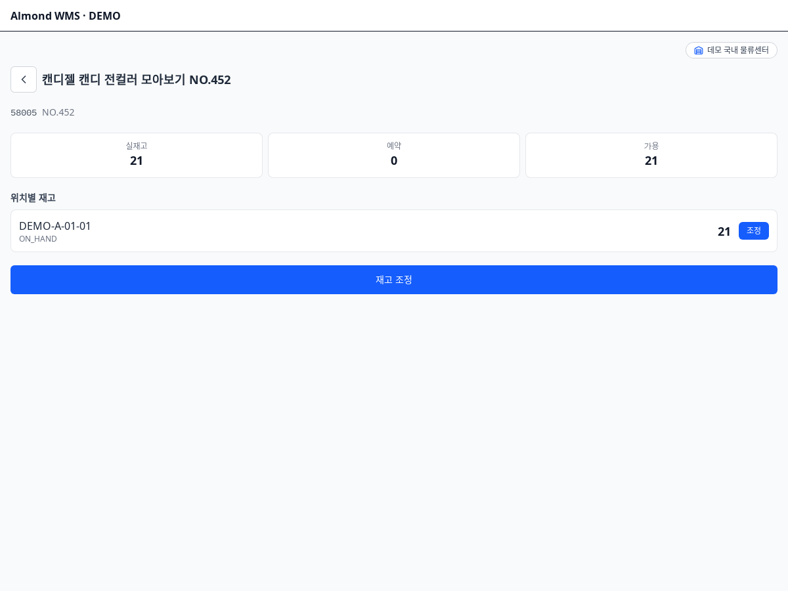

`조정`과 `재고 조정`은 조회 버튼이 아닙니다. 실물과 장부의 차이가 있다는 담당자 확인 없이 수량을 변경하지 않습니다.

## 5. 발주 입고

### 입고할 발주 찾기

시작 조건: 발주 담당자가 발주서를 만들고 각 품목의 `실행 기록`까지 완료해야 합니다. 발주서 생성만으로는 입고할 수 없습니다.

1. 발주 담당자에게 발주번호, 공급처, 예정일, 목적지 창고, SKU, 실발주 수량을 받습니다.
2. 앱의 선택 창고가 목적지 창고와 같은지 확인합니다.
3. 홈에서 `입고`를 누릅니다. 캡처 환경에서는 홈의 `입고/검수`를 누릅니다.
4. `입고 예정` 목록에서 공급처, 예정일, 품목 수, 남은 수량을 확인하고 해당 항목을 누릅니다.

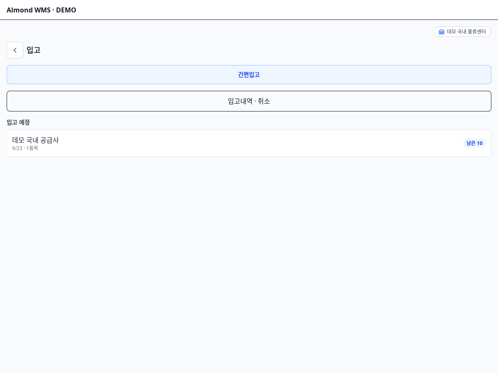

목록 카드에는 전체 발주번호가 표시되지 않습니다. 같은 공급처·예정일의 발주가 여러 개이면 담당자와 대조한 뒤 선택합니다. 목록이 비었다고 기존 발주를 `간편입고`로 대신 처리하지 않습니다.

5. `발주 품목`의 상품명과 SKU를 전달받은 값과 대조합니다.
6. `발주`, `입고`, `남은` 수량을 확인합니다.
7. 대상 품목의 `입고`를 누릅니다. 상품 바코드를 스캔해서 품목을 열 수도 있습니다.

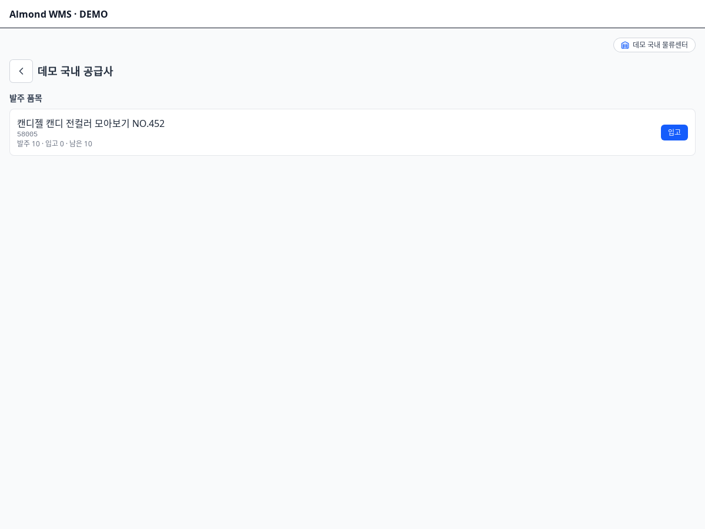

### 실제 받은 수량 입력

1. `입고 수량 직접 입력 (낱개)`에 이번에 받은 수량을 입력합니다. 숫자 버튼으로 바꿔도 됩니다.
2. 목록에서 품목을 열면 남은 수량이 기본값입니다. 일부만 받았으면 반드시 이번 수령량으로 바꿉니다.
3. 상품명, SKU, 입력 수량을 확인합니다. 예시는 발주 10개 중 첫 수령량 4개입니다.
4. `입고`를 한 번 누릅니다.

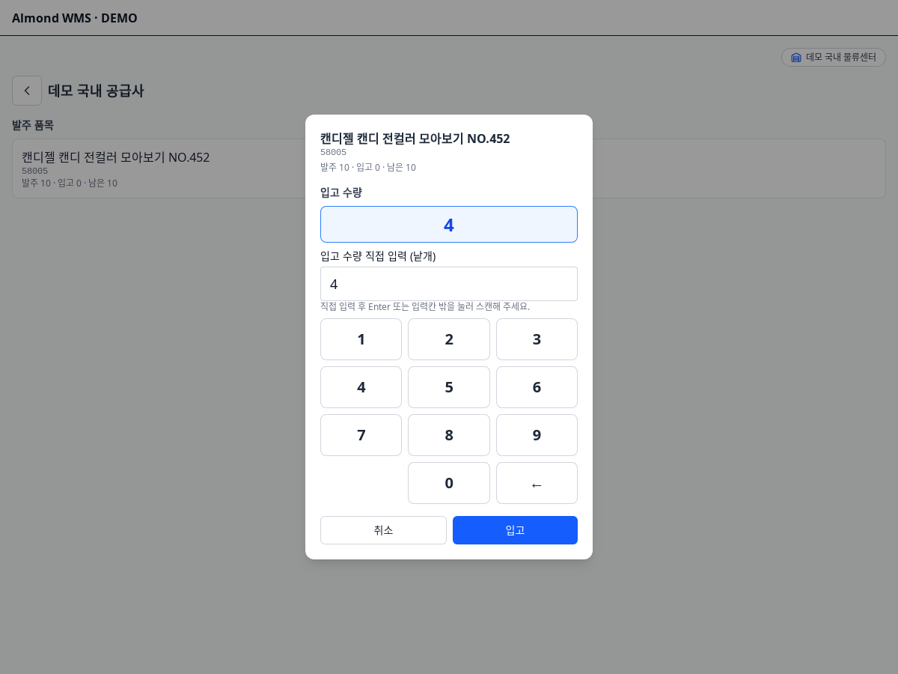

5. `4개 입고됨`과 `발주 10 · 입고 4 · 남은 6`을 확인합니다.
6. 바로 보관 위치로 옮길 경우 `적치하기`를 누릅니다. 나중에 옮길 경우 `닫기`로 돌아간 뒤 홈의 `적치`에서 계속합니다.

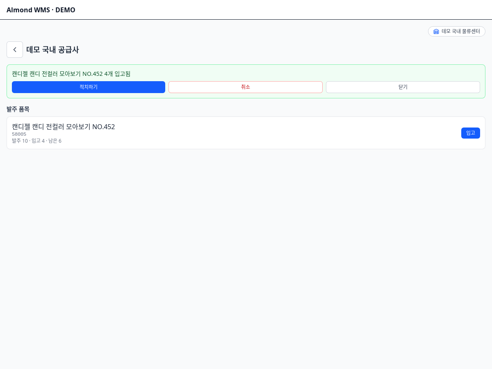

`입고됨`은 수령 기록이 반영됐다는 뜻입니다. 보관 위치로 옮기는 적치는 별도로 처리합니다.

### 남은 수량 입고

1. 다음 물량이 도착하면 같은 발주와 같은 SKU를 다시 엽니다.
2. 현재 `입고 4 · 남은 6`인지 확인합니다.
3. 두 번째 수령량 6을 입력하고 `입고`를 누릅니다.
4. 두 번째 입고 수량도 적치합니다.
5. 남은 발주 품목이 없어졌는지 확인합니다. 발주 담당자는 관리자 발주 상세에서 `전량 입고`와 `입고완료`를 확인합니다.

## 6. 입고한 상품 적치

1. 방금 입고한 결과에서 `적치하기`를 누릅니다. 이미 닫았다면 홈의 `적치`를 엽니다.
2. 적치 목록에서는 상품, 원위치, 입고 시각, `잔여`를 비교해서 선택합니다. 목록이 없으면 기간 필터를 넓히거나 상품 바코드를 스캔합니다.
3. 상품명, SKU, 원위치, 잔여 수량을 확인합니다. 문서 예시의 원위치는 `DEMO-RECEIVING`입니다.
4. `적치 수량 직접 입력 (낱개)`에 실제 옮길 수량을 입력합니다. 모두 옮길 때만 `전량`을 사용합니다.
5. `대상 로케이션`에서 실제 목적지 바코드를 스캔하거나 로케이션 코드를 검색합니다.
6. 검색 결과의 위치를 누릅니다. 예시는 `DEMO-A-01-01`입니다.
7. 선택한 위치와 실물 보관 위치가 같은지 확인한 뒤 `적치`를 누릅니다.

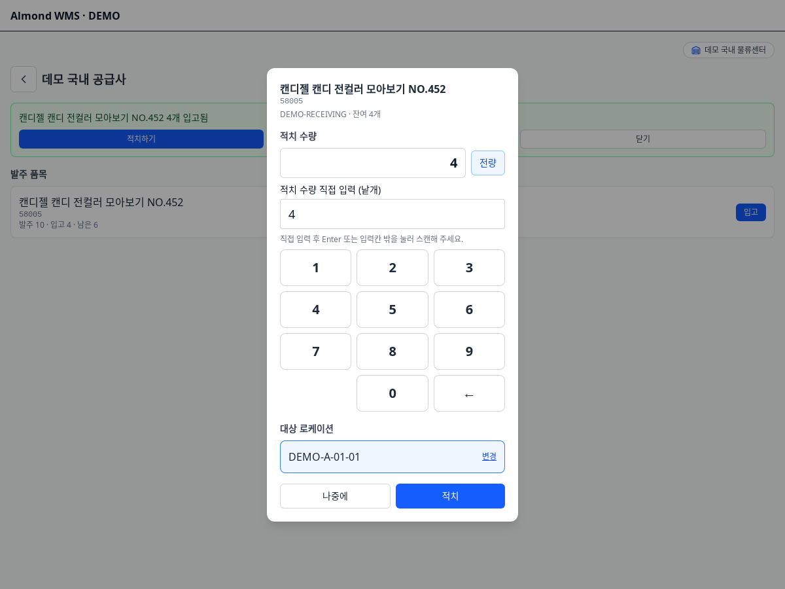

8. `적치 완료` 또는 목록의 줄어든 잔여 수량을 확인합니다.
9. `재고조회`에서 해당 위치의 수량을 확인합니다. 일부만 적치했다면 남은 수량은 같은 입고 항목에서 이어서 처리합니다.

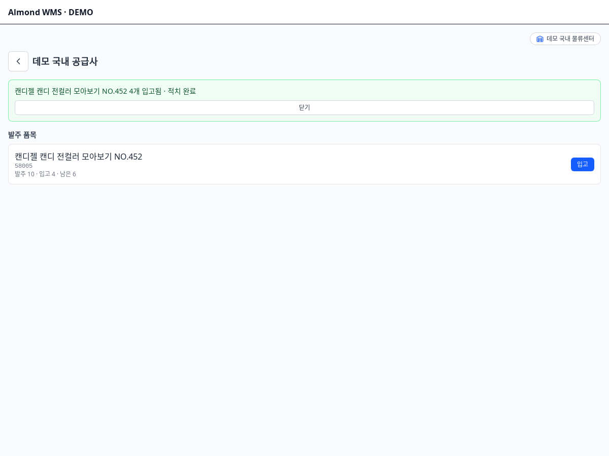

`직전 대상지 … 사용`은 이전에 선택한 위치를 다시 쓰는 버튼입니다. 이번 물품도 같은 위치에 놓는 경우에만 사용합니다. `나중에`는 적치를 완료하지 않고 창을 닫습니다.

## 7. 입고내역 확인과 잘못된 입고

1. 홈의 `입고내역` 또는 입고 화면의 `입고내역 · 취소`를 누릅니다.
2. 시작일·종료일·상태를 확인합니다. 필요하면 상품 필터를 사용합니다.
3. 상품과 입고 시각을 찾아 `입고`, `적치`, `취소`, `회송` 수량을 확인합니다.
4. 문서 예시에서는 같은 SKU의 입고 4개와 6개가 각각 기록되고, 각 입고 수량만큼 적치되어 있습니다.

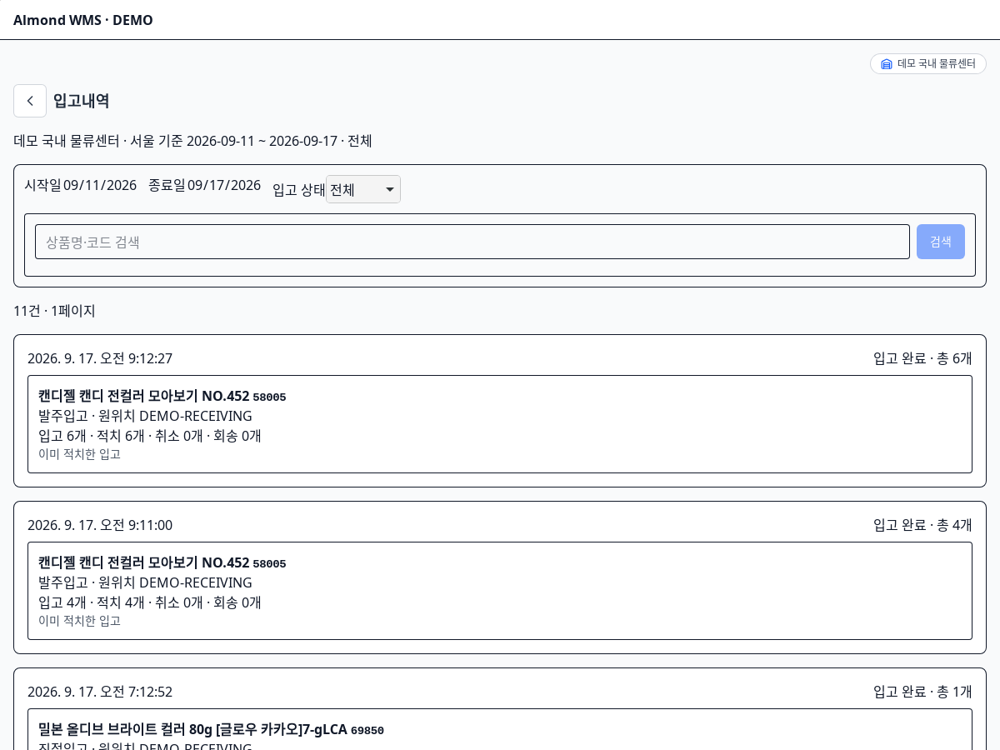

입고를 잘못 기록했다면 담당자에게 먼저 해당 시각·SKU·수량·창고를 전달합니다. `입고 취소`가 표시되는 경우에만 취소 가능 상태를 확인하고 진행합니다. 이미 적치했거나 다른 작업에 사용된 입고는 취소 제한 사유를 확인합니다. 버튼이 없다고 재고 조정으로 임의 상쇄하지 않습니다.

현재 일부 작업 화면은 전체 입고번호·작업 ID를 표시하지 않습니다. 이 경우 없는 값을 만들지 말고 입고 시각, 상품 코드, 수량을 전달해 관리자 입고 내역에서 식별하도록 합니다.

## 8. 운송장으로 출고 작업 열기

시작 조건: 개발팀이 [출고 준비 절차](operator.md)에 따라 shipment 계획, 운송장 발급, 배치 추가를 완료해야 합니다. 주문 생성만으로 바로 스캔할 수 있는 상태가 되지는 않습니다.

1. 운송장번호, 창고, 상품별 SKU와 수량을 받습니다.
2. 홈에서 `출고작업`을 누릅니다.
3. 운송장을 스캔합니다. 수동으로 처리할 때는 `운송장번호`에 전체 번호를 입력하고 `조회`를 누릅니다.

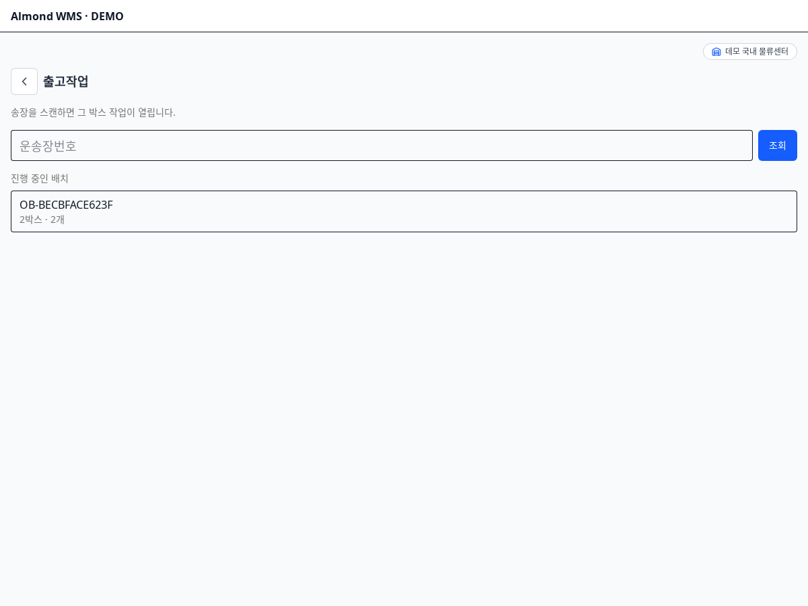

4. 택배사, 운송장번호, 수령인 표시가 해당 작업과 맞는지 확인합니다.
5. `출고 준비`를 누릅니다.

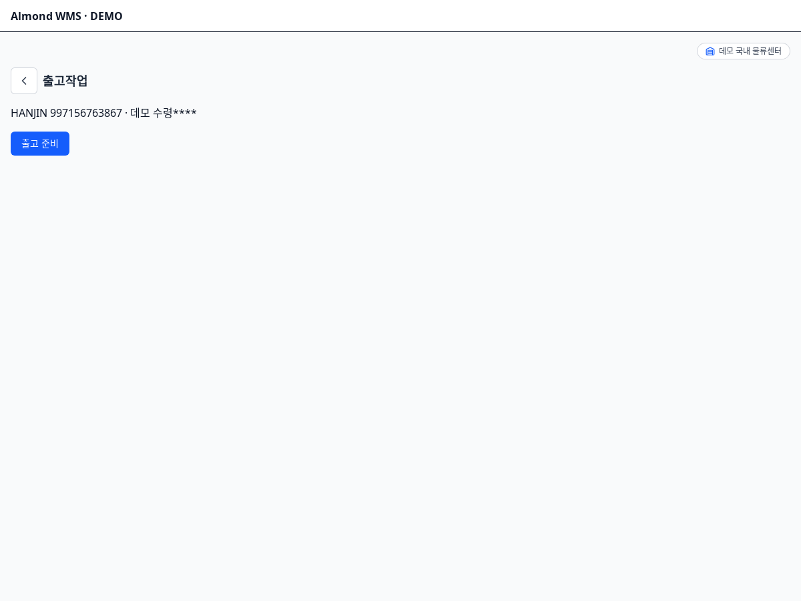

6. 상품별 출발 위치와 `할당 / 피킹 / 남은` 수량이 표시되는지 확인합니다.

## 9. 위치와 상품을 확인해 출고

현재 앱은 마지막 필요 수량이 반영되면 검수·출고 처리를 이어서 수행합니다. 별도의 마지막 출고 확인 버튼을 기다리지 않습니다. **마지막 상품 바코드를 입력하기 전에 상품·수량·운송장·포장 상태를 확인합니다.**

1. 상품 목록의 출발 위치를 확인합니다.
2. `출발 위치 코드`에 위치를 입력하고 `입력`을 누르거나, 실제 위치 바코드를 스캔합니다. 표시된 위치 버튼으로 선택해도 됩니다.
3. `출발 위치: …`가 실제로 상품을 가져오는 위치와 같은지 확인합니다.

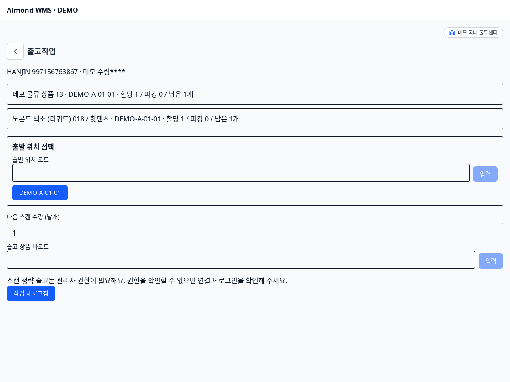

4. `다음 스캔 수량 (낱개)`을 확인합니다. 한 개씩 처리할 때는 1입니다. 여러 개를 한 번에 반영할 때만 실제 확인한 낱개 수량으로 바꿉니다.
5. 해당 위치에서 가져온 상품 바코드를 스캔합니다. 수동 입력할 때는 `출고 상품 바코드`에 입력하고 `입력`을 누릅니다.
6. 화면의 `피킹` 증가와 `남은` 감소를 확인합니다. 바코드만 읽혔다고 완료로 판단하지 않습니다.
7. 다음 상품도 같은 순서로 처리합니다. 위치가 바뀌면 `위치 변경`을 눌러 새 출발 위치를 먼저 선택합니다.

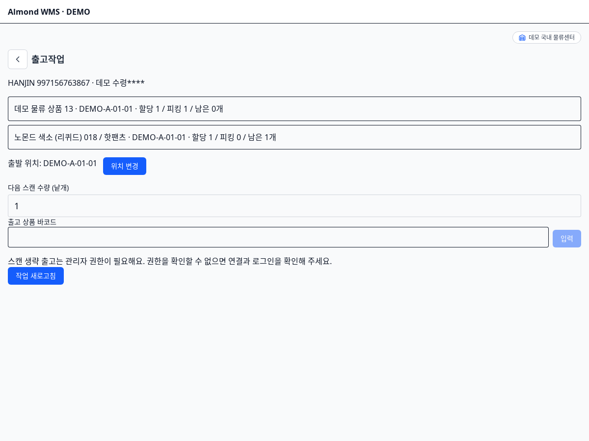

8. 마지막 수량을 처리한 뒤 `출고완료`가 표시되는지 확인합니다.
9. 운송장번호와 완료 시각을 기록하고 `다음 송장 스캔`을 누릅니다.

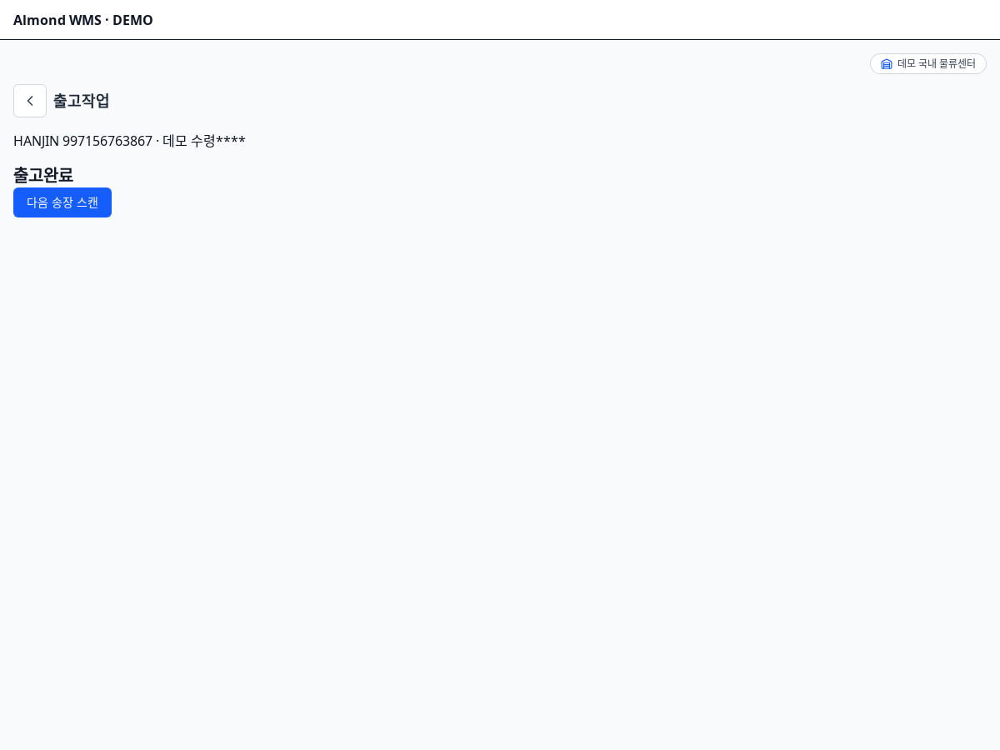

`demoworker`는 관리자용 `스캔 생략 확인`을 사용하지 않습니다. 실물 스캔이나 등록된 바코드의 수동 입력으로 처리합니다. 수량 불일치를 해소하기 위해 다른 상품을 대신 스캔하지 않습니다.

## 10. 프린터와 운송장

- 운송장 발급은 개발팀이 관리자 웹에서 처리합니다. 발급된 번호와 이번 출고 작업의 번호를 대조합니다.
- 현재 창고 앱의 일반 작업 화면에는 직원용 프린터 선택·운송장 출력 버튼이 없습니다. 앱의 `출고완료`는 실제 종이가 인쇄됐다는 의미가 아닙니다.
- 실물 운송장이나 시연용 바코드가 필요한 경우 개발팀이 해당 PC의 승인된 출력 절차로 준비합니다. 문서 화면 속 운송장번호는 이미 완료한 예시이므로 새 작업에는 새로 발급한 번호를 사용합니다.
- 프린터 모델, Windows 드라이버, 용지 규격, 출력 배율, 바코드 판독 여부는 실제 장비에서 담당자와 확인합니다. 개발자 진단의 테스트 출력을 정상 운송장 출력으로 사용하지 않습니다.

## 11. 오류나 중단이 발생한 경우

| 화면 표시 또는 상황 | 확인 및 처리 |
| --- | --- |
| `입고 예정이 없어요` | 선택 창고와 발주 실행 여부를 발주 담당자에게 확인합니다. |
| 남은 발주 수량 초과 | 이번 수령량을 다시 셉니다. 발주 수량 수정이 필요하면 발주 담당자에게 전달합니다. |
| `입고 상태를 다시 확인해 주세요` | `다시 확인`으로 최신 상태를 읽고 수량을 대조합니다. |
| 적치할 항목 없음 | 창고, 기간, 입고 확정 여부, 이미 적치했는지 확인합니다. |
| `이미 출고된 송장이에요` | 완료한 작업입니다. 개발팀에서 새 작업에 사용할 운송장을 받습니다. |
| `이 송장은 오늘 배치에 없어요` | 개발팀에 같은 shipment의 배치 추가 여부를 확인받습니다. |
| 송장의 창고와 선택 창고가 다름 | 운송장과 작업 대상 창고를 대조한 뒤 올바른 창고에서 다시 조회합니다. |
| 위치 또는 SKU 불일치 | 선택한 출발 위치와 해당 위치에 할당된 상품인지 확인합니다. |
| `처리 내역 확인` 또는 결과 미확정 | 추가 스캔을 멈추고 같은 화면의 확인 기능을 사용합니다. 새 작업으로 중복 제출하지 않습니다. |
| 출고 수량이 예상과 다름 | `작업 새로고침`으로 최신 상태를 확인합니다. 확인 전 추가 입력하지 않습니다. |
| 앱을 닫았다가 다시 시작함 | 같은 계정·창고로 돌아와 저장된 작업을 확인합니다. 출고는 `하던 작업 이어서`를 사용합니다. |
| 저장 공간·서버 연결·업데이트 오류 | 정확한 메시지를 기록하고 담당자에게 전달합니다. 작업 기록을 지우거나 앱을 재설치해서 해결하려고 하지 않습니다. |

담당자에게 발생 시각, 계정 ID, 창고, 화면명, SKU, 입력 수량, 화면의 실제 오류 문구를 전달합니다. 출고 작업은 운송장번호도 함께 전달합니다.
