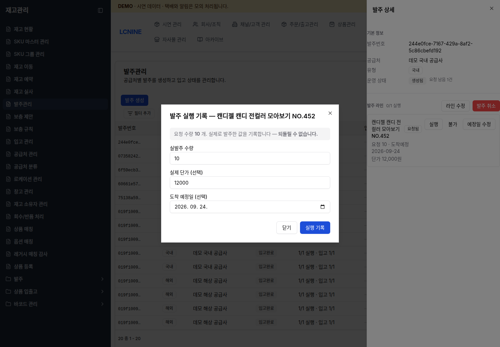
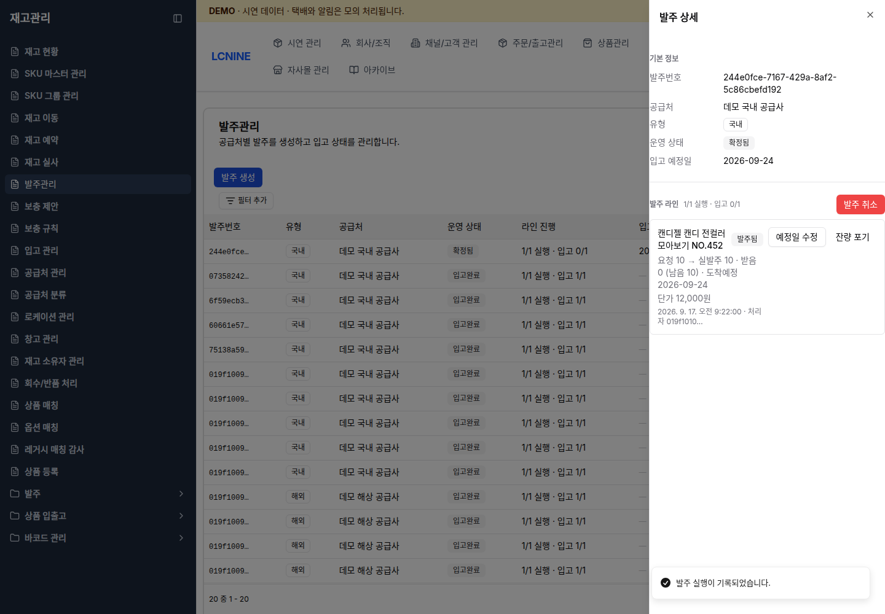
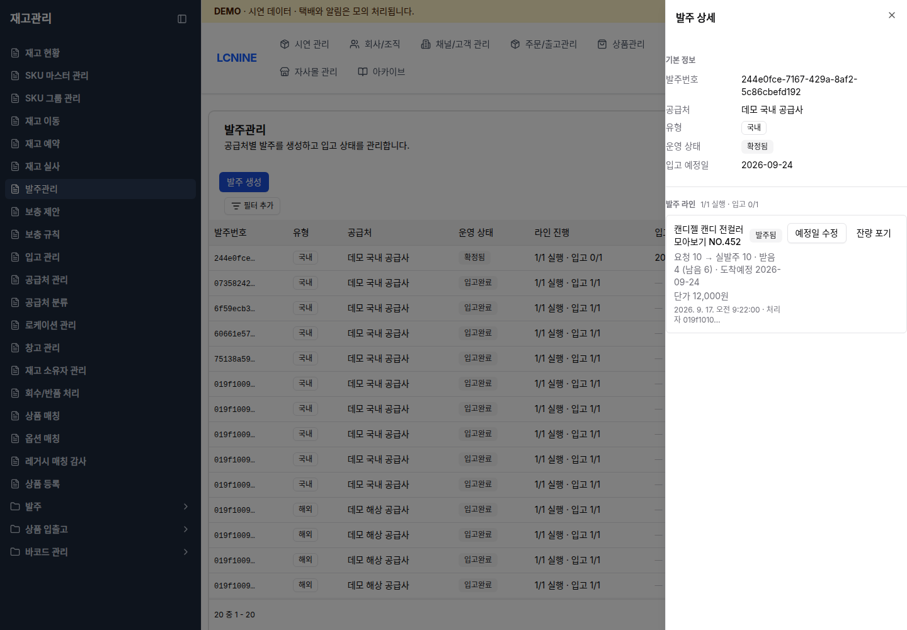

# 발주·입고·출고 합동 실습

[문서 목록](README.md) · [리테일팀](retail.md) · [물류팀](warehouse.md) · [교육 안내자](operator.md)

리테일팀, 물류팀, 교육 안내자가 같은 식별자를 사용해 한 작업을 끝까지 처리합니다. 각 단계가 끝날 때 다음 담당자에게 화면의 실제 번호를 전달합니다.

## 시작 전 확인

- 리테일팀과 교육 안내자는 관리자 화면에 `demoadmin`으로 로그인합니다.
- 물류팀은 Windows 창고 앱에 `demoworker`로 로그인합니다.
- Windows 설치 파일은 교육 담당자가 별도로 전달합니다.
- 관리자 화면과 창고 앱이 모두 demo 환경인지 확인합니다.
- 대상 SKU, 바코드, 시작 가용 수량, 목적지 창고, 입고 위치를 기록합니다.
- 스캐너와 프린터는 현장에서 사용할 모델, Enter suffix, 용지 규격을 확인합니다. 확인 전에는 특정 설정값을 가정하지 않습니다.

## 실습 1. 국내 발주 10개, 부분 입고 4개와 6개

### 리테일팀

1. [리테일팀 문서](retail.md)의 `보충 제안 확인` 절차로 대상 SKU를 찾습니다.
2. `발주 유형: 국내`를 선택한 뒤 `카트`를 누릅니다.
3. `재고관리` → `발주관리` → `발주 카트`에서 수량을 10으로 입력합니다.
4. 목적지 국내 demo 창고를 선택하고 발주서를 만듭니다.
5. 발주 목록에서 새 발주의 `상세`를 엽니다.
6. 대상 라인의 `실행`을 누르고 `실발주 수량` 10을 기록합니다.
7. 발주번호, SKU, 실발주 10, 목적지 창고, 예정일을 물류팀에 전달합니다.

### 물류팀: 첫 입고

1. [물류팀 문서](warehouse.md)에 따라 `입고 예정`에서 공급처, 예정일, SKU, 남은 수량이 맞는 항목을 엽니다. 목록 카드에는 전체 발주번호가 표시되지 않으므로 번호만으로 선택하지 않습니다.
2. 상품과 SKU가 전달 내용과 같은지 확인합니다.
3. 상품 바코드를 스캔해 품목을 열 수 있습니다. `입고 수량 직접 입력 (낱개)`에는 실제 수령량 4를 입력합니다.
4. 입고를 확정하고 화면에 표시된 입고 시각, SKU, 수량을 기록합니다. 입고번호가 표시되는 경우에만 전체 번호도 기록합니다.
5. 결과의 `적치하기`를 누릅니다. 결과를 닫았다면 적치 목록에서 상품, 원위치, 입고 시각, 잔여 수량이 같은 항목을 선택합니다.
6. 목적지 로케이션을 스캔하고 수량 4를 적치합니다.
7. 화면에 표시된 입고번호나 적치 작업 ID가 있으면 함께 기록합니다. 표시되지 않으면 입고 시각, SKU, 원위치, 목적지 로케이션, 입고·적치 수량 4를 리테일팀에 전달합니다.

### 리테일팀 확인

1. 발주 상세를 다시 엽니다.
2. 대상 라인에 `받음 4 (남음 6)`이 표시되는지 확인합니다.
3. 남은 6개를 물류팀에 다시 전달합니다.

### 물류팀: 두 번째 입고

1. 같은 공급처·예정일의 항목에서 같은 SKU와 남은 수량 6을 확인합니다.
2. 실제 수령량 6을 입력하고 입고를 확정합니다.
3. 화면에 새 입고번호가 표시되면 기록합니다. 표시되지 않으면 입고 시각, SKU, 수량 6을 기록합니다.
4. 두 번째 입고 수량 6을 적치하고 화면에 표시된 작업 ID가 있으면 기록합니다. 표시되지 않으면 입고 시각, SKU, 원위치, 목적지 위치, 적치 수량을 기록합니다.

### 완료 확인

- 리테일팀: 라인이 `전량 입고`, 발주서가 `입고완료`인지 확인합니다.
- 물류팀: 두 입고의 미적치 수량이 0인지 확인합니다.
- 다른 작업이 없었던 경우에만 시작 수량 대비 총 10 증가를 확인합니다.

## 실습 2. 여러 상품 주문 출고

### 교육 안내자

1. [교육 안내자 문서](operator.md)에 따라 시연 데이터가 `준비 완료`인지 확인합니다.
2. `생성 방식`을 `무작위 여러 상품`으로 선택합니다.
3. `시나리오`를 `정상 출고`로 선택합니다.
4. `주문 수` 5, `주문당 상품 종류` 2, `품목당 최소 수량` 1, `품목당 최대 수량` 3을 입력합니다.
5. `주문 생성`을 한 번 누릅니다.
6. `생성 이력` → `상세`에서 외부 주문번호와 품목별 수량을 기록합니다.
7. 각 외부 주문번호 링크로 `주문내역 목록`을 열고 외부 주문번호, 생성 시각, 상품별 SKU와 수량을 기록합니다.

### 교육 안내자: 출고 작업 준비

1. `주문/출고관리` → `출고` → `출고주문`에서 생성 시각과 창고가 맞는 최근 행을 엽니다.
2. 상세의 생성일, 창고와 `출고 라인`의 SKU·요청 수량을 기록한 주문과 대조합니다. 후보가 하나로 확인되면 출고주문의 전체 `주문번호`를 FO ID로 기록합니다.
3. `배송` 탭에서 shipment ID, `manifest v`, `reservation v`를 기록하고 예약 수량이 주문 수량과 같은지 확인합니다.
4. shipment 상태가 `draft`이면 `계획 확정`을 누릅니다. `shipment 계획 확정` 창의 `shipping profile UUID`가 채워져 있는지 확인하고 `서버에 요청`을 누른 뒤 상태가 `planned`로 바뀌는지 확인합니다.
5. `주문/출고관리` → `출고` → `운송장 발급`으로 이동합니다.
6. `주문처리(FO)`에서 대상 FO를 고르고 shipment를 체크한 뒤 `택배사: HANJIN`과 `선택 1건 일괄발급`을 차례로 누릅니다.
7. `발급 결과`에서 운송장번호를 기록합니다.
8. `주문/출고관리` → `출고` → `출고 배치`에서 `배치 생성`을 누릅니다.
9. shipment와 같은 `창고`를 선택하고 위치별 출고 실습의 `피킹 방식`은 `개별 피킹`을 선택한 뒤 `생성`을 누릅니다.
10. 방금 만든 배치를 열고 `Eligible shipment`에서 shipment와 운송장번호를 대조한 뒤 `추가`를 누릅니다.
11. `Work item queue`에 같은 shipment와 작업 ID가 표시되는지 확인합니다.
12. 배치 ID, 작업 ID, shipment ID, 운송장번호, 창고, 상품별 SKU와 수량을 물류팀에 전달합니다.

같은 시각에 동일한 SKU·수량의 FO 후보가 여러 개이거나 외부 주문과 FO의 연결이 확실하지 않으면 추측해서 진행하지 않습니다. 외부 주문번호와 후보 FO 정보를 환경 관리자에게 전달해 확인받습니다.

shipment가 없거나 예약이 부족하면 계획을 확정하거나 운송장과 배치를 만들지 않습니다. 부족 상품을 보충한 뒤 같은 주문을 다시 확인합니다. `shipping profile UUID`가 비어 있으면 임의로 입력하지 않습니다. 계속 준비되지 않으면 환경 관리자에게 화면 상태를 전달합니다. 직원이 API를 호출하거나 `출고주문 생성 (수동)`으로 같은 주문의 출고주문을 다시 만들지 않습니다.

### 물류팀

1. [물류팀 문서](warehouse.md)에 따라 `출고작업`에서 전달받은 운송장번호를 스캔하거나 입력하고 `조회`를 누릅니다.
2. 운송장과 선택 창고가 같은지 확인하고 `출고 준비`를 누릅니다.
3. 화면의 상품, 출발 위치, 할당·피킹·남은 수량을 확인합니다.
4. 표시된 출발 위치를 선택하거나 위치 바코드를 스캔합니다.
5. `다음 스캔 수량`을 입력한 뒤 해당 `출고 상품 바코드`를 스캔합니다. 상품과 출발 위치가 바뀌면 화면에서 다시 선택합니다.
6. 마지막 남은 수량을 반영하기 전에 실물, 총수량, 포장 상태를 확인합니다.
7. 마지막 상품 바코드를 스캔하고 처리 결과를 기다립니다. 남은 수량이 0이면 검수와 출고가 자동으로 진행되어 `출고완료`가 표시됩니다. 별도의 포장·검수·출고 완료 버튼은 없습니다.
8. shipment ID, 운송장번호, 각 SKU 출고 수량, 완료 시각을 교육 안내자에게 전달합니다.

### 교육 안내자 확인

1. 주문 화면에서 출고 완료 상태를 확인합니다.
2. 시연 콘솔의 모의 판매채널, 모의 택배, 모의 알림 처리 상태를 확인합니다.
3. 실제 외부 채널이나 고객에게 전송된 결과로 기록하지 않습니다.

## 실습 3. 재고 부족 주문을 보충한 뒤 출고

### 교육 안내자

1. 가용 수량이 적은 상품을 선택합니다.
2. `생성 방식`을 `선택한 상품`, `시나리오`를 `재고 부족 → 보충 후 출고`로 선택합니다.
3. 주문 수와 수량 범위를 입력하고 주문을 생성합니다.
4. 생성된 주문번호와 부족한 SKU·수량을 기록합니다.
5. 출고 준비가 부족 상태로 멈춘 것을 확인합니다.

### 보충 방법 선택

- 발주와 입고를 함께 연습할 때: 리테일팀이 새 발주를 만들고 물류팀이 입고·적치합니다.
- 출고 단계만 연습할 때: 교육 안내자가 시연 콘솔의 `선택 상품 보충`을 사용합니다.

보충 뒤에는 새 주문을 만들지 않습니다. 기존 주문의 예약과 출고 준비를 다시 확인해 같은 주문을 계속 처리합니다.

예약이 완료되면 [교육 안내자 문서](operator.md)의 `물류 앱에 보낼 출고 작업 준비` 절차로 같은 shipment의 계획을 확정하고 운송장을 발급한 뒤 출고 배치에 추가합니다.

### 완료 확인

- 같은 주문번호와 shipment ID를 유지했는지 확인합니다.
- 부족 예약이 해소됐는지 확인합니다.
- 물류팀이 위치별 상품 스캔을 끝내고 화면에 `출고완료`가 표시되는지 확인합니다.
- SKU별 보충 수량과 출고 수량을 기록합니다.

## 인계할 값

| 단계 | 다음 담당자에게 전달할 값 |
| --- | --- |
| 발주 생성·실행 | 전체 발주번호, 공급처, 목적지 창고, SKU, 실발주 수량, 예정일 |
| 입고 확정 | 발주번호, 화면에 표시된 입고번호 또는 입고 시각, SKU, 받은 수량, 남은 수량 |
| 적치 완료 | 화면에 표시된 입고번호·작업 ID 또는 입고 시각·SKU·원위치, 목적지 로케이션, 적치 수량 |
| 주문 생성 | 생성 시각, 주문번호, 상품별 SKU와 수량 |
| 출고 준비 | 주문번호, 출고주문(FO) ID, 배치 ID, 작업 ID, shipment ID, 운송장번호, 창고, 부족 여부 |
| 출고 완료 | shipment ID, 운송장번호, SKU별 출고 수량, 완료 시각 |

## 결과가 불명확할 때

1. 추가 입력과 스캔을 멈춥니다.
2. 화면의 정확한 문구와 발생 시각을 기록합니다.
3. 교육 안내자는 `같은 요청 재확인` 또는 `보충 요청 재확인`을 사용합니다.
4. 리테일팀은 발주 목록과 상세에서 기존 발주번호의 상태를 다시 확인합니다.
5. 물류팀은 화면에 작업 ID가 있으면 그 값을 확인합니다. ID가 없으면 상품, 작업 시각, 수량, 위치를 기준으로 입고·적치·출고 이력을 다시 확인합니다.
6. 기존 결과가 확정되기 전에는 새 발주, 새 입고, 새 주문을 만들지 않습니다.
