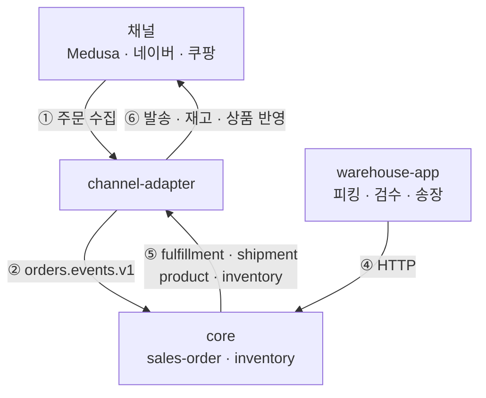

# 공개 레포 README 재작성 Implementation Plan

> ⚠️ **정정 (2026-08-09) — 아래 "검증된 이벤트 토폴로지" 표는 틀렸다.**
> 그 표는 각 앱 `main.ts` 의 `EventsModule.forConsumer({streams})` 를 "실제 런타임 구독"으로 읽었으나,
> Nest 의 `ServerKafka.bindEvents()` 가 `subscribe.topics` 를 `[...this.messageHandlers.keys()]` 로
> **덮어쓴다** (`node_modules/@nestjs/microservices/server/server-kafka.js:92`, v11.1.17). 실제 구독 집합은
> `@OnEvent` 데코레이터가 결정하며 `forConsumer` 의 `streams` 는 사용되지 않는다.
> 누락된 실제 구독: **channel-adapter 의 `PAYMENT`·`USER`·`CORE_ORDER`**, **analytics 의 `PRODUCT`**.
> 이 플랜은 완료됐으므로 본문은 히스토리로 보존한다. 이 표를 새 다이어그램의 근거로 재사용하지 말 것.
> 정본은 [`docs/adr/0029-events-module-registration-surfaces.md`](../../adr/0029-events-module-registration-surfaces.md).
> (`README.md` 자체는 결제 경로를 아예 그리지 않은 축약도라 틀린 내용을 담고 있지는 않다.)

> **For agentic workers:** REQUIRED SUB-SKILL: Use superpowers:subagent-driven-development (recommended) or superpowers:executing-plans to implement this plan task-by-task. Steps use checkbox (`- [ ]`) syntax for tracking.

**Goal:** 공개 레포를 처음 보는 개발자에게 시스템의 지향점과 전체 구조를 전달하는 README 로 교체하고, 첫인상을 해치는 루트 잔재를 정리하고, BSL 1.1 라이선스를 명시한다.

**Architecture:** 코드 변경 없음. 문서 3종(README · LICENSE · 루트 정리)만 다룬다. 순서가 중요하다 — 루트 정리로 파일 목록을 확정하고, 라이선스 파일을 만든 뒤, 그 둘을 참조하는 README 를 마지막에 쓴다. 그래야 README 안의 링크가 실재하는 파일만 가리킨다.

**Tech Stack:** Markdown, GitHub 렌더링(mermaid 네이티브 지원), git mv/rm

## Global Constraints

- 언어는 한국어. 영문판(`README.en.md`)은 이번에 만들지 않는다.
- **존재하지 않는 파일로 링크하지 않는다.** 특히 `README.en.md` 링크 금지 — 공개 레포에서 404 가 된다.
- 다이어그램은 아래 "검증된 이벤트 토폴로지" 를 벗어나는 화살표를 그리지 않는다.
- `web/almondyoung-storefront/LICENSE` 는 건드리지 않는다. medusa-next(MIT, © 2022 Medusa) 파생물이라 상위 라이선스로 덮을 수 없다.
- 커밋은 태스크 단위로 끊는다.

### 검증된 이벤트 토폴로지 (2026-08-08 실측)

각 앱 `main.ts` 의 `EventsModule.forConsumer` 실제 런타임 구독:

| 앱 | 구독 |
|---|---|
| `core` | `ORDER` |
| `channel-adapter` | `FULFILLMENT` · `FULFILLMENT_V2` · `SHIPMENT` · `PRODUCT` · `INVENTORY` · `MEMBERSHIP` |
| `notification` | `USER` · `ORDER` · `PAYMENT` |
| `search` | `PRODUCT` · `UGC_EVENT` |
| `analytics` | `ORDER` · `MEMBERSHIP` |
| `wallet` | `UGC_COMMAND` · `WALLET_COMMAND` |
| `membership` | `PAYMENT` |

`core` 발행(`@InjectStreamPublisher`): `CORE_ORDER` · `FULFILLMENT` · `FULFILLMENT_V2` · `SHIPMENT` · `PRODUCT` · `INVENTORY`

`native/warehouse-app` 은 Kafka 를 쓰지 않는다. `https://core.almondyoung.com/*` 로 HTTP 호출만 한다.

---

## File Structure

| 파일 | 책임 | 태스크 |
|---|---|---|
| 루트 잔재 10개 | 삭제 6 / `docs/` 이동 3 / `scripts/` 이동 1 | 1 |
| `LICENSE` (신규) | BSL 1.1 전문 + 파라미터 | 2 |
| `package.json` | `license` 필드 `UNLICENSED` → `BUSL-1.1` | 2 |
| `apps/medusa/package.json` | `license` 필드 `MIT` → `BUSL-1.1` | 2 |
| `README.md` | 전면 교체 | 3 |

---

### Task 1: 루트 정리

**Files:**
- Delete: `문서`, `point.md`, `refector.md`, `IMPLEMENTATION_SUMMARY_VERSION_MANAGEMENT.md`, `docker-guide.md`, `check-env.js`
- Move: `PIM_VERSION_MANAGEMENT_GUIDE.md` `SEED_GUIDE.md` `SEED_DATA_ANALYSIS.md` → `docs/`
- Move: `trigger-search-index.mjs` → `scripts/`

**Interfaces:**
- Consumes: 없음
- Produces: 정리된 루트. Task 3 의 README 는 여기서 살아남은 파일만 언급할 수 있다.

- [ ] **Step 1: 삭제 대상이 정말 참조되지 않는지 재확인**

```bash
cd /home/pauseb/workspace/almondyoung-server
for f in 문서 point.md refector.md IMPLEMENTATION_SUMMARY_VERSION_MANAGEMENT.md docker-guide.md check-env.js; do
  echo "--- $f"
  grep -rIl --exclude-dir=node_modules --exclude-dir=.git --exclude-dir=dist -F "$f" . 2>/dev/null | grep -v "^\./$f$"
done
```

기대: `IMPLEMENTATION_SUMMARY_VERSION_MANAGEMENT.md` 만 `PIM_VERSION_MANAGEMENT_GUIDE.md` 에서 1건 잡힌다. 나머지는 출력 없음.

이 1건은 삭제 후 `docs/PIM_VERSION_MANAGEMENT_GUIDE.md` 안에 끊어진 참조로 남는다. 보관용 문서 내부의 참조이고 README 나 빌드 경로에 영향이 없으므로 그대로 둔다.

`문서` 는 한국어 단어와 겹쳐 위양성이 많다. 파일명 참조인지 본문 단어인지 눈으로 구분할 것.

- [ ] **Step 2: 삭제 6건**

```bash
git rm -q 문서 point.md refector.md IMPLEMENTATION_SUMMARY_VERSION_MANAGEMENT.md docker-guide.md check-env.js
```

- [ ] **Step 3: 이동 4건**

```bash
git mv PIM_VERSION_MANAGEMENT_GUIDE.md docs/
git mv SEED_GUIDE.md docs/
git mv SEED_DATA_ANALYSIS.md docs/
git mv trigger-search-index.mjs scripts/
```

- [ ] **Step 4: 깨진 것이 없는지 검증**

```bash
npm run type-check
```

기대: 이번 변경으로 **새로 생긴** 오류 0건. (기존에 알려진 오류가 있다면 그 수치가 늘지 않았는지 본다 — `tail` 로 자른 출력에 개수를 매기지 말 것.)

```bash
grep -n "swagger-config" scripts/generate-swagger-docs.ts
ls swagger-config.json
```

기대: 경로가 그대로 유효하다.

```bash
git status --short
```

기대: 삭제 6 + 이동 4 만 보인다. 의도하지 않은 변경이 섞여 있지 않은지 확인.

- [ ] **Step 5: 커밋**

```bash
git add -A
git commit -m "chore(docs): 루트의 완료된 일회성 문서 정리 (삭제 6 · 이동 4)"
```

---

### Task 2: BSL 1.1 라이선스

**Files:**
- Create: `LICENSE`
- Modify: `package.json` (`"license"` 필드)
- Modify: `apps/medusa/package.json` (`"license"` 필드)

**Interfaces:**
- Consumes: 없음
- Produces: 루트 `LICENSE` 파일. Task 3 의 README 라이선스 섹션이 `[LICENSE](LICENSE)` 로 링크한다.

**실행 전 확인이 필요한 파라미터 2건** — 값이 확정되지 않았으면 사람에게 묻고 진행한다:

| 항목 | 계획값 | 확인 사유 |
|---|---|---|
| Licensor | `LCNINE` | GitHub 조직명이다. 법인 정식 명칭과 다를 수 있다 |
| Change Date | `2030-08-08` | BSL 표준인 4년 후. 조정 가능 |

**Change License 에 관한 주석.** BSL 1.1 의 Covenant 1 은 Change License 를 "GPL 2.0 호환" 라이선스로 지정하라고 요구하는데, Apache-2.0 은 GPLv3 와는 호환되지만 GPLv2 와는 호환되지 않는다. 다만 Sentry · CockroachDB · Materialize 등 실제 BSL 채택 사례 다수가 Apache-2.0 을 Change License 로 쓰고 있어 관행상 통용된다. 스펙 결정대로 Apache-2.0 을 쓰되 이 긴장은 기록해 둔다. 엄격히 가려면 대안은 MPL-2.0 또는 "GPL 2.0 or later" 다.

- [ ] **Step 1: `LICENSE` 생성**

파일 전체 내용:

```
Business Source License 1.1

License text copyright (c) 2017 MariaDB Corporation Ab, All Rights Reserved.
"Business Source License" is a trademark of MariaDB Corporation Ab.

-----------------------------------------------------------------------------

Parameters

Licensor:             LCNINE

Licensed Work:        almondyoung-server
                      The Licensed Work is (c) 2026 LCNINE

Additional Use Grant: You may make production use of the Licensed Work to
                      operate your own business, including operating online
                      stores, inventory, fulfillment, and related internal
                      operations for yourself or for a single organization
                      that you control.

                      You may not provide the Licensed Work to third parties
                      as a commercial hosted, managed, or software-as-a-service
                      offering.

                      한국어 요약(참고용, 법적 효력은 위 영문에 있다):
                      자기 사업을 운영하기 위한 프로덕션 사용은 허용한다.
                      이 저작물을 제3자에게 상용 호스팅 · 매니지드 · SaaS
                      형태로 제공하는 것은 허용하지 않는다.

Change Date:          2030-08-08

Change License:       Apache License, Version 2.0

For information about alternative licensing arrangements for the Licensed Work,
please contact dev@lcnine.kr.

-----------------------------------------------------------------------------

Notice

Business Source License 1.1

Terms

The Licensor hereby grants you the right to copy, modify, create derivative
works, redistribute, and make non-production use of the Licensed Work. The
Licensor may make an Additional Use Grant, above, permitting limited
production use.

Effective on the Change Date, or the fourth anniversary of the first publicly
available distribution of a specific version of the Licensed Work under this
License, whichever comes first, the Licensor hereby grants you rights under
the terms of the Change License, and the rights granted in the paragraph
above terminate.

If your use of the Licensed Work does not comply with the requirements
currently in effect as described in this License, you must purchase a
commercial license from the Licensor, its affiliated entities, or authorized
resellers, or you must refrain from using the Licensed Work.

All copies of the original and modified Licensed Work, and derivative works
of the Licensed Work, are subject to this License. This License applies
separately for each version of the Licensed Work and the Change Date may vary
for each version of the Licensed Work released by Licensor.

You must conspicuously display this License on each original or modified copy
of the Licensed Work. If you receive the Licensed Work in original or modified
form from a third party, the terms and conditions set forth in this License
apply to your use of that work.

Any use of the Licensed Work in violation of this License will automatically
terminate your rights under this License for the current and all other
versions of the Licensed Work.

This License does not grant you any right in any trademark or logo of Licensor
or its affiliates (provided that you may use a trademark or logo of Licensor
as expressly required by this License).

TO THE EXTENT PERMITTED BY APPLICABLE LAW, THE LICENSED WORK IS PROVIDED ON AN
"AS IS" BASIS. LICENSOR HEREBY DISCLAIMS ALL WARRANTIES AND CONDITIONS, EXPRESS
OR IMPLIED, INCLUDING (WITHOUT LIMITATION) WARRANTIES OF MERCHANTABILITY,
FITNESS FOR A PARTICULAR PURPOSE, NON-INFRINGEMENT, AND TITLE.

-----------------------------------------------------------------------------

Exceptions

The following paths are NOT covered by this License and remain under their
own terms:

  web/almondyoung-storefront/
      Derived from medusa-next, MIT License, (c) 2022 Medusa.
      See web/almondyoung-storefront/LICENSE.

-----------------------------------------------------------------------------

MariaDB hereby grants you permission to use this License's text to license
your works, and to refer to it using the trademark "Business Source License",
as long as you comply with the Covenants of Licensor below.

Covenants of Licensor

In consideration of the right to use this License's text and the "Business
Source License" name and trademark, Licensor covenants to MariaDB, and to all
other recipients of the licensed work to be provided by Licensor:

1. To specify as the Change License the GPL Version 2.0 or any later version,
   or a license that is compatible with GPL Version 2.0 or a later version,
   where "compatible" means that software provided under the Change License can
   be included in a program with software provided under GPL Version 2.0 or a
   later version. Licensor may specify additional Change Licenses without
   limitation.

2. To either: (a) specify an additional grant of rights to use that does not
   impose any additional restriction on the right granted in this License, as
   the Additional Use Grant; or (b) insert the text "None".

3. To specify a Change Date.

4. Not to modify this License in any other way.
```

- [ ] **Step 2: 루트 `package.json` 의 license 필드 교체**

`"license": "UNLICENSED"` → `"license": "BUSL-1.1"`

- [ ] **Step 3: `apps/medusa/package.json` 의 license 필드 교체**

`"license": "MIT"` → `"license": "BUSL-1.1"`

이 값은 Medusa 스타터 템플릿에서 딸려온 잔재다. `apps/medusa` 에는 자체 `LICENSE` 파일이 없고 내용물은 자체 작성 코드이므로 루트와 일치시킨다.

- [ ] **Step 4: 검증**

```bash
ls -l LICENSE
grep -n '"license"' package.json apps/medusa/package.json
ls web/almondyoung-storefront/LICENSE
```

기대: `LICENSE` 존재, 두 `package.json` 모두 `BUSL-1.1`, storefront `LICENSE` 는 **손대지 않은 채 그대로** 존재.

```bash
node -e "JSON.parse(require('fs').readFileSync('package.json'));JSON.parse(require('fs').readFileSync('apps/medusa/package.json'));console.log('json ok')"
```

기대: `json ok` — 편집 중 JSON 이 깨지지 않았음을 확인.

- [ ] **Step 5: 커밋**

```bash
git add LICENSE package.json apps/medusa/package.json
git commit -m "chore(license): BSL 1.1 적용 (2030-08-08 Apache-2.0 전환)"
```

---

### Task 3: README 전면 교체

**Files:**
- Modify: `README.md` (179줄 전체 교체)

**Interfaces:**
- Consumes: Task 1 이 정리한 루트 파일 목록, Task 2 가 만든 `LICENSE`
- Produces: 최종 산출물

- [ ] **Step 1: `README.md` 를 아래 내용으로 전체 교체**

````markdown
# 아몬드영 서버

커머스·물류 통합 운영 시스템. 자사몰과 오픈마켓의 주문을 하나의 상품·재고 원장으로 수렴시킨다.

> *An English translation of this README is planned.*

---

## 이 시스템을 쓸 이유가 있는가

자사몰 하나면 충분하다면 — 없다. 카페24 같은 잘 만들어진 SaaS 를 쓰면 된다.

있다면 이유는 하나다. 커머스를 중심으로 하는 비즈니스에서, 플랫폼이 허락하는 범위가 아니라
내가 정한 범위로 움직이고 싶을 때. 인증 모델도, 정산 규칙도, 창고 운영 방식도, 배포
토폴로지도 전부 이 저장소 안에 있다.

"전부 안에 있다" 는 세 가지 구체적인 형태를 가진다.

**인증 모델이 우리 것이다.** [`apps/user-service`](apps/user-service) 가 계정과 로그인을 직접
소유한다. 사용자 모델을 바꾸는 일이 외부 플랫폼의 허용 범위를 확인하는 일이 아니라 우리 도메인
결정이 된다.

**앱을 늘리는 비용이 낮다.** 앱들은 서로를 직접 호출하지 않고 Kafka 이벤트로 엮인다.
[`libs/events`](libs/events) 가 트랜잭셔널 아웃박스 · DLQ · 재시도 · 스키마 검증 · graceful
shutdown 을 담당하므로, 새 앱은 기존 앱을 고치지 않고 이벤트를 구독하는 것에서 시작한다.

**인프라 얼개까지 코드다.** [`deployments/lcnine`](deployments/lcnine) 아래 SST 배포 단위
3개(`auth` · `platform` · `services`)가 서비스 경계와 라우팅을 기술한다. 무엇을 어디에 띄울지가
콘솔 설정이 아니라 리뷰 가능한 코드다.

---

## 주문 하나가 지나가는 길

앱 목록을 나열하는 것보다 주문 하나를 따라가는 편이 구조를 빠르게 보여준다. 핵심은 **왕복**이다.
주문은 채널에서 Core 로 들어오고, Core 의 처리 결과는 다시 채널로 나간다.



**① 채널 → `channel-adapter`** — 네이버 · 쿠팡 · 자사몰(Medusa)에서 주문을 수집한다. 채널마다
주문 모델도 ID 체계도 다르므로 여기서 Core 가 이해하는 하나의 계약으로 번역한다.

**② `channel-adapter` → `core`** — 번역된 주문이 `orders.events.v1` 로 넘어간다. 이 경계
덕분에 **Core 는 쿠팡이나 네이버가 존재한다는 사실 자체를 모른다.** 채널이 하나 늘어도 Core 는
바뀌지 않는다.

**③ `core` 내부** — 판매주문을 만들고 재고를 예약하고 출고주문을 낸다. 재고는 현재 수량을
덮어쓰는 방식이 아니라 append-only 이벤트로 쌓는 원장이다.

**④ `warehouse-app` → `core`** — 물류팀이 피킹 · 검수 · 송장 발행을 수행한다. 이 구간만
이벤트가 아니라 HTTP 다. 사람이 스캐너를 찍고 즉시 결과를 봐야 하는 동기적 작업이기 때문이다.

**⑤⑥ `core` → `channel-adapter` → 채널** — 발송 · 재고 · 상품 상태가 이벤트로 나가고
`channel-adapter` 가 각 채널의 형식으로 되돌려 반영한다. 같은 앱이 양방향 번역기다.

도메인 명사의 정확한 정의는 [`CONTEXT.md`](CONTEXT.md), 설계 판단의 근거는
[`docs/adr/`](docs/adr) 에 있다.

---

## 전체 구성

<details>
<summary><b>앱 13 · 라이브러리 4 · 웹 2 · 네이티브 2 · 패키지 5</b></summary>

### 백엔드 앱 (`apps/`)

| 앱 | 역할 |
|---|---|
| `core` | 메인 API. 상품 정보(PIM)와 재고 · 물류(WMS)를 함께 담는 통합 백엔드 |
| `user-service` | 인증, 사용자 계정 |
| `wallet` | 결제, BNPL, 환불 |
| `membership` | 구독 · 멤버십 |
| `notification` | 푸시 · 이메일 · SMS |
| `channel-adapter` | 네이버 · 쿠팡 등 판매채널 양방향 연동 |
| `file-service` | 파일 업로드 · 저장(S3) |
| `search` | OpenSearch 상품 검색 |
| `analytics` | 분석 데이터 수집 |
| `ugc-service` | 리뷰 등 사용자 생성 콘텐츠 |

### 커머스 · 프론트엔드 앱 (`apps/`)

| 앱 | 역할 |
|---|---|
| `medusa` | Medusa 기반 자사몰 커머스 백엔드 |
| `admin-web` | Next.js 관리자 대시보드 |
| `wallet-web` | 결제 · 지갑 화면 |

### 공유 라이브러리 (`libs/`)

| 라이브러리 | 역할 |
|---|---|
| `@app/db` | Drizzle ORM 기반, `DbService<Schema>` 와 단일 트랜잭션 러너 |
| `@app/events` | Kafka 이벤트 버스 — 트랜잭셔널 아웃박스 · DLQ · graceful shutdown |
| `@app/authorization` | RBAC 인가 |
| `@app/shared` | 공통 유틸리티와 도메인 예외 |

### 웹 (`web/`)

| 앱 | 역할 |
|---|---|
| `almondyoung-storefront` | 고객용 쇼핑몰 (Next.js) |
| `auth-web` | 로그인 · 인증 화면 |

### 네이티브 (`native/`)

| 앱 | 역할 |
|---|---|
| `warehouse-app` | 물류 스테이션용 Tauri 앱. 하드웨어 스캐너 · ZPL 라벨 |
| `storefront-app` | Expo 기반 쇼핑몰 모바일 셸 |

### 패키지 (`packages/`)

| 패키지 | 역할 |
|---|---|
| `event-contracts` | 앱 간 Kafka 스트림 · 이벤트 스키마 정의 (프레임워크 비의존) |
| `domain-types` | 프레임워크 비의존 도메인 타입 정의 |
| `product-description` | 상품 상세 Markdown 계약 |
| `hms-api-wrapper` | 효성 CMS(Hyosung CMS) API TypeScript 래퍼 |
| `web-observability` | Next.js 웹 앱용 관측성 헬퍼 |

</details>

---

## 어디로 가는가

이 시스템은 아몬드영을 운영하기 위해 만들어졌고 지금도 그 일을 하고 있다. 도메인 용어와 문서가
한국어인 것도, 배포 구성이 특정 AWS 계정에 맞춰져 있는 것도 그래서다.

다만 목표가 거기서 멈추지는 않는다. 위에서 말한 "완전한 컨트롤" 이 우리에게만 유효할 이유는
없다. 같은 필요를 가진 다른 비즈니스가 가져다 쓸 수 있는 형태 — 범용 제품 — 로 나아가는 것을
지향한다. 라이선스도 그 방향에 맞췄다.

---

## 라이선스

[Business Source License 1.1](LICENSE).

- **자기 사업을 운영하기 위한 프로덕션 사용은 허용된다.** 자가호스팅에 제약이 없다.
- 이 저작물을 제3자에게 상용 호스팅 · 매니지드 · SaaS 형태로 제공하는 것은 허용되지 않는다.
- **2030-08-08 이후 Apache License 2.0 으로 자동 전환된다.**

예외 — [`web/almondyoung-storefront/`](web/almondyoung-storefront) 는 medusa-next(MIT,
© 2022 Medusa)의 파생물이며 해당 디렉터리의
[`LICENSE`](web/almondyoung-storefront/LICENSE) 를 따른다.
````

- [ ] **Step 2: 링크가 전부 실재하는 경로인지 검증**

```bash
cd /home/pauseb/workspace/almondyoung-server
grep -o '](\([^)h][^)]*\))' README.md | sed 's/](//;s/)$//' | sort -u | while read p; do
  [ -e "$p" ] && echo "OK   $p" || echo "FAIL $p"
done
```

기대: 전부 `OK`. `FAIL` 이 하나라도 나오면 그 링크를 고친다.

- [ ] **Step 3: `README.en.md` 링크가 없는지 확인**

```bash
grep -n "README.en" README.md || echo "없음 — 정상"
```

기대: `없음 — 정상`

- [ ] **Step 4: 다이어그램이 검증된 토폴로지를 벗어나지 않는지 대조**

README mermaid 블록의 화살표를 이 계획서 상단 "검증된 이벤트 토폴로지" 와 하나씩 대조한다.

- `CA -->|orders.events.v1| CORE` — `core` 가 `ORDER` 구독 ✓
- `CORE -->|fulfillment · shipment · product · inventory| CA` — `core` 발행 ∩ `channel-adapter` 구독 ✓
- `WH -->|HTTP| CORE` — `warehouse-app` 에 Kafka 없음, HTTP 클라이언트만 ✓

표에 없는 화살표가 그려져 있으면 지운다.

- [ ] **Step 5: 앱 목록이 실제 디렉터리와 일치하는지 검증**

```bash
diff <(ls apps/) <(printf 'admin-web\nanalytics\nchannel-adapter\ncore\nfile-service\nmedusa\nmembership\nnotification\nsearch\nugc-service\nuser-service\nwallet\nwallet-web\n') && echo "apps 일치"
ls libs/ web/ native/ packages/
```

기대: `apps 일치`, 그리고 나머지 디렉터리 목록이 README 표와 일치.

- [ ] **Step 6: GitHub 렌더 확인**

커밋·푸시 후 GitHub 에서 README 를 열어 확인한다.

- mermaid 다이어그램이 그림으로 렌더되는가 (코드블록으로 남아 있으면 문법 오류)
- `<details>` 가 접힌 상태로 보이고 펼쳐지는가
- 표가 깨지지 않는가

- [ ] **Step 7: 커밋**

```bash
git add README.md
git commit -m "docs: README 재작성 — 지향점과 전체 구조 중심으로"
```

---

## 완료 기준

- [ ] 루트에 완료된 일회성 문서가 남아 있지 않다
- [ ] `LICENSE` 가 존재하고 `package.json` 두 곳이 `BUSL-1.1` 이다
- [ ] `web/almondyoung-storefront/LICENSE` 가 변경되지 않았다
- [ ] README 의 모든 상대 링크가 실재하는 경로다
- [ ] README 에 `README.en.md` 링크가 없다
- [ ] GitHub 에서 mermaid 와 `<details>` 가 정상 렌더된다
- [ ] `npm run type-check` 가 이번 변경으로 새 오류를 만들지 않았다
