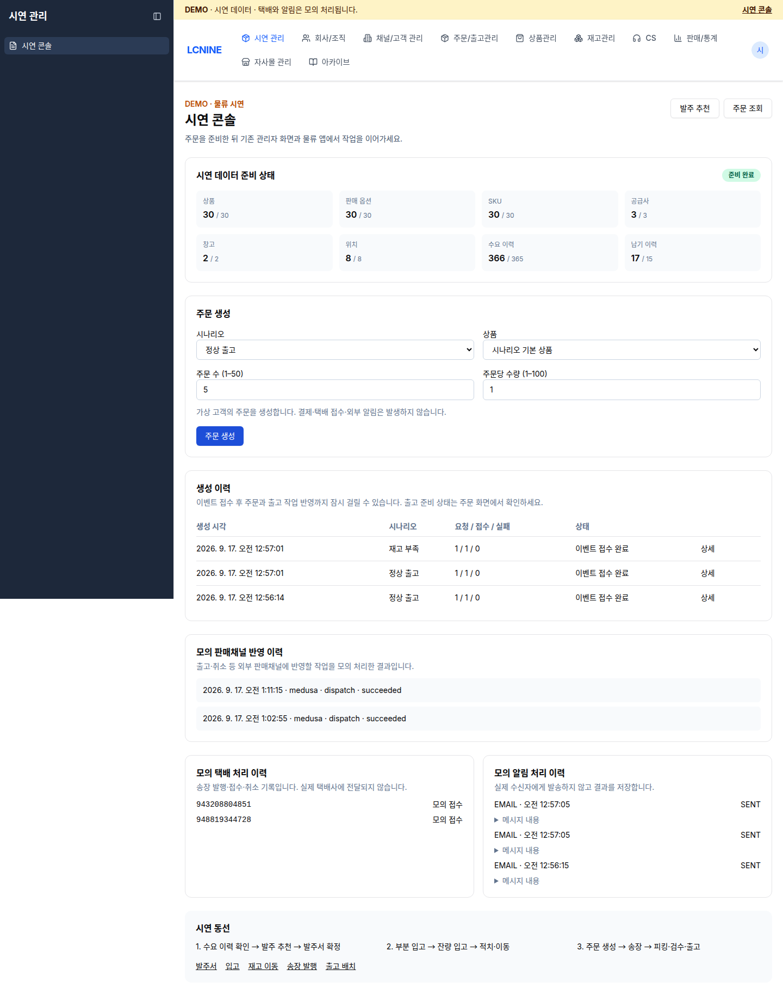

# Demo 운영 메모

## 접속과 범위

- 관리자 콘솔: https://admin.almondyoung-next.com/demo
- 로그인: https://auth.almondyoung-next.com
- 업무 API: https://core.almondyoung-next.com
- 계정: `demoadmin`(관리자), `demoworker`(창고 작업자).
- 로컬 비밀 파일 `.env.demo-access`에 초기 비밀번호를 보관한다. Git·이미지·문서에 비밀번호를 넣지 않는다.
- 로그인 DTO는 소문자·숫자 ID, 8–20자 비밀번호를 받는다. demo 생성 비밀번호는 무작위 20자다.
- `demoworker`는 `logistics_worker` 역할만 갖는다. demo 콘솔 및 관리자 API는 접근할 수 없다.
- apex/www와 기존 CloudFront 배포는 그대로 유지한다. demo 서비스는 하위 도메인을 사용한다.

## 재배포

순서: `deployments/lcnine/platform` → `auth` → `services`에서 `sst deploy --stage demo`.

각 스택 디렉터리에서 실행한다. 저장소 루트에서 `--config`만 지정하면 OpenNext의 상대 경로 패키징이 실패할 수 있다. 별도 worktree에서 auth-web/admin-web의 `node_modules`를 다른 체크아웃으로 절대 경로 symlink하면 Lambda 배포 파일에서 `next` 패키지가 빠질 수 있으므로 해당 앱에 실제 의존성을 설치한다. 배포 후 빌드 성공뿐 아니라 로그인 URL과 관리자 페이지의 실제 HTTP 응답을 확인한다.

동시에 다른 Docker 작업이 수행되는 호스트에서는 전용 buildx builder를 만들고 `BUILDX_BUILDER=<이름> sst deploy --stage demo`로 지정할 수 있다. 최초 배포 중 공유 BuildKit 재시작으로 ARM 빌드 연결이 종료돼 전용 `codex-demo-stage` builder를 사용했다. demo Core와 bundle은 `$BUILDPLATFORM`에서 JavaScript를 컴파일하고, production 의존성과 실행 이미지는 ARM 대상 플랫폼으로 만든다.

최초 생성에서만 auth/services에 `DEMO_INFRA_ONLY=true`로 DB와 네트워크를 먼저 만든다. 런타임 배포를 완료한 stage에 이 옵션으로 deploy하면 애플리케이션 리소스가 제거되므로 사용하지 않는다. DB 명령을 위한 `sst shell` 평가에만 사용하는 것은 리소스를 변경하지 않는다.

DB 순서는 배포별 `db:bootstrap` → `db:migrate` → `db:seed:ref` → `db:seed:demo --group demo-logistics`다. 공통 인자는 `--stage demo --deployment lcnine-auth` 또는 `lcnine-services` 및 `--yes`다. 최초 infra-only 상태에서는 DB 명령에 `--infra-only`도 전달한다.

인증 seed 실행 시 `.env.demo-access`의 `DEMO_ADMIN_PASSWORD`, `DEMO_WORKER_PASSWORD`, `ADMIN_INITIAL_PASSWORD`, `ADMIN_WEB_OIDC_CLIENT_SECRET`를 환경변수로 공급한다. 마지막 값은 services SST secret `AdminWebOidcClientSecret`과 같아야 한다. auth 스택 자체에는 이 secret이 자동 주입되지 않는다. seed는 기존 비밀번호·RP secret을 임의로 덮어쓰지 않는다. 변경 시 인증 관리 API의 비밀번호 재설정·클라이언트 secret 회전과 SST secret 갱신을 함께 수행한다.

실행 환경의 SST 터널에 프로세스 없이 남은 `sst` 인터페이스가 있어 최초 설치는 demo bastion을 통한 localhost 전용 SSH port forwarding으로 수행했다. live 터널이나 시스템 인터페이스를 변경하지 않았다. 관련 임시 도구·키는 gitignored `.superpowers/sdd/2026-09-16-demo-stage/`에 있다.

## 시연 순서

1. 콘솔에서 준비 상태와 상품·수요·납기 이력을 확인한다.
2. 발주 추천에서 국내·해상·항공 공급사 조건을 확인하고 발주서를 만든다.
3. 부분 입고 → 잔량 입고 → 적치·이동을 수행한다.
4. 콘솔에서 정상 출고 또는 재고 부족 주문을 생성한다. 정상 기본 상품은 30번, 부족 기본 상품은 1번이다.
5. 생성 이력의 주문번호를 눌러 주문 검색으로 이동한다. 이벤트 접수 완료는 주문/출고 준비 완료와 다르며, 비동기 반영 시간을 고려한다.
6. 기존 송장·출고 배치 화면과 물류 앱에서 피킹·검수·출고를 진행한다.
7. 콘솔의 모의 택배, 판매채널 반영, 알림 결과를 확인한다. 실제 외부 업무 시스템에는 전송하지 않는다.

생성 요청은 브라우저에 requestId를 먼저 보관한다. 네트워크 오류 후 재확인은 같은 requestId로 처리한다. 일부 실패 재시도는 미완료 항목만 처리한다. 초기화/삭제 기능은 콘솔에 제공하지 않는다.

seed 재실행은 시연 중 생성된 발주·입고·주문·현재 재고를 초기화하지 않는다. 알려진 고정 fixture를 보완한다. 과거 납기 이력용 입고 15건은 적치 완료로 기록해 실제 보충 입고의 적치 대상과 섞이지 않도록 했다. 부족 시나리오는 생성 시점의 가용 재고를 확인하고 주문 수량을 조정한다.

## 물류 앱

`yarn --cwd native/warehouse-app tauri:build:demo`로 demo 전용 앱을 만든다. 별도 앱 식별자 `kr.lcnine.almondwms.demo`, callback `almondwms-demo://oauth/callback`, demo API·issuer·authorize URL을 사용한다. 운영 앱의 로컬 저장소와 분리된다.

호스트 OS용 설치 파일과 웹 번들 검증, 실제 Windows/PDA의 스캐너·프린터·딥링크 검증은 구분한다. 다른 OS의 서명된 설치 파일은 해당 OS/SDK에서 빌드해야 한다.

## 검증 상태

- 실제 IdP API: 관리자·작업자 로그인 200, 회원가입 차단 404.
- 실제 auth-web 브라우저: 관리자·작업자 로그인 성공, 회원가입 링크 없음.
- 물류 앱 OAuth 계약: 작업자 로그인 → public PKCE(S256) → 임의 포트 loopback callback → token 교환 200. 토큰 audience=`warehouse-app`, roles=`[logistics_worker]` 확인.
- 실제 admin-web OIDC 로그인 후 `/demo` 화면 진입 성공. 작업자 계정의 관리자 화면 접근은 `/unauthorized`로 차단.
- 작업자 토큰으로 Core 창고 조회 200, demo 관리 API 403.
- 발주 추천은 30 SKU 평가 후 25건 제안. 발주 확정 → 2+2 분할 입고 → 2개 적치 → 1개 동일 창고 내 이동을 수행했고, 위치별 수량 및 전체 재고 +4, 발주 미입고 잔량 0을 검증했다. 검증 발주 ID: `75138a59-fdd0-432c-8cd1-96fe30a8f04f`.
- 브라우저 콘솔에서 주문 생성 202, 상품 30개 선택지, 생성 주문번호로 기존 주문 내역 검색 이동을 확인했다. 데스크톱 및 390px 화면을 검사했다.
- 동일 생성 요청을 재전송해 동일 run 및 동일 주문 항목이 반환되는 것을 확인했다. 생성 run의 `items[].orderId`는 채널 측 상관 ID이며 Core `salesOrderId`와 다르다. Core 업무 API에는 실제 Core 주문 ID를 사용한다.
- 정상 주문의 모의 송장 발행 → 작업자 OIDC 스캔 → 출고 완료를 확인했다. 송장 `948819344728`, Core shipment `fd09447d-1781-4012-8518-101f7097e134`. 모의 판매채널 반영 `succeeded` 및 이메일 `SENT`/`simulated=true` 이력도 영속화됐다.
- 부족 주문은 최초 2/10 예약 상태에서 출고 계획이 409 `SHIPMENT_NOT_FULLY_RESERVED`로 차단됐다. 8개 보충 발주·입고·적치 후 재예약 10/10, 작업자 OIDC 스캔 및 출고를 완료했다. 송장 `943208804851`, Core 주문 `74ba7f75-a2f9-49b3-add6-c79ff7eca029`. 최종 fulfillment 완료, 출고 수량 10, 해당 SKU 미적치 건수 0을 확인했다.
- 두 주문 모두 모의 판매채널 반영이 첫 시도에 성공했고, 모의 이메일 `SENT` 결과가 저장됐다. 실제 수신 대상은 `.invalid` 도메인이며 외부 전송은 하지 않았다. 공개 Resend webhook은 404로 차단된다.
- 최종 auth/admin 접속 및 user/core/file/channel-adapter/analytics/notification 상태 확인 모두 HTTP 200. 유지한 ECS 서비스는 desired/running 1/1, 배포 완료 상태를 확인했다.
- Linux 설치 파일 빌드 성공: `LCNINE Logistics Demo_0.1.0_amd64.deb`, 패키지 `lcnine-logistics-demo`.

실제 배포 및 업무 API 검증 완료일: 2026-09-17 (KST). 물리 장비의 스캔·인쇄 인수는 수행하지 않았다. Windows/PDA용 설치 파일과 해당 장비의 OAuth 딥링크는 별도 검증 대상이다.

## 배포 화면

실제 demo 배포에서 가상 데이터만 사용한 화면이다.

[모바일 시연 콘솔 화면](assets/demo-stage/console-mobile.png)
