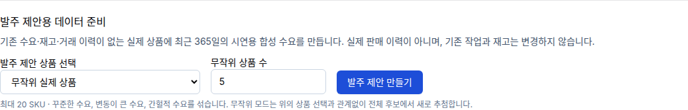
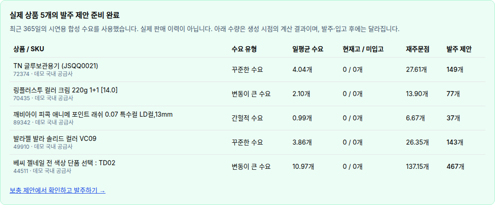

# Demo 실제 상품 발주 제안 생성 검증

## 적용 범위

- branch: `codex/demo-replenishment`
- PR: https://github.com/LCNINE/almondyoung-server/pull/889
- 환경: `demo` (`*.almondyoung-next.com`). 운영 DB 변경 없음.
- Core `POST /demo/replenishment`, admin-web 시연 콘솔·동일 출처 프록시, Markdown 매뉴얼.
- 추가 환경변수 및 DB 마이그레이션 없음. 기존 demo/mock 환경 설정과 재고 관리 권한 적용.

## 동작과 데이터 경계

기본 5개, 최대 20개의 실제 SKU를 무작위 추첨하거나 선택 상품의 구성 SKU를 지정한다. 기존 수요·재고·거래 이력이 없는 SKU만 사용한다. 후보 행 잠금과 잠금 후 새 조회로 다른 발주·입고 작업과의 경합을 처리한다.

365일의 합성 수요를 꾸준한 수요·변동 수요·간헐적 수요로 구성한다. 재고 원장은 변경하지 않으며 실제 보충 엔진의 발주 제안이 1~1,000개 범위인 경우만 채택한다. MOQ와 포장 단위는 기존 엔진의 계산을 사용한다. 요청한 개수를 채우지 못하면 요청 전체를 롤백한다.

기존 `demand_source`의 가져온 이력 구분(`sellmate`)을 사용하되, SKU별 auto 규칙 메모에 `시연용 합성 수요`, 요청 ID, `실제 판매 이력 아님`을 기록한다. auto 규칙의 안전재고·납기 등 계산 파라미터는 덮어쓰지 않는다. UI 결과에도 합성 데이터임을 명시한다. 운영 판매 실적이나 실제 공급사 납기·가격의 적정성을 평가하는 자료가 아니다.

## 검증

- 전체 Jest: 651 suites, 5,747 tests 통과. 별도 환경이 필요한 156 suites / 1,290 tests 제외.
- 이후 후보 조회 최적화·동시 작업 수정에 대해 최종 DB 통합 7개 재실행 통과.
- Core 입력·모듈 등록 11개, admin 입력·프록시 17개 통과.
- root/admin 타입 검사, 변경 파일 ESLint, diff whitespace 검사 통과.
- 두 연결을 사용해 미커밋 발주가 보유한 SKU 잠금과 생성 요청이 경합하는 경우 재현. 수정 전 실패, 수정 후 기존 상품에 합성 수요를 쓰지 않음을 확인.
- 요청 재전송, 서로 다른 요청의 동시 추첨, 부적합 상품 요청의 롤백, 과도한 수량의 롤백, 실제 발주 잔량 반영 후 추가 제안 소멸, demo 외 환경 거부 확인.
- 전체 39,671 SKU demo DB에서 후보 조회 `EXPLAIN (ANALYZE, BUFFERS)`: 648ms. 수요 이력을 상품별로 반복 조회하던 쿼리를 사용된 SKU 집합의 1회 계산으로 변경했다.

## 배포 환경에서 실제 화면 확인

시연 콘솔에서 기본 5개 생성 후 같은 요청을 재확인했다. 요청 ID는 `7c1e92ee-f574-450d-8cda-21fc24cacd44`이다. 새 상품을 추가로 생성하지 않고 저장 결과가 그대로 반환되는 것을 확인했다.

| SKU | 상품 | 수요 유형 | 발주 제안 |
|---|---|---|---:|
| 72374 | TN 글루보관용기 (JSQQ0021) | 꾸준한 수요 | 149 |
| 70435 | 링플러스투 컬러 크림 220g 1+1 [14.0] | 변동 수요 | 77 |
| 89342 | 깨비아이 피콕 애니메 포인트 래쉬 0.07 특수컬 LD컬,13mm | 간헐적 수요 | 37 |
| 49910 | 발라젤 발라 솔리드 컬러 VC09 | 꾸준한 수요 | 143 |
| 44511 | 베씨 젤네일 전 색상 단품 선택 : TD02 | 변동 수요 | 467 |

보충 제안 API와 관리자 화면에서 같은 5개 SKU 및 수량을 확인했다. 총 제안은 기존 가상 상품 24개와 실제 상품 5개를 합한 29개다. 390px 화면에서 문서 전체 가로 넘침 없음, 브라우저 page error 없음. 생성 결과는 생성 시점 기록이며 이후 직원의 발주·입고에 따라 현재 제안은 바뀐다.

