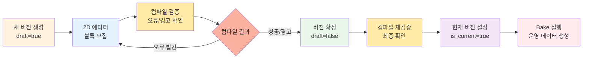
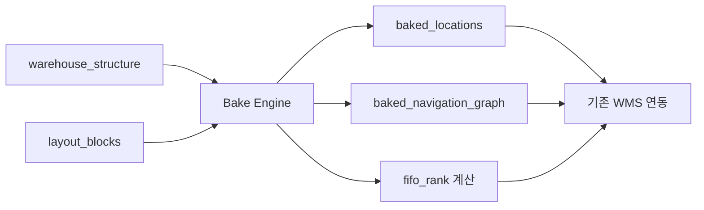

# WMS 창고 레이아웃 시스템 설계

## 📋 개요

본 문서는 WMS(Warehouse Management System)에서 창고의 물리적 레이아웃을 관리하고 최적의 피킹 경로를 생성하기 위한 시스템 설계를 다룹니다.

기존의 단순한 좌표 기반 시스템의 한계를 극복하고, 실제 창고 운영 환경을 반영한 유연하고 확장 가능한 솔루션을 제시합니다.

---

## 🎯 핵심 아이디어

### 문제 정의
- **피킹 동선 최적화**: 작업자가 바구니/카트로 창고를 순회하며 효율적으로 상품을 수집
- **복잡한 창고 구조**: 불규칙한 랙 배치, 중간 통로, 양방향 피킹 경로 지원
- **확장성**: 수천 개의 로케이션을 수동으로 관리하는 것은 비현실적

### 해결 방안
1. **동적 로케이션 자동 생성**: 구조 정의만으로 모든 로케이션 생성
2. **2D GUI 레이아웃 에디터**: 마인크래프트 방식의 블록 배치 시스템
3. **그래프 기반 경로 최적화**: 실제 물리적 제약을 반영한 최단경로 계산

---

## 🏗️ 로케이션 체계

### 1. 표준 로케이션 (Standard Locations)
**자동 생성되는 체계적인 로케이션**

#### 구조
```
[열 이름]-[랙 번호]-[빈 번호]
예: A-04-13 (A열, 4번째 랙, 13번째 빈)
```

#### 동적 생성 로직
```typescript
interface WarehouseStructure {
  columns: string[];              // ['A', 'B', 'C', 'D']
  racksPerColumn: number[];       // [4, 5, 6, 7] (각 열별 랙 수)
  binsPerRack: {
    [column: string]: number[];   // A열: [20, 18, 22, 19] (각 랙별 빈 수)
  };
}

// 예시: 총 22개 랙, 약 400개 빈이 자동 생성됨
```

#### 특징
- ✅ **대량 생성**: 구조 정의 한 번으로 수백/수천 개 로케이션 생성
- ✅ **일관성**: 체계적인 명명 규칙으로 직관적 이해
- ✅ **확장성**: 새로운 열/랙 추가 시 기존 구조 유지

### 2. 독립 로케이션 (Independent Locations)
**수동으로 생성되는 특수 목적 로케이션**

#### 예시
- `입고존`: 트럭에서 내린 상품을 임시 보관
- `흄후드-01`: 화학 제품 등 특수 보관 장소
- `반품구역`: 반품된 상품의 검수 및 재분류
- `포장테이블-A`: 출고 상품 포장 작업 공간

#### 특징
- ✅ **유연성**: 창고별 특수 요구사항 대응
- ✅ **명확한 구분**: 표준 체계와 독립적으로 관리
- ✅ **확장 가능**: 필요에 따라 언제든 추가/제거

---

## 🎮 2D 레이아웃 에디터

### 설계 철학
> "마인크래프트처럼 블록을 배치하여 창고 레이아웃을 시각적으로 구성"

### 격자 좌표 시스템
```
┌─────────────────────────────────────┐
│  (0,0) (1,0) (2,0) (3,0) (4,0)     │
│  (0,1) (1,1) (2,1) (3,1) (4,1)     │  
│  (0,2) (1,2) (2,2) (3,2) (4,2)     │
│  (0,3) (1,3) (2,3) (3,3) (4,3)     │
└─────────────────────────────────────┘
```

---

## 🧱 블록 타입 상세

### 1. 랙 (Rack Block) 🏭
**가장 핵심적인 블록**

#### 속성
- **크기**: 자유로운 가로(width) × 세로(height) 크기
- **뚫린 방향**: 피킹 접근 가능한 방향 지정
  ```
  ┌─────┐
  │  📦  │ ← 왼쪽에서 접근 가능
  │ 랙  │ 
  └─────┘
  ```
- **소속 랙**: 해당 랙의 모든 빈이 이 위치에 있는 것으로 간주

#### 제약사항
- ✅ 표준 로케이션 위치 지정의 **유일한 방법**
- ✅ 뚫린 방향에 인접한 길에서만 피킹 가능
- ✅ 하나의 랙 = 하나의 블록

#### 예시
```typescript
interface RackBlock {
  type: 'rack';
  position: { x: number; y: number };
  size: { width: number; height: number };
  openDirections: ('north' | 'south' | 'east' | 'west')[];
  rackId: string; // 'A-04' 등
}
```

### 2. 로케이션 집합 (Location Set Block) 📦
**독립 로케이션들을 배치하는 블록**

#### 속성
- **크기**: 자유로운 가로 × 세로 크기
- **뚫린 방향**: 접근 가능한 방향들
- **포함 로케이션**: 1개 이상의 독립 로케이션 지정

#### 사용 사례
```typescript
interface LocationSetBlock {
  type: 'location_set';
  position: { x: 2; y: 5 };
  size: { width: 3; height: 2 };
  openDirections: ['north', 'east'];
  locationIds: ['입고존', '임시보관-A', '임시보관-B'];
}
```

#### 제약사항
- ✅ 독립 로케이션 위치 지정의 **유일한 방법**
- ✅ 여러 로케이션을 하나의 물리적 공간에 배치 가능

### 3. 길 (Path Block) 🛤️
**두 번째로 핵심적인 블록**

#### 역할
- **이동 통로**: 작업자와 카트의 이동 경로
- **피킹 접근**: 랙/로케이션 집합의 뚫린 방향과 연결

#### 제약사항
- ✅ 작업자/카트는 **오직 길을 통해서만** 이동 가능
- ✅ 피킹은 뚫린 방향에 **인접한 길에서만** 수행 가능

#### 예시 레이아웃
```
[랙A] [길] [랙B]     [랙C] [길] [랙D]
[랙A] [길] [랙B]     [랙C] [길] [랙D]
[길] [길] [길] [길] [길] [길] [길]
[랙E] [길] [랙F]     [랙G] [길] [랙H]
```

### 4. 열 (Column Block) 📏
**랙 그룹화를 위한 편의 블록**

#### 목적
- **일괄 배치**: 특정 범위의 랙을 한 번에 배치
- **일관성 유지**: 같은 열의 랙들이 동일한 속성 공유

#### 종속 관계
```typescript
interface ColumnBlock {
  type: 'column';
  rackRange: { from: 'A-01', to: 'A-05' };
  
  // 🔒 완전 종속 (오버라이드 불가)
  basePosition: { x: number; y: number };
  perpendicularSize: number; // 열 방향 수직 크기
  
  // 🔄 부분 종속 (랙별 오버라이드 가능)
  defaultParallelSize: number; // 열 방향 평행 크기
  defaultOpenDirections: Direction[];
  
  // 📋 랙별 개별 설정
  rackOverrides: {
    [rackId: string]: {
      parallelSize?: number;
      openDirections?: Direction[];
    }
  };
}
```

#### 위치 계산 로직
```typescript
function calculateRackPosition(column: ColumnBlock, rackIndex: number) {
  let cumulativeLength = 0;
  
  // 이전 랙들의 길이를 누적
  for (let i = 0; i < rackIndex; i++) {
    const prevRackSize = column.rackOverrides[`${column.prefix}-${i+1:02d}`]?.parallelSize 
                        || column.defaultParallelSize;
    cumulativeLength += prevRackSize;
  }
  
  return {
    x: column.basePosition.x + (column.direction === 'horizontal' ? cumulativeLength : 0),
    y: column.basePosition.y + (column.direction === 'vertical' ? cumulativeLength : 0)
  };
}
```

---

## 🗃️ 데이터베이스 설계

### 설계 철학: "에디터 중심 스키마 + 버전 관리"

> **핵심 아이디어**: 
> 1. 2D 에디터에서 사용하는 블록 정보만 저장하고, 실제 로케이션과의 매핑은 나중에 "bake" 과정에서 처리
> 2. Git과 유사한 버전 관리로 레이아웃 변경 이력을 안전하게 보관

### 🏷️ 엔티티 명명 체계

- **Layout Profile**: 한 창고의 레이아웃 버전들을 관리하는 프로필 (≈ Git Repository)
- **Layout Version**: 특정 시점의 2D 맵 스냅샷 (≈ Git Commit)  
- **Layout Block**: 개별 블록 정보 (랙, 길, 로케이션 집합 등)

### 1단계: 에디터 데이터 저장 (현재 목표)

#### 1. warehouse_structure (창고 구조 정의)
```sql
CREATE TABLE warehouse_structure (
    id UUID PRIMARY KEY DEFAULT uuid_v7(),
    warehouse_id UUID REFERENCES warehouses(id) UNIQUE,
    
    -- 동적 생성 규칙 (표준 로케이션용)
    structure_config JSONB NOT NULL,
    
    created_at TIMESTAMP DEFAULT NOW(),
    updated_at TIMESTAMP DEFAULT NOW()
);
```

#### 2. layout_profiles (레이아웃 프로필) 🆕
```sql
CREATE TABLE layout_profiles (
    id UUID PRIMARY KEY DEFAULT uuid_v7(),
    warehouse_id UUID REFERENCES warehouses(id) UNIQUE,
    
    -- 프로필 메타데이터
    name VARCHAR(255) NOT NULL DEFAULT 'Main Layout',
    description TEXT,
    
    -- 현재 활성 버전
    current_version_id UUID, -- FK는 나중에 추가
    
    created_at TIMESTAMP DEFAULT NOW(),
    updated_at TIMESTAMP DEFAULT NOW()
);
```

#### 3. layout_versions (레이아웃 버전) 🆕
```sql
CREATE TABLE layout_versions (
    id UUID PRIMARY KEY DEFAULT uuid_v7(),
    profile_id UUID REFERENCES layout_profiles(id) ON DELETE CASCADE,
    
    -- 버전 정보
    version_number INTEGER NOT NULL, -- 1, 2, 3, ...
    version_name VARCHAR(255), -- "초기 설계", "최적화 v1" 등
    description TEXT,
    
    -- 상태 관리
    is_current BOOLEAN NOT NULL DEFAULT false,
    is_draft BOOLEAN NOT NULL DEFAULT true,
    
    -- 메타데이터
    created_by VARCHAR(255), -- 생성자 정보
    created_at TIMESTAMP DEFAULT NOW(),
    
    UNIQUE(profile_id, version_number)
);

-- 현재 버전 FK 추가
ALTER TABLE layout_profiles 
ADD CONSTRAINT fk_current_version 
FOREIGN KEY (current_version_id) REFERENCES layout_versions(id);
```

#### 4. layout_blocks (2D 맵 블록 정보) - 수정
```sql
CREATE TABLE layout_blocks (
    id UUID PRIMARY KEY DEFAULT uuid_v7(),
    version_id UUID REFERENCES layout_versions(id) ON DELETE CASCADE, -- warehouse_id 대신
    block_type VARCHAR(20) NOT NULL, -- 'rack' | 'location_set' | 'path' | 'column'
    
    -- 2D 그리드 위치
    position_x INTEGER NOT NULL,
    position_y INTEGER NOT NULL,
    width INTEGER NOT NULL,
    height INTEGER NOT NULL,
    
    -- 접근 방향
    open_directions TEXT[], -- ['north', 'south', 'east', 'west']
    
    -- 블록별 핵심 식별 정보만 저장
    block_reference JSONB NOT NULL, -- 타입별 최소한의 참조 정보
    
    -- 메타데이터
    display_name VARCHAR(100), -- 에디터에서 보여줄 이름
    
    created_at TIMESTAMP DEFAULT NOW(),
    updated_at TIMESTAMP DEFAULT NOW()
);
```

### 블록별 Reference 데이터 구조

#### 🏭 **랙 블록**
```typescript
interface RackBlockReference {
  type: 'rack';
  rackId: string;  // 예: "A-04" (단순 식별자만)
}
```

#### 📏 **열 블록** 
```typescript
interface ColumnBlockReference {
  type: 'column';
  columnName: string;      // 예: "A"
  rackRange: {             // 예: 1~5번 랙
    start: number;         // 1
    end: number;           // 5  
  };
  defaultRackSize?: {      // 기본 랙 크기 (오버라이드 가능)
    width: number;
    height: number;
  };
}
```

#### 📦 **로케이션 집합 블록**
```typescript
interface LocationSetBlockReference {
  type: 'location_set';
  locationNames: string[]; // 예: ["입고존", "임시보관-A"]
}
```

#### 🛤️ **길 블록**
```typescript
interface PathBlockReference {
  type: 'path';
  // 길은 별도 참조 정보 불필요 (순수 이동 통로)
}
```

### 🔗 **참조 무결성 전략: "느슨한 결합 + 컴파일 검증"**

#### 🤔 **Foreign Key 딜레마**
```
문제 상황:
로케이션 집합 블록 → 독립 로케이션들 참조
독립 로케이션 삭제 시 FK 제약조건 처리?

❌ SET NULL/CASCADE: 버전 히스토리 손실
❌ RESTRICT/DEFAULT: 사용 안 하는 버전 때문에 삭제 불가
```

#### ✅ **해결책: 직접 FK 제거 + 컴파일 검증**

**핵심 설계 원칙:**
> 레이아웃 버전은 **순수한 설계 데이터**로서 다른 테이블과 직접적인 FK 관계를 갖지 않습니다. 
> 대신 "컴파일" 과정을 통해 현재 시스템 상태와의 일치성을 검증합니다.

#### 📋 **Layout Blocks의 참조 방식**
```typescript
// ❌ 직접 FK 참조 (기존 방식)
interface WrongLocationSetReference {
  type: 'location_set';
  locationIds: UUID[];  // FK 제약조건 문제 발생
}

// ✅ 문자열 식별자 참조 (새로운 방식)
interface CorrectLocationSetReference {
  type: 'location_set';
  locationNames: string[];  // 단순 문자열, FK 없음
}
```

### 🔧 **컴파일 시스템 (Compilation System)**

#### 컴파일이란?
> 레이아웃 버전이 **현재 시스템 상태**와 얼마나 잘 일치하는지 검증하는 과정
> (아직 Bake 단계 이전의 무결성 평가)

#### 컴파일 프로세스
```typescript
POST /layout/versions/{id}/compile
{
  "check_integrity": true,
  "check_connectivity": true,
  "check_accessibility": true
}

// 응답
{
  "compilation_status": "warning", // "success" | "warning" | "error"
  "errors": [...],
  "warnings": [...],
  "summary": {
    "total_blocks": 156,
    "validated_locations": 1247,
    "missing_references": 3,
    "connectivity_issues": 0
  }
}
```

#### 🚨 **컴파일 오류 (Compilation Errors)**
**레이아웃 버전을 사용할 수 없을 정도의 심각한 문제**

```typescript
interface CompilationError {
  type: 'error';
  code: string;
  message: string;
  block_id?: string;
  location?: string;
}

// 예시 오류들
const errorExamples = [
  {
    type: 'error',
    code: 'MISSING_RACK_BLOCK',
    message: 'A열에 A-08~A-10 랙이 필요하지만 해당 랙 블록이 없습니다',
    location: 'A-08, A-09, A-10'
  },
  {
    type: 'error', 
    code: 'MISSING_LOCATION',
    message: '로케이션 집합에서 참조하는 "입고존"이 존재하지 않습니다',
    block_id: 'block-inbound-zone-v3'
  },
  {
    type: 'error',
    code: 'DISCONNECTED_BLOCK',
    message: 'B-05 랙이 길과 연결되지 않아 접근할 수 없습니다',
    block_id: 'block-rack-b05'
  }
];
```

**오류가 있는 버전의 제약:**
- ✅ `is_draft = true`로만 저장 가능
- ❌ `is_current = true` 설정 불가
- ❌ Bake 실행 불가

#### ⚠️ **컴파일 경고 (Compilation Warnings)**  
**작동은 하지만 개선이 권장되는 미심쩍은 부분**

```typescript
const warningExamples = [
  {
    type: 'warning',
    code: 'UNUSED_RACK_BLOCK', 
    message: 'A열은 A-10까지만 있는데 A-13 랙 블록이 정의되어 있습니다',
    block_id: 'block-rack-a13',
    suggestion: '해당 랙 블록을 제거하거나 A열 구조를 확장하세요'
  },
  {
    type: 'warning',
    code: 'INEFFICIENT_PATH',
    message: 'C구역과 D구역 사이에 추가 통로가 있으면 피킹 효율이 향상됩니다',
    suggestion: 'position_x: 15, position_y: 8 위치에 길 블록 추가 권장'
  },
  {
    type: 'warning',
    code: 'LOCATION_CAPACITY_MISMATCH',
    message: '"임시보관-A"의 실제 용량(500)과 블록 설정(1000)이 다릅니다',
    block_id: 'block-temp-storage'
  }
];
```

**경고가 있는 버전:**
- ✅ `is_current = true` 설정 가능
- ✅ Bake 실행 가능
- ⚠️ 운영진에게 알림 발송

### 📋 버전 관리 워크플로우

#### 레이아웃 버전 라이프사이클 (컴파일 포함)


#### 버전 관리 API (컴파일 포함)
```typescript
// 새 버전 생성
POST /warehouses/{id}/layout/versions
{
  "version_name": "최적화 v2",
  "description": "A구역 재배치 및 통로 확장",
  "copy_from_version_id": "version-123" // 기존 버전 복사
}

// 컴파일 검증 (핵심 추가)
POST /layout/versions/{id}/compile
{
  "check_integrity": true,      // 무결성 검사
  "check_connectivity": true,   // 연결성 검사  
  "check_accessibility": true   // 접근성 검사
}

// 버전 확정 (draft → published, 컴파일 필수)
PUT /layout/versions/{id}/publish
{
  "force": false  // true시 경고 무시하고 강제 확정
}

// 현재 버전으로 설정 (컴파일 성공 필수)
PUT /layout/profiles/{id}/current-version
{
  "version_id": "version-456"
}

// 버전 목록 조회 (컴파일 상태 포함)
GET /warehouses/{id}/layout/versions
// 응답에 last_compilation_status, error_count, warning_count 포함
```

### 2단계: Bake 과정 (향후 구현)

```sql
-- Bake된 결과물들 (나중에 구현)
CREATE TABLE baked_layouts (
    id UUID PRIMARY KEY DEFAULT uuid_v7(),
    profile_id UUID REFERENCES layout_profiles(id),
    source_version_id UUID REFERENCES layout_versions(id),
    
    -- Bake 메타정보
    baked_at TIMESTAMP DEFAULT NOW(),
    baked_by VARCHAR(255),
    is_active BOOLEAN DEFAULT false, -- 현재 운영 중인 Bake 결과
    
    created_at TIMESTAMP DEFAULT NOW()
);

CREATE TABLE baked_locations (
    id UUID PRIMARY KEY DEFAULT uuid_v7(),
    baked_layout_id UUID REFERENCES baked_layouts(id) ON DELETE CASCADE,
    code VARCHAR(64) NOT NULL,
    
    -- 원본 블록 참조
    source_block_id UUID REFERENCES layout_blocks(id),
    
    -- 실제 운영 데이터
    capacity INTEGER,
    is_active BOOLEAN DEFAULT true,
    
    created_at TIMESTAMP DEFAULT NOW(),
    updated_at TIMESTAMP DEFAULT NOW(),
    
    UNIQUE(baked_layout_id, code)
);

CREATE TABLE baked_navigation_graph (
    id UUID PRIMARY KEY DEFAULT uuid_v7(),
    baked_layout_id UUID REFERENCES baked_layouts(id) ON DELETE CASCADE,
    
    -- 네비게이션 그래프 데이터
    graph_data JSONB NOT NULL,
    
    -- 성능 지표
    total_nodes INTEGER,
    total_edges INTEGER,
    average_path_length DECIMAL(10,2),
    
    created_at TIMESTAMP DEFAULT NOW()
);
```

### 예시 데이터

#### 1. Layout Profile (레이아웃 프로필)
```json
{
  "id": "profile-wh001",
  "warehouse_id": "wh-001",
  "name": "창고 A 메인 레이아웃",
  "description": "창고 A의 표준 레이아웃 설계",
  "current_version_id": "version-003",
  "created_at": "2024-01-15T09:00:00Z"
}
```

#### 2. Layout Versions (레이아웃 버전들)
```json
[
  {
    "id": "version-001",
    "profile_id": "profile-wh001",
    "version_number": 1,
    "version_name": "초기 설계",
    "description": "창고 A의 최초 레이아웃 설계",
    "is_current": false,
    "is_draft": false,
    "created_by": "admin@company.com",
    "created_at": "2024-01-15T09:00:00Z"
  },
  {
    "id": "version-002", 
    "profile_id": "profile-wh001",
    "version_number": 2,
    "version_name": "통로 확장",
    "description": "메인 통로 폭 확장 및 C구역 재배치",
    "is_current": false,
    "is_draft": false,
    "created_by": "manager@company.com",
    "created_at": "2024-01-20T14:30:00Z"
  },
  {
    "id": "version-003",
    "profile_id": "profile-wh001",
    "version_number": 3,
    "version_name": "최적화 v1",
    "description": "피킹 동선 최적화 및 FIFO 순위 조정",
    "is_current": true,
    "is_draft": false,
    "created_by": "operations@company.com", 
    "created_at": "2024-01-25T11:15:00Z"
  }
]
```

#### 3. WarehouseStructure 설정
```json
{
  "columns": ["A", "B", "C", "D"],
  "racksPerColumn": [4, 5, 6, 7],
  "binsPerRack": {
    "A": [20, 18, 22, 19],
    "B": [24, 20, 21, 23, 18],
    "C": [15, 16, 18, 20, 22, 19],
    "D": [25, 23, 21, 19, 17, 15, 13]
  }
}
```

#### 4. Layout Blocks (version-003의 블록들)

**열 블록:**
```json
{
  "id": "block-column-a-v3",
  "version_id": "version-003",
  "block_type": "column",
  "position_x": 2, "position_y": 1,
  "width": 8, "height": 2,
  "open_directions": ["west"],
  "block_reference": {
    "type": "column",
    "columnName": "A",
    "rackRange": { "start": 1, "end": 4 }
  },
  "display_name": "A열 (1~4번 랙)"
}
```

**랙 블록:**
```json
{
  "id": "block-rack-a04-v3",
  "version_id": "version-003", 
  "block_type": "rack",
  "position_x": 8, "position_y": 1,
  "width": 2, "height": 1,
  "open_directions": ["west"],
  "block_reference": {
    "type": "rack",
    "rackId": "A-04"
  },
  "display_name": "A-04 랙"
}
```

**로케이션 집합 블록:**
```json
{
  "id": "block-inbound-zone-v3",
  "version_id": "version-003",
  "block_type": "location_set", 
  "position_x": 0, "position_y": 0,
  "width": 3, "height": 2,
  "open_directions": ["east", "south"],
  "block_reference": {
    "type": "location_set",
    "locationNames": ["입고존", "임시보관-A", "임시보관-B"]
  },
  "display_name": "입고 구역"
}
```

**길 블록:**
```json
{
  "id": "block-path-main-v3",
  "version_id": "version-003",
  "block_type": "path",
  "position_x": 1, "position_y": 3,
  "width": 12, "height": 1,
  "open_directions": [],
  "block_reference": {
    "type": "path"
  },
  "display_name": "메인 통로 (확장됨)"
}
```

---

## 🚀 구현 로드맵

### Phase 1: 에디터 중심 스키마 + 버전 관리 + 컴파일 시스템 구축 (3주) 🎯
**목표: 컴파일 검증이 포함된 안전한 버전 관리 기반 완성**

#### 📋 데이터베이스 마이그레이션
- ✅ `warehouse_structure` 테이블 생성
- ✅ `layout_profiles` 테이블 생성 (새로운 프로필 개념)
- ✅ `layout_versions` 테이블 생성 (버전 관리)  
- ✅ `layout_blocks` 테이블 생성 (version_id 연결, FK 제거)

#### 🔧 핵심 API 구현
**Profile & Version 관리:**
- ✅ `POST /warehouses/{id}/layout/profile` - 프로필 생성
- ✅ `POST /warehouses/{id}/layout/versions` - 새 버전 생성
- ✅ `GET /warehouses/{id}/layout/versions` - 버전 목록 조회 (컴파일 상태 포함)
- ✅ `PUT /layout/versions/{id}/publish` - 버전 확정 (컴파일 통과 필수)
- ✅ `PUT /layout/profiles/{id}/current-version` - 현재 버전 설정

**Block 관리 (버전별, 느슨한 결합):**
- ✅ `POST /layout/versions/{id}/blocks` - 블록 생성 (문자열 참조)
- ✅ `GET /layout/versions/{id}/blocks` - 블록 목록 조회
- ✅ `PUT /blocks/{id}` - 블록 수정
- ✅ `DELETE /blocks/{id}` - 블록 삭제

**컴파일 시스템 (핵심 추가):**
- ✅ `POST /layout/versions/{id}/compile` - 레이아웃 검증
- ✅ 컴파일 오류/경고 분류 및 응답
- ✅ 무결성, 연결성, 접근성 검사 엔진

#### 🛡️ 유효성 검증 & 비즈니스 로직
- ✅ 블록 겹침, 범위 초과 검증 (기본)
- ✅ 컴파일 오류 시 draft 제한, 현재 버전 설정 금지
- ✅ 컴파일 경고 시 알림 발송
- ✅ 느슨한 결합으로 FK 제약조건 문제 해결
- ✅ 버전 상태 관리 (draft ↔ published)
- ✅ 기존 버전 복사 기능

#### 🧮 **컴파일 검증 규칙**
**오류 (Error) 케이스:**
- ✅ 필수 랙 블록 누락 검사
- ✅ 참조하는 독립 로케이션 존재 여부
- ✅ 길과 연결되지 않은 블록 탐지
- ✅ 접근 불가능한 구역 검사

**경고 (Warning) 케이스:**
- ✅ 사용되지 않는 블록 탐지
- ✅ 비효율적인 경로 제안
- ✅ 용량 불일치 검사
- ✅ 최적화 개선 제안

### Phase 2: 2D 레이아웃 에디터 (6주) 🎮
**목표: 실제 사용 가능한 블록 배치 에디터 완성**

- ✅ React 기반 그리드 컴포넌트
- ✅ 드래그 앤 드롭 블록 배치
- ✅ 4가지 블록 타입별 UI 컴포넌트
- ✅ 실시간 블록 충돌 검사
- ✅ 창고 구조 설정 UI (동적 생성 규칙)
- ✅ 블록 속성 편집 패널

### Phase 3: Bake 시스템 구현 (4주) 🔄
**목표: 에디터 데이터를 실제 운영용 데이터로 변환**

- ✅ Bake 엔진 개발
  - 표준 로케이션 자동 생성
  - 독립 로케이션 매핑
  - 네비게이션 그래프 생성
- ✅ `baked_locations` 테이블 구현
- ✅ `baked_navigation_graph` 테이블 구현
- ✅ Bake 상태 관리 (버전, 동기화)

### Phase 4: 피킹 최적화 연동 (4주) 🎯
**목표: Bake된 데이터를 활용한 실제 피킹 시스템 연동**

- ✅ 그래프 기반 경로 계산 알고리즘
- ✅ 기존 WMS 모듈과 연동
- ✅ 피킹 리스트 생성 시 최적 경로 적용
- ✅ 성능 최적화 및 캐싱

### Phase 5: 고급 기능 (선택사항, 4주) ⚡
- ✅ AI 기반 레이아웃 추천
- ✅ 실시간 동선 분석
- ✅ 모바일 앱 연동
- ✅ 레이아웃 A/B 테스트

## 💡 Bake 과정 상세

### Bake란?
> 에디터에서 설계한 2D 블록 데이터를 실제 WMS에서 사용할 수 있는 형태로 변환하는 과정

### Bake 과정 플로우


### Bake 시점
1. **수동 Bake**: 관리자가 레이아웃 완성 후 수동 실행
2. **자동 Bake**: 레이아웃 변경 감지 시 자동 실행 (나중에)
3. **스케줄 Bake**: 야간 시간대 정기 실행 (대규모 창고용)

### 버전별 Bake 과정 예시

#### 1. 현재 버전 기반 Bake 실행
```typescript
// 현재 활성 버전 (version-003) Bake
POST /layout/profiles/{profile-id}/bake
{
  "version_id": "version-003", // 현재 버전
  "description": "최적화 v1 버전 운영 적용"
}
```

#### 2. Bake 결과물
```typescript
// Baked Layout 메타데이터
const bakedLayout = {
  id: "baked-layout-20240125",
  profile_id: "profile-wh001",
  source_version_id: "version-003",
  is_active: true,
  baked_at: "2024-01-25T15:30:00Z",
  baked_by: "operations@company.com"
};

// warehouse_structure + layout_blocks (version-003) → baked_locations
const bakedLocations = [
  { 
    code: "A-01-01", 
    source_block_id: "block-column-a-v3", 
    baked_layout_id: "baked-layout-20240125",
    capacity: 50 
  },
  { 
    code: "A-01-02", 
    source_block_id: "block-column-a-v3", 
    baked_layout_id: "baked-layout-20240125",
    capacity: 50 
  },
  // ... 400개 자동 생성
  { 
    code: "입고존", 
    source_block_id: "block-inbound-zone-v3", 
    baked_layout_id: "baked-layout-20240125",
    capacity: 1000 
  }
];

// layout_blocks (version-003) → baked_navigation_graph  
const navigationGraph = {
  id: "nav-graph-20240125",
  baked_layout_id: "baked-layout-20240125",
  graph_data: {
    nodes: { "A-01": { x: 2, y: 1 }, "A-02": { x: 4, y: 1 } },
    edges: { "A-01->A-02": { distance: 5, estimated_time: 30 } },
    picking_routes: [
      { start: "A-01", path: ["A-01", "path-1", "A-02"], total_distance: 15 }
    ]
  },
  total_nodes: 156,
  total_edges: 312,
  average_path_length: 12.5
};
```

#### 3. 버전 변경 시 안전한 롤백
```typescript
// 새 버전으로 변경
PUT /layout/profiles/{id}/current-version
{ "version_id": "version-004" }

// 새 버전 Bake
POST /layout/profiles/{id}/bake

// 문제 발생 시 이전 버전으로 롤백
PUT /layout/profiles/{id}/current-version  
{ "version_id": "version-003" }

// 이전 Bake 결과 재활성화 (새로 Bake 할 필요 없음)
PUT /baked-layouts/{baked-layout-20240125}/activate
```

---

## 💡 기대 효과

### 운영 효율성 ⚡
- **피킹 시간 단축**: 최적화된 동선으로 30-50% 시간 절약
- **작업자 피로도 감소**: 불필요한 이동 거리 최소화
- **처리량 증대**: 동일 인력으로 더 많은 주문 처리
- **실시간 최적화**: 레이아웃 변경이 즉시 피킹 시스템에 반영

### 관리 편의성 🎮
- **시각적 관리**: 직관적인 2D GUI로 누구나 쉽게 이해
- **신속한 적응**: 창고 레이아웃 변경 시 즉시 반영
- **확장성**: 새로운 창고 추가 시 빠른 설정
- **버전 관리**: Git과 유사한 체계적인 변경 이력 관리

### 위험 관리 & 안정성 🛡️
- **안전한 실험**: Draft 모드에서 레이아웃 테스트 후 적용
- **컴파일 검증**: 실제 적용 전 모든 오류/경고 사전 탐지
- **단계적 검증**: Draft → Compile → Publish → Bake 순서로 안전성 확보
- **즉시 롤백**: 문제 발생 시 이전 버전으로 빠른 복구
- **변경 추적**: 모든 레이아웃 변경 사항의 완전한 이력 보관
- **무중단 운영**: 새 레이아웃 준비 중에도 기존 운영 지속
- **참조 무결성**: FK 제약조건 없이도 논리적 일관성 보장

### 비용 절감 💰
- **인력 효율화**: 작업자당 생산성 향상
- **공간 활용도**: 최적 배치로 창고 공간 효율성 증대
- **오류 감소**: 체계적인 피킹으로 오배송 최소화
- **실험 비용 최소화**: 물리적 변경 전 가상 시뮬레이션

### 개발팀 생산성 🚀
- **점진적 개발**: Phase별 단계적 구현으로 위험 분산
- **독립적 모듈**: 기존 WMS 영향 없이 새 기능 추가
- **확장 가능한 아키텍처**: 향후 AI/ML 기능 통합 용이

---

## 📚 참고자료

- [TSP 알고리즘 최적화 방법](https://en.wikipedia.org/wiki/Travelling_salesman_problem)
- [창고 관리 시스템 베스트 프랙티스](https://www.logisticsmgmt.com/article/warehouse_best_practices)
- [그래프 기반 경로 찾기 알고리즘](https://www.geeksforgeeks.org/graph-data-structure-and-algorithms/)

---

*이 문서는 WMS 창고 레이아웃 시스템의 설계와 구현을 위한 종합 가이드입니다.* 