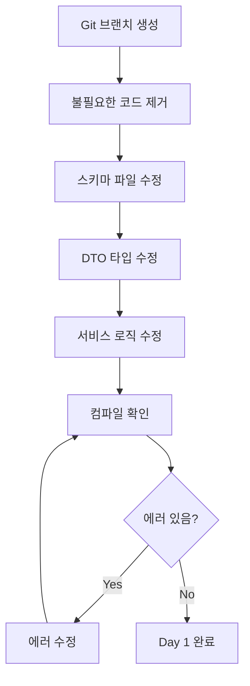

# WMS 옵션 구조 개편 - Day 1 구현 가이드

## 문서 정보
- **작성일**: 2025-11-09
- **대상**: WMS 옵션 키를 조합형(JSONB)에서 1차원(VARCHAR) 구조로 전환
- **범위**: Day 1 - 코드 제거 및 타입 수정 (DB 마이그레이션 제외)
- **전제**: 초기 개발 단계, 하위 호환성 고려 불필요

---

## 📋 목차
1. [개요](#개요)
2. [작업 흐름](#작업-흐름)
3. [Step 1: Git 브랜치 및 초기 설정](#step-1-git-브랜치-및-초기-설정)
4. [Step 2: 불필요한 코드 완전 제거](#step-2-불필요한-코드-완전-제거)
5. [Step 3: 스키마 파일 수정](#step-3-스키마-파일-수정)
6. [Step 4: DTO 타입 수정](#step-4-dto-타입-수정)
7. [Step 5: 서비스 로직 수정](#step-5-서비스-로직-수정)
8. [Step 6: 컴파일 확인 및 빌드](#step-6-컴파일-확인-및-빌드)
9. [체크리스트](#체크리스트)

---

## 개요

### 목표
WMS에서 조합형 옵션 구조를 완전히 제거하고 1차원 문자열 기반 optionKey로 전환합니다.

### 핵심 변경사항
```typescript
// Before (조합형)
optionKey: { "사이즈": "M", "색상": "블랙" }  // Record<string, string>

// After (1차원)
optionKey: "M / 블랙"  // string | null
```

### 제거 대상
1. **OptionEngineService** - 옵션 조합 생성 엔진
2. **OptionMatchingStrategy** - Option 전략
3. **MasterService.generateSkusFromOptions()** - SKU 자동 생성 메서드
4. **MasterController** - generate-skus 엔드포인트
5. **product_option_matchings** - 테이블 정의 (스키마 파일에서)

### 예상 소요 시간
**총 8시간** (AM 4시간 + PM 4시간)

---

## 작업 흐름



---

## Step 1: Git 브랜치 및 초기 설정

### ⏰ 예상 소요: 15분

### 1.1 브랜치 생성

```bash
# 현재 브랜치 확인
git branch

# feat/wms-1d-option-key 브랜치 생성 및 체크아웃
git checkout -b feat/wms-1d-option-key

# 현재 상태 커밋 (체크포인트)
git add .
git commit -m "chore: checkpoint before WMS option migration"
```

### 1.2 작업 환경 확인

```bash
# Node.js 버전 확인
node --version
# 예상: v18 이상

# 의존성 설치 확인
npm install

# WMS 빌드 가능 여부 확인
npm run build:wms
```

### ✅ 체크포인트
- [ ] `feat/wms-1d-option-key` 브랜치 생성 완료
- [ ] 초기 체크포인트 커밋 완료
- [ ] WMS 빌드 성공 확인

---

## Step 2: 불필요한 코드 완전 제거

### ⏰ 예상 소요: 2시간

### 2.1 OptionEngineService 모듈 삭제

```bash
# 전체 모듈 폴더 삭제
rm -rf libs/shared/src/option-engine/
```

**삭제 대상:**
- `libs/shared/src/option-engine/option-engine.service.ts`
- `libs/shared/src/option-engine/option-engine.module.ts`
- `libs/shared/src/option-engine/types/*.ts`
- `libs/shared/src/option-engine/index.ts`

### 2.2 OptionMatchingStrategy 삭제

```bash
# 전략 파일 삭제
rm apps/wms/src/inventory/strategies/option-matching.strategy.ts
```

### 2.3 MasterService 정리

**파일**: `apps/wms/src/inventory/services/master.service.ts`

#### 2.3.1 Import 제거

```typescript
// ❌ 삭제할 import
import { OptionEngineService, OptionSchema } from '@shared/option-engine';
```

#### 2.3.2 Constructor 수정

```typescript
// Before
constructor(
  @Inject(DB_TOKEN) private readonly db: DbConnection,
  private readonly inventoryService: InventoryService,
  private readonly optionEngine: OptionEngineService,  // ← 삭제
) {}

// After
constructor(
  @Inject(DB_TOKEN) private readonly db: DbConnection,
  private readonly inventoryService: InventoryService,
) {}
```

#### 2.3.3 generateSkusFromOptions 메서드 제거

**제거할 메서드** (대략 137-154줄):

```typescript
// ❌ 전체 메서드 삭제
/*
async generateSkusFromOptions(masterId: string, tx?: DbTx) {
  return this.inTx(async (trx) => {
    const master = await trx.query.inventoryProductMasters.findFirst({
      where: eq(wmsTables.inventoryProductMasters.id, masterId)
    });
    if (!master) return [];
    
    const schema = (master.optionSchema || { options: [] }) as OptionSchema;
    const combos = this.optionEngine.generateCombinations(schema);
    
    const createdSkuIds: string[] = [];
    for (const combo of combos) {
      const existing = await trx.query.skus.findFirst({
        where: and(
          eq(wmsTables.skus.masterId, masterId),
          eq(wmsTables.skus.optionKey, combo as any)
        )
      });
      if (existing) continue;
      
      const skuName = `${master.name} ${Object.values(combo).join(' / ')}`;
      const sku = await this.inventoryService.createSku({
        name: skuName,
        masterId,
        optionKey: combo as any
      } as any, trx);
      createdSkuIds.push(sku.id);
    }
    return createdSkuIds;
  }, tx);
}
*/
```

### 2.4 MasterController 정리

**파일**: `apps/wms/src/inventory/controllers/master.controller.ts`

#### 2.4.1 generate-skus 엔드포인트 제거

```typescript
// ❌ 전체 메서드 삭제
/*
@Post(':id/generate-skus')
@ApiOperation({ summary: '마스터의 옵션 조합으로 SKU 자동 생성' })
async generateSkus(@Param('id') id: string) {
  const skuIds = await this.masterService.generateSkusFromOptions(id);
  return {
    message: `Generated ${skuIds.length} SKUs`,
    skuIds,
  };
}
*/
```

### 2.5 InventoryModule 정리

**파일**: `apps/wms/src/inventory/inventory.module.ts`

#### 2.5.1 Import 제거

```typescript
// ❌ 삭제할 import
import { OptionEngineModule } from '@shared/option-engine';
import { OptionMatchingStrategy } from './strategies/option-matching.strategy';
```

#### 2.5.2 Module 설정 수정

```typescript
// Before
@Module({
  imports: [
    DbModule.forRoot(),
    OptionEngineModule,  // ← 삭제
    // ...
  ],
  providers: [
    // ...
    VoidMatchingStrategy,
    VariantMatchingStrategy,
    OptionMatchingStrategy,  // ← 삭제
    // ...
  ],
})

// After
@Module({
  imports: [
    DbModule.forRoot(),
    // OptionEngineModule 제거
    // ...
  ],
  providers: [
    // ...
    VoidMatchingStrategy,
    VariantMatchingStrategy,
    // OptionMatchingStrategy 제거
    // ...
  ],
})
```

### 2.6 ProductMatchingService 정리

**파일**: `apps/wms/src/inventory/services/product-matching.service.ts`

#### 2.6.1 Import 제거

```typescript
// ❌ 삭제할 import
import { OptionMatchingStrategy } from '../strategies/option-matching.strategy';
```

#### 2.6.2 Constructor 수정

```typescript
// Before
constructor(
  @Inject(DB_TOKEN) private readonly db: DbConnection,
  private readonly voidStrategy: VoidMatchingStrategy,
  private readonly variantStrategy: VariantMatchingStrategy,
  private readonly optionStrategy: OptionMatchingStrategy,  // ← 삭제
) {}

// After
constructor(
  @Inject(DB_TOKEN) private readonly db: DbConnection,
  private readonly voidStrategy: VoidMatchingStrategy,
  private readonly variantStrategy: VariantMatchingStrategy,
) {}
```

#### 2.6.3 getStrategy 메서드 수정

```typescript
// Before
private getStrategy(strategyType: MatchingStrategyType): MatchingStrategy {
  switch (strategyType) {
    case 'void':
      return this.voidStrategy;
    case 'variant':
      return this.variantStrategy;
    case 'option':  // ← 삭제
      return this.optionStrategy;
    default:
      throw new Error(`Unknown strategy type: ${strategyType}`);
  }
}

// After
private getStrategy(strategyType: MatchingStrategyType): MatchingStrategy {
  switch (strategyType) {
    case 'void':
      return this.voidStrategy;
    case 'variant':
      return this.variantStrategy;
    default:
      throw new Error(
        `Unsupported strategy: ${strategyType}. Only 'void' and 'variant' are supported.`
      );
  }
}
```

### ✅ 체크포인트
- [ ] `libs/shared/src/option-engine/` 폴더 삭제 완료
- [ ] `option-matching.strategy.ts` 파일 삭제 완료
- [ ] `MasterService` import/constructor 정리
- [ ] `MasterService.generateSkusFromOptions()` 메서드 제거
- [ ] `MasterController` 엔드포인트 제거
- [ ] `InventoryModule` import/provider 정리
- [ ] `ProductMatchingService` 정리 완료

---

## Step 3: 스키마 파일 수정

### ⏰ 예상 소요: 1.5시간

**파일**: `apps/wms/database/schemas/wms-schema.ts`

### 3.1 SKU 스키마 optionKey 타입 변경

**위치**: 대략 306-420줄

```typescript
// Before
export const skus = pgTable('skus', {
  id: uuid('id').primaryKey().defaultRandom(),
  holderId: uuid('holder_id')
    .references(() => holders.id, { onDelete: 'cascade' })
    .default("00000000-0000-0000-0000-000000000000")
    .notNull(),
  masterId: uuid('master_id')
    .references(() => inventoryProductMasters.id, { onDelete: 'restrict' })
    .notNull(),
  name: varchar('name', { length: 255 }).notNull(),
  code: varchar('code', { length: 64 }).notNull().unique(),
  optionKey: jsonb('option_key'),  // ← 변경 대상
  defaultBarcode: varchar('default_barcode', { length: 64 }),
  // ... 나머지 필드
}, t => ({
  uqSkuMasterOption: unique().on(t.masterId, t.optionKey),
  idxSkuCode: index('idx_sku_code').on(t.code),
  idxSkuMaster: index('idx_sku_master').on(t.masterId),
  idxSkuBarcode: index('idx_sku_barcode').on(t.defaultBarcode),
}));

// After
export const skus = pgTable('skus', {
  id: uuid('id').primaryKey().defaultRandom(),
  holderId: uuid('holder_id')
    .references(() => holders.id, { onDelete: 'cascade' })
    .default("00000000-0000-0000-0000-000000000000")
    .notNull(),
  masterId: uuid('master_id')
    .references(() => inventoryProductMasters.id, { onDelete: 'restrict' })
    .notNull(),
  name: varchar('name', { length: 255 }).notNull(),
  code: varchar('code', { length: 64 }).notNull().unique(),
  optionKey: varchar('option_key', { length: 255 }),  // ✅ VARCHAR로 변경
  defaultBarcode: varchar('default_barcode', { length: 64 }),
  // ... 나머지 필드
}, t => ({
  uqSkuMasterOption: unique().on(t.masterId, t.optionKey),
  idxSkuCode: index('idx_sku_code').on(t.code),
  idxSkuMaster: index('idx_sku_master').on(t.masterId),
  idxSkuBarcode: index('idx_sku_barcode').on(t.defaultBarcode),
}));
```

### 3.2 product_option_matchings 테이블 정의 제거

**위치**: 대략 868-882줄

```typescript
// ❌ 전체 테이블 정의 삭제
/*
export const productOptionMatchings = pgTable('product_option_matchings', {
  id: uuid('id').primaryKey().defaultRandom(),
  productMatchingId: uuid('product_matching_id')
    .references(() => productMatchings.id, { onDelete: 'cascade' })
    .notNull(),
  optionName: varchar('option_name', { length: 255 }).notNull(),
  optionValue: varchar('option_value', { length: 255 }).notNull(),
  skuId: uuid('sku_id')
    .references(() => skus.id, { onDelete: 'cascade' })
    .notNull(),
  createdAt: timestamp('created_at', { withTimezone: true }).notNull().defaultNow(),
}, t => ({
  uniqueOptionMatching: unique().on(t.productMatchingId, t.optionName, t.optionValue),
}));
*/
```

### 3.3 productOptionMatchingsRelations 제거

```typescript
// ❌ Relations 정의 삭제
/*
export const productOptionMatchingsRelations = relations(productOptionMatchings, ({ one }) => ({
  productMatching: one(productMatchings, {
    fields: [productOptionMatchings.productMatchingId],
    references: [productMatchings.id],
  }),
  sku: one(skus, {
    fields: [productOptionMatchings.skuId],
    references: [skus.id],
  }),
}));
*/
```

### 3.4 matchingStrategyEnum 수정

**위치**: enum 정의 부분

```typescript
// Before
export const matchingStrategyEnum = pgEnum('matching_strategy', [
  'void',
  'variant',
  'option',  // ← 삭제
]);

// After
export const matchingStrategyEnum = pgEnum('matching_strategy', [
  'void',
  'variant',
]);
```

### 3.5 inventoryProductMasters optionSchema 주석 추가

**위치**: inventoryProductMasters 테이블 정의

```typescript
export const inventoryProductMasters = pgTable('inventory_product_masters', {
  id: uuid('id').primaryKey().defaultRandom(),
  name: varchar('name', { length: 255 }).notNull(),
  masterCode: varchar('master_code', { length: 64 }).notNull(),
  
  // ✅ 주석 추가
  // DEPRECATED: WMS는 더 이상 옵션 조합을 생성하지 않음
  // UI 호환성을 위해 유지, 향후 제거 예정
  optionSchema: json('option_schema'),
  
  defaultPolicy: json('default_policy'),
  status: inventoryMasterStatusEnum('status').notNull().default('active'),
  createdAt: timestamp('created_at', { withTimezone: true }).notNull().defaultNow(),
  updatedAt: timestamp('updated_at', { withTimezone: true }).notNull().defaultNow(),
}, t => ({
  uqMasterCode: unique().on(t.masterCode),
}));
```

### 3.6 wmsTables export 정리

**위치**: 파일 하단의 export 부분

```typescript
// Before
export const wmsTables = {
  // ... 다른 테이블들
  productOptionMatchings,  // ← 삭제
  // ... 다른 테이블들
};

// After
export const wmsTables = {
  // ... 다른 테이블들
  // productOptionMatchings 제거
  // ... 다른 테이블들
};
```

### ✅ 체크포인트
- [ ] `skus.optionKey`: jsonb → varchar(255) 변경
- [ ] `productOptionMatchings` 테이블 정의 제거
- [ ] `productOptionMatchingsRelations` 제거
- [ ] `matchingStrategyEnum`에서 'option' 제거
- [ ] `optionSchema` 주석 추가
- [ ] `wmsTables` export에서 productOptionMatchings 제거

---

## Step 4: DTO 타입 수정

### ⏰ 예상 소요: 1시간

### 4.1 CreateSkuDto 수정

**파일**: `apps/wms/src/inventory/dto/sku/create-sku.dto.ts`

**위치**: 대략 26-28줄

```typescript
// Before
@ApiProperty({
  description: '옵션 조합 키 (예: {"색상":"퍼플","용량":"256GB"})',
  required: false,
  type: Object
})
@IsOptional()
optionKey?: Record<string, string>;

// After
@ApiProperty({
  description: '옵션 식별자 (1차원 문자열)',
  required: false,
  type: String,
  example: "S / 검정",
  examples: {
    simple: {
      value: "M / 블랙",
      summary: "사이즈와 색상"
    },
    complex: {
      value: "256GB / 퍼플 / Wi-Fi",
      summary: "용량, 색상, 연결"
    },
    none: {
      value: null,
      summary: "옵션 없음"
    }
  }
})
@IsOptional()
@IsString()
@MaxLength(255)
optionKey?: string;
```

**Import 추가**:

```typescript
import {
  IsString,
  IsOptional,
  IsInt,
  IsUUID,
  IsEnum,
  Min,
  MaxLength,  // ← 추가
  ValidateNested,
  IsArray,
} from 'class-validator';
```

### 4.2 SkuResponseDto 수정

**파일**: `apps/wms/src/inventory/dto/sku/sku-response.dto.ts`

**위치**: 대략 46-47줄

```typescript
// Before
@ApiProperty({ required: false, type: Object })
optionKey?: Record<string, string>;

// After
@ApiProperty({
  required: false,
  type: String,
  description: '옵션 식별자',
  example: "M / 흰색",
  nullable: true
})
optionKey?: string | null;
```

### 4.3 UpdateSkuDto 수정

**파일**: `apps/wms/src/inventory/dto/sku/update-sku.dto.ts`

```typescript
// Before
@ApiProperty({
  description: '옵션 조합 키',
  required: false,
  type: Object
})
@IsOptional()
optionKey?: Record<string, string>;

// After
@ApiProperty({
  description: '옵션 식별자 (예: "L / 빨강")',
  required: false,
  type: String,
  example: "L / 빨강",
  nullable: true
})
@IsOptional()
@IsString()
@MaxLength(255)
optionKey?: string;
```

**Import 추가** (없는 경우):

```typescript
import { IsString, IsOptional, MaxLength } from 'class-validator';
```

### 4.4 CreateMasterDto 수정

**파일**: `apps/wms/src/inventory/dto/master/create-master.dto.ts`

**optionSchema 필드에 deprecated 표시 추가**:

```typescript
// Before
@ApiProperty({
  description: '옵션 스키마',
  required: false,
  type: Object,
  example: {
    options: [
      { name: "사이즈", values: ["S", "M", "L"] }
    ]
  }
})
@IsOptional()
optionSchema?: any;

// After
@ApiProperty({
  description: 'DEPRECATED: WMS는 더 이상 옵션 조합을 생성하지 않음. UI 호환성만 유지.',
  required: false,
  type: Object,
  deprecated: true,  // ← 추가
  example: {
    options: [
      { name: "사이즈", values: ["S", "M", "L"] }
    ]
  }
})
@IsOptional()
optionSchema?: any;
```

### ✅ 체크포인트
- [ ] `CreateSkuDto.optionKey`: Record → string, MaxLength 추가
- [ ] `SkuResponseDto.optionKey`: Record → string | null
- [ ] `UpdateSkuDto.optionKey`: Record → string, MaxLength 추가
- [ ] `CreateMasterDto.optionSchema`: deprecated 표시 추가
- [ ] 모든 필요한 import 추가 확인

---

## Step 5: 서비스 로직 수정

### ⏰ 예상 소요: 2시간

### 5.1 InventoryService._createSkuInternal 수정

**파일**: `apps/wms/src/inventory/services/inventory.service.ts`

**위치**: 대략 950-987줄

```typescript
// Before
async _createSkuInternal(
  data: Omit<CreateSkuDto, 'id' | 'code' | 'defaultBarcode' | 'supplierIds' | 'categoryIds'> & { masterId: string },
  tx: DbTx,
) {
  const db = tx;
  const skuCode = this._generateSkuCode();

  let skuName: string;
  if (data.source === SkuCreationSource.AUTO_MATCHING) {
    skuName = `${data.productName || 'Unknown Product'} - ${data.variantName || 'Unknown Variant'}`;
  } else if (data.source === SkuCreationSource.MANUAL_MATCHING) {
    skuName = data.name;
  } else {
    skuName = data.name || `Auto-generated SKU Name (${skuCode})`;
  }

  const [newSku] = await db.insert(wmsTables.skus).values({
    masterId: data.masterId,
    name: skuName,
    code: skuCode,
    optionKey: (data as any).optionKey as any,  // ← 수정 대상
    deliveryProfileId: data.deliveryProfileId,
    sale1m: data.sale1m,
    sale3m: data.sale3m,
    safetyStock: data.safetyStock ?? 0,
  }).returning();

  if (!newSku) {
    throw new Error('Failed to create SKU internally');
  }

  const generatedBarcode = await this._generateAndSetDefaultBarcode(newSku.id, db);
  newSku.defaultBarcode = generatedBarcode;

  this.logger.log(`SKU created internally: ${newSku.id} (Name: ${newSku.name})`);
  return newSku;
}

// After
async _createSkuInternal(
  data: Omit<CreateSkuDto, 'id' | 'code' | 'defaultBarcode' | 'supplierIds' | 'categoryIds'> & { masterId: string },
  tx: DbTx,
) {
  const db = tx;
  const skuCode = this._generateSkuCode();

  let skuName: string;
  if (data.source === SkuCreationSource.AUTO_MATCHING) {
    skuName = `${data.productName || 'Unknown Product'} - ${data.variantName || 'Unknown Variant'}`;
  } else if (data.source === SkuCreationSource.MANUAL_MATCHING) {
    skuName = data.name;
  } else {
    skuName = data.name || `Auto-generated SKU Name (${skuCode})`;
  }

  const [newSku] = await db.insert(wmsTables.skus).values({
    masterId: data.masterId,
    name: skuName,
    code: skuCode,
    optionKey: data.optionKey ?? null,  // ✅ string | null로 명확히 처리
    deliveryProfileId: data.deliveryProfileId,
    sale1m: data.sale1m,
    sale3m: data.sale3m,
    safetyStock: data.safetyStock ?? 0,
  }).returning();

  if (!newSku) {
    throw new Error('Failed to create SKU internally');
  }

  const generatedBarcode = await this._generateAndSetDefaultBarcode(newSku.id, db);
  newSku.defaultBarcode = generatedBarcode;

  // ✅ 디버깅 편의를 위해 optionKey 로그 추가
  this.logger.log(
    `SKU created internally: ${newSku.id} (Name: ${newSku.name}, OptionKey: ${newSku.optionKey || 'N/A'})`
  );
  return newSku;
}
```

### 5.2 기타 서비스 메서드 확인

**파일**: `apps/wms/src/inventory/services/inventory.service.ts`

다음 메서드들은 Drizzle ORM의 타입 추론에 의해 자동으로 `string | null` 타입이 적용되므로 **추가 수정이 불필요**합니다:

- `getSku()` - 조회 시 optionKey 자동 타입 반영
- `updateSku()` - 업데이트 시 string 허용
- `getSkus()` - 목록 조회 시 자동 반영
- `deleteSku()` - optionKey와 무관

**확인만 필요**:
```typescript
// 이미 올바르게 동작함 (Drizzle 타입 추론)
async getSku(id: string, tx?: DbTx) {
  // optionKey는 자동으로 string | null 타입
}

async updateSku(id: string, data: UpdateSkuDto, tx?: DbTx) {
  // data.optionKey는 string으로 처리됨
}
```

### 5.3 InventoryService 타입 관련 수정 사항 확인

**확인 대상**: optionKey를 직접 다루는 모든 곳

```bash
# optionKey 사용처 검색
grep -r "optionKey" apps/wms/src/inventory/services/inventory.service.ts
```

**예상 결과**: 
- `_createSkuInternal` - ✅ 수정 완료
- 기타 메서드 - Drizzle 타입 추론으로 자동 처리

### ✅ 체크포인트
- [ ] `_createSkuInternal`: optionKey 타입 처리 수정
- [ ] 로그 메시지에 optionKey 추가 (디버깅 용이)
- [ ] 기타 서비스 메서드 타입 확인 (Drizzle 자동 처리)
- [ ] optionKey 관련 타입 에러 없음 확인

---

## Step 6: 컴파일 확인 및 빌드

### ⏰ 예상 소요: 1시간

### 6.1 TypeScript 타입 체크

```bash
# 전체 프로젝트 타입 체크
npx tsc --noEmit

# 예상 에러 없어야 함
# 만약 에러가 있다면 단계별로 수정
```

### 6.2 예상 컴파일 에러 및 해결

#### 에러 1: OptionEngineModule을 찾을 수 없음

```
Error: Cannot find module '@shared/option-engine'
  at apps/wms/src/inventory/inventory.module.ts
```

**원인**: `InventoryModule`에서 import 제거 누락

**해결**:
```typescript
// apps/wms/src/inventory/inventory.module.ts
// import { OptionEngineModule } from '@shared/option-engine'; ← 삭제 확인
```

#### 에러 2: optionKey 타입 불일치

```
Type 'Record<string, string>' is not assignable to type 'string'
  at apps/wms/src/inventory/dto/sku/create-sku.dto.ts
```

**원인**: DTO 타입 수정 누락

**해결**: Step 4의 DTO 수정 재확인

#### 에러 3: generateSkusFromOptions 메서드 참조

```
Property 'generateSkusFromOptions' does not exist on type 'MasterService'
```

**원인**: Controller에서 메서드 호출 코드 미제거

**해결**: Step 2.4 재확인

#### 에러 4: OptionMatchingStrategy 타입 에러

```
Cannot find name 'OptionMatchingStrategy'
```

**원인**: ProductMatchingService에서 import 미제거

**해결**: Step 2.6 재확인

### 6.3 Drizzle 타입 재생성

```bash
# 스키마 변경사항 반영 (마이그레이션 파일 생성)
npm run db:generate.wms

# 생성된 마이그레이션 파일 확인
ls -la apps/wms/database/migrations/
```

**참고**: 실제 DB 적용은 사용자가 직접 진행

### 6.4 WMS 빌드

```bash
# WMS만 빌드
npm run build:wms

# 예상 결과: 에러 없이 빌드 성공
```

### 6.5 전체 프로젝트 빌드

```bash
# 전체 프로젝트 빌드
npm run build

# 예상 결과: 다른 마이크로서비스도 정상 빌드
```

### 6.6 린트 검사

```bash
# ESLint 검사
npm run lint

# 자동 수정 가능한 항목 수정
npm run lint:fix
```

### 6.7 빌드 성공 확인

```bash
# 빌드 결과물 확인
ls -la dist/apps/wms/

# 예상: main.js 등 정상 생성
```

### ✅ 체크포인트
- [ ] `npx tsc --noEmit` 에러 없음
- [ ] `npm run db:generate.wms` 성공
- [ ] `npm run build:wms` 성공
- [ ] `npm run build` 성공
- [ ] `npm run lint` 에러 없음
- [ ] 빌드 결과물 정상 생성 확인

---

## 체크리스트

### 전체 Day 1 작업 확인

#### Step 1: Git 브랜치 및 초기 설정
- [ ] `feat/wms-1d-option-key` 브랜치 생성
- [ ] 초기 체크포인트 커밋
- [ ] 작업 환경 확인 완료

#### Step 2: 불필요한 코드 제거
- [ ] `libs/shared/src/option-engine/` 폴더 삭제
- [ ] `option-matching.strategy.ts` 파일 삭제
- [ ] `MasterService` import 정리
- [ ] `MasterService.generateSkusFromOptions()` 메서드 제거
- [ ] `MasterService` constructor 정리
- [ ] `MasterController` 엔드포인트 제거
- [ ] `InventoryModule` import 정리
- [ ] `InventoryModule` providers 정리
- [ ] `ProductMatchingService` import 정리
- [ ] `ProductMatchingService` constructor 정리
- [ ] `ProductMatchingService.getStrategy()` 메서드 수정

#### Step 3: 스키마 파일 수정
- [ ] `skus.optionKey` jsonb → varchar(255) 변경
- [ ] `productOptionMatchings` 테이블 정의 제거
- [ ] `productOptionMatchingsRelations` 제거
- [ ] `matchingStrategyEnum`에서 'option' 제거
- [ ] `inventoryProductMasters.optionSchema` 주석 추가
- [ ] `wmsTables` export 정리

#### Step 4: DTO 타입 수정
- [ ] `CreateSkuDto.optionKey` 타입 변경 및 validators 추가
- [ ] `CreateSkuDto` import 추가 (MaxLength)
- [ ] `SkuResponseDto.optionKey` 타입 변경
- [ ] `UpdateSkuDto.optionKey` 타입 변경 및 validators 추가
- [ ] `CreateMasterDto.optionSchema` deprecated 표시

#### Step 5: 서비스 로직 수정
- [ ] `InventoryService._createSkuInternal` optionKey 처리 수정
- [ ] 로그 메시지에 optionKey 추가
- [ ] 기타 서비스 메서드 타입 확인

#### Step 6: 컴파일 확인 및 빌드
- [ ] TypeScript 타입 체크 통과
- [ ] Drizzle 마이그레이션 파일 생성
- [ ] WMS 빌드 성공
- [ ] 전체 프로젝트 빌드 성공
- [ ] 린트 검사 통과

### 최종 확인
- [ ] 삭제된 파일이 더 이상 존재하지 않음
- [ ] import 에러 없음
- [ ] 타입 에러 없음
- [ ] 빌드 에러 없음
- [ ] 린트 에러 없음

---

## 다음 단계

Day 1 완료 후:

1. **Git 커밋**
   ```bash
   git add .
   git commit -m "refactor(wms): remove option engine and migrate to 1D option key
   
   - Remove OptionEngineService module
   - Remove OptionMatchingStrategy
   - Remove MasterService.generateSkusFromOptions()
   - Change skus.optionKey from JSONB to VARCHAR(255)
   - Update all DTOs to use string optionKey
   - Remove product_option_matchings table definition
   
   Breaking changes:
   - optionKey is now string | null (was Record<string, string>)
   - Removed POST /masters/:id/generate-skus endpoint
   "
   ```

2. **Day 2 진행**
   - 사용자가 DB 마이그레이션 실행
   - 테스트 작성 (단위/통합/E2E)
   - 전체 테스트 실행 및 검증

---

## FAQ

### Q: optionSchema는 왜 제거하지 않나요?
**A**: UI 호환성을 위해 유지합니다. WMS는 더 이상 사용하지 않지만, deprecated 표시만 하고 향후 PIM과 완전 분리 시 제거 예정입니다.

### Q: 기존 코드에서 optionKey를 객체로 사용하는 곳이 있다면?
**A**: Step 6의 TypeScript 타입 체크에서 모두 잡힙니다. 에러가 발생하면 해당 위치에서 string으로 변경하면 됩니다.

### Q: Drizzle 마이그레이션 파일은 실행하지 않나요?
**A**: Day 1에서는 생성만 합니다. 실제 DB 적용은 사용자가 직접 진행합니다.

### Q: 테스트는 언제 작성하나요?
**A**: Day 2에서 작성합니다. Day 1은 코드 변경과 빌드 성공 확인까지만 진행합니다.

---

## 참고 자료

- [PIM-WMS 옵션 아키텍처](./pim-wms-option-architecture.md)
- [전체 마이그레이션 계획](./wms-option-migration-implementation-plan.md)
- [Drizzle ORM 문서](https://orm.drizzle.team/)
- [NestJS 모듈 구조](https://docs.nestjs.com/modules)

---

**문서 버전**: 1.0  
**작성일**: 2025-11-09  
**예상 소요**: 8시간 (AM 4시간 + PM 4시간)  
**전제**: 초기 개발 단계, 하위 호환성 불필요, DB 마이그레이션 별도 진행

