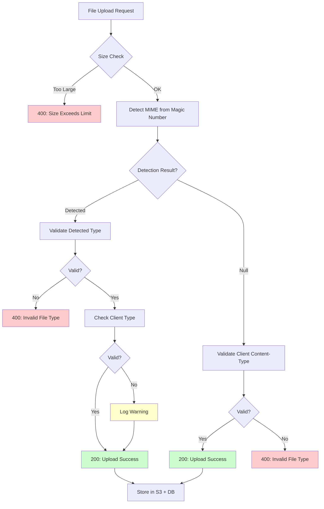

# 📊 File Service API Test Structure

## 📁 파일 구조

```
postman/
├── File-Service-MIME-Validation.postman_collection.json  # 메인 테스트 컬렉션
├── File-Service-Local.postman_environment.json           # 로컬 환경 설정
├── generate-test-files.sh                                # 테스트 파일 자동 생성 스크립트
├── README.md                                             # 상세 가이드
├── QUICK_START.md                                        # 5분 빠른 시작
└── TEST_STRUCTURE.md                                     # 이 파일

test-files/  (자동 생성됨)
├── malicious.exe.jpg                    # 16B   - EXE disguised as JPG
├── malicious.html                       # 353B  - HTML with XSS
├── valid-image.jpg                      # 286B  - Valid JPEG
├── valid-image.png                      # 70B   - Valid PNG
├── image.svg                            # 335B  - SVG image
├── image.webp                           # 44B   - WebP image
├── document.txt                         # 309B  - Plain text
├── data.csv                             # 295B  - CSV file
├── config.json                          # 511B  - JSON file
├── document.pdf                         # 543B  - PDF document
├── large-file.bin                       # 10MB  - Size limit test
└── ... (19 files total)
```

---

## 🧪 테스트 구조 (총 21개 요청)

### Setup (1개)
```
└── Health Check
    ├── Method: GET /health
    └── Tests: Server is running (200 OK)
```

---

### 1. Security Tests (3개) 🔒

**목적:** 악성 파일 차단 검증

```
1.1 Reject EXE disguised as JPG
    ├── File: malicious.exe.jpg (MZ signature)
    ├── Context: product-image (allows: image/*)
    ├── Expected: 400 Bad Request
    └── Validation: Magic number detects executable

1.2 Reject HTML with image Content-Type
    ├── File: malicious.html
    ├── Content-Type: Sent as image/png
    ├── Expected: 400 Bad Request
    └── Validation: Detects text/html from content

1.3 Accept JPEG with wrong Content-Type (warn)
    ├── File: valid-image.jpg (real JPEG)
    ├── Content-Type: application/octet-stream
    ├── Expected: 200 OK
    ├── Detected: image/jpeg ✅
    └── Client Type: application/octet-stream ⚠️ (warning logged)
```

---

### 2. Practical Compatibility Tests (3개) 🖼️

**목적:** 실무에서 발생하는 MIME 타입 변형 대응

```
2.1 Accept JPEG with non-standard MIME (image/jpg)
    ├── File: image-with-wrong-mime.jpg
    ├── Content-Type: image/jpg (비표준)
    ├── Detected: image/jpeg (표준)
    ├── Expected: 200 OK
    └── Note: Detected type이 유효하면 허용

2.2 Accept PNG with correct MIME
    ├── File: valid-image.png
    ├── Content-Type: image/png ✅
    ├── Detected: image/png ✅
    └── Expected: 200 OK (perfect match)

2.3 Accept SVG (image/svg+xml matches image/*)
    ├── File: image.svg
    ├── Content-Type: image/svg+xml
    ├── Whitelist: image/*
    ├── Match Logic: image/svg+xml → split('/') → image === image ✅
    └── Expected: 200 OK
```

---

### 3. Fallback Cases (3개) 📄

**목적:** Magic number 없는 텍스트 파일 검증

```
3.1 Accept TXT file (text/plain)
    ├── File: document.txt
    ├── Detection Result: null (no magic number)
    ├── Fallback: Validate client Content-Type
    └── Expected: 200 OK

3.2 Accept CSV file (text/csv)
    ├── File: data.csv
    ├── Detection: null
    ├── Fallback: text/csv
    └── Expected: 200 OK

3.3 Accept JSON file (application/json)
    ├── File: config.json
    ├── Detection: null
    ├── Fallback: application/json
    └── Expected: 200 OK
```

---

### 4. Wildcard Pattern Tests (4개) 🎯

**목적:** 와일드카드 패턴 매칭 검증

```
4.1 image/* accepts JPEG
    ├── Pattern: image/*
    ├── File: photo.jpg → image/jpeg
    └── Match: ✅

4.2 image/* accepts WebP
    ├── Pattern: image/*
    ├── File: image.webp → image/webp
    └── Match: ✅

4.3 application/pdf + image/* accepts PDF
    ├── Pattern: ["application/pdf", "image/*"]
    ├── File: document.pdf → application/pdf
    ├── Context: receipt
    └── Match: ✅ (exact match)

4.4 application/pdf + image/* accepts PNG
    ├── Pattern: ["application/pdf", "image/*"]
    ├── File: receipt-scan.png → image/png
    ├── Context: receipt
    └── Match: ✅ (wildcard match)
```

---

### 5. Public/Private Access Tests (4개) 🔐

**목적:** 공개/비공개 파일 접근 제어 검증

```
5.1 Upload as Public File
    ├── File: public-image.jpg
    ├── Body: isPublic=true
    ├── Expected: 200 OK
    └── Response: isPublic=true, url=public-bucket-url

5.2 Access Public File without Auth
    ├── Method: GET /public/{fileId}
    ├── Auth: None
    ├── Expected: 200 OK
    └── Content-Type: image/jpeg

5.3 Upload as Private File (default)
    ├── File: private-document.pdf
    ├── Body: (isPublic not set → default false)
    ├── Expected: 200 OK
    └── Response: isPublic=false

5.4 Private File requires Auth
    ├── Method: GET /public/{privateFileId}
    ├── Auth: None
    ├── Expected: 404 Not Found
    └── Note: Private files blocked on public endpoint
```

---

### 6. Edge Cases & Validation (3개) ⚠️

**목적:** 경계 조건 및 입력 검증

```
6.1 Reject File Too Large
    ├── File: large-file.bin (10MB)
    ├── Context: user-avatar (max: 2MB)
    ├── Expected: 400 Bad Request
    └── Error: "File size exceeds limit"

6.2 Reject Invalid Context
    ├── Context: "non-existent-context"
    ├── Expected: 404 Not Found
    └── Error: "Context non-existent-context not found"

6.3 Reject Missing File
    ├── Body: Only contextId (no file)
    ├── Expected: 400 Bad Request
    └── Error: "File is required"
```

---

## 🎯 테스트 커버리지 매트릭스

| Category | Tests | Assertions | Focus Area |
|----------|-------|------------|------------|
| Security | 3 | 6 | 악성 파일 차단, Magic number 검증 |
| Compatibility | 3 | 6 | MIME 타입 변형, 브라우저 호환성 |
| Fallback | 3 | 6 | 텍스트 파일, Content-Type 폴백 |
| Wildcard | 4 | 8 | 패턴 매칭, 정규식 검증 |
| Access Control | 4 | 9 | 공개/비공개, 인증 검증 |
| Edge Cases | 3 | 6 | 크기 제한, 입력 검증 |
| **Total** | **20** | **41** | **포괄적 검증** |

---

## 📋 Context별 허용 MIME 타입

```sql
-- Database: file_contexts 테이블

┌─────────────────────────────┬──────────────────────────────────┬───────────┐
│ Context ID                  │ Allowed MIME Types               │ Max Size  │
├─────────────────────────────┼──────────────────────────────────┼───────────┤
│ product-image               │ ["image/*"]                      │ 5MB       │
│ user-avatar                 │ ["image/*"]                      │ 2MB       │
│ user-document               │ ["image/*", "application/pdf"]   │ 10MB      │
│ receipt                     │ ["application/pdf", "image/*"]   │ 5MB       │
│ business-verification-file  │ ["application/pdf", "image/*"]   │ 10MB      │
└─────────────────────────────┴──────────────────────────────────┴───────────┘
```

---

## 🔄 Validation Flow



---

## 🧩 Wildcard Matching Logic

### Pattern: `image/*`

```typescript
function matchesMimeType(actual: string, pattern: string): boolean {
  // Exact match: "image/jpeg" === "image/jpeg"
  if (actual === pattern) return true;
  
  // Full wildcard: "*/*"
  if (pattern === '*/*') return true;
  
  // Type wildcard: "image/*"
  if (pattern.endsWith('/*')) {
    const [patternType] = pattern.split('/');  // "image"
    const [actualType] = actual.split('/');    // "image" (from "image/svg+xml")
    return patternType === actualType;
  }
  
  return false;
}
```

**테스트 케이스:**
```javascript
matchesMimeType("image/jpeg", "image/*")      // ✅ true
matchesMimeType("image/svg+xml", "image/*")   // ✅ true
matchesMimeType("image/webp", "image/*")      // ✅ true
matchesMimeType("video/mp4", "image/*")       // ❌ false
matchesMimeType("application/pdf", "image/*") // ❌ false
```

---

## 🔍 Expected Log Output

### 정상 업로드 (Magic Number 검증)
```
[DEBUG] Detected MIME type: image/jpeg
[INFO] File uploaded successfully - File: valid-image.jpg, User: 01932d3e-5678-7abc-9def-0123456789ab, Context: product-image
```

### Content-Type 불일치 (경고)
```
[DEBUG] Detected MIME type: image/jpeg
[WARN] Client MIME type not in whitelist - Client: application/octet-stream, Detected: image/jpeg. File: valid-image.jpg, User: 01932d3e-5678-7abc-9def-0123456789ab, Context: product-image
[INFO] File uploaded successfully - File: valid-image.jpg, User: 01932d3e-5678-7abc-9def-0123456789ab, Context: product-image
```

### Fallback 검증 (텍스트 파일)
```
[DEBUG] Could not detect MIME type from buffer (likely text-based file)
[DEBUG] Using client Content-Type (no magic number detection): text/plain
[INFO] File uploaded successfully - File: document.txt, User: 01932d3e-5678-7abc-9def-0123456789ab, Context: user-document
```

### 악성 파일 차단
```
[DEBUG] Detected MIME type: application/x-executable
[ERROR] File upload rejected - Invalid file type for product-image. Allowed: image/*. Got: application/x-executable
```

---

## 📊 Success Criteria

✅ **All tests pass (20/20)**  
✅ **No false positives** (정상 파일 차단 없음)  
✅ **No false negatives** (악성 파일 허용 없음)  
✅ **Logs clear and actionable**  
✅ **Performance < 200ms per upload** (10MB 제외)

---

## 🚀 실행 방법

### Postman GUI
```bash
# 1. Import collection + environment
# 2. Set authToken in environment
# 3. Run Collection (Ctrl+R)
```

### Newman CLI
```bash
newman run File-Service-MIME-Validation.postman_collection.json \
  -e File-Service-Local.postman_environment.json \
  --reporters cli,htmlextra \
  --reporter-htmlextra-export report.html
```

### Docker (CI/CD)
```dockerfile
FROM postman/newman:alpine
COPY postman/ /postman
RUN ./postman/generate-test-files.sh
CMD newman run /postman/File-Service-MIME-Validation.postman_collection.json
```

---

## 📈 확장 가능한 테스트 시나리오

### 추가 가능한 테스트들:

1. **동시성 테스트**
   - 동일 파일 동시 업로드 (100 concurrent requests)
   - Race condition 검증

2. **성능 테스트**
   - 100MB 파일 업로드 시간 측정
   - 메모리 사용량 모니터링 (4100 byte sample 검증)

3. **보안 테스트**
   - TOCTOU (Time-of-Check-Time-of-Use) 공격
   - ZIP 폭탄 (압축 파일 검증)
   - 다중 확장자 파일 (file.jpg.exe)

4. **국제화 테스트**
   - UTF-8 파일명 (한글, 일본어, 이모지)
   - Content-Type charset 파라미터

5. **에러 처리 테스트**
   - S3 장애 시뮬레이션
   - DB 트랜잭션 롤백 검증

---

**작성일:** 2025-12-18  
**버전:** 1.0  
**유지보수:** 새로운 context 추가 시 테스트 케이스도 추가 필요

